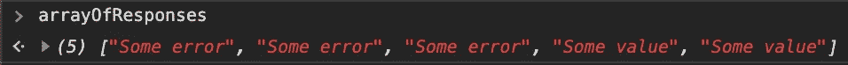
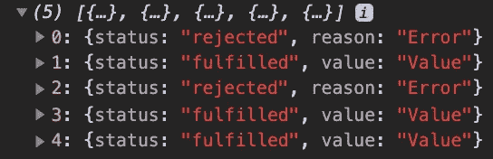

# Promise.all、Promise.race 和全新 es 2020 promise . all 已确定

> 原文：<https://levelup.gitconnected.com/promise-all-promise-race-and-the-new-es2020-promise-allsettled-bc5b2d65a028>

由 [Unsplash](https://unsplash.com/s/photos/clock?utm_source=unsplash&utm_medium=referral&utm_content=creditCopyText) 上的 [chuttersnap](https://unsplash.com/@chuttersnap?utm_source=unsplash&utm_medium=referral&utm_content=creditCopyText) 拍摄

*承诺*是 ES6 最激动人心的创新之一。你可能以前在 Bluebird 或 Q 这样的库上使用过 *Promises* ，但是它们在 2015 年才成为一个标准的 JavaScript 特性。

> Promise 对象表示异步操作的最终完成(或失败)及其结果值。

一个*承诺*做一些可能需要一些时间的事情，但是如果一切顺利，最终它会*解决*或者如果出了问题*拒绝*。带*。然后是*和*。然后你可以分别对结果或错误做些什么。*

它们是在大约五年前推出的，所以*承诺*对你来说应该不是什么新鲜事，但是 ES2020 有了一个新功能:*承诺*。*全部解决*。它填补了 ES6 *诺言.一切*和*诺言.竞赛*留下的空白

# 一系列承诺

你经常不仅要处理一个*承诺*，还要处理一系列*承诺*。如果您一次发送许多服务器请求，可能就是这种情况。

例如，我创建了一个包含五个*承诺*的数组。他们*以 50%的概率解决*或*拒绝*，经过一段时间(100 毫秒，200 毫秒，…，500 毫秒)。

我们可以手动处理这个*承诺*数组，在这个例子中，我将结果存储在一个响应数组中。如果半秒钟后您在控制台中显示该阵列，您将看到如下内容:

但是你经常想在所有的*承诺*解决之后，或者一旦其中一个解决了，就去做一些事情。这有点棘手，这就是为什么*承诺*和*承诺.比赛*为你做这件事。

# 承诺.比赛

*Promise.race* 以*承诺*的数组为参数，返回一个*承诺*。该*承诺*将在数组的*承诺*中的一个承诺解决时解决，或者在一个承诺拒绝时拒绝。

# 承诺。所有

*Promise.all* 在数组的所有*承诺*解析后解析。

但是，如果一个*承诺*拒绝，那么*承诺*也会拒绝。

# ES2020 Promise.allSettled

一旦所有的*承诺*都解决了，不管它们是解决了还是拒绝了，你都可能想要执行一些行动。这就是*承诺*的目的。

*Promise.allSettled* 将在所有*承诺*解决或拒绝时解决。返回值是一个对象数组，带有状态(拒绝或满足)和值(或错误)。

鉴于*承诺. all* 会在一个*承诺*拒绝后立即拒绝，而*承诺. race* 会在一个*承诺*解决后立即解决，而*承诺. allSettled* 将始终解决，并且仅在每个单个*承诺*解决后。

*Promise.allSettled* 是 ES2020 的一个特性，已经在 Node v.12.9.0，Google Chrome 76，Safari 13 和 Firefox 71 中得到支持。