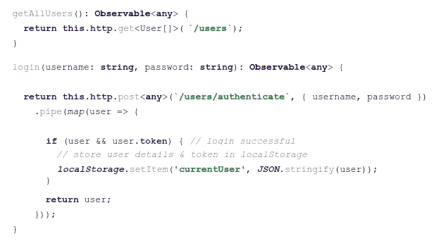
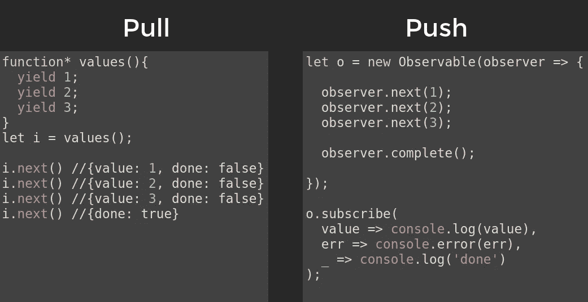
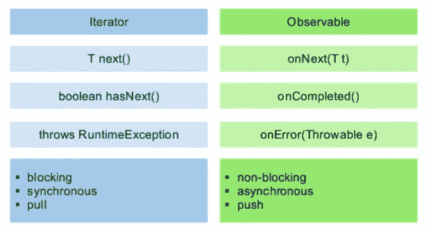
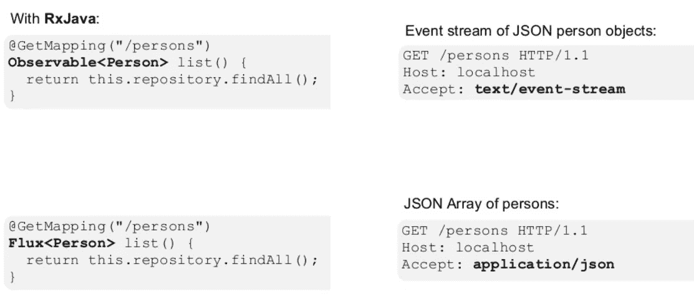

# 承诺、可观察和流之间有什么区别？

> 原文：<https://levelup.gitconnected.com/promise-vs-observable-vs-stream-165a310e886f>

## [网页开发](https://rakiabensassi.medium.com/list/software-engineering-7a179a23ebfd)

## 现代编程中的三种风格

由[内森·杜姆劳](https://unsplash.com/@nate_dumlao?utm_source=medium&utm_medium=referral)在 [Unsplash](https://unsplash.com?utm_source=medium&utm_medium=referral) 上拍摄的照片

我的一个同事想知道可观察到的东西和承诺是否是一样的东西，在一次讨论的启发下，我决定写这篇文章来解释它们之间的区别。

*可以在 Udemy 上查看我的* ***视频课程****:*[*如何识别、诊断、修复 Web Apps 中的内存泄漏*](https://www.udemy.com/course/identify-and-fix-javascript-memory-leaks/) *。*

# 承诺与可观察

承诺和观察都有助于我们使用 JavaScript 中的 ***异步功能*** 。承诺是以异步方式解析的值，如 HTTP 调用。当异步操作完成或失败时，它们处理一个 ***单事件*** 。

可观察的东西就像承诺，除了它们与多个值一起工作，它们自己清理，它们可以被取消。如果不再需要 HTTP 请求或一些异步操作的结果，可观察对象的订阅允许取消订阅，而承诺最终会调用成功或失败的回调，即使您不再需要通知或它提供的结果。

Observable 就像一个流(在许多语言中),允许传递 0 个、1 个或更多事件，每个事件都调用回调函数。它们处理一个 ***序列的异步事件*** 。

可观察性提供了承诺和更多的特征:

*   随着时间的推移，它们可以有[多个值](https://medium.com/@luukgruijs/understanding-creating-and-subscribing-to-observables-in-angular-426dbf0b04a3):如果我们继续订阅时事通讯，我们将获得下一个生成的值。发件人决定我们什么时候收到，但我们必须等到它来。
*   他们有多条管道
*   它们支持聚合操作，如映射、过滤、forEach、归约等
*   我们可以做一些强大的功能，比如用`zip`、`merge`或`concat`将不同的`Observable`组合成一个新的。

使用 Angular app 中可观察到的[来处理](https://medium.com/javascript-in-plain-english/angular-material-table-with-edit-function-like-excel-7c2c53332553)[用户的认证](https://medium.com/swlh/sso-with-spnego-and-kerberos-8794f8ad5162)

由于在处理“异步事件序列”的[反应式编程](https://medium.com/javascript-in-plain-english/angular-material-table-with-edit-function-like-excel-7c2c53332553)中使用了可观察值，让我们看看这个来自 [Uladzimir Sinkevich](https://www.scnsoft.com/blog/java-reactive-programming) 的真实例子，这意味着什么:

比如说，今天是星期五，约翰想和他的朋友鲍勃一起吃披萨，看一集《星球大战》。让我们概述一下他的选择。

1.  约翰完成了他的工作。然后去点披萨，一直等到做好。然后抱起他的朋友。最后(带着鲍勃和披萨)回到家，开始看电影。这将是**同步**的方法，时间太长了，到那时约翰可能已经想取消了。
2.  约翰在网上订了比萨饼，打电话给鲍勃，邀请他来。他回到家，叫了外卖，开始看电影(吃披萨),没有等鲍勃出现。这就是**异步**方法可能发生的情况。
3.  约翰订了比萨饼，打电话给鲍勃，邀请他来，回家，并得到他的比萨饼。但是这一次，他等到鲍勃来了，只有在那之后，他才打开电影。这就是**反应式方法**的目的。您等待所有异步操作(更改)完成，然后继续进一步的操作。

> "反应式编程是用异步数据流编程."安德烈·斯塔尔茨

# 可观察与流

在这个阶段，在看到我们可以用一个可观察对象做什么之后，我的同事提出了下一个好问题:
“既然它们有相似的操作符，我们可以像在 Java 中处理流一样处理一个可观察对象(在前端)吗？”

可观测的和流看起来非常相似。它们有看起来相似的运算符(过滤器、映射等)，但可观察值与流有显著不同:

*   流只是随时间到达的集合。
*   可观测量就像集合…除了它们随着时间 ***异步*** 到达。
*   Stream 只能使用一次，Observable 可以订阅多次。
*   流是 ***基于拉的*** :数据消费者决定何时从数据生产者那里获取数据。生产者不知道数据何时将被交付给消费者。这只适用于与 ***同步的*** 事物。要从集合中提取一个值，它现在必须可用 ***！*** 如果我们将同步理解为“拉”…我们可以将异步理解为“推”…
*   可观察的是 ***基于推送的*** :数据生产者(简讯的创建者)决定消费者(简讯的订阅者)何时获取数据。承诺是 Javascript 中最常见的 ***推*** 的方式。承诺(生产者)向注册的回调(消费者)传递 ***一个解析值*** ，但与函数不同的是，承诺负责精确地确定该值何时被 ***推送到*** 回调。

每个 Javascript 函数都使用 pull 该函数是数据的生产者，调用该函数的代码通过从其调用中取出一个*单个*返回值来消费数据。

一个可观察的生产者是 ***多个值*** ，*将它们推送给*订阅者。我们订阅一个可观察的，当下一个项目到达`onNext`，或者当流完成`onCompleted`，或者当错误发生`onError`时，我们将 ***得到*** ***通知*** 。因为有了`Observable`，我们就接收到了`onNext`、`onCompleted`、`onError`事件。我们可以做的其他事情是缓存，节流，...

[用迭代器拉 vs 用可观察值推](http://slides.com/robwormald/everything-is-a-stream#/65)

Java 中的迭代器与可观察对象

## Java 8 流 API 与 RxJava

让我们以 Java 8 Streams API(Java . util . stream)中的流和 RxJava 中的 Observables(Java 的 ReactiveX API，用于可观察流的异步编程)为例。这两个 API 不是为相同的用途而构建的。

*   我们可以使用 rx Java***执行异步任务*** 。
*   使用 Java 8 stream，我们将 ***遍历您的集合*** 中的条目。
*   我们可以在 RxJava 中做几乎相同的事情(遍历集合中的项目)，但是，由于 RxJava 专注于并发任务，…，它使用同步、锁存…因此，使用 RxJava 的相同任务可能比使用 Java 8 stream 慢。
*   RxJava 可以与`CompletableFuture`相比，但是它可以计算不止一个值。
*   默认情况下 RxJava 是 ***单线程的。*** 除非我们开始使用调度程序，否则一切都将发生在同一个线程上。

[后端实现:REST 方法返回一个可观察对象](https://www.slideshare.net/triondevelopment/reactive-everywhere)

## **最后一件事:流与集合**

正如你已经注意到的，我们的故事中还有第四个玩家:它是 ***集合*** 。Java 8 Streams API 提供了一种处理 Java 集合的机制。它是关于将集合转换为流，并行处理元素 ***，*** ，然后将结果元素收集到一个集合中。

*   集合是一个 ***内存中的*** 数据结构，其中包含元素。集合中的每个元素在实际成为集合的一部分之前都经过计算。所以，这是一组 ***急切地*** 计算出来的数值。
*   流是固定的数据结构，它按需计算元素。Java 8 流可以看作是*构造的集合，当用户需要时，这些值被计算出来。*
*   *像函数式编程语言一样，流支持可以串行或并行执行的聚合操作:过滤、映射、归约、查找、匹配、排序、限制、收集…*
*   *流还支持管道和内部迭代:大多数 java 8 流操作只返回流。这有助于我们创建各种流操作的链→这称为流水线操作。流水线操作看起来类似于 SQL 查询。*

## *今天到此为止*

*让我知道你对此的想法。我希望这有助于增强你对承诺、可观察和心流的理解，下次你遇到这些术语时，它们不会让你困惑。*

# *想要更多吗？*

*我为一群聪明、好奇的🧠人写关于工程、技术和领导力的文章💡。 [**加入我的免费电子邮件简讯独家访问**](https://rakiabensassi.substack.com/) 或在此报名 Medium。*

**可以在 Udemy 上查看我的* ***视频课程****:*[*如何识别、诊断、修复 Web Apps 中的内存泄漏*](https://www.udemy.com/course/identify-and-fix-javascript-memory-leaks/) *。**

* [## 编译器与解释器:了解它们的区别以及何时使用它们

### 编译器和解释器的类型和用例

medium.com](https://medium.com/better-programming/compiler-vs-interpreter-d0a12ca1c1b6)  [## 为什么编码标准很重要，以及如何衡量开发速度

### 熟悉一个新项目需要多长时间

levelup.gitconnected.com](/learning-velocity-and-coding-standards-10952f6c9640)*