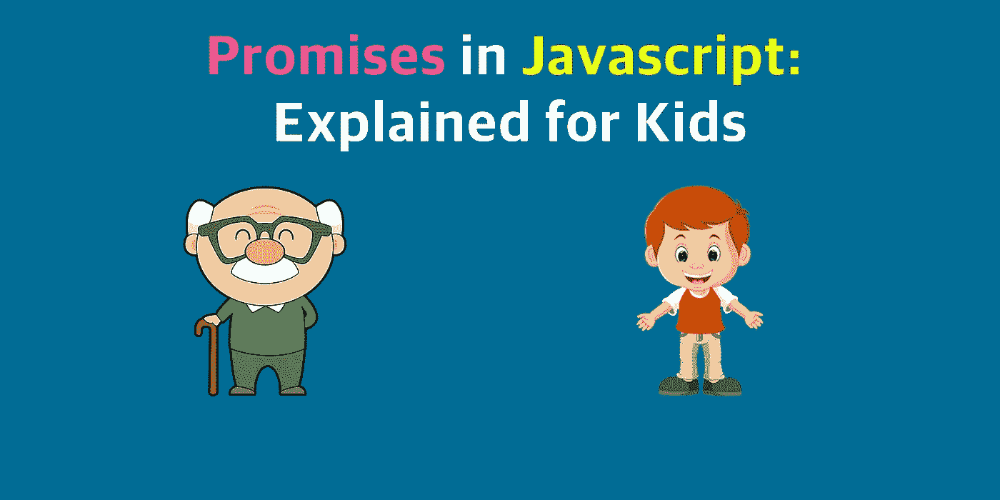
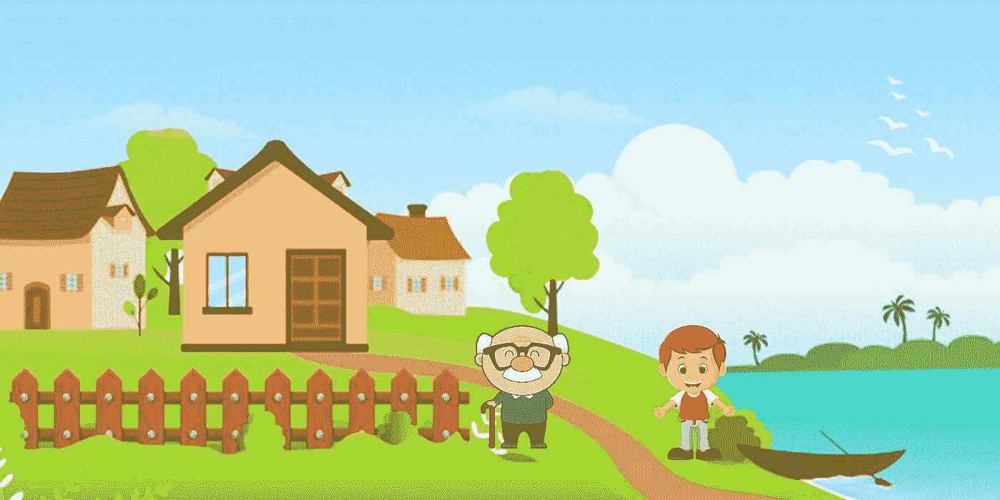
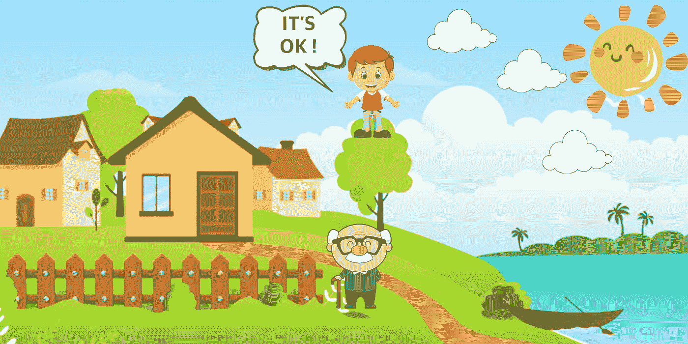
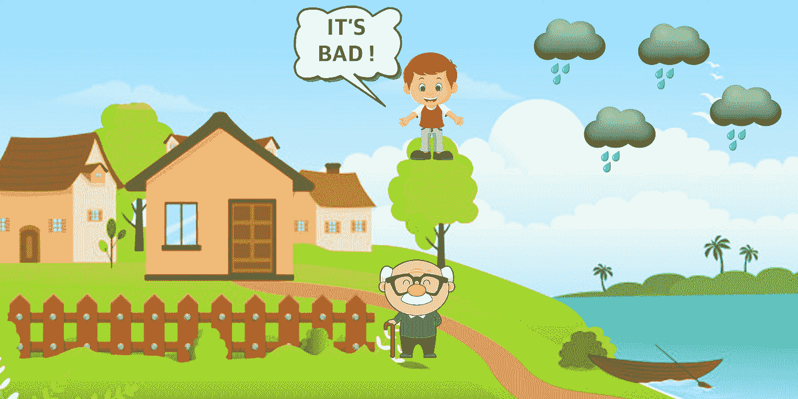
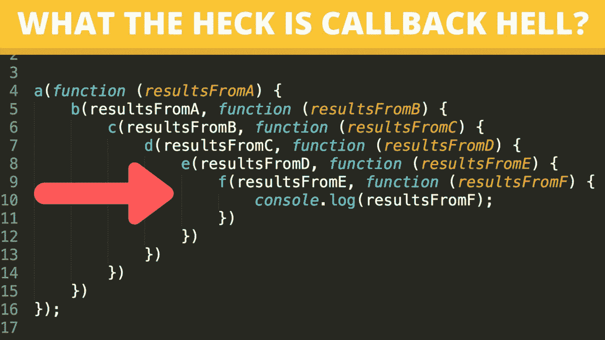
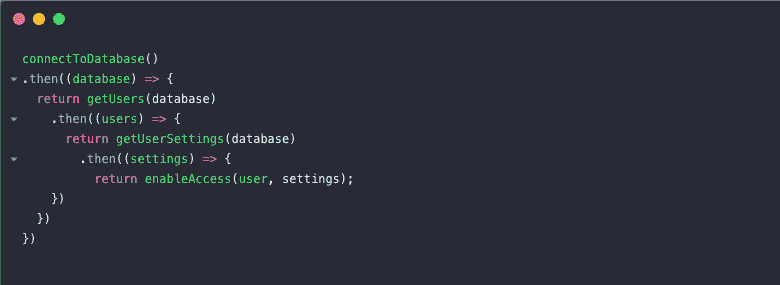

# JavaScript 中的承诺:为孩子们解释

> 原文：<https://levelup.gitconnected.com/promises-in-javascript-explained-for-kids-a69e56b58e2c>

回调、承诺和 ES6 异步等待。

在本文中，我们将讨论异步 JavaScript。这不是一个简单的话题，但我会尽可能简单明了地解释它，这样孩子就能理解了。

首先，我给你讲个故事:

从前，有一对父子。如果天气晴朗，他们想一起去划船。否则，他们会找到另一种方式度过周末。

第一场

因为这是一个小城市，他们没有互联网来查看天气，父亲说:

**父亲**:儿子……你应该爬到最高的树上去看看天气。

儿子:好的，爸爸。

父亲:我不会和你一起去，因为我很忙，但是你必须答应我，无论如何都要带着一个答案回来。根据你的回答，我会决定这个周末我们要做什么，

儿子:我保证。

**了解这一点很重要:**
1)父亲真的很忙，所以他会在儿子查看天气的时候做其他事情。

2)儿子会回到家里，告诉父亲他所看到的一切。

让我们一起看看会发生什么:

## **1。快乐案例:**

当儿子爬上树，天气晴朗的时候。他将愉快地回家，周末他们将一起航行。

## **2。坏消息:**

有可能会有**坏消息**。雨天这不是孩子想要的，但有时我们需要呆在家里(尤其是现在，冠状病毒疫情)。儿子将回家告诉父亲他看到的所有的云。在这种情况下，根据答案，父亲将决定呆在家里玩棋盘游戏。

## **3。意外错误:**

还有第三种选择。也许，出于某种不可预知的原因，儿子无法知道是否会下雨。有很多雾或者他不能爬树…这都不重要。结果就是我们不知道天气。

即使在这种情况下，男孩答应带着一个答案回来，所以他会回家，向他的父亲解释发生了什么事…然后…父亲会做出决定。

现在，我们来谈谈编程。JavaScript 以同样的方式工作。

有时候，我们在等待(儿子的)回答时，想做其他的事情(父亲)。

假设我们在 Amazon.com，想找一台新电视。有数以百万计的产品出售，所以只需 2-3 秒钟就能根据标题找到你想要的电视。

在此期间，浏览器可以做其他与我们的搜索无关的事情。(例如，打开聊天机器人或绘制页面)。

2-3 秒后，我们会有答案:

1.  产品有货，我们可以买。
2.  产品缺货，店家会推荐不同的。
3.  连接到数据库时出现问题。在这种情况下，网站将不得不显示一条错误消息。

# 好吧，好吧，这是一个很好的故事，但是……我该怎么利用它呢？

## **A)使用回调:**

回调示例

我真的不建议再用回调了。代码将很难理解和维护。可以搜索“回调地狱”了解更多。

在我们的情况下，父亲会等待儿子。但是也许母亲必须等到父亲做出决定，而父亲的决定必须等到儿子……你明白了。

回调地狱

## **B)利用承诺**

作为回调的替代，JavaScript 引入了承诺。

主旨很简单。承诺有两个功能:

*   化解:任务成功就叫(男孩爬树。不管是晴天还是雨天，我们都有应对措施
*   拒绝:当我们遇到错误(树着火了)时就会发生

承诺范例

它比回调更容易阅读，但代码仍然很多。我们不再有回调地狱，但我们可以有一个承诺地狱:D

承诺地狱

## **C)异步等待— ES6**

2015 年，JavaScript 引入了一种新的承诺语法糖。

您可以找到许多解释 ES6 功能的非常好的资料，但一般来说，您需要理解两个关键词:

*   ***async*** :等待某事的函数必须是 async。在我们的情况下，父亲将是异步的，男孩将是一个承诺。
*   在异步函数内部，我们可以使用 ***await*** 。只有在等待的函数被解析后，JavaScript 才会知道执行剩余的代码。

ES6 异步等待

# **结论:**

在编程中，理解事物如何工作以及为什么工作是很重要的。有了这个故事，你可以向任何人解释回调，承诺和异步等待，甚至是一个孩子。

让我知道你对这篇文章的看法，还有哪些主题值得一个故事。

# **演职员表:**

有趣的是，我在学习 JavaScript 时读过一个类似的故事。这是 Andy Shora 写的一篇关于 AngularJS 的旧文章，但它背后的想法是这篇文章的灵感。

你可以在这里查看:

 [## 以卡通形式解释的 AngularJS 承诺

### 每个星期天早上，一位父亲都让他的儿子去用他的…

www.andyshora.com](https://www.andyshora.com/promises-angularjs-explained-as-cartoon.html) 

让我知道你对这篇文章的看法，还有哪些主题值得一个故事。