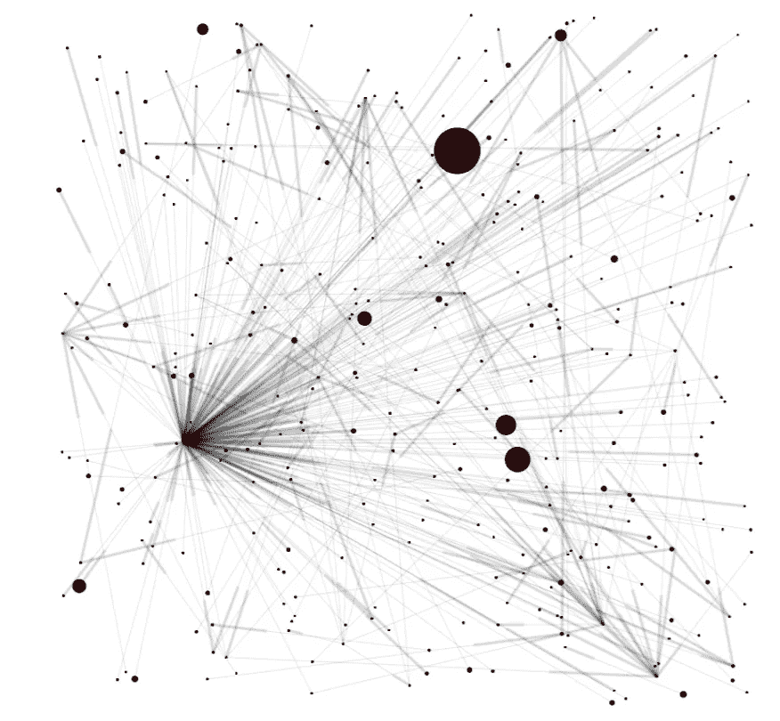

# 重要性证明共识机制

> 原文：<https://levelup.gitconnected.com/proof-of-importance-consensus-mechanism-5e0d7abbd5ba>

## 什么是重要性证明，它是如何工作的，为什么它很重要！

我将在一系列文章中讨论许多共识机制。你可以在下面的链接中找到一些答案:

*   [经过时间的证明是什么](https://medium.com/nerd-for-tech/whats-proof-of-elapsed-time-4f67cf3f45b3)
*   [比特币工作证明——你必须阅读的唯一一篇文章](/bitcoin-proof-of-work-the-only-article-you-will-ever-have-to-read-4a1fcd76a294)
*   [利益相关证明——什么是利益相关证明，它是如何工作的？](https://medium.com/nerd-for-tech/proof-of-stake-what-is-and-how-does-it-work-1c8bd7f00303)(顺便说一下，为了更好地理解重要性证明，你还应该了解利害关系证明及其局限性！)

# 所以…什么是重要性共识的证明？

共识机制允许分布式系统和区块链协同工作并保持安全。区块链是一个巨大的分布式数据库，需要有一种机制让节点就如何在所有对等节点之间建立共识达成一致。

在重要性共识证明机制中，节点根据它们拥有的股份(即拥有的硬币数量)加上节点拥有这些硬币的时间长度来接收评级。重要性证明计算中还包括其他指标，如交易次数和净转账——过去 x 天内的交易数量和规模。与赌注证明不同，在重要性证明中，节点不仅需要赌注，而且还需要通过在一段时间内拥有硬币(即授权)并实际使用它们进行交易来获得网络中的一些重要性。

作为赌注的证据，富有的节点通过积累硬币变得更加富有。重要性证明试图通过添加其他变量来解决这个问题，这些变量将赋予节点“重要性”。这种共识机制是由加密货币 NEM 开发和实现的。

## 重要性的证明区块链·NEM

NEM 是加密货币 NXT 的一个分支。它于 2015 年 3 月推出，是一款面向企业的高能效区块链。它建议解决一些与证明利害关系有关的问题，例如越富越富的弊端。重要性证明引入了基于附加变量的评级或评分系统。评级越高，节点被选为块采集器的概率越大(他们称之为矿工块采集器)。计算得分时包括的变量有归属、交易伙伴以及交易的数量和规模。

在 NEM 重要性证明机制中，节点需要满足以下条件作为条件的一部分，以获得更高的评级并被选为收集节点:

*   至少有 10000 XEM(NEM 本地加密货币)的余额。这也称为最低既得利益，这是一个需要在节点的帐户中存在一段时间才能开始收获的金额
*   已经转移了至少 1 000 XEM
*   发生在最近 43 200 个街区内(大约 30 天)
*   拥有交易伙伴，即与网络中的其他节点进行交易。在这种情况下，网络理论被用于验证节点的重要性(例如，它避免了某人创建两个帐户以便仅相互交易)

截至 2015 年 4 月 29 日的 Nem 交易图。资料来源:国民经济管理白皮书

然后，该算法将这些值放在一起，并计算每个节点的评级。根据评分，该节点将有一定概率被随机选中进行下一轮分块收割。如果选定的节点不在线，可以将块收集委托给另一个节点，也称为委托收集。

重要性证明不需要节点来计算复杂的问题，因此，它不需要花费太多的能量，也不需要任何专门的硬件。

重要性证明有多重要？嗯，没有多少区块链实施了它，但 NEM 是一个相当大的一个。也许我们还需要几年才能看到。

反正你看过我的文章，你对我很重要！🦄

🚀请跟我来，也请查看我的🧱区块链课程:

🐶[有史以来第一次 Dogecoin 课程](https://www.udemy.com/course/-dogecoin-course-the-first-complete-dogecoin-course/?referralCode=9416B1408224CE309DD8)

👨‍🎓[金融科技、云和网络安全课程](https://www.udemy.com/course/fintech-technologies-cloud-and-cybersecurity/?referralCode=F1D4EA005A2881735A36)

📖  [完成 NFTs 课程](https://www.udemy.com/course/the-complete-nft-course-learn-everything-about-nfts/?referralCode=AAEE908D13D0E2276B19)

👨‍🎓 [Unblockchain 课程](https://www.udemy.com/course/blockchain-deep-dive-from-bitcoin-to-ethereum-to-crypto/?referralCode=B8463EE382E6D313304B) —脑洞大开的区块链课程