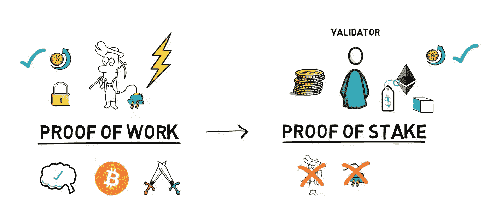
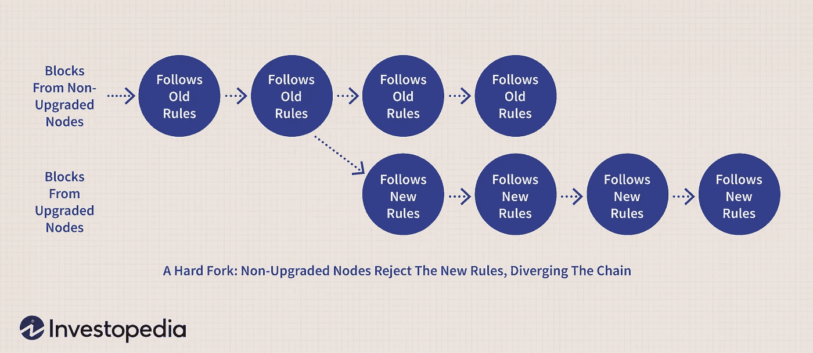

# 为什么股权证明让加密矿工毛骨悚然

> 原文：<https://levelup.gitconnected.com/proof-of-stake-ethereum-2cd5dac1092a>

## [技术](https://rakiabensassi.medium.com/list/software-engineering-7a179a23ebfd)

## 以太坊在从工作证明转换到排除矿工的利益证明算法方面取得了进展——有什么替代方案吗？

图片由[米洛斯拉夫·hamřík](https://pixabay.com/users/vjkombajn-764634/?utm_source=link-attribution&utm_medium=referral&utm_campaign=image&utm_content=6293700)从[皮克斯拜](https://pixabay.com/?utm_source=link-attribution&utm_medium=referral&utm_campaign=image&utm_content=6293700)拍摄

据分析师称，仅在 2021 年的前几个月，加密采矿行业就购买了 70 万张高端和中档 GPU 卡——市值约为 5 亿美元。

全世界数以百万计的矿工每十分钟通过在他们的电脑上运行复杂的任务来竞争，以便第一个掷出下一个区块的正确数字，并在 2021 年 7 月获得超过 20 万美元(比特币)的奖励。

那么以太坊从工作证明(PoW)到股份证明(PoS)的转变将如何影响矿工和 GPU 提供商，如 Nvidia，该公司向加密行业出售了价值 1.75 亿美元的安培 GeForce RTX 30 GPU？

作为新算法操作模型以太坊 2.0 或卡斯珀 FFG 的一部分，以太坊向 PoS 的迁移已经全面展开。电力矿商将不再被需要，因为大宗交易的验证和确认将由确认者完成，确认者的选择取决于他们的股份——他们持有股份的 ETH 数量。

在我们进一步讨论之前，让我们确保我们在工作证明的构成上是一致的。

# 工作证明:环境影响

早在中本聪 2008 年发布比特币白皮书之前，工作证明制度就已经存在。然而，在过去的几年里，它对环境的影响越来越受到批评。

矿工是工作证明的核心。他们用电脑进行数百万次反复试验的计算。第一个成功生产所需产量的矿工与网络分享，并获得免费加密货币作为奖励。

当比特币鲜为人知，价值只有几分钱的时候，采矿很便宜。但随着其价值的增加，一种军备竞赛开始了，矿工们投入资源，寻求成为第一个验证区块并赚取新硬币的人。这场竞争已经导致像比特大陆这样的大型中央集权的采矿场越来越占优势。

中国比特大陆矿业农场([图片来源](https://qz.com/1053799/chinas-bitmain-dominates-bitcoin-mining-now-it-wants-to-cash-in-on-artificial-intelligence/)

因此，电力消耗大幅增加。几项研究表明，如今比特币矿工的用电量相当于一些小国。

> 比特币网络的年度电费将超过智利和孟加拉国等国家。

为了解决这些问题，区块链第二大加密货币以太坊(Ethereum)决定改用更经济的股权证明系统:它可以减少 99%的网络能耗——估计为 45，000 千兆瓦时。

工作证明与利益证明(source⁴图片)

# 利害关系的证明:它是如何工作的？

在利益证明系统中，网络参与者应该证明他们已经投资了加密货币以便能够开采，而不是使用计算能力。这就是“股份”一词的由来。

这种想法背后的原因是，那些投资了大量资金的人对确保一切彻底好转有很大兴趣，因为欺诈会危及对货币的信任，从而危及你自己投资的价值。

1.  任何携带 32 ETH 进场的人都可以作为鉴定者参与。每个验证者拥有与存款金额成比例的投票权，类似于股东大会。
2.  事务的验证器是随机选择的。他们将对事务进行排序，并向网络提出结果块。
3.  验证者与被选为**证明者**的一组成员分享这个新的区块链。任何给定的块过程至少需要 128 个证明者。
4.  证明者检查验证器的工作，并接受或拒绝它。如果被接受，验证者和证明者将获得免费的以太作为他们形成的每个块的奖励。
5.  如果你想作弊，并产生一个无效块，你失败的投票，并失去你的股份。试图操纵该过程的验证器可能会丢失它所投入的 32 个以太中的一部分。
6.  为了成功作弊，验证者必须控制超过 50%的资本，从而超过 50%的投票权。

工作证明与利益证明(source⁴图片)

# PoS 优势

那么清酒证明制度有什么优势呢？

这种替代解决方案有一个好处。但这也可能是失败。让我们从好的一面开始。

## 交易率

预计网速会提高。目前，以太坊每秒处理大约 30 笔交易。以太坊的创造者 Vitalik Buterin 认为，到项目结束时，这个数字可能会上升到每秒 10 万次交易*。*

## *费用减少*

*最近一次对网络的更新，名为“ ***硬叉伦敦*** ”，于 8 月初生效，是 2015 年以来对以太坊区块链最大的改变，并包括了一项名为 ***EIP 1559*** 的减费功能。降费减少了作为每笔交易一部分的以太供应，创造了以太坊成为通缩的可能性。*

## *效率*

*以太坊 2.0 的另一个变化叫做**分片**，它将把区块链分成 *64* 所谓的“分片”。每个碎片只负责总事务中属于它的部分，然后结果将与连接到所有其他“碎片”的主网络进行协调这将使整个网络速度更快。*

> *证明利害关系解决了生态问题，但也有不利的一面。*

# *PoS 劣势*

## *集中化风险*

*块奖励可以有一个*复利效应*:成功的验证者收到钱，可以再投资以获得更多的投票权重。从长远来看，这可能会导致验证器的集中化。*

*在利害关系证明系统中，对于一个小组来说，控制过程比在工作证明系统中更困难，但这仍然是可能的。你投入的以太越多，你就越有可能被选为验证者或证明者。*

## *硬叉子&没有什么危险*

*挑战不仅来自欺骗和集中化，还来自升级，如果变化是有争议的。在这种情况下，网络的一部分将加入升级，而对新功能越来越不满意的社区的其余成员将继续使用旧协议。*

*比特币在过去已经经历了几次这样的**硬分叉**，产生了*比特币现金*和*比特币黄金*等后代。*

**

*加密货币在新协议、功能或规则发生变化后的硬分叉-图片由 Julie bang investopedia 2019(source⁶)提供*

*任何时候在区块链中出现分叉，安全问题**无关紧要**都可能发生，要么是因为恶意的动作，要么是当两个诚实的验证者同时提出阻塞时的意外。*

*在这里，参与者可以尝试作弊，如果正确的链变体最终获胜，仍然不会受到损害。这使得利害关系共识系统更容易受到攻击。*

# *最终想法*

*比特币之类的货币因为耗能而成为环保猪。解决这个问题最简单的方法就是简单地停止公共采矿，或者在全球范围内由大量的矿工同时完成同样的任务。*

*作为对工作证明的其他替代方案的采用，以太坊现在正在迁移到利益证明。但是还有其他机制来保护区块链和解决生态挑战:*

*   *使用私有以太网中使用的**授权证明**，只有某些授权节点被允许生成和验证新块。*
*   ***由英特尔开发的耗时证明**，使用特殊的 CPU 命令迫使处理器什么也不做。该过程基于“可信执行环境”,并且需要对硬件制造商的信任。*
*   *还有货币为阿达的区块链**卡尔达诺**。*

*哪种实现将最终赢得比赛，以及利害关系证明是否能够战胜其他加密货币的问题将在未来得到澄清。*

*🧠💡我为一群聪明、好奇的人写关于工程、技术和领导力的文章。 [**加入我的免费电子邮件简讯，独家获取**](https://rakiabensassi.substack.com/) 或在此注册 Medium。*

**你可以在 Udemy 上查看我的* ***视频课程****:*[*如何识别、诊断、修复 Web Apps 中的内存泄漏*](https://www.udemy.com/course/identify-and-fix-javascript-memory-leaks/) *。**

* [## 为什么软件开发人员需要采用系统思考者的思维方式

### 放下原始的编码技能去理解更大的图景

better 编程. pub](https://betterprogramming.pub/system-thinking-in-software-development-9a7828303e95)  [## 一个少年如何成为一名连续创业者和社交媒体商业未来的先驱

### 如果你的生意不在社交媒体上，你几乎没有生意

bettermarketing.pub](https://bettermarketing.pub/teenager-serial-entrepreneur-3589e1288b67) 

# 参考

[秘密采矿对 AIB 销售额的 5 亿美元影响](https://www.jonpeddie.com/blog/crypto-minings-half-a-billion-dollar-impact-on-aib-sales)

[每块的块奖励](https://bitcoinvisuals.com/chain-block-reward)

[英伟达涉嫌向加密矿工出售价值 1.75 亿美元的安培 GeForce RTX 30 图形处理器](https://wccftech.com/nvidia-allegedly-sold-175-million-worth-ampere-geforce-rtx-30-gpus-to-miners/)

⁴ [以太坊 2.0——游戏改变者？桩的证明、信标链、分片、对接说明](https://www.youtube.com/watch?v=ctzGr58_jeI)

⁵ [利益证明(vs 工作证明)](https://www.youtube.com/watch?v=M3EFi_POhps)

⁶ [硬叉(区块链)](https://www.investopedia.com/terms/h/hard-fork.asp)*