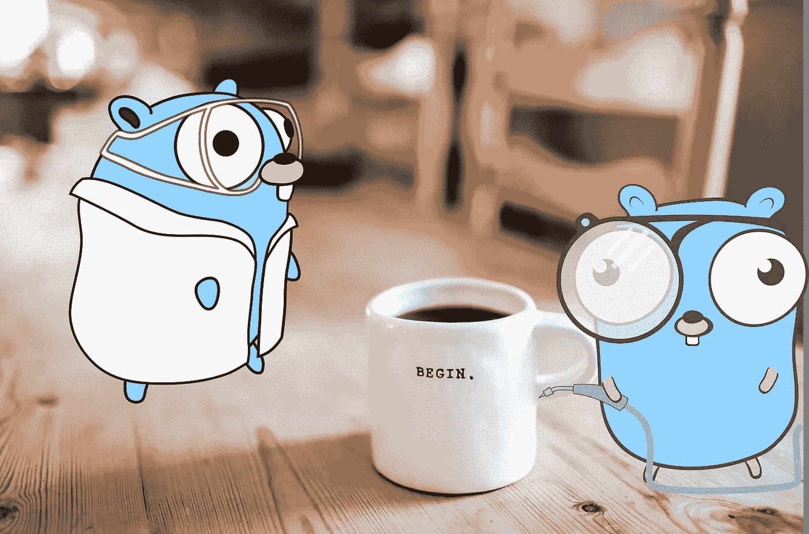
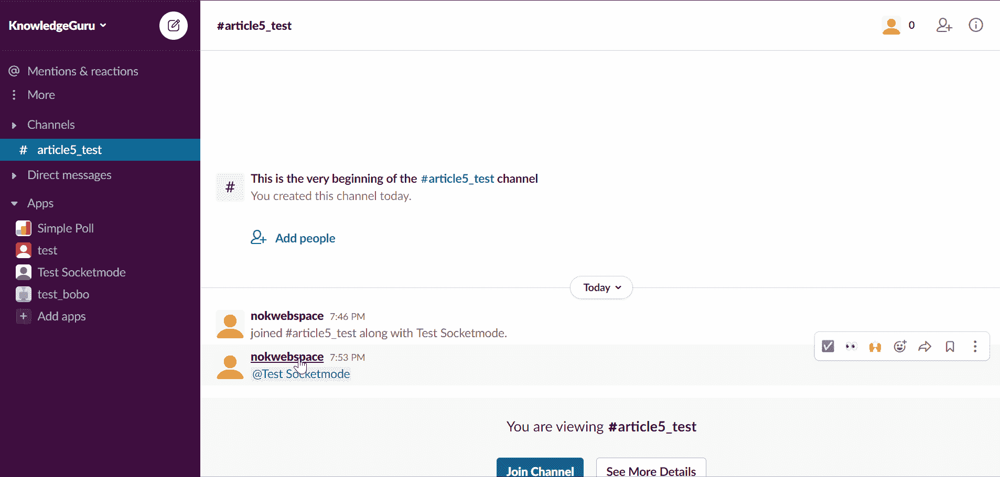
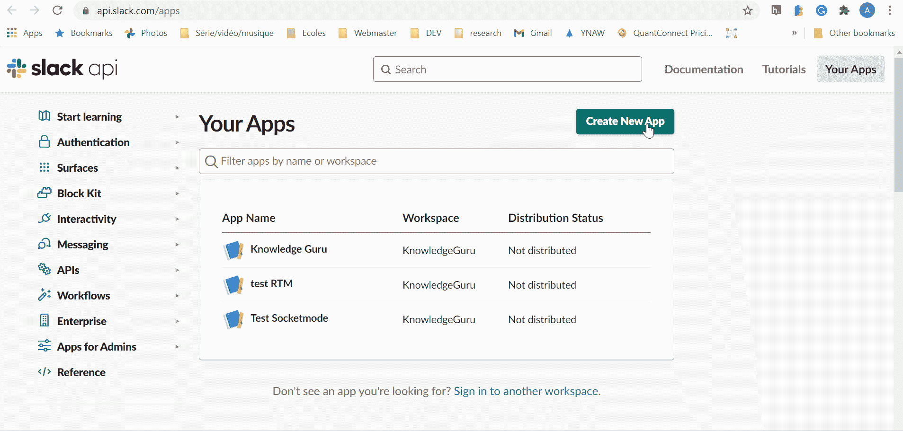
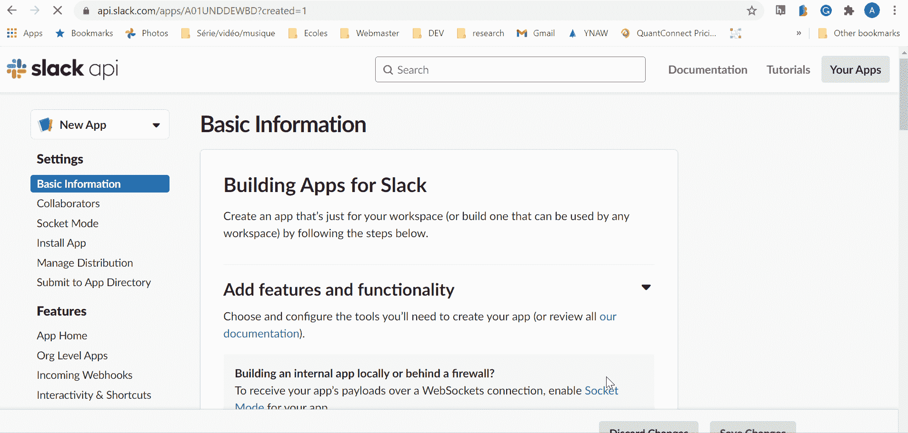
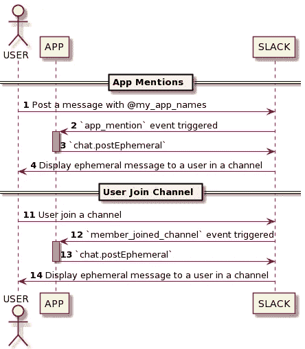

# 使用套接字模式正确地欢迎用户使用 Golang

> 原文：<https://levelup.gitconnected.com/properly-welcome-users-in-slack-with-golang-using-socket-mode-9a206d30a34a>

## GOLANG SLACKBOT 教程

## 掌握一对一的互动



照片由[丹妮尔·麦金尼斯](https://unsplash.com/@dsmacinnes?utm_source=medium&utm_medium=referral)在 [Unsplash](https://unsplash.com?utm_source=medium&utm_medium=referral) 上拍摄，[埃贡·厄尔布尔](https://github.com/egonelbre)拍摄。

当创建一个 Slack 应用程序来增加参与度时，开始小的有意义的一对一交互是必不可少的。例如，你可以在 Slack [应用主页](https://api.slack.com/start/overview#app_home)发送一个简短的教程，告诉你如何使用你的应用。每当用户加入时，你也可以介绍一个频道的目的和规则，并附上只有他能看到的信息，以免污染其他成员。

我希望这篇文章能帮助你理解 Slack 应用程序的一些核心特性。在进入编码之前，让我展示两个用例并解释 Slack 的术语。有了这个基础设置，您将能够与您的用户创建更加令人兴奋的交互。我认为这些是任何 Slack 应用程序的基础。

本教程指导你实现我最初提到的两个用例，在 Golang 中使用 [slack-go](https://github.com/slack-go/slack) 库和使用 [Slack Socket 模式](https://api.slack.com/apis/connections/socket)。

> *为什么是套接字模式？*🤔

使用套接字模式，你不需要公共服务器。换句话说，你的笔记本电脑，你的 Raspberry Pi，或者一个私人服务器都可以托管你的机器人。套接字模式非常适合您不打算通过[应用程序目录](https://slack.com/apps)发布的小型应用程序。

## 用例 1:当用户加入通道时发送临时消息

[短暂消息](https://api.slack.com/messaging/managing#ephemeral)只对特定用户可见，不会持续存在于对话中。这些是对用户交互反应的理想选择，例如加入频道、回答敏感信息、给出指示等。



提到机器人会触发一条短暂的信息。

## 用例 2:用你的应用主页中的消息来回应提到你的应用或机器人的消息。

[App Home](https://api.slack.com/start/overview#app_home) 是你 Slack 应用的专用空间。您可以创建一个自定义的登录页面，添加一个关于页面来记录您的应用程序，并在您的应用程序和用户之间建立一个私人消息线程。与短暂的消息不同，这些消息将被持久保存，这意味着您发送的所有提示和技巧都将很容易被访问。我个人更喜欢在 Slack 应用主页上发送信息，而不是通过机器人作为私人信息发送。你想让你的用户相信你的应用主页是一个可以找到你的应用或机器人信息的地方。


加入频道会在 App Home 中触发一条消息

# **教程步骤 1:配置您的应用**

创建一个[新应用](https://api.slack.com/apps)。请给它起一个很酷的名字🤘。



逐步创建一个松弛的应用程序

在适当的部分激活套接字模式。不要忘记保存提供给您的应用程序令牌😇。此外，激活事件 API 并订阅以下事件:

*   app _ mentionned
*   成员 _ 加入 _ 渠道


逐步配置松弛应用程序

转到`OAuth & Permissions`保存我们将需要的`Bot User OAuth Token`并添加以下权限:

*   聊天:写作—让您在频道中发布消息
*   users:read —在本例中，我收集用户名来个性化问候消息



逐步管理 Slack Bot 权限

# **教程步骤 2:创建项目存储库**

首先，创建一个新的 Go 项目并导入`slack-go`库。

```
go mod init go get -u github.com/slack-go/slack
```

我在本教程中使用我的`slack-go`分支，因为我正在演示的一个特性还没有被合并 [#PR904](https://github.com/slack-go/slack/pull/904) 。

要使用 fork，我们需要在`go.mod`中添加一个 replace 语句:

```
replace github.com/slack-go/slack => github.com/xnok/slack v0.8.1-0.20210415015007-5ceeab881540
```

然后，我们强制考虑这种变化:

```
go mod tidy
```

最后，您可以创建下面的项目结构，或者在我们学习教程的过程中引用它。

```
+ controllers
|`- greetingController.go
+ drivers
|`- Slack.go
+ views
|`+ greetingViewsAssets
| |`- greeting.json
| - greetingViews.go
- main.go
```

我使用 MVC 结构，并相应地组织文件。接下来，我将解释每个元素及其实现。你可以在这里找到我的教程[的完整代码。这可能有助于派生出代码来跟进。](https://github.com/xNok/slack-go-demo-socketmode)

# **教程第三步:基础> main.go**

文件`main.go`本质上管理初始化和依赖性。首先，它从一个文件中读取我们需要的两个松弛令牌:

```
SLACK_APP_TOKEN=xapp-xxxxxxxxx 
SLACK_BOT_TOKEN=xoxb-xxxxxxxxx
```

我创建了一个小助手`ConnectToSlackViaSocketmode`来验证这两个环境变量，并实例化 Slack 客户机。[参见 drivers/Slack.go 代码](https://github.com/xNok/slack-go-demo-socketmode/blob/main/drivers/slack.go)。

然后我们初始化我们的事件监听器和控制器。最后，我们启动事件循环，以便应用程序开始接收我们从 Slack 订阅的事件。

为了让这段代码做任何事情，我们需要创建我们的控制器，所以让我们开始吧。

# **教程步骤 4:创建控制器> greetingController.go**

我们试图用这种控制器实现的流程如下:



控制器的顶部管理依赖关系和事件处理。`NewGreetingController`是`GreetingController`的初始化构造函数。它使用`EventHandler`来注册我们想要监听哪个事件，以及回调哪个函数来处理它。这个 Slack 应用程序使用处理程序和中间件设计模式来处理每一个事件，如果您需要更多的解释，您可以在这里阅读专门的文章。

我们将在`reactToMention`和`postGreetingMessage`中定义我们的机器人的核心逻辑。让我们深入研究一下💪。

## 实施反应

该函数的代码中有五个重要步骤:

1.  `*socketmode.Event`是事件的一般类型；你注册那个函数来接收`AppMentionEvent; therefore`你需要转换的传入事件，这样处理起来更方便。
2.  你需要确认你收到了信息。它是特定于套接字模式的，如果您忘记，可能会导致错误。
3.  我们需要用户的真实姓名，所以我们使用`GetUserInfo`。Slack 只提供 UserID，因为这个数据可能被认为是敏感的。
4.  我们使用我们的视图生成您的消息。我们还没有实现它！
5.  我们将消息发送到我们的应用程序主页。**这是比较棘手的部分**。要在 App Home 中发送消息，需要将 channelID 设置为 UserID。换句话说，你的 App Home channelID 就是用户 UserID。我个人觉得 API 实现/约定有点牵强，但是现在你知道了！！👌

## 实现 postGreetingMessage

除了第 4 项，我们有与`reactToMention`相同的五个关键点，我们改为通过专用函数发送短暂消息。

# **教程第五步:创建视图> greetingViews.go**

为了使创建 Slack 视图的工作变得简单，我使用了一些技巧:

1.  我专门用 [Block-kit](https://api.slack.com/block-kit) 设计了我的 UI，并将 JSON 有效载荷保存在一个 JSON 文件中。例如，参见`greetingViewsAssets/greeting.json`。
2.  我使用 [Go 模板](https://golang.org/pkg/text/template/) s 来呈现我的视图，并注入用户名等可变元素。
3.  从 Golang 1.16 开始，我使用`embed`包来访问我的项目中嵌入的文件。

如果你需要更多关于这些技巧的解释，你可以在这里阅读专门的文章。

创建这个视图需要几个简单的步骤。首先，呈现模板会将用户名注入消息中。然后，您最终得到一个生成的 JSON，您可以将它作为 Slack 消息解组。

# 尝试应用程序

成功完成教程后，您可以运行您的应用程序:

```
go run ./main.go
```

也可以直接克隆[我的库](https://github.com/xNok/slack-go-demo-socketmode)来提前试用。

# **最终想法**

完成本教程将为您提供一个与用户互动的基础。从技术上讲，你还没有在本教程中学会如何发送一条常规消息。但我认为，了解如何使用 Slack 提供的所有通信方法来减少通知疲劳是至关重要的。如果制作不当，一群懒虫会制造很多噪音。

从那时起，你可以从 Slack 中寻找更高级的功能，将你的工作区自动化带到一个新的水平:应用程序主页标签，斜杠命令，快捷方式，交互，工作流。

*进一步解读*