# 性能

> 原文：<https://levelup.gitconnected.com/properties-98d4122f08b5>

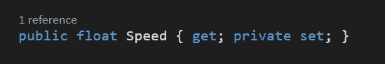

属性到底是什么？嗯，*属性*有点像类固醇上的变量。您可以*从属性中获取*或*设置*值，通过它们运行*功能代码*，并使用它们来控制*变量*的*访问修饰符*。让我们从制作一个*播放器*脚本开始，并开始*声明*属性！

**声明属性**

你有没有注意到 *IntelliSense* 在使用*点符号*后显示一个 **get** 或 **set** 值？那些是财产！这是在告诉你，你可以*得到*或*设定*物体的位置。

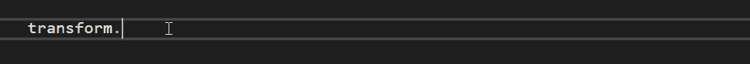

有些东西像 *Time.deltaTime* ，只有*获得*的值，而没有能力*设置*的值。这是因为*的*访问修饰符*设置*值为*私有*或*保护*。

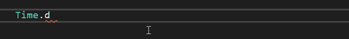

当你使用一个*等号*给一个变量赋值时，你就是在*设置*这个值。注意这里试图*设置*的值 *Time.deltaTime* 抛出*错误*，因为它没有设置值。设置*的数值计算*起作用，因为它有一个*获取*和一个*设置*。

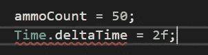

首先是一个标准的*私人*变量为我的玩家*速度*使用*骆驼情况*。然后*公有属性*声明使用 *pascal case* 与*相同的*变量名。函数内部是 *get* 关键字，后面是更多的带*返回*私有速度值*的花括号。*

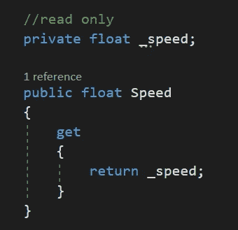

现在当我在 void *Start* 中检查 public speed *属性*时，可以看到我有能力*获取*的值，但没有能力*设置*它。

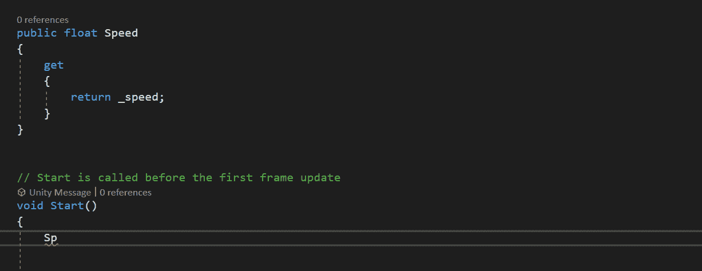

在 *get* 下面，你可以做一个 *set* ，并且*赋值*camel case*private speed 变量等于*关键字值*。Unity 将基于私有*变量*自动检测值的返回类型，并确保您返回正确的值*类型*。*

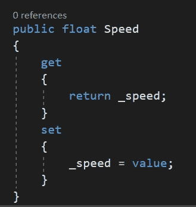

现在公共速度*属性*显示我可以获取和设置该值。

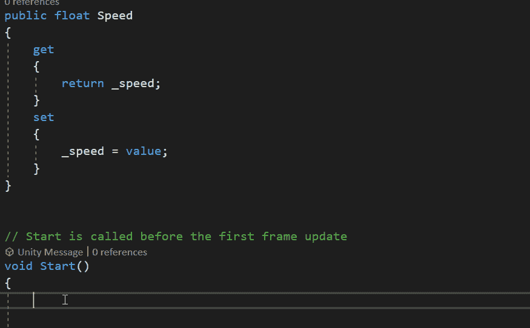

你可以做的另一件事是从这些*方法*中运行代码！这里我介绍*最小*和*最大*速度变量。如果我将速度增加到*增加*，我就可以检查它是否达到了*最大*速度变量，然后运行一些代码。如底部的 void *Start* 所示，您可以像普通变量一样将*属性*的*值*赋给*。*

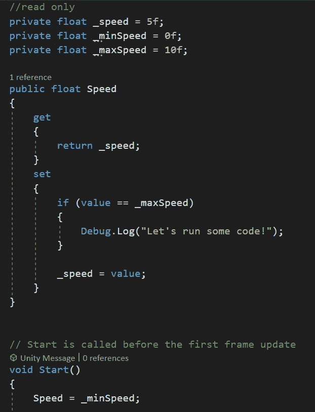

**汽车属性**

有一种更短更简洁的方式来声明属性，那就是使用*汽车属性*。现在删除了原始变量，我所需要的就是这个带有 *get* 和 *set* 的 Auto 属性。

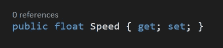

在 void *Start* 中键入 *Speed* 表示我仍然可以*得到*和 *set* 这个值。

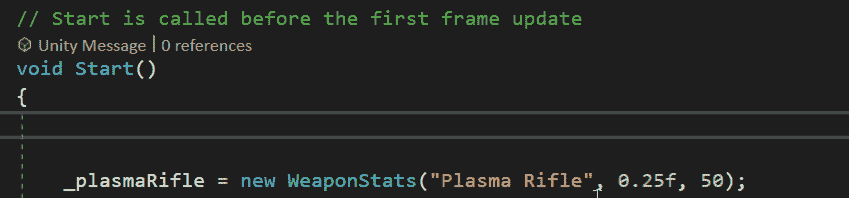

像常规变量一样，我也可以*给*分配*自动属性*的值。

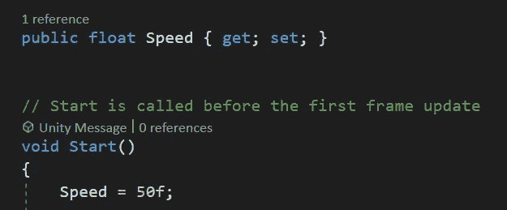

这里需要注意的一点是，你*不能*通过*自动属性*运行额外的代码。如果你想在你的*函数*中运行代码，你想使用更冗长的属性声明。

这里你可以做的另一件事，是将一个*访问修饰符*分配给 *get* 或 *set* 。在这个例子中，*集合*现在是私有的。与使用常规属性不同，使用*自动属性*时，您实际上需要有一个 *get* 和一个 *set* 。因此，如果您只想要一个 *get* ，您仍然需要*声明一个*private*set 为只读属性。*

Speed 属性现在在 IntelliSense 中显示 get 和 private 集。如果我从另一个脚本访问这个，我只会看到*得到*作为一个可用选项。这样，其他脚本可以读取这个值，但不能改变它。

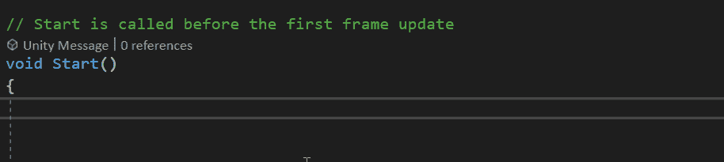

另外需要注意的是，即使这个属性是 *public* ，它仍然*不能*被*序列化*给*检查员*。但是，如果需要，您可以使用*调试*模式在*检查器*中看到它。

它将在这里显示为灰色区域，但仍然可见。

**何时使用属性**

属性对于*经理类*来说很棒，因为你不能立即*分配*他们的*值*。你只能用一个 *get* 或者一个 *set* 来声明它们。属性然后需要在 void *Start* 中*初始化*。缺乏序列化属性字段的能力也使得它们在某些情况下不太理想。你可能还想记录有多少敌人已经繁殖到你的场景中，但是你不需要*改变*值*。跟踪*分数*是另一个例子，你可能希望 *UI 管理器*能够*读取*分数，但不能更改它。最后要注意的是，如果你需要的话，属性*也可以设为静态*。***

*一般来说，只有当*绝对需要*公开时，你才希望将事情*公开*，因此*属性*非常适合将值*公开*用于*获取*，而将*私有*用于*设置*。*