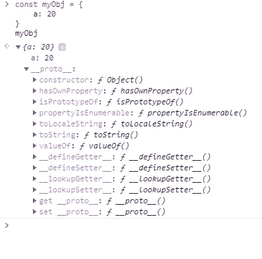

# Javascript 对象中的属性隐藏和 __proto__。

> 原文：<https://levelup.gitconnected.com/property-shadowing-and-proto-in-javascript-objects-d007fa062a63>

在谈论属性隐藏和解释它是如何工作的之前，我们首先要定义隐藏的一般含义。

根据维基百科:

> 在计算机编程中，当在某个**范围**(决策块、方法或内部类)内声明的变量与在外部范围内声明的变量同名时，就会出现**变量隐藏**。在标识符级别(名称，而不是变量)

考虑:

```
let a = 20function myFunction() { console.log(a)}myFunction() // -->20
```

这是一个简单的例子。“myFunction”可以访问变量“a”的值，因为它是在其外部作用域(本例中为全局作用域)中定义的。
现在考虑这个例子:

```
let a = 20function myFunction() {
  let a = 10 console.log(a)}myFunction() // -->10
```

我们定义了另一个变量，该变量与其外部作用域(a)中的变量同名。所以 *console.log* 会打印新的值:10。我们说' *myFunction* ' **中的 *'a'* 遮蔽了存在于其外部作用域的' a '。**听起来合乎逻辑对吗？

对象属性具有类似的机制，但稍微复杂一些。

为了理解对象中的隐藏是如何工作的，我们应该首先理解 Javascript 中的原型是如何工作的。

当您创建一个新的 Javascript 对象时，一个名为 **__proto__** 的新的隐藏内部属性(在大多数情况下)会在您的对象中自动创建，它只是作为对另一个现有对象的引用。



myObj 有一个名为 __proto__ 的新属性，它本身有许多属性

如果你使用*对象文字符号*，那么 **__proto__** 属性将被设置为*内置* **Object.prototype.** 你可以把它想象成一个对象，它包含了各种在 Javascript 对象上使用的通用工具。(注意，这不是创建 __proto__ 是 Object.prototype 本身的对象的唯一方法):

```
const myObj = { a: 20}console.log(myObj.__proto__ === Object.prototype) // --> true
```

通过显式修改 **__proto__** 值，您可以指定希望新创建的对象将哪个对象的 **__proto__** 作为*引用*:

```
const obj1 = { b: 90}const obj2 = {}obj2.__proto__ = obj1
```

或者使用 Object.create 方法:

```
const obj1 = {b: 90}const obj2 = Object.create(obj1)console.log(obj2.__proto__ === obj1) // --> true
```

您现在可能会问自己:为什么 Javascript 要在我的对象中创建这个 *__proto__* 属性，为什么我还要修改它？
这个问题的答案是:**原型链**。

如果您想访问对象内部的属性，只需键入 object.propertyName。但是如果该属性不存在呢？在这里，一个充满可能性的新世界打开了。

如果您试图访问一个您没有在对象中定义的属性，Javascript 引擎将尝试在您的对象的 **__proto__** 属性中查找它(正如我们前面解释的，它只是对另一个对象的引用)。如果它没有找到它，它将尝试在另一个对象的 **__proto__** 中找到它，直到它到达 **Object.prototype** ，这是*链的末端。这就是为什么我们称它为* ***原型链。***

考虑下面的例子:

```
const obj1 = { a: 90}const obj2 = {}obj2.__proto__ = obj1console.log(obj2.a) // --> 90
```

*obj2* 没有属性 a。我们已经能够通过我们自动创建的 *__proto__* 来访问它，它是对“ *obj1* 的引用。当*引擎*在“ *obj2* ”层没有找到“a”时，它继续检查 **__proto__** 属性“a”是否存在，然后找到并打印它。

这就是**属性隐藏**发挥作用的地方。如果我们在' *obj2* '中已经有了一个名为' a '的属性，那么它就会有**遮蔽' **obj1** '中的' a ':**

```
const obj1 = { a: 90}const obj2 = { a:20}obj2.__proto__ = obj1console.log(obj2.a) // --> 20
```

现在一切都开始有意义了，对吗？

问题是，事情要比这稍微复杂一些。还有其他一些定义**属性隐藏的规则。**

***第一法则:***

如果在 **__proto__** 链上找到您尝试创建/修改的属性，并且其**属性描述符**的*【可写】*设置为**假，**该属性将不会在您的新对象级别上创建/修改。

> 一个`***PropertyDescriptor***` 描述了一个`[***Object***](https://www.javascripture.com/Object)`上的属性。任何 JavaScript 对象都可以用作`***PropertyDescriptor***` ，其中未指定的属性将被视为`***undefined***` 或`***false***`。
> 
> https://www.javascripture.com/PropertyDescriptor

默认情况下' *writable'* 设置为 true，但是我们可以使用 *Object.defineProperty* (或者 Object.defineProperties 用于同时定义多个属性)来更改它。

这个方法用于在对象内部定义一个新的属性，但是它允许我们指定它的*属性描述符*以及*。*

我们将只关注' *writable '，因为其他属性超出了本文的范围。*

考虑:

```
const obj = {}Object.defineProperty(obj, "a", {value: 20,writable: false})obj.a = 100console.log(obj.a); // --> 20
```

在本例中，我们在对象' *obj* '中定义了一个新属性，为其赋值 20，并将其可写的*标记为 **false** 。*

这意味着‘a’的值不能被修改(除非我们将它的*可写值*改为 true)。这使其成为一个只读变量。

这对所有创建的对象都有影响，这些对象引用了此对象的 ***__proto__*** (其属性的 writable 为 false)。他们将无法**跟踪**该资产，甚至无法创建同名资产:

```
const obj = {}Object.defineProperty(obj, "a", { value: 20, writable: false})const obj2 = Object.create(obj)obj2.a = 40console.log(obj2.a) // --> 20console.log(obj2.hasOwnProperty('a')) // --> false (Used to check whether a particular object has a specific property)
```

***第二条规则:***

如果你试图**阴影**的属性是一个 ***Setter*** ( *因此是一个* ***Getter，*** *因为没有 getter* 就没有 Setter)，那是行不通的！

> **Getters** 是实际调用隐藏函数来获取值的属性。**设置器**是实际调用隐藏函数来设置值的属性。
> 
> src:你不知道 Js-凯尔·辛普森

考虑:

```
const obj = { get a() { return this._a }, set a(value) { this._a = value + 10 }}obj.a = 20console.log(obj.a); // --> 30
```

当我们试图将 20 赋给' a '属性时， **setter** 方法被自动调用，并将 10 加到名为' _a '的属性的值上(这是一个任意的名称，您可以随意命名)。然后当我们想要检索它的值时，一个 **getter** 方法被自动调用并返回' _a + 10 '即 30。

当你试图在你的对象**、**中添加一个属性时，如果在 **__proto__** 链上找到它，但是使用 **Setter** 方法**、**将调用 **Setter** 方法，而不是**隐藏**属性:

```
const obj = { get a() { return this._a }, set a(value) { this._a = value + 10 }}obj.a = 10const obj2 = Object.create(obj)obj2.a = 100console.log(obj2.a); // --> 110console.log(obj.a); // --> 20
```

# 结论:

当你创建一个新对象时，一个名为 **__proto__** 的新属性被定义在其中。此属性的行为相当于对另一个对象的引用，该对象默认为 Object.prototype。

当你在你的对象中创建一个新属性时，在 **__proto__ 链**中具有相同名称的属性会被新属性自动**隐藏**，仅当:

**1-** 在**链**上找到的属性没有将*可写*设置为**假。**

**2-** 在**链**上找到的较高属性没有 **setter** 方法。

[](https://skilled.dev) [## 编写面试问题

### 一个完整的平台，在这里我会教你找到下一份工作所需的一切，以及…

技术开发](https://skilled.dev)