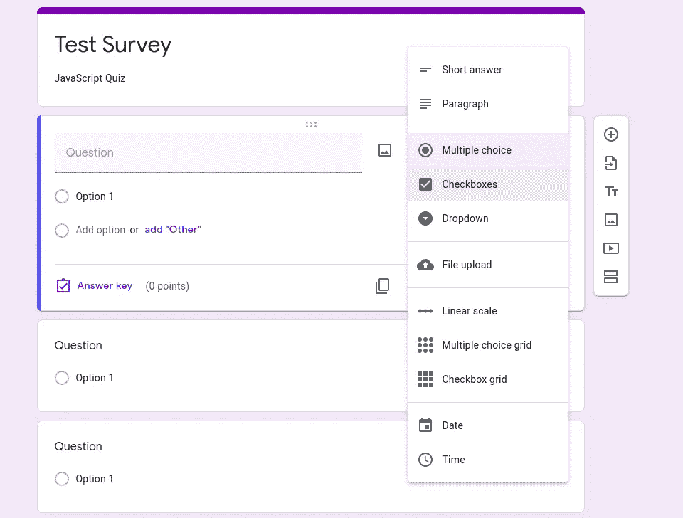

# 角度应用的利与弊

> 原文：<https://levelup.gitconnected.com/pros-and-cons-in-angular-application-4002a5a957f>

## 有角的

由[罗曼·博日科](https://unsplash.com/@romanbozhko?utm_source=unsplash&utm_medium=referral&utm_content=creditCopyText)在 [Unsplash](https://unsplash.com/s/photos/coffee-shop?utm_source=unsplash&utm_medium=referral&utm_content=creditCopyText) 拍摄的照片

上周，我刚刚读了[一篇关于 Angular](https://www.altexsoft.com/blog/engineering/the-good-and-the-bad-of-angular-development/) 的利与弊的文章，根据我从 Angular 2-rc1 到 Angular 9 的 4 年工作经验，我认为 Angular 2+的一些观点是不正确的。

我决定写这篇文章来讨论 Angular 2+应用程序的利与弊:

棱角分明的优点

*   角坐标的力量
*   轻松学习编码+惯例
*   反应式编程
*   巴泽尔支持
*   反应形式

有角度的缺点

*   更新到新版本需要时间
*   不擅长服务器端渲染
*   没有 jQuery 的生活

*更多类似这样的内容，查看*[*https://betterfullstack.com*](https://betterfullstack.com)

# 棱角分明的优点

使用 Angular 后，您会意识到一些主要的好处。

## 角坐标的力量

在 Angular 应用程序中，您几乎可以从 [Angular CLI](https://cli.angular.io/) 创建任何东西。它允许你做很多事情:

1.  通过`ng g application`和`ng g library`语法创建多个应用程序和多个库
2.  支持为服务人员创建模板
3.  通过`ng g`命令支持创建`class`、`component`、`directive`、`enum`、`guard`、`interceptor`、`interface`、`module`、`pipe`、`service`。
4.  通过`ng xi18n`支持多种语言。
5.  通过`ng lint`运行林挺工具。
6.  通过`ng test`和`ng e2e`进行单元测试和端到端测试。
7.  使用`ng update`轻松迁移项目。

Angular CLI 支持开发人员在应用程序中做几乎所有的事情。

## 轻松学习编码+惯例

Angular 超级好学。四年前我开始开发 Angular 2 时，安装、运行和理解代码只花了我 3 天时间。

原因是:

1.  Angular CLI 使用类似`home.component.ts`的约定创建文件。这让我很容易理解。
2.  Angular 使用 [TypeScript](https://www.typescriptlang.org/) 并且当你处理 JavaScript 并查看 TypeScript 时，就像一个成年人回到学校学习 1 + 1 = 2。编写 TypeScript 非常简单和容易。
3.  设置新项目时，样式表有多种选择。您可以使用默认的一个`css`或选择 Sass 和其他。选择你熟悉的或者客户要求的。不需要花时间来配置这个路径。

你不需要花太多时间去学习 Angular，我也不认为 Angular 需要太多 JavaScript 知识。

## 反应式编程

 [## 现代 Web 应用程序中的反应式编程

### 了解如何在现代 web 应用中处理异步代码，以及我们如何管理它——从回调和承诺到 RxJS

levelup.gitconnected.com](/approach-reactive-programming-in-modern-web-application-b20f59b7699d) 

在创建了一个新的 Angular 项目后，你可以从`node_modules`中看到`rxjs`库，因为 Angular 到处都在使用反应式编程:

1.  Http 请求将返回一个流。您可以使用`pipe`或`subscribe`来得到结果。
2.  截击机。这是一种节点中间件。你可以使用反应式编程来处理与 XHR 相关的事情。
3.  [Renderer2](/angular-and-rxjs-patterns-use-reactive-programming-to-compose-and-manage-data-in-angular-apps-2e0c4ce7a39c#description) 是 Angular 应用中 jQuery 的替代品。这就是 Angular 2+在应用程序中不使用 Jquery 的原因。

    **你心目中的不可能？**

    这是 Angular 的主要优点之一。jQuery 只是一个只做一些 DOM 操作的库。人们可以用 jQuery 构建什么，那么它就可以用 renderer2 来构建。

    在角度应用中:

    *   使用 Renderer2 进行 DOM 操作
    *   使用 Renderer2 实现任何组件，如幻灯片、转盘、切换按钮或许多其他组件。

    这有助于客户避免在他们的项目中使用太多的开源库，以及许可证风险。

    另一方面，这意味着开发人员自己应该对不用 jQuery 构建东西有很好的了解。

    ## 反应形式

    在使用了包括 Angular、React 和 Vuejs 在内的 3 个不同的 UI 框架和库之后，我认为 Angular 是最好的。

    也许在这一点上你不会同意我的观点。

    但是，您应该尝试使用 Angular、React 和 Vuejs 创建一个演示应用程序，其逻辑类似于创建 google survey 应用程序。

    *   有一个加号按钮添加一个新的问题部分
    *   单击加号按钮添加一个新问题，并输入一些信息，如问题、选项 1、问题类型和添加选项。
    *   你可以把许多问题分成一大部分。

    谷歌调查样本

    这意味着你必须创建一个有三个不同层次的表单。

    1.  部分级别
    2.  问题级别
    3.  选项级别

    有一种情况是，你想得到属于第 2 部分的问题 5 的选项。这个只需要一行代码来表示角度的无功形式。

    Angular 的无功功率是 Angular 给竞争对手带来的最大好处之一。

# 棱角分明的 CONS

Angular 也有一些我认为相对于 [Vuejs](https://vuejs.org/) 或者 [Reactjs](https://reactjs.org/) 的缺点。

## 花点时间更新到新版本。

你知道 Angular 发布新版本的速度非常快。这意味着 Angular 开发者每 3 个月或 6 个月，应该为 Angular 迁移一次版本，以避免过时。

以下是发布主要版本的时间表:

*   ***第二版:***2014 年 10 月上映。
*   ***版本 3:*** 得到错误。不发布
*   ***第四版:***2016 年 12 月 13 日发布。
*   ***第五版:***2017 年 11 月 1 日发布
*   ***第六版:***2018 年 5 月 4 日发布
*   ***第七版:***2018 年 10 月 18 日发布
*   ***第八版:***2019 年 5 月 28 日发布
*   ***第九版:***2020 年 2 月 7 日上映

也有许多次要和补丁版本，修复了一些错误和改进的东西。6 年内发布了 7 个主要版本，超过 400 个版本。

这使得使用 Angular 的开发人员必须定期迁移项目。

## 不擅长服务器端渲染

我们有 [Angular Universal](https://github.com/angular/universal) 用 Angular 做服务器端渲染。就我个人而言，我做过一些 Angular Universal 项目、 [Nextjs](https://nextjs.org/) 项目和 [Nuxtjs](https://nuxtjs.org/) 项目，我认为 Angular Universal 比 Nextjs 和 Nuxtjs 更复杂。

我认为客户端渲染项目使用 Angular 会更好。如果你尝试用 Angular 实现服务器端渲染，这将比用 Nextjs 或 Nuxtjs 做同样的事情花费更多的精力。

## 没有 jQuery 的生活

正如我在上面的**渲染 2** 部分提到的。在 Angular 中，我们有 Renderer2 来帮助我们处理 DOM 操作。

这意味着 Angular 在应用程序中不需要 jQuery，这可能会给开发人员带来一些困难，特别是对于初级开发人员，他们不能自己构建 UI 组件，需要在后台使用 jQuery 的库。

我个人认为这对于 Angular 来说是一个缺点，因为 jQuery 为 UI 贡献了很多很好的库，一些特定的 UI 如果不使用第三方库的话会花费很多时间来构建。

所以，我从一些 Angular 项目中观察到的，他们仍然对一些特定的库使用 jQuery，并通过 npm 将 jQuery 安装到项目中，并将其添加到`angular.json`或放入`index.html`。

这将给开发人员造成一些困惑，为什么有些项目使用 jQuery，而有些项目不使用 jQuery。

如果你觉得这篇文章有用！你可以在[媒体](https://medium.com/@transonhoang?source=post_page---------------------------)上关注我。我也在[推特](https://twitter.com/transonhoang)上。欢迎在下面的评论中留下任何问题。我很乐意帮忙！

 [## 故事-更好的全栈

### 关于 JavaScript、Python 和 Wordpress 的有用文章，有助于开发人员减少开发时间并提高…

betterfullstack.com](https://betterfullstack.com/stories/)