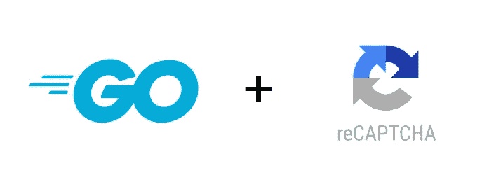

# 在 Go 中使用 Google 的 reCAPTCHA

> 原文：<https://levelup.gitconnected.com/protect-your-endpoints-with-google-recaptcha-in-go-f4da5669ed9>

# 介绍

防止恶意软件在您的 web 应用程序上从事滥用活动始终是一个好的做法。最流行的工具是谷歌的 reCAPTCHA。在当前状态下，它支持 v2 和 v3。在本文中，我们将重点关注 v3，因为它需要更少的用户交互并支持分析。

# 先决条件

*   Go 环境([指令](https://golang.org/doc/install))
*   一个已经在谷歌的 reCAPTCHA 控制台上注册的网站
*   一个新的目录，e.x `recaptcha-endpoints`，在你的`GOPATH`里面，我们所有的代码都将存放在那里

# 入门指南

注册您的网站后，将生成一个新的 API 密钥和秘密对。要使 reCAPTCHA 工作，需要对 web 应用程序的前端和后端服务进行更改。我们将只演示如何在后端服务上使用它，因为 Google 的[文档](https://developers.google.com/recaptcha/docs/v3?hl=nl#placement_on_your_website)对于前端的挑战设置非常直接。

# 履行

我们将实现一个简单的服务器，它有一个端点来处理用户的登录，给定一个电子邮件和密码，用 Google reCAPTCHA 保护。

验证 reCAPTCHA 令牌的方法是在`[https://www.google.com/recaptcha/api/siteverify](https://www.google.com/recaptcha/api/siteverify)`上发出一个`POST`请求，然后是作为 URL 参数的秘密和响应令牌。然后评估回答，以确定挑战是否成功。源代码就要出来了。

让我们一步一步地深入了解它

*   保存 Google 的 reCAPTCHA 请求链接的常量变量
*   一个`LoginRequest`结构，包含验证凭证的用户电子邮件和密码，外加一个 reCAPTCHA 令牌的额外字段。
*   一个`SiteVerifyResponse`结构，用于解码来自 Google reCAPTCHA API 的响应。
*   `main`函数定义登录端点处理程序，传递 reCAPTCHA 秘密作为参数。
*   作为处理程序运行的`Login`函数首先解码请求体。然后检查并验证调用`CheckRecaptcha`函数的 reCAPTCHA 令牌，最后验证所提供的凭证。
*   执行所有 reCAPTCHA 验证相关工作的`CheckRecaptcha`函数。接受秘密和响应令牌作为参数，构造适当的`POST`请求并发出请求。将响应解码成`SiteVerifyResponse`结构并检查验证是否成功，将收到的分数与提供的最小值( **0.5** )进行比较，并检查动作名称(**登录**)

> 通过设置`data-action`属性，您可以为网站上的任何操作设置自定义操作名称。通过这种方式，您可以在管理控制台中访问数据的详细细分，并可以为每个操作应用不同的业务逻辑(例如，针对低分登录的 2FA 身份验证)。

# 中间件

上面的解决方案是可行的，尽管它不能随着 web 服务器的增长而扩展。它需要代码复制、处理程序中的通用代码和每个结构中的额外字段，用于解码请求体。

为了避免这一切，我们可以实现一个中间件来处理所有的 reCAPTCHA 验证，并应用于任何需要的端点。前面的代码现在变成了。

我们将提到我们代码的第一个版本的变化。

1.  `RecaptchaResponse`字段已经从`LoginRequest`结构中移除，因为不再需要它。
2.  引入了一个新的结构`SiteVerifyRequest`,它将在中间件函数中用于从请求体中检索 reCAPTCHA 令牌。
3.  `Login`处理函数现在由`RecaptchaMiddleware`包装。
4.  任何关于 reCAPTCHA 的源代码都已从处理程序中删除。
5.  接受秘密的新函数`RecaptchaMiddleware`已经被创建，它作为中间件运行。包含所有关于谷歌 reCAPTCHA 验证的代码。将请求体读取并解码成`SiteVerityRequest` struct，然后像以前一样检查并验证 reCAPTCHA。
6.  第 125 行有一个棘手的部分需要注意。在 Go 中，http 请求体是一个只能读取一次的`io.ReadCloser`类型。因此，我们必须恢复它，以便能够在任何后续处理程序中再次使用它。

这就是我们解决方案第一版的所有不同之处。这样代码就干净多了，处理程序只包含已经创建的业务逻辑，Google 的 reCAPTCHA 验证只发生在中间件内部的一个地方。

# 源代码

我实现了一个处理 Google reCAPTCHA 验证的开源包，它支持 v2 和 v3。还包括一个开箱即用的中间件。可以在 [GitHub](https://github.com/chanioxaris/go-recaptcha) 上找到。