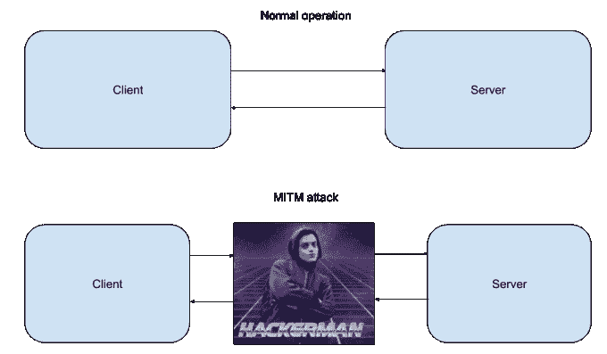
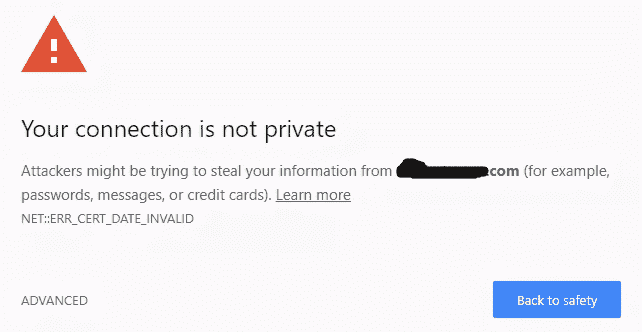
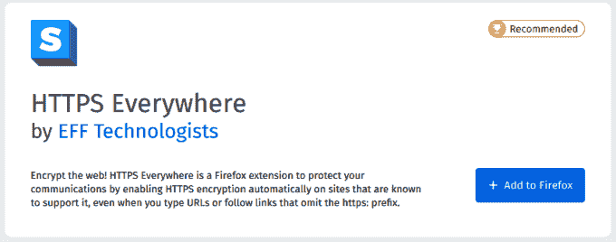
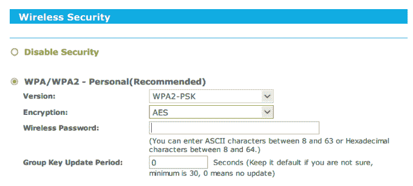
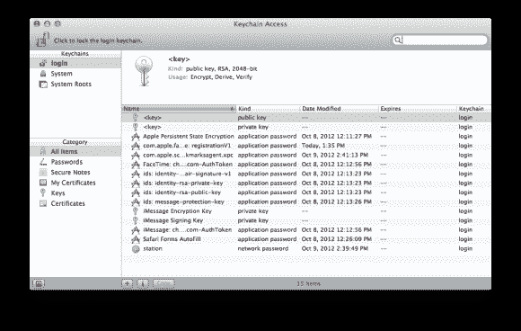
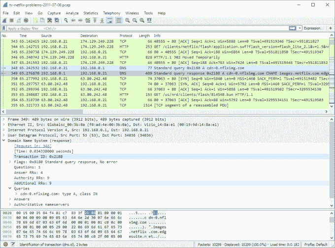
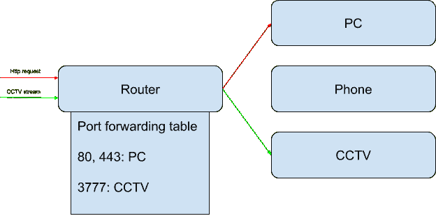
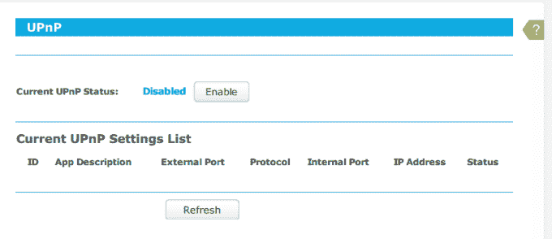
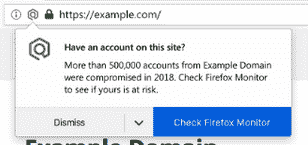

# 保护自己免受这些常见的网络威胁

> 原文：<https://levelup.gitconnected.com/protect-yourself-from-these-common-cyber-threats-e6777736fe54>

僵尸网络正密切关注着你


图片由来自 [Pixabay](https://pixabay.com/?utm_source=link-attribution&utm_medium=referral&utm_campaign=image&utm_content=1163108) 的 [Thomas Breher](https://pixabay.com/users/tbit-715211/?utm_source=link-attribution&utm_medium=referral&utm_campaign=image&utm_content=1163108) 拍摄

在我们的数字世界中，信息安全至关重要。无论是你的工作项目还是你的个人生活，没有什么可以抵御黑帽攻击。在本文中，我将告诉您一些常见的攻击类型，以便您有所准备。

大多数人认为他们不必担心网络攻击。真的，如果你看看它，当他们可以黑一家银行，或者说*五角大楼的时候，为什么有人会费心去破解你的银行账户来获得你可能有的任何存款呢？*

实际上，事情要比这复杂一些。尽管银行无疑比你的储蓄账户拥有更多的钱，但它们也是出了名的难以进入。每家银行都有一支网络安全专家队伍夜以继日地保护他们的系统，甚至不要让我从五角大楼开始。互联网的早期已经过去很久了，大型组织已经搞清楚了。

另一方面，普通用户没有接受过网络安全教育。是的，他们中的每一个人孤立地产生微不足道的利润，但是我们有如此多的人。与成千上万幸福的互联网用户打交道要容易得多，即使他们中只有一百人真的被黑了，这也已经是一个胜利了。换句话说，当代黑客关注的是数量而不是质量。

这对我们来说是个好消息！事实证明，保护自己免受大规模攻击要容易得多，只要你了解它们实际上是如何工作的。

# 中间人(MITM)攻击

这些是一些最常见和最容易的攻击类型。它被称为中间人，因为这正是它的工作方式。



MITM 袭击的基本情况如上图所示。在正常操作下，客户端直接与服务器通信。如果攻击者获得了读取和拦截您和服务器之间的网络流量的能力，他就成了中间人。

由于能够拦截和更改您与服务器交换的内容，攻击者可以做很多事情。他可以从您访问的任何网站窃取您的密码，将自定义 HTML 注入网页，并最终控制您的系统。

现在你明白什么是 MITM 攻击了，但是像这样拦截网络流量怎么可能呢？那我们为什么有那么多加密的东西？

好消息是，加密是有效的(大部分时间)。MITM 攻击对于像 HTTPS 或 FTPS 这样的受保护协议是无效的。虽然解密和拦截 HTTPS 流量非常容易，但加密是不可能的。为此，您需要访问一个证书，该证书安全地(希望)存储在远程服务器上。我想你们很多人都熟悉这样的错误:



它完美地解释了自己。当使用非法证书加密网络流量时，会出现此类错误。无论它是否过时，或者您的系统配置错误，或者正在进行实际攻击，浏览器都会及时通知您。如果你在一个没有被积极开发的网站上看到这个错误，这一定意味着你的流量对任何人都是公开的。

## 保护浏览器

如果您使用的是 HTTP，流量根本没有加密。任何人都可以公开阅读和修改它。这就是为什么每个人都在尽可能快地远离 HTTP。这是你的第一道防线。为了确保您永远不会通过 HTTP 访问网站，请安装 *HTTPS Everywhere* 插件:



这个插件是由电子前沿基金会开发的，这是一个非营利组织，旨在帮助人们保持在线安全。它将确保您访问的一切都与 HTTPS，确保您不会去的 HTTP 版本的意外。如果你正在使用一个不支持 HTTP 的网站，我强烈建议你重新考虑使用一个不关心你隐私的资源。你可以获得[火狐](https://addons.mozilla.org/en-CA/firefox/addon/https-everywhere/)或者 [Chrome](https://chrome.google.com/webstore/detail/https-everywhere/gcbommkclmclpchllfjekcdonpmejbdp?hl=en) 的插件。

## 保护网络安全

如果您的 WiFi 路由器设置正确，MITM 攻击将很难在您的本地网络上进行。你正在寻找 2 个设置:网络加密和 ARP 欺骗。

加密设置决定了如何加密您的机器和路由器之间的流量。如果它使用的是过时的加密套件，攻击者将能够毫不费力地进入您的网络并监听流量。要检查和更改您的设置，您需要登录到您的路由器管理面板。大多数情况下，地址和凭证会写在路由器本身的标签上。如果没有，请查阅您的特定路由器的用户手册。进入管理面板后，您会看到无线安全设置。以下是该页面在我的 TP-Link C1900 路由器上的外观:



您需要找到一个具有这些设置的页面，并确保您使用的是最新版本的 WPA 加密(WPA2-PSK 在撰写本文时)。您还需要指定一个足够安全的密码，稍后我将对此进行更多的讨论。

## 保护客户端

如果你的 WiFi 和浏览器受到保护，干得好。您最不想做的事情就是检查您的根证书。系统使用这些信息来检查加密(HTTPS)流量是否合法。攻击者可以秘密地将自己的根证书安装到您的系统中，并在浏览器没有检测到的情况下拦截 HTTPS 流量。

对于 Windows 用户，有一个易于使用的命令行工具来列出所有第三方证书。你可以从这里下载。下载后，在文件夹中运行此命令:

```
.\sigcheck.exe -tv
```

一秒钟后，它会给你一个由第三方安装在你的系统上的所有证书的列表。你需要仔细检查这个列表，确保你知道这些是什么，以及你是否信任它们。如果有疑问，你可以谷歌一下它的名字和发行商以获得更多信息。如果你认为这些是可疑的，你可以很容易地删除它们。按`Win+R`键，输入提示。将弹出以下窗口:


浏览左边的文件夹，你会很容易地找到不需要的证书，并通过右键点击删除它们。注意不要删除任何真正合法的证书:这将使 HTTPS 完全不可用。

对于 macOS 用户，没有简单的工具可以列出第三方证书。但是，您可以打开钥匙串工具并手动查看它们:



使用左侧菜单，您可以毫不费力地搜索证书，并确保您信任它们。

## 无礼的

一旦你保护了你的网络，尝试自己对它进行一次 MITM 攻击，以确保它不起作用，这可能是有益的。2 最常用的工具是 [mitmproxy](https://github.com/mitmproxy/mitmproxy) 和 [Wireshark](https://www.wireshark.org/) 。



Wireshark 是一个全面的网络管理工具，可以让您逐个数据包地查看网络流量，了解 WiFi 上发生的一切。该工具非常复杂，其用法超出了本文的范围，但是如果您感兴趣，这里有一个关于 Wireshark 的很棒的[教程。](http://worldcomp-proceedings.com/proc/p2011/SAM4991.pdf)

# 开放端口攻击

默认情况下，外部世界应该无法访问您的本地网络。本地网络暴露于互联网的方式是使用端口转发。

服务器软件的每一部分都监听指定的*端口*。对于 HTTP/HTTPS，它是 80/443，SSH 是 22，依此类推。每台机器都可以根据需要打开和关闭端口。但是路由器如何确定哪些端口应该从互联网转发到什么机器呢？



假设一个简单的家庭网络，其中一台 HTTP 服务器运行在 PC 上，一台 CCTV 服务器运行在 DVR 上。PC 想监听端口 80/443，DVR 想监听端口 3777。然后，路由器将有一个端口转发表，指定什么请求应该发送到什么机器。

为什么端口转发是一个安全问题？因为您正在向全世界开放您的本地网络，互联网上的任何系统都可以尝试连接到它。如果昨天阿帕奇或《我的世界》服务器出现了漏洞，黑客可以让整个僵尸网络扫描网络，寻找运行旧软件的开放端口。如果攻击者获得了本地网络中一台机器的访问权，他就获得了其余设备的密钥。

因此，如果您正在运行任何服务器并在路由器上启用了端口转发，那么保持暴露的软件不断更新就成了您的责任。如果你有一堆服务器在运行，并且不想让它们都暴露在外部世界的危险之下，考虑建立一个 [VPN](https://www.howtogeek.com/221001/how-to-set-up-your-own-home-vpn-server/) 。

如果您是一个普通的互联网用户，并且没有在本地网络上运行任何服务器，该怎么办？那你安全吗？也许吧。

虽然端口转发需要设置，并且必须首先启用，但是大多数路由器默认情况下都有另一个工具。我说的是 UPnP 端口转发。服务器可以直接要求路由器临时转发端口，而不是手动输入端口转发表。torrent 客户端通常使用它来建立点对点连接。

为什么这样不安全？如果攻击者在你的电脑上安装了一个恶意软件(这种情况经常发生)，它可以要求路由器打开某个端口(例如远程桌面端口)**，而你甚至不会注意到**。谢天谢地，这个选项很容易关闭。在路由器管理页面上查找 UPnP 端口转发设置。下面是它在我的 TP-Link C1900 路由器上的样子:



下面是对 [DLink](https://eu.dlink.com/uk/en/support/faq/cameras-and-surveillance/mydlink/settings/router/how-do-i-disable-upnp-on-my-dir-series-router) 和[华硕](https://www.asus.com/support/FAQ/1039292/)的说明。

## 无礼的

一旦您认为您的本地网络足够安全，您可以尝试扫描它的开放端口，看看是否有您遗漏的端口。这种工具被称为端口扫描器，可以在网上免费获得。首先，你可以去这个网站从互联网外部扫描你的端口。一旦这些被关闭，您就可以使用`nmap`来扫描本地网络上的端口。

要安装`nmap`，请根据您的操作系统遵循[官方文档](https://nmap.org/book/install.html)。安装后，您可以像这样扫描本地网络上的任何计算机:

```
$ nmap <IP ADDRESS HERE>
```

`nmap`将在输出中让您知道在指定的 IP 地址上是否有任何端口打开。

# 密码攻击

最后但同样重要的是，我们有基本的密码攻击。这些攻击包括从热门网站挖掘数据泄露到基本的暴力攻击。

很有可能，这不是你在互联网上的第一年。此外，您可能在许多不同的网站上有许多帐户。有时，这些网站被黑客攻击，密码被泄露，或者只是一个意外泄露了这些密码。不考虑这个问题，**你的一些密码可以在暗网数据库上公开获得**。

如果你为不同的账户使用不同的密码，这不是一个大问题，但是老实说:你有吗？即使它们是不同的，它们通常是一个“基本”密码的变体，通过获得其中一个，很容易获得其余的。

所以你的第一步是改变你账户的密码，直到你有不同的密码。你可能想知道，我怎么能记住一串看起来像`HB*IOYuih345879(*09`的又长又强的密码呢？但是你不需要。

事实是，符号和数字并不能保证密码的安全。长度是。如果您的密码是一个大约 25 个字符的简单英语句子，它将比 j*(hj3E3W)安全得多！。计算速度正在赶上，现代视频卡可以相当容易地破解带有许多符号的 8 字符密码。所以，这些“安全”的密码既不安全又难记！

取而代之的是，试着用长而易记的句子作为你的密码，这是你独有的。使用这种方法，你将能够很容易地记住你的密码，使他们几乎不可能破解。

最后，一旦你的账户安全了，知道你正在使用的某个服务是否被破坏了，或者你的电子邮件是否出现在某个漏洞中，这可能是有益的。这些服务是免费和收费的。

## Firefox 监视器

如果您是 Firefox 用户，您已经在使用这个工具，甚至可能会看到如下消息:



如果你没有使用 Firefox，可以考虑改用它。如果你强烈反对使用安全浏览器，你仍然可以在本网站的任何浏览器[上免费使用该工具。](https://monitor.firefox.com/)

## 密码管理员

大多数密码管理器(1Pass，Keeper)将有这个功能作为付费插件。我不想张贴广告，所以，如果你感兴趣，在搜索中查找它们。

# 结束语

感谢你阅读我的关于网络自卫基础的文章，我希望你会觉得有用。

# 资源

*   Coursera 上的免费网络安全课程
*   [无密码 SSH 登录的工作原理](https://medium.com/better-programming/how-passwordless-ssh-login-works-711cb9af235)
*   [使用 Syncthing 创建一个没有云的云](https://medium.com/@mihalkrasnov/use-syncthing-to-create-a-cloud-without-a-cloud-24d9bdddbbb0)