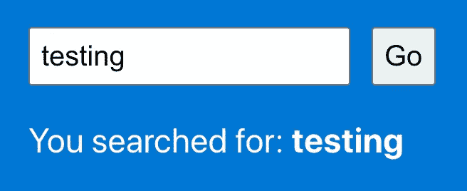
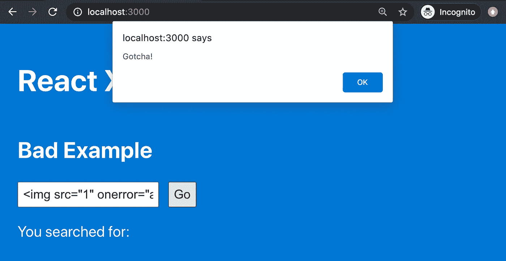
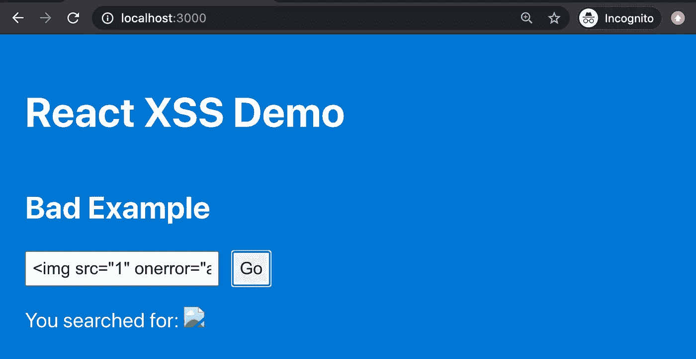
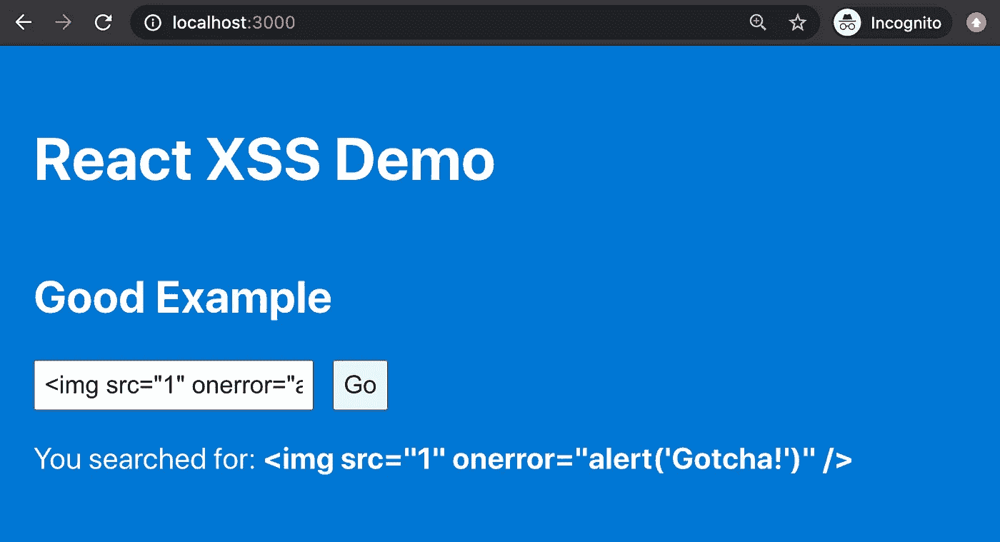
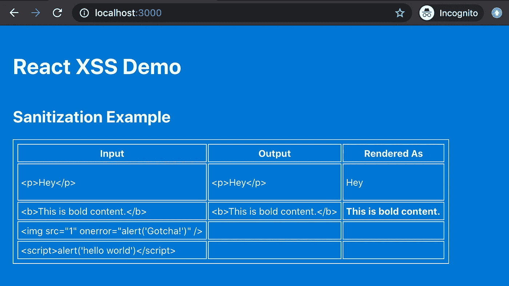

# 在 React 中防范 XSS 攻击

> 原文：<https://levelup.gitconnected.com/protecting-against-xss-attacks-in-react-52442d9fff4c>


迈克尔·盖革在 [Unsplash](https://unsplash.com?utm_source=medium&utm_medium=referral) 上的照片

跨站脚本(XSS)攻击是一种将恶意代码注入网页并执行的攻击。这是前端 web 开发人员必须处理的最常见的网络攻击形式之一，因此了解攻击的工作原理以及如何防范它非常重要。

在本文中，我们将查看一些用 React 编写的代码示例，这样您也可以保护您的站点和用户。

# 示例 React 中成功的 XSS 攻击

对于我们所有的例子，我们将实现相同的基本功能。我们将在页面上有一个搜索框，用户可以输入文本。点击“Go”按钮将模拟运行搜索，然后一些确认文本将显示在屏幕上，向用户重复他们搜索的术语。对于任何允许你搜索的网站来说，这都是非常标准的行为。



搜索演示

很简单，对吧？什么会出错？

那么，如果我们在搜索框中输入一些 HTML 呢？让我们试试下面的片段:

```

```

现在发生了什么？



XSS 攻击被执行

哇，`onerror`事件处理程序被执行了！这不是我们想要的。我们只是无意中执行了一个来自不可信用户输入的脚本。



残破的图像被渲染

然后在页面上呈现这个破碎的图像。这也不是我们想要的。

那么我们是怎么到这里的呢？在本例中，在呈现搜索结果的 JSX 中，我们使用了以下代码:

```
<p style={searchResultsStyle}>You searched for: <b><span dangerouslySetInnerHTML={{ __html: this.state.submittedSearch }} /></b></p>
```

用户输入被解析和呈现的原因是因为我们使用了`dangerouslySetInnerHTML`属性，这是 React 中的一个特性，它的工作方式就像本地的`innerHTML`浏览器 API，由于这个原因，它通常被认为是不安全的。

# 示例 React 中失败的 XSS 攻击

现在让我们来看一个成功抵御 XSS 攻击的示例。这里的修复非常简单。为了安全地呈现用户输入，我们不应该使用`dangerouslySetInnerHTML`属性。相反，让我们像这样编写输出代码:

```
<p style={searchResultsStyle}>You searched for: <b>{this.state.submittedSearch}</b></p>
```

我们将输入相同的输入，但这一次，输出如下:



XSS 的进攻被阻止了

不错！用户输入仅作为文本呈现在屏幕上。威胁解除。

这是个好消息！默认情况下，React 将对其呈现的内容进行转义，将所有数据视为文本字符串。这相当于使用原生的`textContent`浏览器 API。

# 示例 3:净化 React 中的 HTML 内容

所以，这里的建议似乎很简单。只是不要在你的 React 代码中使用`dangerouslySetInnerHTML`，你就成功了。但是，如果您发现自己需要使用这个特性，该怎么办呢？

例如，您可能正在从 Drupal 这样的内容管理系统(CMS)中获取内容，其中一些内容包含标记。(顺便说一句，我可能建议首先不要在你的文本内容和来自 CMS 的翻译中包含标记，但是对于这个例子，我们将假设你已经被否决了，包含标记的内容仍然存在。)

在这种情况下，您*确实*想要解析 HTML 并将其呈现在页面上。那么，如何安全地做到这一点呢？

答案是在渲染之前净化你的 HTML。相反，您将通过一个函数运行内容，在呈现之前去除任何潜在的恶意代码，而不是完全避开 HTML。

有许多好的 HTML 清理库可供您使用。与任何网络安全相关的东西一样，最好不要自己写这些东西。外面有比你聪明得多的人，有好人也有坏人，他们比你考虑得更多。始终采用久经考验的解决方案。

我最喜欢的净化库之一叫做`[sanitize-html](https://www.npmjs.com/package/sanitize-html)`，它确实如其名所示。你从一些肮脏的 HTML 开始，通过一个函数运行它，然后你得到一些漂亮、干净、安全的 HTML 作为输出。如果您想要比默认设置提供更多的控制，您甚至可以自定义允许哪些 HTML 标记和属性。

*更新:我推荐一个更小的库* `[*dompurify*](https://www.npmjs.com/package/dompurify)` *。它的缩小和 gzip 大小只有*[*6.4 kB*](https://bundlephobia.com/result?p=dompurify@2.2.2)*，与*`*sanitize-html*`*[*的 49.7 kB*](https://bundlephobia.com/result?p=sanitize-html@2.1.2) *形成对比。API 遵循相同的格式，使用您可以自定义的选项获取脏输入并返回净化的输出。**

**

*净化你的 HTML*

# *结论*

*这就是了。XSS 攻击是如何执行的，如何防止它们，以及如何在必要时安全地解析 HTML 内容。祝您编码愉快，并祝您安全！*

**完整的代码示例可以在 GitHub* *上找到* [*。*](https://github.com/thawkin3/xss-demo)*