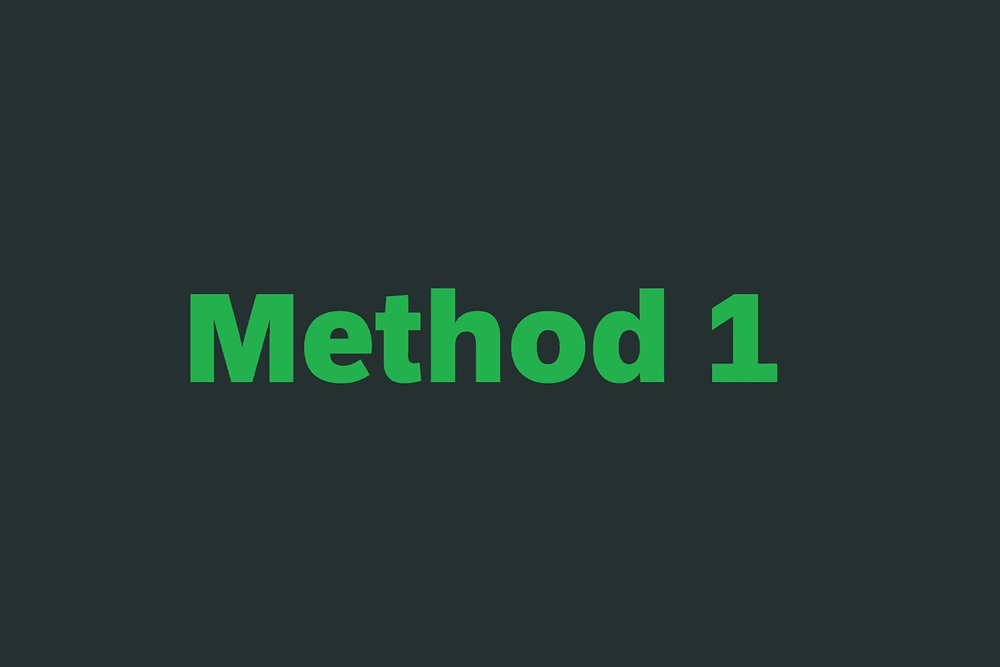
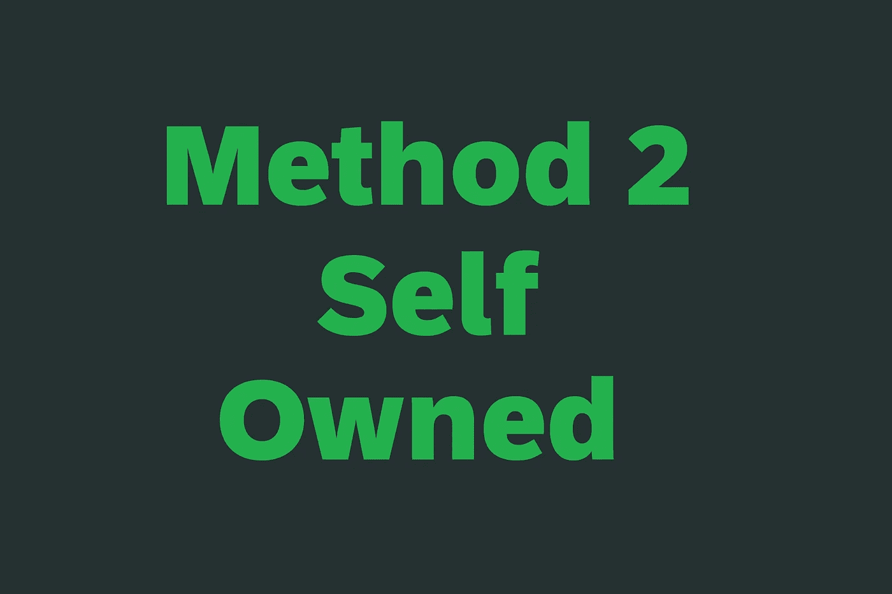
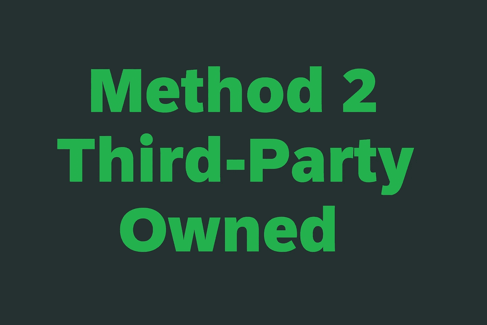

# 保护公共方法免受不合逻辑的调用。NET C#

> 原文：<https://levelup.gitconnected.com/protecting-public-methods-from-illogical-calls-in-net-c-91fcbb8bee33>

## 提示和技巧

## 包含代码示例和解释的完整指南。

**保护公共方法免受不合逻辑的调用。NET C#** 。照片由[在](https://unsplash.com/@flyd2069?utm_source=unsplash&utm_medium=referral&utm_content=creditCopyText) [Unsplash](https://unsplash.com/?utm_source=unsplash&utm_medium=referral&utm_content=creditCopyText) 上飞行的:D 拍摄，由 [Ahmed Tarek](https://medium.com/@eng_ahmed.tarek) 调整

在这篇文章中，我将向你展示一种技术来保护你的模块公共方法免受未经授权的调用，或者说，不合逻辑的调用。

你可能会说:

> 如果它们是公共的，那么我认为任何模块都可以调用它们。如果我想阻止某个模块调用公共方法，那么它首先就不应该是公共的。

我部分同意你的观点，原因有二:

1.  有时公共方法在你使用的第三方库上，它们没有被正确地抽象。
2.  即使你把你的方法分成定义良好的接口，也不要低估开发人员做出错误决定的能力。

还是不明白，对吧？让我给你看一个简单的例子。

 [## 🔥订阅艾哈迈德的时事通讯🔥

### 订阅艾哈迈德的时事通讯📰直接获得最佳实践、教程、提示、技巧和许多其他很酷的东西…

medium.com](https://medium.com/subscribe/@eng_ahmed.tarek) 

**绊倒一个开发者的病态心理**。照片由 [NeONBRAND](https://unsplash.com/@neonbrand?utm_source=unsplash&utm_medium=referral&utm_content=creditCopyText) 在 [Unsplash](https://unsplash.com/?utm_source=unsplash&utm_medium=referral&utm_content=creditCopyText) 上拍摄，由 [Ahmed Tarek](https://medium.com/@eng_ahmed.tarek) 调整

# 绊倒一个开发者的病态思维

让我们检查下面的代码示例。

正如您在代码示例中看到的，在第 **57** 和 **62** 行，开发人员将`IRead`转换为`IWrite`并将`IWrite`转换为`IRead`，这将会成功，因为传入的对象已经实现了这两个接口。是的，这是不合逻辑的，但它可能会发生。

我知道，我知道。我们不应该把我们的代码设计成“这种无知水平”，但是，如果我们能做得更好，为什么不呢？

在接下来的部分中，我将向您展示两种方法来使您的代码更健壮地应对这种行为。

**问题**。由 [Elisa Ventur](https://unsplash.com/@elisa_ventur?utm_source=unsplash&utm_medium=referral&utm_content=creditCopyText) 在 [Unsplash](https://unsplash.com/?utm_source=unsplash&utm_medium=referral&utm_content=creditCopyText) 上拍摄，由 [Ahmed Tarek](https://medium.com/@eng_ahmed.tarek) 调整

# 问题是

现在让我们想出一个更清楚的例子来说明我们要解决的问题。

假设我们正在做一个像亚马逊一样的在线商店网站。在这个项目上，我们有不止一个模块的工作。

我们有**商店**模块，最终用户将能够看到所有产品，并选择产品添加到他的购物车。

我们有**购物车**模块，终端用户可以看到他添加购买的产品。

我们有**结帐**模块，终端用户可以看到他的产品和支付金额的摘要。

对于我们的例子，我们特别关心**购物车**模块，以及它如何被其他两个模块使用；**存储**和**检查**模块。

现在让我们直接进入代码。

正如您在代码示例中注意到的，没有什么太复杂的。

然而，在第 **52** 和 **68** 行，没有任何东西可以阻止开发人员通过调用在这些上下文中不应该调用的方法来进行这些转换和以错误的方式使用`ShoppingCart`。

危险的是代码实际上会被执行，因为传入的对象已经实现了`IStoreShoppingItems`和`IListShoppingItems`接口。如果这是一个银行系统或如此关键的东西，这将是一场彻底的灾难。

为了防止这种情况发生，我们有两种方法:

1.  允许开发人员进行强制转换，但要确保它抛出异常。
2.  首先阻止开发人员进行造型。

这两种方法在设计和实现方面是不同的。

**方法一**。图片由[艾哈迈德·塔里克](https://medium.com/@eng_ahmed.tarek)拍摄

# 方法 1

在这种方法中，我们将允许开发人员进行强制转换，但要确保它会抛出异常。

`IStoreShoppingItems`、`IListShoppingItems`、`ShoppingCart`、`Store`和`CheckOutManager`都将具有相同的旧实现。

然后，我们将添加以下内容:

我们在这里实际做的是为`ShoppingCart`类创建两个独立的包装器，一个负责**读**操作，另一个负责**写**操作。

然后我们将开始使用这些包装器，而不是最初的`ShoppingCart`类，如下所示:

这样，如果开发人员试图做同样的非法/不合逻辑的转换，运行时将抛出一个异常，因为现在传入的对象是无论是`ReadShoppingCart`还是`WriteShoppingCart`，而不是像以前一样是`ShoppingCart`。

**方法 2——如果代码是自有的**。图片由[艾哈迈德·塔里克](https://medium.com/@eng_ahmed.tarek)拍摄

# 方法 2 -如果代码是自有的

在这种方法中，我们将首先阻止开发人员进行造型。

在这种情况下，我们假设整个代码归我们所有，这意味着我们可以对整个代码应用更改。

这种方法的主要思想是用多个**密钥**来保护对公共方法的调用；一个**密钥**用于**读**操作，另一个**密钥**用于**写**操作。这些密钥是在创建`ShoppingCart`类的实例时创建的。

这些**密钥**的所有者是主模块，然后主模块负责将正确的**密钥**共享给正确的模块。

因此，我们将应用这些更改:

**历史购物项目**和**历史购物项目:**

我们在这里可以注意到:

1.  我们添加了`string writingSecretKey`作为`AddShoppingItem`方法的参数。
2.  这意味着无论哪个模块调用`AddShoppingItem`方法，它都需要提供一个**写密钥**，该密钥应该与最初定义并保存到`ShoppingCart`对象中的密钥相匹配。
3.  否则，将引发异常。
4.  我们添加了`string readingSecretKey`作为`GetShoppingItems`方法的参数。
5.  这意味着无论哪个模块调用`GetShoppingItems`方法，它都需要提供一个**读取密钥**，该密钥应该与最初定义并保存在`ShoppingCart`对象中的密钥相匹配。
6.  否则，将引发异常。

**购物车**:

我们在这里可以注意到:

1.  我们增加了`private readonly string m_WritingSecretKey;`和`private readonly string m_ReadingSecretKey;`
2.  它们将由构造函数中传递的值初始化。这一点非常重要，因为我们希望将它们的初始化委托给所有者模块。
3.  此外，值得一提的是，它们应该是不可变的，并对外界隐藏。
4.  在`AddShoppingItem`方法的开始，我们检查传入的`writingSecretKey`是否与`m_WritingSecretKey`相同。否则，将抛出一个`UnauthorizedAccessException`异常。
5.  在`GetShoppingItems`方法的开始，我们检查传入的`readingSecretKey`是否与`m_ReadingSecretKey`相同。否则，将抛出一个`UnauthorizedAccessException`异常。
6.  就是这样，就这么简单。

**店铺:**

我们在这里可以注意到:

1.  我们添加了`private readonly string m_WritingSecretKey;`
2.  它将由构造函数中传递的值初始化。这一点非常重要，因为我们希望将它们的初始化委托给所有者模块。
3.  此外，值得一提的是，它应该是不可变的，并对外界隐藏。
4.  当调用`ShoppingCart`的`AddShoppingItem`时，会传入密钥。
5.  值得一提的是，在第 **26** 行，如果开发人员试图进行非法/不合逻辑的强制转换调用`GetShoppingItems`方法，他会发现他需要传入一个他没有的**读取密钥**。
6.  这将使他试图做一些错误的事情听起来很清楚。
7.  此外，即使开发人员决定为**读取密钥**传入任何值，也会抛出异常。

检出管理器:

我们在这里可以注意到:

1.  我们添加了`private readonly string m_ReadingSecretKey;`
2.  它将由构造函数中传递的值初始化。这一点非常重要，因为我们希望将它们的初始化委托给所有者模块。
3.  此外，值得一提的是，它应该是不可变的，并对外界隐藏。
4.  当调用`ShoppingCart`的`GetShoppingItems`时，它会传入密钥。
5.  值得一提的是，在第 **15** 行，如果开发者试图进行非法/不合逻辑的强制转换调用`GetShoppingItems`方法，他会发现他需要传入一个他没有的**写密钥**。
6.  这将使他试图做一些错误的事情听起来很清楚。
7.  此外，即使开发人员决定为**写密钥**传入任何值，也会抛出异常。

**程序**:

我们在这里可以注意到:

1.  我们正在初始化`m_WritingSecretKey`和`m_ReadingSecretKey`。
2.  我们正在创建一个传入键的`ShoppingCart`实例。
3.  我们与`Store`共享**写密钥**。
4.  我们与`CheckOutManager`共享**读取密钥**。
5.  就是这样。

将这些代码修改到位将使整个解决方案像 charm 一样工作。

**方法 2——如果代码为第三方所有**。图片由[艾哈迈德·塔里克](https://medium.com/@eng_ahmed.tarek)拍摄

# 方法 2 -如果代码为第三方所有

在这种方法中，我们将首先阻止开发人员进行造型。

在这种情况下，我们假设整个代码由第三方库拥有，这意味着我们不能在主代码上应用更改。

这种方法的主要思想是用多个**密钥**保护对公共方法的调用；一个**密钥**用于**读**操作，另一个**密钥**用于**写**操作。这些密钥是在创建`ShoppingCart`类的实例时创建的。

这些**密钥**的所有者是主模块，然后主模块负责将正确的**密钥**共享给正确的模块。

因此，我们假设这是第三方代码:

现在我们要做的是将它们包装到我们的保护层中，如下所示。

**iprotecttedstoreshopping items**和**iprotecttedlistshopping items**:

**受保护的购物车**:

这里唯一的新东西是我们在内部使用了不受保护的`ShoppingCart`类，但是用我们的**密钥**检查包装了它。

**受保护的商店**:

同样的概念也适用于这里，我们在内部使用未受保护的`Store`类，但是用我们的**写** **密钥**检查来包装它。

**受保护的检出管理器**:

这里应用了相同的概念，我们在内部使用了未受保护的`CheckOutManager`类，但是用我们的**读取密钥**检查包装了它。

**程序**:

这里唯一的新东西是，我们创建了受保护的包装器，传入了不受保护的对象，并最终向外界公开了这些受保护的包装器。

**最终想法**。由 [Erwan Hesry](https://unsplash.com/@erwanhesry?utm_source=unsplash&utm_medium=referral&utm_content=creditCopyText) 在 [Unsplash](https://unsplash.com/?utm_source=unsplash&utm_medium=referral&utm_content=creditCopyText) 上拍摄，由 [Ahmed Tarek](https://medium.com/@eng_ahmed.tarek) 调整

# 最后的想法

现在，我们已经探索了多种方法来使我们的代码更加健壮，但是，问题是:

> 我会建议你总是使用这些方法吗？

答案很简单:

> 不，只在需要的时候使用。如果您的系统有一些关键模块需要额外的安全层，那么您可以使用这些方法。否则，您将增加系统的复杂性，却没有任何回报。

因此，话虽如此，希望你觉得读这个故事和我写它一样有趣。

# 希望这些内容对你有用。如果您想支持:

如果您还不是**中**会员，您可以使用 [**我的推荐链接**](https://medium.com/@eng_ahmed.tarek/membership) ，这样我可以从**中**获得您的一部分费用，您无需支付任何额外费用。订阅
[**我的简讯**](https://medium.com/subscribe/@eng_ahmed.tarek) 将最佳实践、教程、提示、技巧和许多其他很酷的东西直接发送到您的收件箱。

# 其他资源

这些是你可能会发现有用的其他资源。

 [## 标记枚举:如何在一个字段中表示特征组合

### 将[读、写、修改……]等功能及其组合表示到单个字段中。

levelup.gitconnected.com](/flagged-enumerations-how-to-represent-features-combinations-into-one-field-f32e46a0885)  [## 什么是软件系统中的缓存

### 软件系统中缓存的定义和最佳实践。

levelup.gitconnected.com](/what-is-caching-in-software-systems-cfa71c385bfc)  [## 中的责任链设计模式。NET C#

### 学习中的责任链设计模式。带有增强功能的. NET C#。

levelup.gitconnected.com](/chain-of-responsibility-design-pattern-in-net-c-666bb4dc2816) 