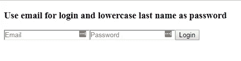
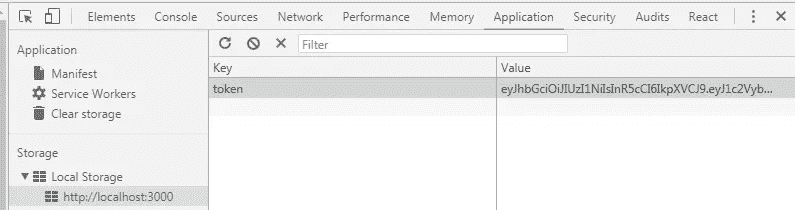
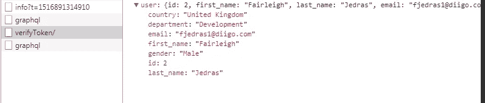
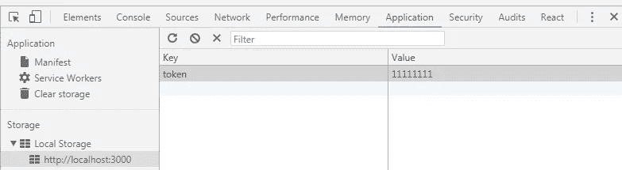
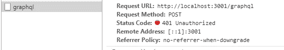

# 使用 JWT 认证保护您的 React + GraphQL 应用程序

> 原文：<https://levelup.gitconnected.com/protecting-your-react-graphql-application-with-jwt-authentication-3c03db9530cb>

继续 React + GraphQL 教程，通过 JWT 增加安全性


保护您的 GraphQL API

# 警告

本教程中提供的实现不是生产就绪的代码，也没有足够的安全性来集成到您的应用程序中。这篇文章的目的是扩展 [GraphQL 文档](http://graphql.org/graphql-js/authentication-and-express-middleware/)中给出的信息。你可以读到很多关于使用 JWT 的讨论([这里](https://float-middle.com/json-web-tokens-jwt-vs-sessions/)或者[那里](https://ponyfoo.com/articles/json-web-tokens-vs-session-cookies))，它的[优点](https://dzone.com/articles/jwtjson-web-tokens-are-better-than-session-cookies)、[缺点](http://cryto.net/~joepie91/blog/2016/06/13/stop-using-jwt-for-sessions/)以及不同的[储存](https://auth0.com/docs/security/store-tokens)它们的方式。

**注意:**如果您在生产中使用令牌认证，您必须确保您的 API 仅在`https`期间可用。此外，还必须禁用 CORS(为了简化示例，此处启用了它)

# 介绍

在本系列文章的第一部分中，我们用后端的 GraphQL API(使用 node JS)和前端的 React JS 创建了单页面应用程序(SPA)。

在第二部分[中，我们通过添加](/enhancing-your-react-graphql-app-with-redux-and-redux-thunk-90c556aff1c5) [Redux](https://redux.js.org/) 作为状态管理库和 Redux-Thunk 作为[中间件](https://redux.js.org/docs/advanced/Middleware.html)来增强我们的应用程序。我们还添加了一些特性，如 [StorageService](http://StorageService.js) 来存储搜索表单的数据，以及 [React-Router-Redux](https://github.com/reactjs/react-router-redux) 来以“Redux”方式处理客户端路由。

在本教程中，我们将使用所有这些功能，并在后端进行一些更改，以使用基于 Json Web 令牌(也称为 [JWT](https://jwt.io/) s)的身份验证来保护我们的 GraphQL API

你可以在[库](https://github.com/KilroggD/GraphQL-redux-jwt)中看到一个工作教程。要启动它，请运行 **npm，在客户端和服务器文件夹中安装**，然后您可以使用 **npm start** 来启动服务器或客户端，或者两者都启动。

# 在后端保护您的 API

首先，我们需要安装一个对 JWT 令牌有用的 npm 包。

```
npm i -s jsonwebtoken
```

我们将使用它在后端创建和验证 JSON web 令牌。你可以在这里看到完整的 package.json 文件[。](https://github.com/KilroggD/GraphQL-redux-jwt/blob/master/graphsrv/package.json)

然后我们需要创造我们的逻辑与 JWT 合作。我们首先导入 jsonwebtoken 库、用户的数据源和一个附加的 lodash 函数。

```
import jwt from 'jsonwebtoken'
import Users from './data/users'
import find from 'lodash/find'
```

以下常量用作 JWT 的配置选项:

```
const expiresIn = '3h' // time to live
const secret = 'samplejwtauthgraphql' // secret key
const tokenPrefix = 'JWT' // Prefix for HTTP header
```

现在，我们准备向 SPA 的后端添加负责身份验证的方法。第一个函数将负责创建令牌。它将检查数据源中是否存在具有给定凭证的用户，否则返回令牌或 false。 *jwt.sign* 函数用于生成新的令牌。在本教程中，我们将使用用户的电子邮件和小写的姓氏作为凭证。

```
/**
 * Use email as login, use password as password
 * [@param](http://twitter.com/param) {string} email 
 * [@param](http://twitter.com/param) {string} password
 */
export const createToken = (email, password) => {
    if (!email || !password) { // no credentials = fail
        return false
    }
    const user = find(Users,
        (user) => {
            return user.email === email.toLowerCase()
                && user.last_name.toLowerCase() === password
        }
    );
    if (!user) { // return false if not found
        return false
    }
    const payload = {
        username: user.email,
    }
    const token = jwt.sign(payload, secret, {
        expiresIn
    })
    return token
}
```

下一个函数将从认证头中提取令牌(通过 JWT 前缀)并检查它是否有效。如果有效，它将返回属于用户的令牌，否则抛出一个错误。 *jwt.verify* 方法用于此。

```
/**
 * [@returns](http://twitter.com/returns) {Object} - current user object
 * [@param](http://twitter.com/param) {string} token header
 */
export const verifyToken = (token) => {
    const [prefix, payload] = token.split(' ')
    let user = null
    if (!payload) { //no token in the header
        throw new Error('No token provided')
    }
    if (prefix !== tokenPrefix) { //unexpected prefix or format
        throw new Error('Invalid header format')
    }
    jwt.verify(payload, secret, (err, data) => {
        if (err) { //token is invalid
            throw new Error('Invalid token!')
        } else {
            user = find(Users, { email: data.username })
        }
    })
    if (!user) { //user does not exist in DB
        throw new Error('User doesn not exist')
    }
    return user
}
```

为了使我们的 API 安全，我们需要在 [server.js](https://github.com/KilroggD/GraphQL-redux-jwt/blob/master/graphsrv/src/server.js) 文件中创建几个 HTTP 端点来处理用户登录和令牌验证。

```
import express from 'express'
import bodyParser from 'body-parser'
import schema from './schema'
import graphqlHTTP from 'express-graphql'
import { createToken, verifyToken } from './auth'app.use('/login', jsonParser, (req, res) => {
    if (req.method === 'POST') {
        const token = createToken(req.body.email, req.body.password)
        if (token) { //send successful token
            res.status(200).json({ token })
        } else {
            res.status(403).json({ //no token - invalid credentials
                message: 'Login failed! Invalid credentials!'
            })
        }
    }
});/**
 * Verify token and return either error or valid user profile
 */
app.use('/verifyToken', jsonParser, (req, res) => {
    if (req.method === 'POST') {
        try {
            const token = req.headers['authorization']
            const user = verifyToken(token)
            res.status(200).json({ user })
        } catch (e) {
            console.log(e.message)
            res.status(401).json({ //unauthorized token
                message: e.message
            })
        }
    }
});
```

此外，为了使我们的 API 受到 JWT 令牌认证的保护，我们需要在 GraphQL API 处理之前添加一些中间件来处理数据。

```
// auth middleware
app.use('/graphql', (req, res, next) => {
    const token = req.headers['authorization']
    try {
        req.user = verifyToken(token)
        next()
    } catch (e) {
        res.status(401).json({ //unauthorized token
            message: e.message
        })
    }
});
```

这个中间件检查一个令牌，如果令牌有效，就添加一个用户对象来请求这个对象，否则就返回一个 401 http 头。如果令牌有效，它将调用 next()函数，这将导致一个现有的 GraphQL 处理程序。我们可以使用“context”键将这个用户对象传递给 GraphQL 模式。

```
app.use('/graphql', graphqlHTTP((req, res) => ({
    schema,
    graphiql: true,
    context: {
        user: req.user,
    }
}));
```

# 在前端添加身份验证和令牌验证逻辑

我们需要在前端进行一些更改，以便它能够处理身份验证和令牌。您可以在存储库的[客户端](https://github.com/KilroggD/GraphQL-redux-jwt/tree/master/client)文件夹中找到源代码。

首先，我们需要在 [ApiService](https://github.com/KilroggD/GraphQL-redux-jwt/blob/master/client/src/ApiService.js) 中为新的端点调用添加一些方法。

下面的方法是调用非 GraphQL APIs 的通用函数。它只是为 Javascript 获取功能添加了更多的语法糖。

```
/**
     * Generic API call (for non-graphql endpoints)
     * [@param](http://twitter.com/param) {string} url 
     * [@param](http://twitter.com/param) {object} params 
     */
    async apiCall(url, params = {}, method = 'POST', token = false) {
        const res = await fetch(`${this.baseUrl}${url}/`, {
            method,
            mode: 'cors',
            headers: this.buildHeaders(token),
            body: JSON.stringify(params),
        })
        if (!res.ok) {
            throw new Error(res.status)
        }
        return res.json()
    }
```

我们还需要定义一个 buildHeaders 方法，该方法假设我们可能有一个包含令牌的身份验证头。如果我们将令牌作为参数传递，它会创建一个授权 HTTP 头，其中包含前缀为“JWT”的令牌。

```
 /**
     * Build  http headers object
     * [@param](http://twitter.com/param) {string|boolean} token 
     */
    buildHeaders(token = false) {
        let headers = new Headers();
        headers.append('Content-type', 'application/json');
        if (token) {
            headers.append('Authorization', `JWT ${token}`);
        } return headers;
    }
```

然后我们需要调用登录和验证令牌端点的方法。

```
/**
     * Login user and return jwt token or throw error in
     * case of fail
     * [@param](http://twitter.com/param) {string} login
     * [@param](http://twitter.com/param) {string} password
     */
    async login(params) {
        const res = await this.apiCall('/login', params)
        console.log(res)
        return res.token
    }/**
     * Verify current token and return current user or throw error
     * [@param](http://twitter.com/param) {string} token 
     */
    async verifyToken(token) {
        const res = await this.apiCall(
           '/verifyToken',
           {},
           'POST',
           token
        )
        return res.user
    }
```

最后，我们的 GraphQL API 方法应该能够在其 HTTP 头中使用我们的身份验证令牌。另外，请注意，我们现在将令牌作为参数传递给所有受保护的 API 调用。

```
/**
     * Generic function to fetch data from server via graphql API
     * [@param](http://twitter.com/param) {string} query
     * [@returns](http://twitter.com/returns) {unresolved}
     */
    async getGraphQlData(resource, params, fields, token = false) {
        const query = `{${resource} ${this.paramsToString(params)} 
             ${fields}}`
        const res = await fetch(this.apiUrl, {
            method: 'POST',
            mode: 'cors',
            headers: this.buildHeaders(token),
            body: JSON.stringify({ query }),
        });
        if (res.ok) {
            const body = await res.json();
            return body.data;
        } else {
            throw new Error(res.status);
        }
    }/* .... */ /**
     * 
     * [@param](http://twitter.com/param) {object} params
     * [@returns](http://twitter.com/returns) {array} users list or empty list
     */
    async getTodos(params = {}, token) {
        const data = await this.getGraphQlData(
            'todos', params, this.todoFields, token
        );
        //return todos list
        return data.todos;
    }
```

现在是时候转到与 React-Redux 相关的逻辑了。我们需要定义一个[缩减器](https://github.com/KilroggD/GraphQL-redux-jwt/blob/master/client/src/reducers/authReducer.js)来处理我们的状态中与认证相关的部分。

```
// shape of bit or state related to authentication
const initialState = { 
    isAuthenticated: false,
    isFailure: false,
    isLoading: true,
    current_user: null,
}
```

这个 reducer 将处理所有成功和失败的身份验证，它还将加载用户配置文件数据。我们使用 isLoading 标志让 UI 组件知道正在加载。

[动作](https://github.com/KilroggD/GraphQL-redux-jwt/blob/master/client/src/actions/authActions.js)文件将处理所有这些状态转换。其中最有趣的部分实际上是中间件，它处理 API 调用以获取/验证令牌，并根据结果分派特定的操作。例如，下面的登录函数将使用给定的参数进行 API 调用，然后将令牌存储在存储中，并在成功的情况下调度一个 *loginSuccess()* 操作，或者在身份验证失败的情况下显示一个错误并调度 *loginFailure()* 。请注意，我们还使用 react-redux-router 中的 *push()* 方法以“redux 方式”进行重定向

```
export const login = (params) => async dispatch => {
    try {
        const token = await ApiService.login(params)
        StorageService.setToken(token)
        dispatch(loginSuccess())
        dispatch(push('/'))
    } catch (e) {
        console.error(e.message)
        dispatch(loginFailure())
    }
}export const logout = () => dispatch => { //destroy token and logout
    StorageService.removeToken()
    dispatch(logoutAction())
    dispatch(push('/login'))
}
```

下一个动作用于在页面加载时从存储中验证我们的令牌，如果令牌有效，则获取用户的配置文件，如果无效，则重定向到登录页面。

```
export const verifyToken = () => async dispatch => {
    if (!StorageService.getToken()) { //if no token - logout
        dispatch(logoutAction())
        return
    }
    try {
        dispatch(requestProfile())
        const user =await ApiService.verifyToken(
            StorageService.getToken()
        )
        dispatch(receiveProfile(user))
        dispatch(loginSuccess())
    } catch (e) {
        //remove token and logout if invalid
        console.error(e.message)        
        StorageService.removeToken()
        dispatch(logoutAction())
    }
```

# 在客户端处理私有和公共路由

我们的应用程序中有许多不同的组件，我们需要其中一些(用户列表，待办事项列表)只对授权用户可用，但其他一些(登录表单)应该对非授权用户可用。在每个组件内部检查这一点并不是很有效，所以我们将创建特殊的[容器](https://github.com/KilroggD/GraphQL-redux-jwt/tree/master/client/src/containers)来在路由级别处理它。第一个只允许访客访问，如果用户已经登录，则重定向到主页。

```
/**
 * Router for only guest stuff like Login/Register
 * If not guest - redirects to home
 */class GuestRoute extends React.Component {
    render() {
        const {
            isAuthenticated,
            component: Component,
            ...props
        } = this.props        
        return (
            <Route
                {...props}
                render={props =>
                    !isAuthenticated
                        ? <Component {...props} />
                        : (
                            <Redirect to={{
                                pathname: '/',
                                state: { from: props.location }
                            }} />
                        )
                }
            />
        )
    }
}const mapStateToProps = ({ auth }) => {
    const isAuthenticated = auth.isAuthenticated
    return {
        isAuthenticated,
    }
}export default connect(mapStateToProps)(GuestRoute)
```

第二个是 [PrivateRoute](https://github.com/KilroggD/GraphQL-redux-jwt/blob/master/client/src/containers/PrivateRoute.js) ，只允许授权用户访问，用户未登录时重定向到登录页面。

```
/**
 * Private route to navigate over private routes
 * If not logged in - goes to login
 * If not admin but required - throws an error!
 */class PrivateRoute extends React.Component {componentDidMount() {
        this.props.dispatch(verifyToken())
    }logoutHandler() {
        this.props.dispatch(logout())
    }render() {
        const {
            isAuthenticated,
            component: Component,
            current_user,
            ...props
        } = this.props
        if (this.props.isLoading) {
            return <Loading />
        }
        if (isAuthenticated && !current_user) {
            return null
        }
        return (
            <Route
                {...props}
                render={props =>
                    isAuthenticated
                        ?
                        <main>
                            <Header
                              current_user={current_user}
                              logout={this.logoutHandler.bind(this)}                     
                            />
                            <Component {...props} />
                        </main>
                        : (
                            <Redirect to={{
                                pathname: '/login',
                                state: { from: props.location }
                            }} />
                        )
                }
            />
        )
    }
}const mapStateToProps = ({ auth }) => {
    const current_user = auth.current_user;
    const isAuthenticated = auth.isAuthenticated;
    return {
        isAuthenticated,
        current_user,
        isLoading: auth.isLoading,
    }
}export default connect(mapStateToProps)(PrivateRoute)
```

在组件挂载时，我们通过调度 verifyToken 操作来检查身份验证状态，然后将当前用户配置文件传递给应用程序的状态，或者重定向到登录页面。isLoading 标志用于转换状态。

对于这个容器，我们还添加了更多的功能，比如一个带有欢迎消息和注销链接的公共标题，当用户登录时，它将显示在所有页面上。

```
/**
 * Header with greetings and links
 * [@param](http://twitter.com/param) {object} props 
 */const Header = (props) => {
    return <header className="header">
        <p className="header__greeting">
            <span>
                Welcome
                <a className="header__link" href="">
                    {props.current_user.first_name}
                </a>
            </span>
        </p>
        <p className="header__logout">
            <a className="header__link" href="" onClick={(e) => { e.preventDefault(); props.logout(); }}>
                Logout
            </a>
        </p>
    </header>
}export default Header
```

正如你所看到的，这些路由容器是高阶组件，它们封装了一个通用的 react-router 路由组件，所以我们可以在主[应用](https://github.com/KilroggD/GraphQL-redux-jwt/blob/master/client/src/App.js)文件中的应用路由中使用它们。所有公共和游客路线都在这里。

```
const App = () => {
    return <Switch>
        <GuestRoute exact path='/login'
            component={LoginContainer}                       
        />
        <PrivateRoute exact path='/' component={UserListContainer}/>
        <PrivateRoute path='/todos/:userId'
            component={TodoListContainer}
        />
    </Switch>
};
```

# 包扎

在浏览完所有源代码示例后，让我们看看我们的应用程序实际上是如何工作的。

当我们运行应用程序并在浏览器中打开页面时——我们没有登录，PrivateRoute 中的签入会将我们重定向到登录表单。



如果我们输入来自[用户](https://github.com/KilroggD/GraphQL-redux-jwt/blob/master/graphsrv/src/data/users.js)数据源的一些有效凭证(电子邮件和小写的姓氏)，我们将登录并重定向到用户列表页面。

我们向 */login* 端点发送一个请求，如果我们的凭证有效，它返回给我们一个有效的 JWT 认证令牌。你可以使用 Chrome 开发工具在本地存储中看到它。



当您刷新页面时，令牌仍然在那里，您可以看到调用了 verifyToken 方法来获取有关当前登录用户的信息。令牌通过端点及其背后的令牌验证逻辑进行验证，我们的服务器将当前用户的配置文件发送回给我们。



如果我们的令牌过期或被删除，或者我们将其更改为无效内容，如:



我们将看到错误消息，GraphQL API 请求将返回未授权的 401 HTTP 响应，因为令牌验证失败。



当我们登录时，我们的应用程序应该像往常一样工作，直到我们执行注销，此时令牌将从 localStorage 中删除，我们将再次重定向到登录页面。要使用 JWT 注销，您只需从客户端移除您的令牌。

这就是我们如何在前端使用 React + Redux 在 Node JS 中使用 GraphQL API 进行 JWT 认证。希望有所帮助。随意克隆[库](https://github.com/KilroggD/GraphQL-redux-jwt)并运行/测试/修改它。

这差不多就是本教程的内容。:)