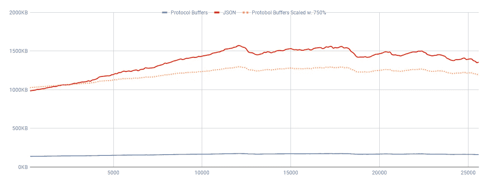

# Protobuf —一种高性能的数据交换格式。

> 原文：<https://levelup.gitconnected.com/protobuf-a-high-performance-data-interchange-format-64eaf7c82c0d>


协议缓冲区，通常称为 *protobuf* ，是一种二进制数据交换格式，它保证了类型安全，同时是语言无关的和跨平台的。这种格式的大小是高效的，开发的重点是高序列化/反序列化性能。

这种格式依赖于预编译的模式，不像 JSON 等其他数据交换格式那样可以使用通用库进行序列化/反序列化。官方编译器支持 C++、C#、Dart、Go、Java、Python。在编译器不支持的语言中使用 protobuf，虽然可能，但相当麻烦。

# 模式文件

该模式在*中定义。proto* 文件使用官方[语言指南](https://developers.google.com/protocol-buffers/docs/proto3)中定义的语言。它支持复杂的结构，包括嵌套类型、可选字段、重复字段*(数组)*、映射等等。

```
syntax = "proto3";package Example;message Entity {
  int32 identifier = 1;
  optional string description = 2;
  repeated Coordinate points = 3;
}message Coordinate {
  optional int32 x = 1;
  optional int32 y = 2;
}
```

然后，使用*协议*将该模式编译成所需的语言，该协议为每个*消息*实体生成许多带有类定义的文件。

# 性能—消息大小

我第一次发现 protobuf 是在开发 Abathur 的时候，abath ur 是一个模块化星际争霸 2 代理的框架。每个*游戏步骤*都必须同步整个游戏状态(正常游戏速度下 16Hz，更快时 22.4hz)——这就产生了很高的带宽要求，所以我决定运行一些测试。



[*response observation*s](https://github.com/Blizzard/s2client-proto/blob/01ab351e21c786648e4c6693d4aad023a176d45c/s2clientprotocol/sc2api.proto#L359)与 JSON 相比格式化为 protobuf 的大小。作者图表。

单个游戏状态对象([*response observation*s](https://github.com/Blizzard/s2client-proto/blob/01ab351e21c786648e4c6693d4aad023a176d45c/s2clientprotocol/sc2api.proto#L359))在地图 [Trozinia LE](https://liquipedia.net/starcraft2/Troizinia_LE) 上格式化为 JSON 时大小在 959.55 千磅到 1534.51 千磅之间变化，大致等于**实时玩时 7.86–12.57 Mbps**。当格式化为 protobuf 时，完全相同的对象在 133.61KiB 和 169.01KiB 之间变化，这导致*" only "***1.09–1.38 Mbps**。

在这个特定的场景中，选择 protobuf 而不是 JSON 意味着总的消息大小节省了 **618.19%** 到 **807.93%** 。这对网络应用的性能产生了巨大的影响，并可能为云解决方案节省大量的纯数据传输速率。然而，Abathur 在本地运行——但是节省的 I/O 操作值得赞赏。

# 性能—序列化/反序列化

在某些应用程序中，尤其是云解决方案中，减少数据传输本身可能值得对 protobuf 进行更改——但只有从纯粹的性能角度来看，如果花费在“*”压缩“*数据上的时间能够在传输数据时节省下来，才值得这样做。

protobuf 消息的二进制表示非常类似于 C++对象的内部二进制表示。因此，这种格式在 C++中非常高效，因为它几乎可以简单地将消息直接复制到内存中，并解释为一个对象。然而，Abathur 是 C#/Python 的混合体——具有非常不同的内部数据表示的语言。因此，我决定进行一些测试…

测试集是通过在[煤渣堡垒](https://liquipedia.net/starcraft2/Cinder_Fortress)上运行两个精英人工智能来生成的，并连续请求*观察【16860 步。然后将这些观察结果保存到磁盘上，并随后加载到小型测试应用程序中，以便对序列化/反序列化进行计时。修整平均值是 25%的修整平均值。*

```
+-----------------------+----------+-----------+-----------+
|     C# Results        | 25% mean | Max value | Min value |
+-----------------------+----------+-----------+-----------+
| proto serialization   | 1.00ms   | 27.899ms  | 0.326ms   |
| json serialization    | 9.0916ms | 94.5744ms | 2.722ms   |
| proto deserialization | 0.544ms  | 16.609ms  | 0.125ms   |
| json deserialization  | 18.326ms | 124.808ms | 6.911ms   |
+-----------------------+----------+-----------+-----------+
```

*这些测试是在一台运行 Windows 10 的普通笔记本电脑上进行的，该电脑配有 I5–5200 u CPU、2.20GHz、8 GB RAM。C#中的序列化/反序列化是使用 Google 完成的。Protobuf.JsonFormatter 和 Google。proto buf . JSON parser**Python 序列化/反序列化使用了 Google . proto buf . JSON _ format*

```
+-----------------------+----------+------------+-----------+
|    Python Results     | 25% mean | Max value  | Min value |
+-----------------------+----------+------------+-----------+
| proto serialization   | 23.788ms | 126.0893ms | 11.007ms  |
| json serialization    | 38.021ms | 171.122ms  | 19.995ms  |
| proto deserialization | 24.220ms | 124.0892ms | 10.007ms  |
| json deserialization  | 46.635ms | 218.156ms  | 23.997ms  |
+-----------------------+----------+------------+-----------+
```

Protobuf 的序列化和反序列化比 C#中的 JSON 要快得多，这并不奇怪，因为对象的内部数据表示与 C++使用的数据表示相似，c++首先对格式进行了优化。然而 Python 也获得了实质性的性能提升！

# 反射

protobuf 是不是简单的比 JSON 好？**当然不是。这两种格式差别很大，单纯从性能上比较它们是不公平的。JSON 是人类可读的、自描述的、得到普遍支持的、有效的行业数据交换格式。**

另一方面，Protobuf 可能很难使用，因为接收方必须知道模式，数据才有意义。如果不仔细遵循最佳实践，小的模式更改很容易破坏以前的集成——更不用说笨拙的模式编译工作流了。它不太为人所知，支持的语言也很少，所以它可能不是公共 API 的首选。

但是，如果你渴望高性能的数据传输，或者你的云提供商在数据传输费用上敲你竹杠，那就试试吧。

*原载于 2020 年 8 月 12 日*[*【https://adequatesource.com】*](https://adequatesource.com/protobuf/)*。*