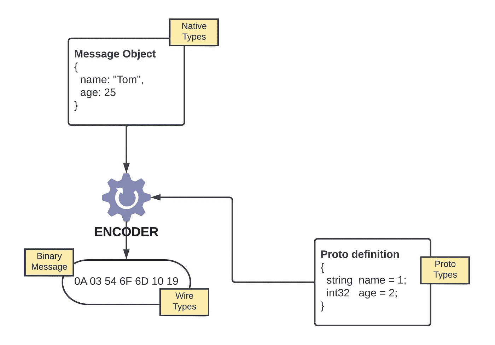
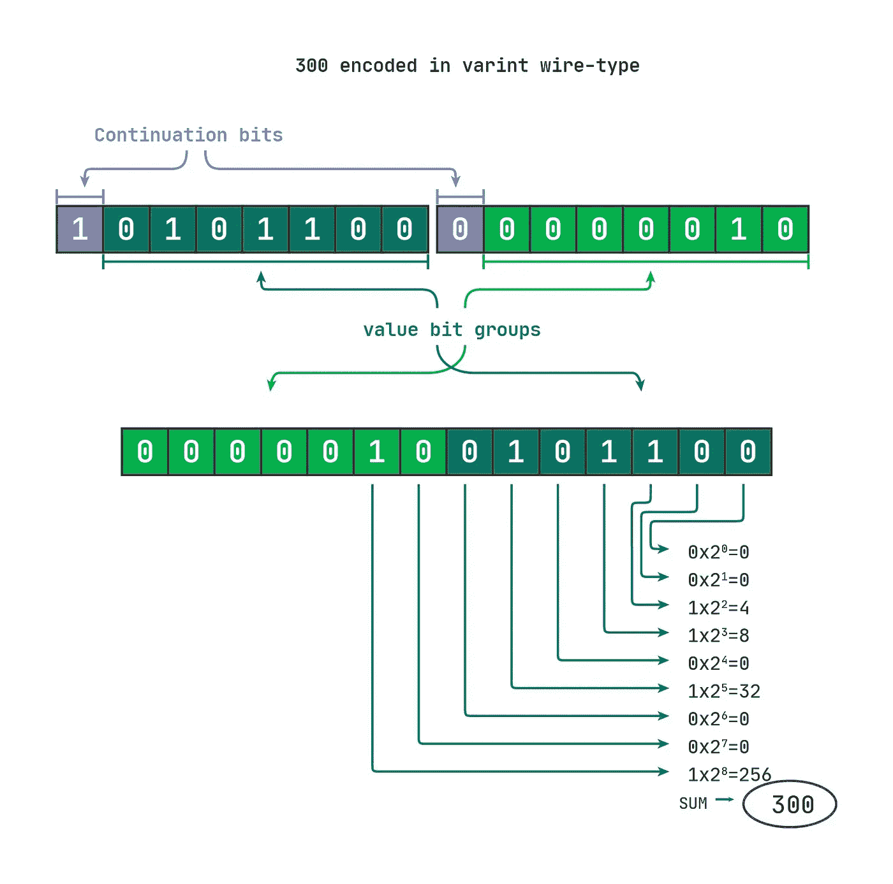
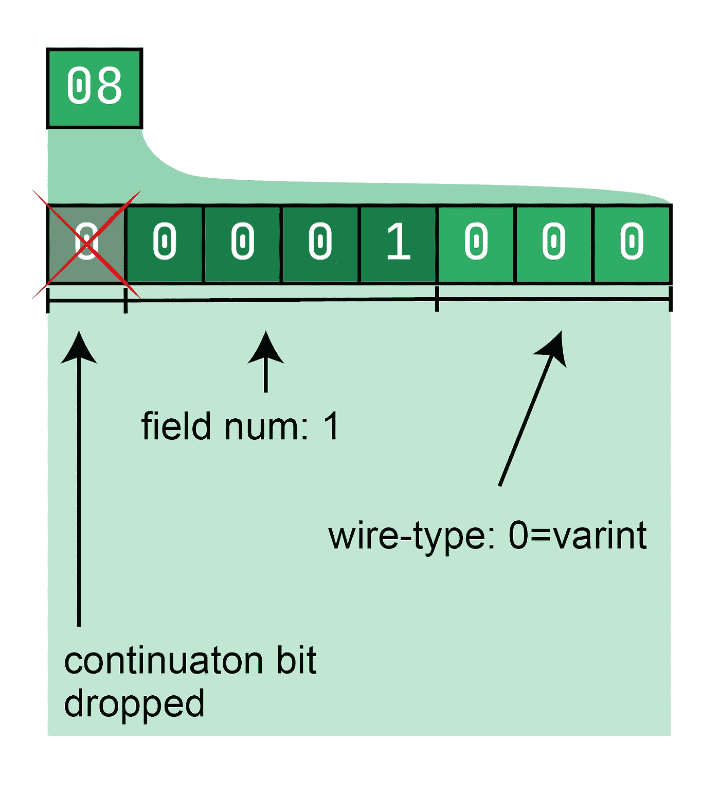
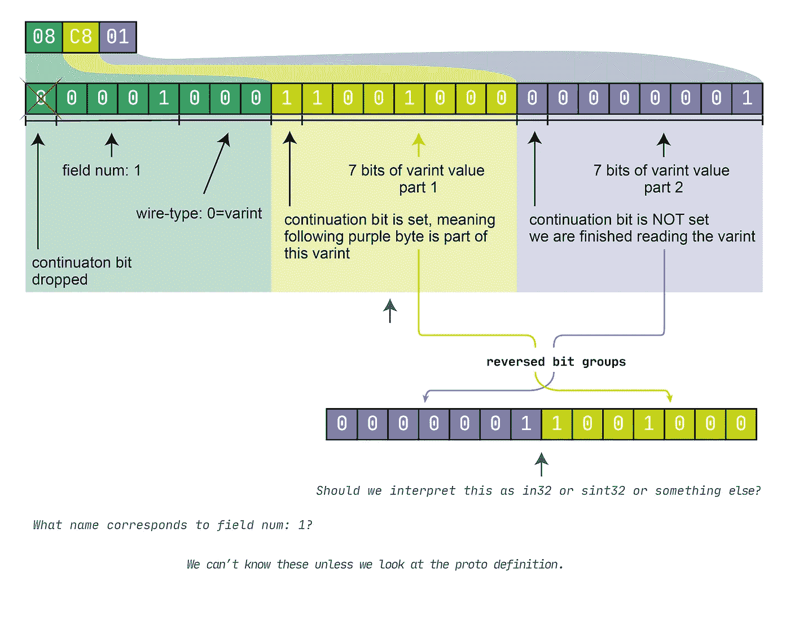
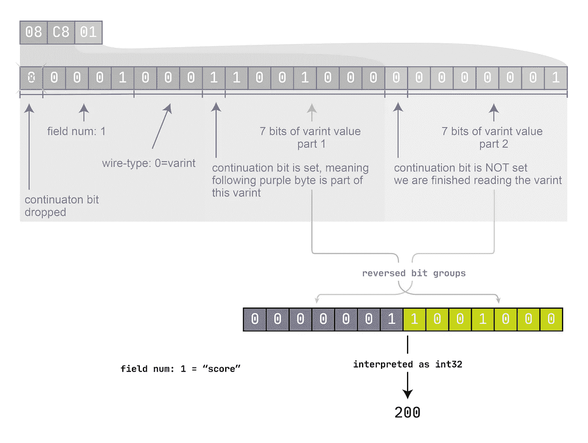
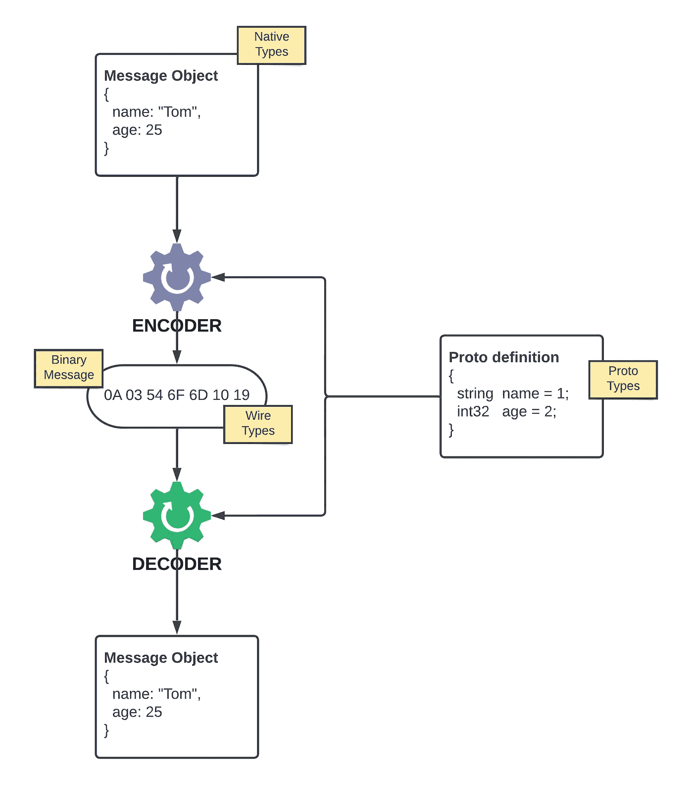
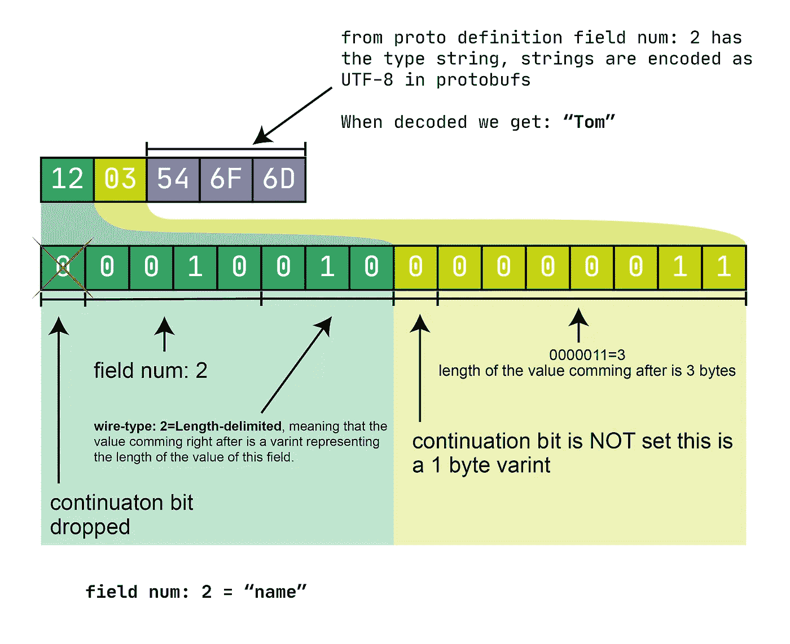

# Protobufs 解释道

> 原文：<https://levelup.gitconnected.com/protobufs-explained-17ed6ba52076>

本质上，协议缓冲区(也称为 protobufs)允许将结构化数据编码成一个紧凑的字节流(0 和 1 的序列)。假设您有一个带有属性 score 和 name 的 player JavaScript 对象:

```
{
  score : 25,
  name: "Tom"
}
```

如果通过 protobufs 序列化，它将变成如下所示的字节流(每个字节用两个十六进制数字表示):

```
08 C8 01 12 03 54 6F 6D
```

如你所见，它总共有 8 个字节。

相比之下，用 JSON 序列化的相同对象(去掉空白)将产生 26 字节的数据。所以在这个特殊的例子中，protobufs 变体大约比 x3 小。这种差异会因下划线数据的不同而有所不同，但总体上 protobuf 序列化版本总是比基于文本的版本小，并且在大规模系统上会产生巨大的差异。

即使您已经使用 protobufs 有一段时间了，您也可能会对它们有一些疑问:

*   为什么我们需要原型定义，我们不能将结构化消息直接转换成二进制吗？
*   为什么我们在原型定义中需要字段编号？
*   除了语言原生类型之外，为什么我们还需要为字段定义类型？
*   本机类型、原型类型和连线类型之间的区别。
*   …

# 编码

要将上述对象编码成字节流，protobuf 编码器需要两个输入，要编码的实际对象和它的 proto 定义。

> 原型定义是用原型语言编写的。语言有两个版本，proto2 和 proto3，我们将讨论后者(尽管我们在这里使用的例子在 proto2 中是相同的)

下面是上述对象的原型定义

```
message Player {
  *int32* score = 1;
  *string* name = 2;
}
```

这是一个关于编码的高级视图



先说一下 proto 语言及其类型，按照我们的例子，结构化数据被定义为一个`message`，单个字段有类型和字段号，“name”是类型`string`，它的字段号是 1；“年龄”是字段号为 2 的类型`int32`。这种类型是与语言无关的，也就是说，`message`类型可以翻译成 JavaScript 和 POJO 中的对象或 Java 中的类，`int32`可以翻译成 JavaScript 中的`number`，而在 Java 中它可以有更具体的`int`类型。

# 3 种打字系统

我们需要记住，编码/解码涉及到多种类型系统。

*   **线类型**——如何在字节流中写入内容
*   **proto types**—proto definition 语言中性类型，这是对 protobufs 编码器/解码器关于如何将语言本机类型转换为有线类型以及如何将有线类型转换为有线类型的指示。
*   **语言本地类型** —例如 JavaScript 对象、字符串、数字、布尔或 Java 类、字符串、字符、整数、浮点、布尔

需要考虑的一个有趣点是，**线类型**和**语言本机类型**具有内存表示(即它们如何存储在 0 和 1 中)，而**原型类型**从不存在于内存中，它们在编码过程中用于将语言本机类型转换为线类型，在解码过程中用于执行相反的操作。

当我们回顾我们的例子时，我们将很快看到所有三种类型系统在编码/解码过程中所扮演的角色，但在此之前，我们需要了解一些基础知识。我们将从变异体开始。

## Varints

变量是一种使用一个或多个字节序列化整数的方法。变量的字节长度随着整数变大而增加。因此，varint 可能由一个或多个字节组成，每个字节中的最高有效位(MSB)称为延续位，当它被设置时，意味着至少还有一个字节要读取，每个字节中的其余 7 位专用于存储该值。你可以在 7 位中存储的最高无符号值是 2⁷=128，所以任何高于这个值的值都需要另一个字节来容纳。让我们看一下例子，看看这实际上是如何工作的。

varint 中编码的整数`1`是`00000001`为了计算出它，我们查看最高有效位，看到它是零，这告诉我们这个 varint 没有更多的字节可供读取，接下来我们丢弃最高有效位(因为它仅用于正确读取 varint ),剩下 7 位实际整数值`0000001`,它是 10 进制的`1`。

现在让我们看看如何计算出 varint `1010 1100 0000 0010`实际上保存的是整数值`300`。我们查看第一个字节中的第一位，看到它已设置，这意味着还有另一个字节要读取，然后我们读取下一个字节的第一位，看到它没有设置，告诉我们已经到达末尾。接下来，我们删除延续位，剩下的是保存整数值的位组，我们反转它们，因为变量首先存储较不重要的组，这是我们在 base2 中的最后一个整数，然后我们可以使用位置表示法来查看它在 base10 中的样子。下图说明了这一点。



理解变量

需要更多关于 varints 的信息？看看 [Carl Mastrangelo](https://carlmastrangelo.com/blog/lets-make-a-varint) 写的，里面涵盖了很多有趣的方面。

## 编码消息基础

当消息被编码时，每个字段都被写成一个键值对，一个接一个。字节流中的每个键都是一个值为`(field_number << 3) | wire_type`的变量，即最后 3 位总是存储值的类型。**不保证键值对的顺序。**

## 读取第一个键值对

我建议我们假装是一个 protobufs 解码器，像它一样读取我们的示例字节流。除此之外，让我们想象一下，我们现在无法访问消息的 proto 定义，我们唯一知道的是字节流的样子和 protobufs 协议是如何工作的。

在我们的例子中，第一个字节是`08`，根据我们已经说过的，我们希望它是一个字段键和 wire_type。



字段键

此时，我们知道字段编号为 1，wire-type 为 0，对应于 varint ( [由 protobufs 协议](https://developers.google.com/protocol-buffers/docs/encoding#types)定义)，基于此，我们可以继续读取字节流`C8`中的下一个 Varint，它的延续位`11001000`已设置—我们还需要读取下一个字节`01`，它的延续位`00000001`未设置—我们已完成读取 Varint。接下来，我们需要删除延续位并颠倒位组的顺序以得到`0000001 1001000`(为了理解为什么我还没有将它转换为 base10，请继续阅读)



这样我们就完成了读取第一个编码的键-值对，但这只是读取，原始对象属性的重建还需要几个步骤。

## Protobuf 消息不是完全自描述的

解码器不查看其原型定义就不能完全重构原始消息。让我们看看到目前为止我们已经收集了哪些信息。我们已经从字节流中读取了与该字段相关的任何内容，但是这些信息足以重建原始的对象属性吗？

*   字段编号:1
*   电线类型:Varint
*   数值:`0000001 1001000`

对，我们仍然需要弄清楚字段名以及如何解释二进制值。

为了弄清楚为什么我们不查看字段的原型类型定义就不能解释值，考虑一下，原型类型`int32`和`sint32`都用 varint wire-type 编码。现在，值`0000001 1001000`对于 int32 可能意味着 200，对于 sint32 可能意味着 100。如果你的银行账户里少了 100 美元，仅仅是因为有人不知道原型定义，你不会高兴的。还记得我们说过原型类型是编码器/解码器的一种指令吗？

在这一点上，打开了查看原型定义的大门，从中我们可以看出，编号为 1 的字段被命名为“score ”,其原型类型是 int32。



假设我们在 JavaScript 环境中解码，类型告诉我们应该将值解释为普通变量(如果是 sint32，我们需要一个额外的步骤将其解码为 ZigZag signed integer 编码，这将导致值 100 ),它还会指示我们使用 JS `number`类型作为结果类型。因此，我们最终将属性值为 200 的属性 score 赋给目标对象。

对于意识来说，这是这个特殊领域的类型

```
+------------+------------+-----------+
| JavaScript | proto type | wire-type |
+------------+------------+-----------+
| number     | int32      | Varint    |
+------------+------------+-----------+
```

编码器使用原型定义来:

*   验证输入，例如，`number`类型的 JavaScript 值符合 proto `int32`，但`string`不符合。
*   确定目标焊线类型，例如`Varint`代表`int32`
*   包括字段号，以使解码器能够识别字段

解码器使用它们来:

*   根据字段编号获取字段名称
*   了解如何解码线类型，并以适当的语言原生类型加载它们。



关于协议缓冲区还有很多要讨论的，但是现在让我们结束对字节流的研究，也了解长度分隔的字段是如何编码的。

我们在第四个字节`12`，也就是`00010010`，所以我们得到了线类型`010` = 2 长度分隔，字段编号`0010` =2。这里的类型告诉我们，我们应该期待一个表示值的长度的变量，下一个字节`03`是二进制的`00000011`，它是一个等于 3 的变量 int，我们可以继续读取值`54 6F 6D`的下 3 个字节。从 proto 我们得到字段名“name”，字段类型是`string`，字符串编码为 UTF8，当用 UTF8 解码值时，我们得到“Tom”。



关于长度分隔的字段，需要注意的主要一点是，它的长度变量位于键和值之间。

祝你玩得愉快！👽

# 分级编码

感谢您成为我们社区的一员！在你离开之前:

*   👏为故事鼓掌，跟着作者走👉
*   📰查看[级编码出版物](https://levelup.gitconnected.com/?utm_source=pub&utm_medium=post)中的更多内容
*   🔔关注我们:[推特](https://twitter.com/gitconnected) | [LinkedIn](https://www.linkedin.com/company/gitconnected) | [时事通讯](https://newsletter.levelup.dev)

🚀👉 [**加入升级人才集体，找到一份惊艳的工作**](https://jobs.levelup.dev/talent/welcome?referral=true)