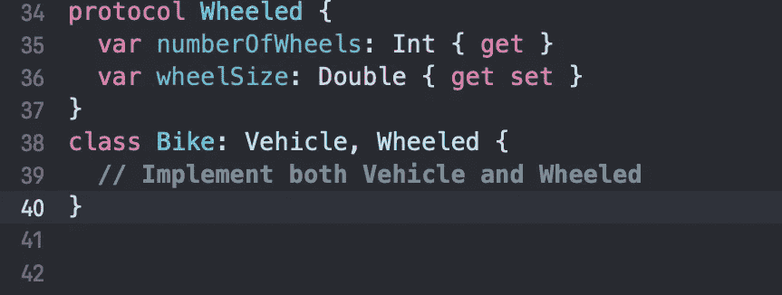

# Swift 中的协议

> 原文：<https://levelup.gitconnected.com/protocols-in-swift-7359a88248b4>

我从初级到中级都解释过，有代码示例和快照。🚀

> 有了协议，你就定义了一组具体类型实现的公共属性和行为*🤓*。*让我们来看一个例子:*

关键字`protocol`后面是协议的名称，后面是花括号，里面是协议的成员。

**您会注意到的最大区别是协议*不包含任何实现*。**你在这里定义的是类似于车辆的*概念*的东西——它可以加速和停止。💯

## 让我们理解它的语法

一个协议可以被一个类、结构或枚举**采用**——当另一个类型采用一个协议时，它需要实现协议中定义的方法和属性。一旦一个类型实现了一个协议的所有成员，这个类型就被认为**符合**该协议。例如:

> 在命名类型的名称后面加上一个冒号和您想要遵循的协议的名称。这种语法可能看起来很熟悉，因为它与您用来使一个类从另一个类继承的语法相同。在这个例子中，Unicycle 符合车辆协议。

**注意，它*看起来*像类继承，但它不是；结构和枚举也可以符合这种语法的协议。**

在上面的代码中，一个类可以采用一个协议。在这里，我们创建了一个名为`Unicycle`的`Vehicle`类型的类，并且我们使用了协议`accelerate`和`stop`的属性，我们通过将兜售虚假作为代码块来定义该方法。

**如果您要从上面的** `**Unicycle**` **类中删除** `**stop()**` **的定义，Swift 会显示一个错误，因为 Unicycle 不会完全符合** `**Vehicle**` **协议😮。**

因为您没有同时使用加速和停止，错误显示为类型“独轮车”不符合协议“车辆”。

# 协议中的属性

当在协议中定义属性时，您必须显式地将它们标记为`get`或`get set`，有点类似于您声明计算属性的方式。然而，就像方法一样，您不包含任何属性的实现。

正如我们之前说过的，在协议括号中，我们只写协议能做的事情。

如果你不熟悉计算属性，getter 和 setter。那么你可以通过下面的解释:[*https://medium . com/dev-genius/what-are-properties-in-swift-2 EC 8 ABA 9a 378*](https://medium.com/dev-genius/what-are-properties-in-swift-2ec8aba9a378)

# 协议中的初始化器

**Swift** 允许程序员通过符合其类型直接初始化**协议**。我们可以将**初始化器**声明为**协议**的一部分，就像普通的**初始化器**一样，但是我们不会使用花括号或者**初始化器**体。

让我们看看代码，并通过示例来探索它:

在上面的 *Account* 协议中，您定义了两个初始化器作为协议的一部分。在这种情况下，任何符合 Account 的类型都需要有这些初始化器。如果你使用一个类类型遵循一个带有必需初始化器的协议，那些初始化器必须使用**必需的**关键字。

# 协议继承

您可能希望定义一个协议，该协议包含车辆的所有质量，但也特定于带车轮的车辆。为此，您可以拥有从其他协议继承的协议，就像您可以拥有从其他类继承的类。

在上面的代码中， *WheeledVehicle* 协议继承自另一个协议，即 *Vehicle* 。所以这个*轮式车辆*协议将包括*车辆*协议及其自身的所有属性。

**定义一个协议保证任何符合该协议的类型都将拥有*所有*你在该协议中定义的成员。**

# 实现多个协议

一个类只能继承一个类——这就是“单一继承”的属性。相比之下，一个类可以采用任意多的协议！

关于协议还有很多要学的，但这已经足够在日常代码中实现了。

> 一些主题，如标准库中的协议、等价、可比、“自由”函数、Hashable、CustomStringConvertible 等，可以在另一篇关于协议的高级文章中讨论。

# 要点

*   协议定义了一个契约，类、结构和枚举可以**采用**。
*   通过采用协议，类型需要通过实现协议的所有方法和属性来使**符合**协议。
*   一个类型可以采用任意数量的协议，这允许通过子类化不允许的准多重继承。
*   您可以使用扩展来实现协议的采用和一致性。
*   Swift 标准库广泛使用协议。您可以在自己的命名类型上使用其中的许多类型，例如 Equatable 和 Hashable。

 [## 编写面试问题

### 一个完整的平台，在这里我会教你找到下一份工作所需的一切，以及…

技术开发](https://skilled.dev)