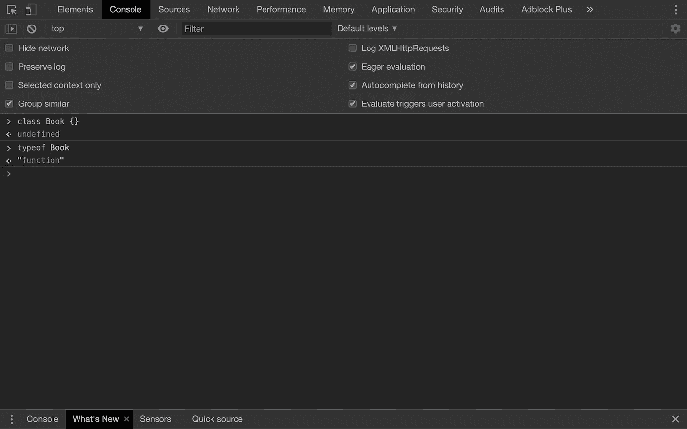
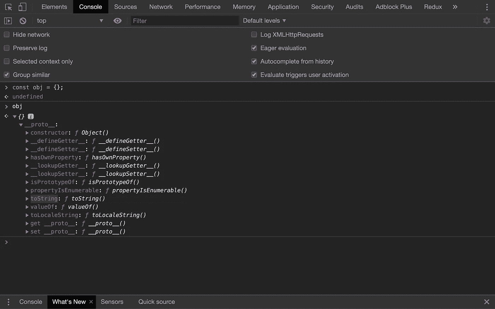
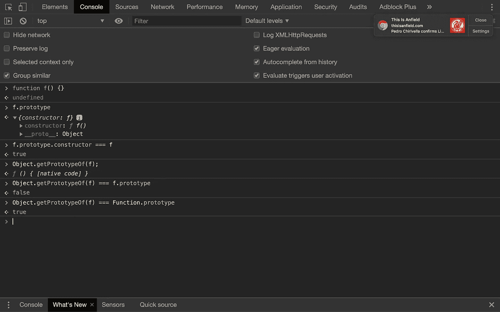
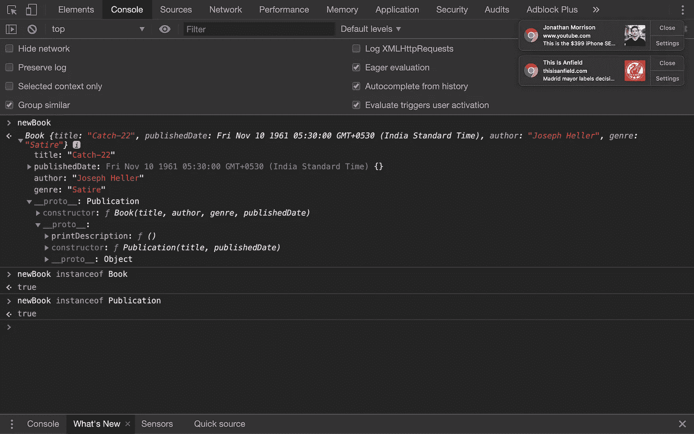

# JavaScript 中的原型继承

> 原文：<https://levelup.gitconnected.com/prototypal-inheritance-in-javascript-c03725a0d789>

# 介绍

JavaScript 是这个街区里最奇怪的孩子。这很奇怪，但是在我看来，这些奇怪之处使得 JavaScript 成为最灵活的语言。然而，许多开发人员不熟悉这些专业，这阻碍了他们编写好的代码。

本文是我试图阐明大多数开发人员不熟悉的 JavaScript 基本概念的系列文章的第一篇。

在这篇文章中，我将关注的主要概念是**继承**。**继承**很可能是 JavaScript 中最重要但被误解的概念，尤其是对于具有基于类的语言背景的开发人员来说。

尽管 JavaScript 在 **ES2015** 中引入了类，但它并不依赖它们来实现**继承**，而是仅仅是语法上的糖。

JavaScript 类被美化为**构造函数，**并且在幕后，它们仍然使用**原型继承**。

# 什么是原型继承？

在 JavaScript 中，我们可以创建一个对象而不用定义它的类。对象也可以直接从其他对象继承属性。这个特性将 JavaScript 与基于类的语言区分开来，在基于类的语言中，类继承自其他类。

在我们深入研究**原型继承**如何工作之前，让我们讨论一下对象在 JavaScript 中的行为。

JavaScript 中的对象是键值对。创建对象最简单的方法是使用花括号(**字面形式**)，在花括号内定义属性和方法。

您可以使用**点号**在对象中查找属性。您也可以使用**圆点国家**来添加或修改属性。

如果我们查找一个存在于对象中的属性，我们得到分配给它的值。如果我们在一个对象中查找*不存在*的属性，我们得到`undefined`作为值。这两条规则适用于*，除非*属性存在于**原型链**中。

## 什么是**原型链**？

每个对象都有一个到另一个对象的链接，称为其原型**。那个对象也有一个**原型**，这一直持续到我们到达一个对象，其中**原型**是`null`。由此产生的一系列相互连接的对象被称为**原型链**。**

****

**我们可以使用 Google DevTools 来研究这种关系。如您所见，我已经创建了一个空对象，但是它只有一个名为`__proto__`的属性，并分配了一个对象。`__proto__`是保存对象的**原型**的键(也称为**委托原型**)。从这一点开始，我将把这个属性称为 **[[prototype]]** ，因为这是标准。**

**当我们试图访问一个对象中的属性时，将在对象本身中查找该属性，然后在它的**原型**中查找，依此类推，直到找到具有匹配名称的属性*或*，到达**原型链**的末端。一旦找到匹配的名称，查找就会终止。**

**这种行为在下面给出的例子中很明显。**

**[**object . setprototypeof()**](https://developer.mozilla.org/en-US/docs/Web/JavaScript/Reference/Global_Objects/Object/setPrototypeOf)**将一个对象(或`null`)设置为给定对象的**[[原型]]** 。****

****由于`book` *没有*一个名为`title`的属性，查找委托给**`book``publication`的**【原型】**。`publication`有一个名为`title`的属性，因此分配给它的值将被打印到控制台。******

****因为`book` *有*一个名为`publishedYear`的属性，所以查找不会委托给`publication`，分配给`book.publishedYear`的值会打印到控制台。****

****上面，你可以看到使用[**object . create()**](https://developer.mozilla.org/en-US/docs/Web/JavaScript/Reference/Global_Objects/Object/create)*实现的相同场景。* **Object.create()** 接受一个对象(或`null`)并将其设置为一个全新对象的**[[原型]]** 。****

******Object . set prototypeof()**和**对象。当我们需要利用**原型继承**时，Create()** 就派上了用场。但是这两种方法对 JavaScript 来说都相对较新。实现**原型继承**的古老机制是使用 c **构造函数**。****

## **什么是构造函数？**

****构造函数**是用`new`操作符执行时初始化对象的常规函数。用`new`关键字执行**构造函数**被称为**构造函数调用**。**

**在我们继续之前，有一件关于函数的事情你应该知道。**

**所有的 JavaScript 函数(除了箭头函数)都有一个名为`prototype`的内置属性。**不要把这个属性和** [**【原型】**](https://developer.mozilla.org/en-US/docs/Web/JavaScript/Reference/Global_Objects/Function#Function_prototype_object) **混淆。****

****

**一个函数的`prototype`属性，*除非变异*，有一个自己的属性，名为`constructor`，指向函数的内存位置。**

**一个 c **构造器调用**导致三件事。**

1.  **创建了一个全新的对象。它可以是新构造的对象，也可以是函数返回的替代对象。**
2.  **创建的对象被设置为该特定调用的`this`上下文。**
3.  **函数的`prototype`属性被设置为新对象的 **[[prototype]]** 。**

**上面的例子结合了我们已经讨论过的所有概念来模拟一个**继承**的经典案例。**

**为了提供对`Publication`的属性和方法以及`Book`的新实例的访问，我使用**function . prototype . call()**将`Book`中的`this`上下文传递给`Publication`。因为`Book`中的`this`上下文引用了新的实例，所以`Publication`的属性和方法被添加到其中。**

**由于`Book`的实例也应该能够访问驻留在`Publication`的 **[[prototype]]** 中的自定义方法，所以我使用 **object.setPrototypeOf()** 到链接`vehicle`和`book`的 **[[prototype]]** 。**

****

**我们可以使用 操作符的 [**实例来验证**构造函数**的`prototype`属性是否出现在**原型链**的任何地方。**](https://developer.mozilla.org/en-US/docs/Web/JavaScript/Reference/Operators/instanceof)**

# **概述**

**在 JavaScript 中，对象可以从其他对象继承。每个对象都有一个祖先对象，这导致了一系列相互链接的对象。这个链中的对象可以访问位于它们之前的对象的属性和方法。**object . set prototypeof()**， **Object.create()** 和**构造函数**是三种方法，你可以用它们来链接对象，实现**继承**。**

# **下一个**

*   **班级和他们如何在引擎盖下工作**
*   ****串联继承**([**object . assign()**](https://developer.mozilla.org/en-US/docs/Web/JavaScript/Reference/Global_Objects/Object/assign)， [**展开语法**](https://developer.mozilla.org/en-US/docs/Web/JavaScript/Reference/Operators/Spread_syntax) 等。)**
*   ****功能继承** ( **工厂功能**)**

**再见，注意安全！👋**