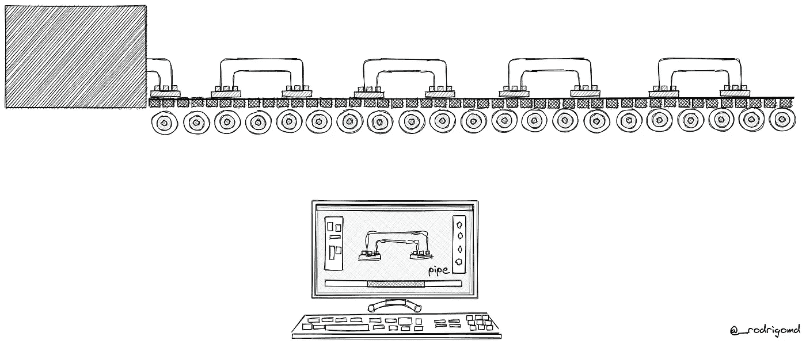
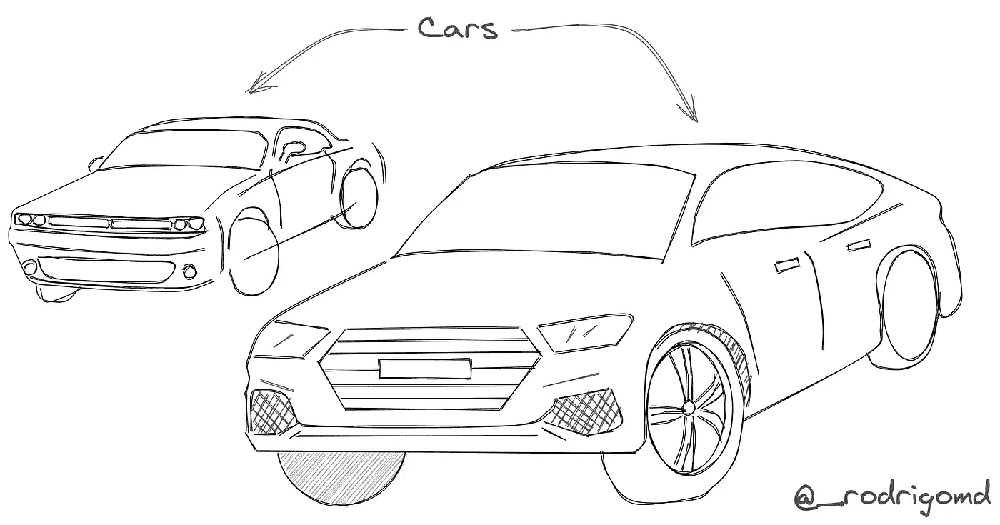
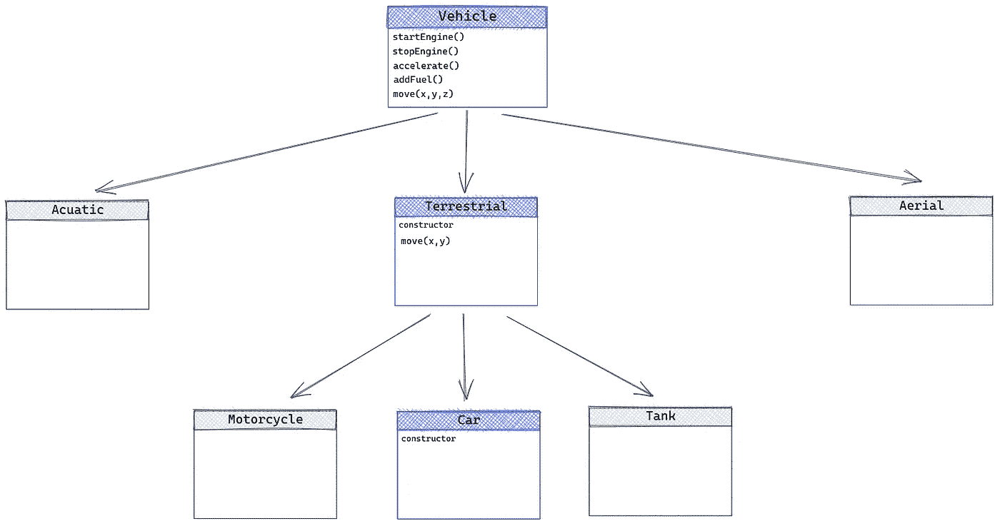
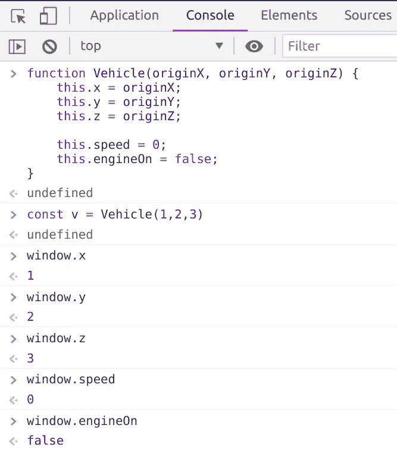
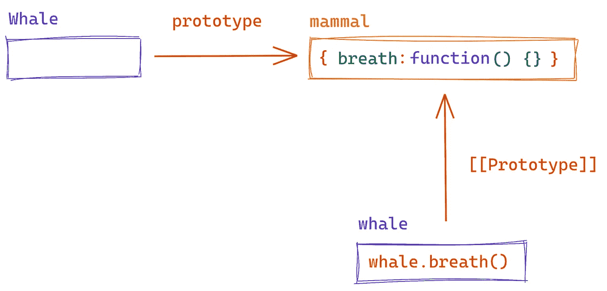
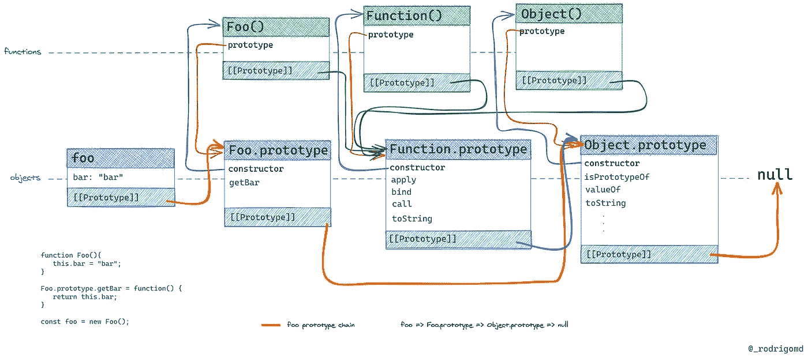

# 原型继承:JavaScript 中类背后的大秘密

> 原文：<https://levelup.gitconnected.com/prototypal-inheritance-the-big-secret-behind-classes-in-javascript-e7368e76e92a>

## JavaScript 基础知识

关于类和原型的完整指南


托马斯·凯利在 [Unsplash](https://unsplash.com?utm_source=medium&utm_medium=referral) 上的照片

人们有时会发现相信一个小谎言比花时间去理解一个复杂的真相更容易(你看过黑客帝国电影吗？).在 JavaScript 中，我们从 Java 等其他语言中了解到的类是不存在的。那么 JS 中的类继承是如何工作的呢？在本文中，我们将通过分析幕后发生的事情来找到答案。

## 内容

*   什么是课？
*   如何用 JavaScript 写类？
*   原型
*   原型链
*   创建没有类的对象
*   那为什么我们还在使用类？

# 什么是课？

JavaScript 是一种多范式语言，这意味着您可以按照不同的编程风格编写代码。尽管如此，最突出和使用的是面向对象的范例或面向对象的朋友。

在这种范式中，我们通过对象和类的概念来表示现实世界的问题。



合奏线:从抽象到现实

一堂课就像一张蓝图。它是一个对象的规范，描述了它将会是什么样子和如何表现。想象一个工厂里的流水线；每一件作品都是用绘图工具预先设计好的。这个设计为机器提供了如何组成每个物体的细节。该设计不是实际的表示；它是对象结构的抽象。编程语言中的类也是如此；它们是对象的抽象，对象是类似于真实世界对象的虚拟形式。



另一种理解阶级的方法是通过家庭和团体。想象一个汽车类，它有共同的属性，如品牌、型号、颜色、引擎和年份。car 类作为一个构造函数来创建 Car 对象，这些对象可以有不同的属性，但最终都是 Car。在编程中，我们说每个汽车对象都是汽车类的一个实例。

> 一个类就像一个蓝图，是一个对象的规格说明，描述了它将会是什么样子和如何表现

## 层次和子类化

类不仅作为对象或对象组的规范，还通过子类化表示现实世界的层次结构。

取下面的定义:

> 车辆是运送人或货物的机器— [维基百科](https://en.wikipedia.org/wiki/Vehicle)

这意味着我们的汽车可以继承车辆的属性和方法，因为根据定义，它是这样的。但是在这两者之间，我们可以添加尽可能多的类来模拟我们试图解决的问题。

一种表示可以是以下关系:



在上面的图像中，我们根据设计的环境对车辆进行了分类:地面车辆，如汽车、卡车、摩托车；飞机、喷气式飞机、直升机的天线，船只、游艇和潜艇的水上天线。我们可以用其他分类方法来区分它们，比如位移机制，例如，对于陆地车辆:车轮或履带。但是对于这个例子来说这是不必要的，所以我们可以避免增加问题的复杂性。

该图从上到下，从一般到具体描述了汽车的含义。这是继承的规则。我们总是从最一般的形式到最详细的形式。每次我们建模一个继承自另一个的类时，我们都会扩展功能以增加更多的专门化。

当 B 类扩展 A 类时，我们说 B 是 A 的子类，同时 A 是 B 的超类或基类。

按照这个例子，Car 是 Terrestrial 的子类，但是这里有一个关于类继承的事情:

> 继承遵循传递性

上面的陈述意味着，如果我们添加一个类 C 来扩展以前的类 B(扩展 A 的那个类),那么 C 类也通过传递性从类 A 扩展。在车辆的例子中，car 也是车辆类的子类，这意味着 Car 实例可以从两个类继承方法和属性:陆地和车辆类。

在像 C++这样的其他语言中，我们可以同时从许多类中扩展一个类；这叫做多重继承，但是 JavaScript 不支持。

> 💡在 JavaScript 中，一个类一次只能继承一个类。

# 如何用 JavaScript 写类？

从 ES6 开始，创建类变得很容易；如果需要初始化对象的实例，使用保留的`class`字并编写一个构造函数块。如果您想从另一个类扩展行为，请在类名后使用`extends`关键字。如果你打算将初始化委托给父类，记得在构造函数中调用`super()`方法。

我们还可以使用其他特性，比如使用 getters 和 setters 的*，静态值，以及更多的*。

在上面的代码中，你可以看到如何从 ES6 开始编写一个类。所有漂亮的语法都放在普通对象的肩上，通常是通过使用*构造函数*创建的。

构造函数是*构造函数模式*的核心部分，用于通过实例化创建共享功能的相似对象。构造函数只不过是一个普通的函数。为了区分函数和构造函数，开发人员有一个用大写字母编写构造函数的惯例，而其他函数的名称必须以小写字母开头。

下面是构造者的车辆版本，这是在语言中包含类的语法之前实例化对象的首选方式。

一个函数构造器，它的原型被赋予了一些方法

为了用构造函数创建一个对象实例，我们需要使用保留的`new`字来调用它们。当心调用没有这个词的构造函数，构造函数不会失败，但是行为会有所不同。



Chrome DevTools 上的一个截图

当我们调用不带`new`字的构造函数时，它会将所有分配给`this`上下文的变量和方法追加到“*全局对象*”中，如上图所示。在 Web 浏览器中，全局对象是`window`对象，而在 NodeJS 中是当前模块。

类通过抛出一个错误解决了这个问题:

```
Uncaught TypeError: Class constructor Vehicle cannot be invoked without 'new'
```

类和构造函数代码之间的另一个众所周知的区别是，对于构造函数，我们必须在声明构造函数之后向名为 *prototype* 的对象添加属性和方法。我们不需要使用类来实现。

初级程序员常见的误解是，他们认为一旦创建了新的实例，类中定义的方法就会被复制到新的实例中。

让我们找出答案。

```
// First we create a vehicle’s instance using the Vehicle class const vehicle = new Vehicle(0,0,0)// Then we check if the methods declared inside the class 
// are copied to the instancevehicle.hasOwnProperties('startEngine') // false
vehicle.hasOwnProperties('stopEngine') // false
.
.
.
vehicle.hasOwnProperties('move') // false
```

GIF via [Giphy](https://media.giphy.com/media/vC7re5BB5QsYU/giphy.gif)

我们使用每个对象在最近创建的 vehicle 实例上拥有的`hasOwnProperty`方法来检查它是否拥有在类中定义的方法。令我们惊讶的是，它没有任何方法。

留给我们以下问题:

—他们去哪里了？

GIF via [Giphy](https://media.giphy.com/media/gIfgb4RSmErc07m4n9/giphy.gif)

使用`getPrototypeOf`方法——从 ES6 开始可用——我们可以使用构造函数检索前面代码中看到的同一个*原型*对象，猜猜会发生什么？

```
// ES6 syntax: using classes
const prototype = Object.getPrototypeOf(Vehicle)// we print the vehicle's instance properties
console.log(Object.keys(vehicle))
// []console.log(Object.keys(prototype))
// ['startEngine', 'stopEngine', 'accelerate', 'addFuel', 'move']
```

ES6 语法隐藏了这样一个事实，即类内部使用我们在构造函数中看到的相同原型对象，并自动复制其中的所有方法。

## 使用类继承

> 在下面的例子中，我们将只使用汽车和车辆类。为了简单起见，陆地类将被删除。

使用`extends`,我们将 Car 声明为 Vehicle 的子类，这意味着无论何时我们从 Car 调用`super`,我们都引用了 Vehicle 原型或其构造函数中的方法。在第 7 行，我们调用车辆的构造函数，在第 11 行调用车辆的类`move`方法，保存在原型对象中。在这两种情况下，我们传递参数，并且自动设置上下文，用新创建的汽车实例替换 Vehicle 上的`this`引用。

## 使用构造函数的继承

在这种方法中，下面发生的事情对我们来说是显而易见的。很明显，我们在 Car 内部调用车辆的构造函数，并将一个车辆实例指定为 Car 的原型。我们也明确地将移动的逻辑委托给车辆的移动方法。

第 9 行发生的是通过汽车的构造者扩展汽车的魔法。原型物体将汽车和车辆结合在一起。使用这种基本形式——我的意思是创建一个 Vehicle 实例作为原型——我们会遇到给汽车的原型对象分配不必要的属性的问题，这些属性在我们调用车辆的构造函数时设置为`this`。

我们有多种选择来创建两个构造函数之间的绑定，以支持调用和使用超类的方法。其中之一是`Object.create`方法，从 ES6 开始可用。

`Object.create`所做的和第 15 到 17 行所发生的一样。创建一个新的构造函数，然后用作代理，以避免调用车辆的构造函数，这将意外地向汽车的原型添加属性。

至此，我们已经看到了两种相同的方法:*用 JavaScript* 创建“类”。现代方式类似于其他语言，隐藏了处理原型的所有复杂性，但是这样做，我们已经忘记了这些对象的存在和它们的功能。

# 原型

前面，我们发现在类语法中重复引用了一个叫做 prototype 的对象，但是所谓的 *prototype* 是什么，它的目的是什么？

`prototype`对象本身被有效地用作构造器创建的每个对象的蓝图。这是我们在旧语法中放置构造函数方法的地方，这是一个保留在类中但被隐藏的事实。

> 原型负责存储和提供对一组公共方法和属性的访问，这些方法和属性在配置了原型的类或构造函数的所有实例之间共享

作为一个对象，原型比类提供了更多的灵活性。正如我们前面看到的，可以通过添加新方法来修改它。此外，我们可以删除方法，甚至用另一个对象完全替换原型。

当我们通过添加或删除方法来修改原型时，所有先前创建的、链接到原型的对象将会立即反映这些更改。如果我们添加一个方法，实例可以使用该方法，就好像它一直存在一样。

例如，让我们用一个灯构造器来建模一个灯:

1.  我们创建一个*灯*对象
2.  我们向`Lamp.prototype`添加了两个方法，用于修改指示灯是开还是关的内部属性(*真*或*假*
3.  先前创建的 *lamp* 实例可以毫无问题地执行这两种方法
4.  我们删除了其中一个方法
5.  当我们试图执行从 *lamp* 实例中删除的方法时，出现了一个错误，因为它不再能够访问它

你可以在这里找到真实的例子

当我们替换原型对象时，情况就不同了。先前创建的实例仍然可以访问旧原型的方法。创建的新对象将使用新的原型。

看一下下面的例子:

1.  我们用一个方法创建了 Bird 构造函数: *fly* ，我们创建了一个新的 *bird* 对象来执行这个方法
2.  然后，我们创建另一个名为 *aquaticBird* 的对象，其中没有 *fly* 方法，而是有一个名为 *swim* 的方法
3.  我们用 *aquaticBird* 对象替换`Bird.prototype`
4.  现在，bird 实例仍然可以执行 *fly* 方法。但是，如果我们创建一个新对象，让我们称之为 penguin，它没有找到 *fly* 方法，因为它的原型没有一个名为 *fly* 的方法，但是它有 *swim* 方法。因此，两个实例都指向两个不同的原型

你可以在这里找到真实的例子

> 替换后的原型不会在现有对象上更新。

除了原型，JavaScript 还有另一个相关的特性，所有对象都有一个特殊属性，它负责前面描述的行为。它的名字是[[Prototype]](是的，带括号)，负责保存对 Prototype 对象的引用。引用由使用原型作为模型创建的任何对象保存。我们可以替换原型，但是只有替换后创建的对象才会将新对象作为其原型。

> [[Prototype]]属性负责存储对构造函数原型的引用。您可以将其视为每个 JavaScript 对象上的一个隐藏的只读属性。

让我们用一个例子来强化这些概念:

假设我们需要在代码中模拟一条鲸鱼。鲸鱼有肺呼吸，这是所有哺乳动物的特征。鲸鱼是一种水生哺乳动物；因此，我们可以将`breath`行为作为方法存储在哺乳动物对象中，并将该对象设置为`Whale`构造函数的原型。

> 您是否注意到哺乳动物对象可能是一个类，但是我们使用一个普通对象将其方法绑定到鲸鱼实例？。

prototype 对象和[[Prototype]]属性之间的关系是，前者作为一组对象的公共方法和属性的可编辑存储。而第二个负责维护对原型的只读版本的引用，以便找到并执行它的方法。



由我创造

在我们之前的例子中，每次一个 *whale* 对象，一个`Whale`的实例，执行`breath`方法时，都会发生以下情况:JavaScript 跟随从 *whale* 对象指向`Whale.prototype`的`[[Prototype]]`，在本例中是*哺乳动物对象*，搜索`breath`方法，直到找到并执行它。

需要考虑的一点是，当我们用任何策略在 JavaScript 中创建一个对象时，[Prototype]]属性是自动设置的。

```
const instance = new Class() // class or constructorconst obj = {}const newObj = Object.create();
```

> 💡覆盖[[Prototype]]属性的唯一方法是使用`Object.setPrototypeOf`，但是不推荐在内置的构造函数上使用它:数组、对象、函数、字符串

每当我们创建或实例化一个新对象时，都会发生两个事件:

*   创建一个空对象。如果它是使用类或函数构造函数创建的，那么新对象被传递给其中一个来替换`this`上下文，并添加任何在构造函数中定义的属性或方法
*   在新对象中设置[[Prototype]]属性，以引用用于创建该对象的构造函数或类的原型；如果没有给出明确的原型，那么将使用 `Object.prototype`,因为在 JavaScript 中，它是所有对象的父对象

> 💡使用 `Object.create(null)`，我们避免设置对象的原型。缺点是返回的对象会和`Object.prototype`在一个级别；因此，它不会继承对象的任何原型方法。

所有的原型行为和逻辑背后都是有原因的。让一个对象负责常见的存储方法是一种内存优化策略。另一种方法是在每个新创建的实例上重复这些方法，导致内存浪费。

# 原型链



原型链——由我创建

我们已经知道[[prototype]]属性负责维护对 prototype 对象的引用，当 prototype 的 Prototype 做同样的事情时，就会创建一个链，也称为 Prototype 链。这就是 JavaScript 如何设法通过*原型继承*来模拟*类继承*。在上图中，我们可以沿着连接每个物体的橙色线看到这一点。

每次我们执行一个对象的方法时，JavaScript 都会在对象本身中搜索该方法。当它找不到它时，它会跟随对其父原型的[[Prototype]]引用，并通过原型链重复该过程，直到它找到该方法或到达结尾，一个 *null* 引用。

原型链是由一种特定类型的原型继承形成的，称为*原型委托*或*差异继承。这只是继承的一种形式，但它是我们每次创建对象时自动创建的默认形式。*

还记得在本文的开头，我们使用`hasOwnProperty`方法来判断类方法是否被复制到每个新实例中吗？。好吧，事情是这样的，JS 沿着原型链一路向上，直到它的顶端`Object.prototype`，执行它的方法。在 JavaScript 中，所有的对象都继承自`Object.prototype`,它为元编程、自省和其他实用程序提供了有用的方法。

尽管构造函数负责创建新对象并为它们提供原型，但它们不是对象原型链的一部分。构造函数是简单的函数，因此有自己的原型链继承自`Function.prototype`。因为 JavaScript 中的所有原型也是对象，`Function.prototype`也继承了`Object.prototype`。考虑到这一点，我们可以说函数只不过是对象，一种特殊形式的对象，但最终是对象。

Gif via [Giphy](https://media.giphy.com/media/wPZhtUm53H5lu/giphy.gif)

> 在 JavaScript 中，函数是一级对象，因为它们可以像任何其他对象一样拥有属性和方法。它们与其他对象的区别在于函数可以被调用。简言之，它们是`[Function](https://developer.mozilla.org/en-US/docs/JavaScript/Reference/Global_Objects/Function)`对象[ [2](https://developer.mozilla.org/en-US/docs/Web/JavaScript/Reference/Functions) ]

检查原型链的官方方法是`Object.getPrototypeOf`，但是有些浏览器支持一个非官方属性。它叫`__proto__`，如果浏览器支持，所有对象都有，就相当于有了一个公共的[[Prototype]]。可以通过做`obj.__proto__`来检查原型链，等等。

如你所见，JavaScript 与其他语言如 C++、Java 或 Python 的主要区别；JS 使用一系列可变对象，主要使用构造函数而不是类来实现继承和表达层次结构。原型委托模仿类继承，当在当前对象中找不到行为时，将执行行为的责任委托给上层原型。

类继承和原型继承之间的一个重要区别是，后者通过使用对象更加灵活，因为我们可以随心所欲地修改对象之间的关系，添加或删除方法，甚至替换运行时的行为。

> 类继承≤原型继承

# 创建没有类的对象

在这一点上，我可以坦率地告诉你；我在撒谎。构造函数不需要模拟其他编程语言中的类的行为。这是一种叫做*构造函数模式*的方式，它依赖于构造函数和`new`关键字来创建对象。这是在 JavaScript 中建立层次结构和重用逻辑的主要方法，但不是唯一的方法。

我们可以通过应用*原型模式*来达到同样的效果。在这个模式中，主要思想是使用一个简单的对象作为基础，并在每次我们需要新版本时克隆它。这相当于用类创建实例。缺点是我们还需要覆盖属性。

一个简单的例子是:

```
const mascot = {
    specie: '', 
    name: '', 
    greeting() { 
        return `Hello I'm ${this.name}, I'm a ${this.specie}`
    }
}// Here we clone the mascot object and extend its properties
const rocco= {...mascot, specie: 'dog', name: 'Rocco'}rocco.greeting()> "Hello I'm Rocco, I'm a dog"
```

我们可以构建一个更精细的版本，自动克隆和覆盖属性，甚至使用以下方法进行原型委托:

*   `Object.setPrototypeOf`
*   `Object.create`
*   `Object.assign`或传播算子

还记得本文中继承的第一张图吗？解释车辆等级的那个？。下面你可以找到一个使用普通对象的实现。这次我添加了 *Terrestrial* 类来证明代码是遵循原型链的。

车辆物体

首先，我们用一个负责创建新版本的方法来创建我们的*车辆*对象；这将是建造者的替代品，只是这一次不需要使用`new`关键字来创建车辆。

在`create`方法中，我们创建了一个新的空对象，并使用`Object.create(this)`将 vehicle 对象指定为其原型，然后我们向最近创建的对象添加属性，将其转换为一辆新车。

陆地物体

在称为陆地的第二个对象中，我们遵循以下步骤:

*   首先，我们将所有对象的声明和配置封装在一个[life](https://developer.mozilla.org/en-US/docs/Glossary/IIFE)中。该函数将被声明并立即调用，以返回内部定义的*地面*对象
*   在第 15 行，我们将*车辆*对象注入到[生活](https://developer.mozilla.org/en-US/docs/Glossary/IIFE)中
*   在第 5 行，在 create 方法中，我们创建了一个新的空对象，但是使用`Object.create(this)`将它的原型设置为地球对象
*   我们通过使用传递给`terrestrial.create`方法的参数在第 6 行创建了一个新的*车辆*对象，并且我们还将其属性复制到上一行创建的空对象中。在这种特殊情况下，复制的属性将是在`vehicle.create` 方法中定义的 *x* 、 *y* 和 *z*
*   在第 12 行，我们将注入的*车辆*对象设置为地球的原型对象
*   最后，我们返回在方法`create`中创建的对象作为一个新的*陆地*对象

汽车对象

*汽车*物体与*地面*物体没有什么不同，除了`move`功能。在*汽车*对象中，我们通过只传递 *x* 和 *y* 变量来覆盖功能。我们需要在*原型链*中触发搜索，以在*车辆*对象中找到原始的`move`实现，并传递 *x* 、 *y* 和 *0* 作为参数。

第 17 行相当于类中的`super.move(x,y,0)`。它调用*地面*移动方法，因为它没有那个方法，但是链接到*车辆*，JS 搜索上一级，用那些变量执行`vehicle.move`。

> 💡在第 17 行传递上下文`this`很重要，这样`vehicle.move`方法就可以用给定的参数更新当前汽车对象中的属性

最后，为了制造一辆汽车，我们需要:

```
const newCar = car.create(1,2);
```

*新车*的原型链条为:

```
newCar => car => terrestrial => vehicle => Object.prototype => null
```

# 那为什么我们还在使用类？

现在我们已经探测到 JavaScript 中的所有类都位于普通对象之上，因此我们可以用它们实现同样的效果。我们可以想到模仿语言中从未考虑过的东西的好处。

—为什么要模仿类分类法？

一个好处是代表了面向对象编程中广泛使用的概念。用 JavaScript 模拟类有助于其他程序员轻松地从静态类型语言(如 Java)中迁移出来，以重用他们的知识和实践。例如，通过类来表达设计模式。

我们在示例中看到的车辆层级。使用类或普通对象更容易编码和记忆？

这些类很容易理解和编写。JavaScript 中包含的语法糖提供了一种简单的方式来编写层次结构，并使用原型委托来重用逻辑和优化内存使用。简单性的代价是不加选择地滥用类语法，而没有意识到随之而来的问题。

当我们模仿阶级行为时，我们得到的不仅仅是好处，还有坏处。所有类的问题都有一个共同的根源，即它们通过将多个逻辑链接在一起而提供的紧密耦合。

[***脆弱的基础类问题***](https://en.wikipedia.org/wiki/Fragile_base_class) 就是其中之一 ***。我们可以在基类或超类中插入变化，并影响所有子类，甚至使它们出现故障。***

类层次结构的不灵活性是产生问题的原因。如果您只需要使用整个类层次结构中的一小部分逻辑，会发生什么呢？。你不能把你需要的代码从它的扩展超类中分离出来；你将通过传递性继承它们。因此，当我们真正需要实现一个特定的逻辑时，有时我们会陷入从类中复制行为的困境，以避免从不必要的超类中扩展。

作为一种选择，我们可以按原样使用这些类，因为我们不想重复代码。问题是我们最终自动继承了一堆我们可能永远不会用到的方法；这就是所谓的 [**香蕉-大猩猩-丛林问题**](https://www.quora.com/I-keep-hearing-about-the-banana-gorilla-jungle-problem-with-OOP-However-I-sense-that-this-is-a-fallacy-Am-I-right#:~:text=Because%20the%20problem%20with%20object%2Doriented%20languages%20is%20they've,banana%20and%20the%20entire%20jungle.) **。**

> “你想要一个香蕉，但你得到的是一只大猩猩拿着香蕉和整个丛林。”—乔·阿姆斯特朗，Erlang 编程语言的创始人

尽管如我们所见，类有许多相关的问题，但这并不证明我们需要抛弃类，开始到处写对象。我们之前提到的所有问题都是在没有解耦的情况下扩展系统而导致的糟糕的类实现的产物。因此，即使使用对象和原型委托也会出现同样的问题，这也提供了紧密耦合的继承。

是的，类继承使我们的代码紧密耦合，随着时间的推移，我们的类定义将变得过时。但是我们可以改变这一点。我们可以从简单的语法中获益，使用原型链，并且如果我们使用[可靠的](https://www.digitalocean.com/community/conceptual_articles/s-o-l-i-d-the-first-five-principles-of-object-oriented-design#:~:text=S.O.L.I.D%20is%20an%20acronym%20for,easy%20to%20maintain%20and%20extend.)原则并且使重构成为一个频繁的任务，我们仍然有一个解耦的系统。

# 结论

类只不过是放在构造函数上的语法糖，构造函数使用原型对象来存储所有生成的对象共有的方法和属性。

JavaScript 通过*原型委托*模仿类继承，原型委托依赖于*[[原型]]* 属性将一个对象与其所有以前的原型链接在一起，构建一个原型链。

将类语法与原型委托结合起来，JS 获得了模拟类的所有好处；清晰简洁的语法、熟悉的概念和来自其他语言的可重用知识、内存优化和代码重用。但是，作为其他复杂问题的根源，它也获得了不灵活性和紧耦合。

原型继承不仅仅是类继承，通过用类的实例以一种简单的方式用文字对象代替对象的创建、修改和扩展，就像在语言的灵活性上加了一层约束。

理解原型的概念，在 JS 中没有比原语值和对象更多的值；通过遵循*原型模式*来帮助生成远离类语法的解决方案，以实现用其他方法不可能实现的事情。例如，我们可以通过将多个对象混合成一个来创建多重继承，这是语言中不支持的特性；这是原型继承的另一种形式，称为 ***串联继承*** ，是原型委托的替代形式。

我并不是说你应该停止使用类，把你所有的代码都移植到普通对象上……*这是一个愚蠢的建议*。正如所有与软件相关的事情一样，在选择一个或另一个策略之前，我们需要了解利弊。类有它的好处，特别是对于 OOP 风格的代码，但是正如我们在这里所展示的，在 JS 中，你可以用普通的对象得到相同的结果，所以要明智地选择，并且保持开放的心态去接受对象和原型可以带给你的可能性。

在下一篇文章中，我们将探索实现原型继承的不同方法。

> 你想让我写另一个什么主题？请在评论中告诉我，或者在[推特](https://twitter.com/_rodrigomd)上联系我。
> 
> 小费💡:本文中的所有图表都是使用 [excalidraw](https://excalidraw.com) 制作的

# 参考

*   [1][http://www.objectplayground.com/](http://www.objectplayground.com/)
*   [2][https://developer . Mozilla . org/en-US/docs/Web/JavaScript/Reference/Functions](https://developer.mozilla.org/en-US/docs/Web/JavaScript/Reference/Functions)
*   [https://javascript.info/function-prototype](https://javascript.info/function-prototype)
*   [4][https://www . thoughtworks . com/insights/blog/composition-vs-inheritance-how-choose](https://www.thoughtworks.com/insights/blog/composition-vs-inheritance-how-choose)
*   【5】[https://www . oreilly . com/library/view/learning-JavaScript-design/9781449334840/ch09s 01 . html](https://www.oreilly.com/library/view/learning-javascript-design/9781449334840/ch09s01.html)
*   【6】[https://www . oreilly . com/library/view/learning-JavaScript-design/9781449334840/ch09s 07 . html](https://www.oreilly.com/library/view/learning-javascript-design/9781449334840/ch09s07.html)

## 其他文章

[](https://medium.com/@rodrigo_md/how-we-change-our-clients-thought-that-we-were-a-slow-team-e129cd8ffa05) [## 我们如何改变客户认为我们是一个慢团队的想法

### 通过实践和经验重新发现 Scrum

medium.com](https://medium.com/@rodrigo_md/how-we-change-our-clients-thought-that-we-were-a-slow-team-e129cd8ffa05)