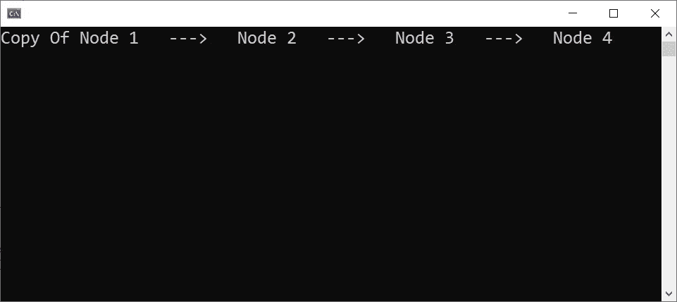

# 中的原型设计模式。NET C#

> 原文：<https://levelup.gitconnected.com/prototype-design-pattern-in-net-c-67db46c3d28f>

## 设计模式

## 中了解原型设计模式。NET C#

**原型设计模式。**照片由[菲尔·肖](https://unsplash.com/@phillshaw?utm_source=unsplash&utm_medium=referral&utm_content=creditCopyText)在 [Unsplash](https://unsplash.com/?utm_source=unsplash&utm_medium=referral&utm_content=creditCopyText) 拍摄，由[艾哈迈德·塔里克](https://medium.com/@eng_ahmed.tarek)调整

# 英语原型

在本文中，我们将讨论**中的**原型设计模式**。NET C#**

不过，我们先来探究一下**原型**这个词在英语中的意思。

根据[dictionary.cambridge.org](https://dictionary.cambridge.org/dictionary/english/prototype):

**原型定义来自**[**https://dictionary.cambridge.org/**](https://dictionary.cambridge.org/)，由[艾哈迈德·塔里克](https://medium.com/@eng_ahmed.tarek)调整

根据[merriam-webster.com](https://www.merriam-webster.com/dictionary/prototype):

**原型定义来自**[**https://www.merriam-webster.com/dictionary/prototype**](https://www.merriam-webster.com/dictionary/prototype)，由[艾哈迈德·塔雷克](https://medium.com/@eng_ahmed.tarek)调整

正如你所看到的，**原型制作**主要是创建一个要扩展的东西的副本。

 [## 🔥订阅艾哈迈德的时事通讯🔥

### 订阅艾哈迈德的时事通讯📰直接获得最佳实践、教程、提示、技巧和许多其他很酷的东西…

medium.com](https://medium.com/subscribe/@eng_ahmed.tarek) 

**原型设计模式定义**。由[瓦尔德马尔·布兰德](https://unsplash.com/@waldemarbrandt67w?utm_source=unsplash&utm_medium=referral&utm_content=creditCopyText)在 [Unsplash](https://unsplash.com/?utm_source=unsplash&utm_medium=referral&utm_content=creditCopyText) 上拍摄，由[艾哈迈德·塔雷克](https://medium.com/@eng_ahmed.tarek)调整

# 原型设计模式定义

原型设计模式是创造性的设计模式之一。它主要关心的是通过复制一个已经存在的对象来创建一个新的对象，而不丢失它的任何封装的内部细节，同时不依赖于类结构。

哇，一个很大的定义，对不对？让我为你简化它。

当您使用任何图表生成器软件工具时，您总是在寻找复制您已经添加的图表形状的功能。

使用此功能，您会得到以下结果:

1.  您可以复制图表形状。
2.  然后应用微小的变化，如改变颜色，而不必从头开始配置所有的形状属性。
3.  您从中复制的主形状的颜色不应受到您为复制形状设置的新颜色的影响。

你所期望的实际上就是**原型设计模式**的内容。您正在复制的图表形状实际上是从软件代码中定义的类创建的对象。

现在，要启用您正在寻找的功能并使其按您预期的那样工作，应该这样做:

1.  该软件应该能够复制**源**图形状对象。
2.  新的**副本**对象应该与**源**对象完全相同，但却是一个完全独立的对象，与**源**对象完全断开。
3.  改变**复制**对象的属性或设置不会对**源**对象产生任何影响。

就这些吗？其实没有。

正如你所知道的，在软件世界里，仅仅有一些工作是不够的。我们应该始终关注其他因素，如可读性、可维护性、可扩展性……以及其他一些目标。其中一个目标是确保我们的代码是松散耦合的，并且对其他模块或类的依赖性最小。

因此，**原型设计模式**关注的目标之一是确保我们可以实现复制一个对象，而实际上并不依赖于它的类定义。

现在，你可能会问:

> 这是不对的。实际上我的模块已经知道并依赖于这个对象类，否则，我的模块怎么会首先使用这个对象呢？！！

你说对了一部分。您的模块知道对象类向外部世界公开了什么，但这还不是全部。

定义这个对象的类可能有其他私有、内部或受保护的成员，而你的模块完全不知道这些成员。

基于这个事实，我们可以得出结论，您的模块实际上不能处理复制任务本身，因为它没有所需的所有信息。这里实际应该发生的是将复制任务委托给对象类本身，因为它完全了解其内部。

不服气？让我展示给你看。

**隐藏字段示例**。由 [Michael Dziedzic](https://unsplash.com/@lazycreekimages?utm_source=unsplash&utm_medium=referral&utm_content=creditCopyText) 在 [Unsplash](https://unsplash.com/?utm_source=unsplash&utm_medium=referral&utm_content=creditCopyText) 上拍摄，由 [Ahmed Tarek](https://medium.com/@eng_ahmed.tarek) 调整

# 隐藏字段示例

让我们假设我们有一个如下定义的`Person`类:

正如您所注意到的，除了用于评估`FullName`属性的私有`separator`字段之外，所有成员都是公共的。

现在，假设在某个模块中，我们有一个`Person`类的实例对象，我们想如下复制它:

如你所见，在我们试图复制对象的第 **4** 行，我们不知道为`separator`传递什么，因为我们无法访问已经为原始`ahmedTarek`对象设置的对象。

这意味着我们不能在我们的模块中处理这个复制任务。

**嵌套对象示例**。照片由 [X Y](https://unsplash.com/@sandworm?utm_source=unsplash&utm_medium=referral&utm_content=creditCopyText) 在 [Unsplash](https://unsplash.com/?utm_source=unsplash&utm_medium=referral&utm_content=creditCopyText) 上拍摄，由 [Ahmed Tarek](https://medium.com/@eng_ahmed.tarek) 调整

# 嵌套对象示例

假设我们有一个如下定义的`Node`类:

现在，让我们创建一系列嵌套节点，如下所示:

运行此命令应该会得到以下结果:

**原创系列**。图片由[艾哈迈德·塔里克](https://medium.com/@eng_ahmed.tarek)拍摄

现在我们想创建一个`node1`的副本。有人可能认为正确的做法如下:

但是实际上运行它会得到这样的结果:

**错误复制系列**。图片由[艾哈迈德·塔里克](https://medium.com/@eng_ahmed.tarek)拍摄

这是错误的，因为**节点 1** 的新副本引用的是**节点 2** ，而不是**节点 2** 的副本，依此类推…

为了解决这个问题，我们需要采用一种更复杂的方法。我们需要为每个节点创建一个副本，并让每个人都引用下一个副本。

接下来，我们应该这样做:

运行它，我们会得到以下结果:

**复抄系列**。图片来自[艾哈迈德·塔里克](https://medium.com/@eng_ahmed.tarek)

现在，它工作得很好，但我们可以注意到代码往往很复杂。

**原型设计模式来拯救**。由 [Yogi Purnama](https://unsplash.com/@yogipurnama?utm_source=unsplash&utm_medium=referral&utm_content=creditCopyText) 在 [Unsplash](https://unsplash.com/?utm_source=unsplash&utm_medium=referral&utm_content=creditCopyText) 上拍摄，由 [Ahmed Tarek](https://medium.com/@eng_ahmed.tarek) 调整

# 原型设计模式来拯救

正如我们现在所理解的，在一个单独的模块上复制一个对象要么是因为隐藏成员的存在而不可能，要么是可能但复杂的。**原型设计模式**提供了解决方案。

英寸 NET C#中，已经有了一个表示在`ICloneable`接口中的模式的实现。如果我们通过实现这个接口来扩展我们的类，我们将有一个`public object Clone()`方法来实现。

然而，这种方法已经存在，并得到了。NET 框架本身，我对它有些担心。但是，让我先向您介绍一下这种方法，然后我们可以讨论我的顾虑。

**使用不可克隆的**。图片由[艾哈迈德·塔里克](https://medium.com/@eng_ahmed.tarek)拍摄

# 使用 ICloneable

在这一节中，我们将使用带有**隐藏字段**和**嵌套对象**的`ICloneable`示例，看看它是否真的能工作。

## 对隐藏字段使用 ICloneable 示例

让我们回到我们的`Person`类例子。但是，这一次，它将如下执行`ICloneable`:

看，现在在第 **18** 行我们正在创建一个`Person`类的新实例，我们可以访问所有私有字段。这很容易。

现在，使用它很容易，如下所示:

运行它会得到这样的结果:

**使用 ICloneable** 的结果。图片由[艾哈迈德·塔里克](https://medium.com/@eng_ahmed.tarek)拍摄

看，这很有魅力。

## 将 ICloneable 与**嵌套对象**一起使用示例

让我们回到我们的`Node`类例子。然而，这一次，它将如下实现`ICloneable`:

看，现在在第 **28** 行我们正在创建一个`Node`类的新实例，我们也在使用`Next`节点的`Clone`方法来复制它。这很容易。

注意:这里的一个问题是，我们命名每个节点副本的方式是硬编码的，并且封装在`Node`类本身中。这是我们稍后会解决的问题，请继续关注。

现在，使用它很容易，如下所示:

运行它会得到这样的结果:

**使用 ICloneable** 的结果。图片由[艾哈迈德·塔里克](https://medium.com/@eng_ahmed.tarek)拍摄

看，这很有魅力。

我对克隆的担忧。照片由 [NeONBRAND](https://unsplash.com/@neonbrand?utm_source=unsplash&utm_medium=referral&utm_content=creditCopyText) 在 [Unsplash](https://unsplash.com/?utm_source=unsplash&utm_medium=referral&utm_content=creditCopyText) 上拍摄，由 [Ahmed Tarek](https://medium.com/@eng_ahmed.tarek) 调整

# 我对 ICloneable 的担忧

虽然使用`ICloneable`看似有效，但我相信它存在一些严重的问题。

## 不可变副本

`ICloneable`为我们提供了一个`public object Clone()`方法，我们可以用它来复制一个对象。但是，如果对象是不可变的呢？换句话说，如果在创建对象之后，甚至连对象的公共属性都无法设置，那该怎么办？

在这种情况下，我们通过调用`Clone`方法得到的对象不能被任何方式操作，这在大多数情况下是没有用的。让我们考虑一下。

当我们试图复制一个对象时，很可能我们这样做是因为我们需要一个现有对象的精确副本，然后对副本进行一些更新，对吗？现在，如果我告诉你，你得到的副本不能更新，在这种情况下，它是没有价值的。

使用`ICloneable`的唯一情况是，如果你只需要一个精确的副本，而不需要任何更新。

## 返回对象

正如您所注意到的，`ICloneable`为我们提供了一个返回`object`的`public object Clone()`方法，而不是`Person`或`Node`。这就是为什么我们需要将从`Clone`方法返回的`object`转换为`Person`或`Node`。

实际上，如果你只做几次，这没什么大不了的，但是如果你做的次数太多太频繁，那就有问题了。这将影响整体性能。

**另一条路**。照片由[沃尔坎·奥尔梅斯](https://unsplash.com/@volkanolmez?utm_source=unsplash&utm_medium=referral&utm_content=creditCopyText)在 [Unsplash](https://unsplash.com/?utm_source=unsplash&utm_medium=referral&utm_content=creditCopyText) 上拍摄，由[艾哈迈德·塔雷克](https://medium.com/@eng_ahmed.tarek)调整

# 相反

首先，让我强调一下，我认为复制一个对象很可能应该是一个特定于类的任务。这是因为每个类都会定义自己的成员，并且定义这些成员中哪些是不可变的，哪些不是。

话虽如此，现在让我们向您展示另一种处理复制对象的方法。

## 隐藏字段示例的更好解决方案

回到我们的`Person`类:

注意`FirstName`和`LastName`都是不可变的。

假设`Person`类允许自己被复制。在这种情况下，`Person`类应该定义一个`Clone`方法来返回当前`Person`对象的副本。然而，仅仅返回一个不可变的对象对调用者模块可能是无用的，因为它需要在复制的对象上应用一些更新。

为了实现这一点，我们可以这样做:

看到我们在这里做的了吗？我们添加了一个`Clone`方法，调用者有机会覆盖任何属性。那么，返回的对象仍然是不可变的。

另外，`Clone`方法现在返回一个`Person`，而不是一个`Object`。

此外，我们添加了一个更简单的无参数的`Clone`方法，它将返回一个精确的副本，没有任何覆盖。

现在，使用它的方式如下:

运行它会得到这样的结果:

**结果**。图片由[艾哈迈德·塔里克](https://medium.com/@eng_ahmed.tarek)拍摄

太棒了，工作起来很有魅力。

## 嵌套对象的更好解决方案示例

回到我们的`Node`类:

所以，按照和以前一样的概念，我们可以这样做:

因此，正如您在这里可以注意到的那样，`Clone`方法的调用者有不止一个选项；不管是否决还是不否决。

另外，现在设置复制的`Node`的名称的逻辑被委托给调用者，而不是`Node`类本身。

现在，运行它会得到这样的结果:

**结果**。图片由[艾哈迈德·塔里克](https://medium.com/@eng_ahmed.tarek)拍摄

很好，对吧？

**最终想法**。由 [Pietro Rampazzo](https://unsplash.com/@peterampazzo?utm_source=unsplash&utm_medium=referral&utm_content=creditCopyText) 在 [Unsplash](https://unsplash.com/?utm_source=unsplash&utm_medium=referral&utm_content=creditCopyText) 上拍摄，由 [Ahmed Tarek](https://medium.com/@eng_ahmed.tarek) 调整

# 最后的想法

在本文中，我们讨论了**中的**原型设计模式**。NET C#** 。我们展示了一些例子并对它们进行了分析。

这里要提到的是**原型设计模式**的一个常见用法是在**生成器设计模式**本身。如果你想了解更多，你可以阅读我的文章 [**构建器设计模式。NET C#**](/builder-design-pattern-in-net-c-bbf11c891548?sk=86d584e92a5f565c35e8a642543e9289) 。

有人可能会说，遵循本文提供的增强实现并没有提供任何不同系统模块可以依赖的抽象层。然而，我的回答是，我们仍然可以抽象出我们提供的不同的`Clone`方法。我这样做不是为了避免分心，但肯定是可以做到的。

现在你明白了**原型设计模式**是什么了。然而，这并不是故事的结尾。

您需要在互联网上搜索更多关于**原型设计模式**及其用法的文章和教程。这会帮助你更好地理解它。

最后，我希望你觉得读这个故事和我写它一样有趣。

# 希望这些内容对你有用。如果您想支持:

如果您还不是**中型**会员，您可以使用 [**我的推荐链接**](https://medium.com/@eng_ahmed.tarek/membership) ，这样我就可以从**中型**中获得您的一部分费用，您无需支付任何额外费用。订阅
[**我的简讯**](https://medium.com/subscribe/@eng_ahmed.tarek) 将最佳实践、教程、提示、技巧和许多其他很酷的东西直接发送到您的收件箱。

# 其他资源

这些是你可能会发现有用的其他资源。

 [## 递归的诅咒。NET C#

### 为什么以及如何在？NET C#

levelup.gitconnected.com](/curse-of-recursion-in-net-c-b017271ddbe6)  [## 将参数传递给. NET C#方法

### 向. NET C#方法传递参数的不同方式。

levelup.gitconnected.com](/passing-parameters-to-a-net-c-method-388badb7c095)  [## 保护公共方法免受不合逻辑的调用。NET C#

### 包含代码示例和解释的完整指南。

levelup.gitconnected.com](/protecting-public-methods-from-illogical-calls-in-net-c-91fcbb8bee33) 