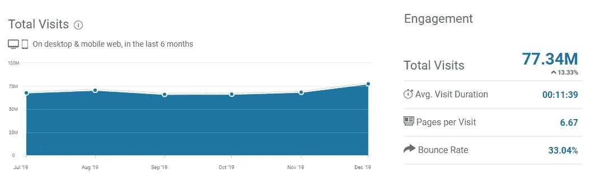

# 作为开发人员，获得额外收入的有效方法

> 原文：<https://levelup.gitconnected.com/proven-ways-to-make-extra-money-as-a-developer-1e06167831bb>

## 用你的技能创造一份有价值的副业收入

阿尔瓦罗·雷耶斯在 [Unsplash](https://unsplash.com/s/photos/job?utm_source=unsplash&utm_medium=referral&utm_content=creditCopyText) 上拍摄的照片

> 如果你想了解更多关于技术的知识，请订阅我全新的 YouTube 频道，在那里我会用一种简洁明了的方式解释复杂的话题，帮助你提高技能！→【https://www.youtube.com/@litwire 

做程序员是一件很棒的事情。不仅大部分时间工作很有趣，而且周围有大量的工作机会，而且大部分薪水都很高。

但是有时候，额外的一点钱是很受欢迎的。无论是因为你还在学院或大学，你想开始为自己工作，而不是为别人工作，你有一个孩子，想花更多的时间和他们在一起，你仍然需要赚一些钱，或者你只是为了好玩才这样做。

好消息是:作为一名程序员，你拥有增加现金流所需的一切。你的大脑，你的笔记本电脑——这才是你真正需要的。感兴趣吗？看看下面的策略，决定什么最适合你。

# 开始自由职业

照片由[布鲁克·卡吉尔](https://unsplash.com/@brookecagle?utm_source=medium&utm_medium=referral)在 [Unsplash](https://unsplash.com?utm_source=medium&utm_medium=referral) 拍摄

自由职业可以是一件伟大的事情。没有(真正的)老板，大量的项目可供选择，专家每天的高额费用，你想要多少假期就有多少假期……不胜枚举。

然而，寻找客户和项目需要很多训练和努力。对我来说，最大的好处是你可以在固定工作之外开始自由职业，无论是在晚上还是周末。

像 [Upwork](https://www.upwork.com/) 或 [Fiverr](https://www.fiverr.com/) 这样的平台似乎提供了许多机会，尤其是在场外做事，但要注意那边的竞争。

此外，利率相当低，所以我只建议如果你只是想第一次尝试一下，或者只满足于一点点额外收入的话。

一个更好的策略是在你的 LinkedIn 个人资料上多下功夫，从你的社交网络中联系招聘人员和过去的客户，参加会议和聚会，寻找为远程员工和公司牵线搭桥的平台。

# 参加编码竞赛

照片由[肖恩·多](https://unsplash.com/@everywheresean?utm_source=medium&utm_medium=referral)在 [Unsplash](https://unsplash.com?utm_source=medium&utm_medium=referral) 上拍摄

没错，这是真事。有专门的平台组织真正的奖金编程比赛。

其中最大的是 [Topcoder，](https://www.topcoder.com/)拥有超过一百万的会员和众多的比赛。他们有三个主要关注领域:设计、数据科学和开发。

你可以参与由 2000 多家公司发起的真实项目，或者与对手进行单场比赛。乐趣是有保证的，快速的学习曲线也是如此。

如果你喜欢挑战，这可能是适合你的。然而，竞争是存在的，你不能指望稳定的收入流，所以把这个放在次要位置。

# 开始写

照片由[凯特琳·贝克](https://unsplash.com/@kaitlynbaker?utm_source=medium&utm_medium=referral)在 [Unsplash](https://unsplash.com?utm_source=medium&utm_medium=referral) 上拍摄

在我看来，写作仍然是接触广大读者的最佳方式之一。你有很多机会开始写作并从中赚钱:

*   你可以开你的博客，用广告收入赚钱。
*   你可以写书或电子书，并在网上出售。
*   你可以在 Medium 这样的平台上写作，参与他们的合作项目。
*   你可以为 CSS-Tricks 这样的网站写客座博文，如果你的文章被接受，这些网站会付给你一笔固定的费用。

尝试一些东西，看看人们对你的作品有什么反应，这并没有错。

然而，你应该考虑的一些事情是选择一个你特别感兴趣的领域(让你有动力)，坚持不懈地写作(获得认可需要时间)，并不断提高你的写作技能以发表高质量的文章(人们会感谢你，外面有太多低质量的东西了…).

# 录制和销售在线课程

[Avel Chuklanov](https://unsplash.com/@chuklanov?utm_source=medium&utm_medium=referral) 在 [Unsplash](https://unsplash.com?utm_source=medium&utm_medium=referral) 上拍摄的照片

在我看来，能够在网上教人是过去十年中出现的最好的事情之一，并且至少还会存在十年，如果不是更长的话。

学生和老师都受益匪浅。学生可以从各种课程中进行选择，并按照自己的时间表进行学习。教师通过他们的内容接触到 1000 或 100，000 人。

如果你有编程经验，最好是 JavaScript 或 Python(或任何其他流行语言或框架)等语言的专业知识，甚至是利基渗透测试，并且你可以享受教授他人的乐趣，那么创建在线课程可能是你的事情。

有很多平台可以发布你的课程。例如，Udemy 每月大约有 7500 万访客，任何人都可以加入他们。

Udemy 流量概述

其他平台，如[前端大师](https://frontendmasters.com/)或 [Pluralsight](https://www.pluralsight.com/) 都是受邀才能参加的，但如果你有声誉或良好的关系网——为什么不呢？

但是，在录制课程时，有一些事情需要考虑:

*   购买好的设备:好的麦克风和网络摄像头是必须的！
*   优质内容才是王道。竞争在稳步增加，所以你需要让人们相信你可以教给他们有价值的东西。
*   练习大声清晰地说话。
*   总是重做你的录音。
*   创建其他材料，如 GitHub 项目、演示文稿、编码示例等

即使它看起来很吸引人，一旦一门课程被录制，人们开始购买它，它将为你创造被动收入，这只是在某种程度上是真的。最好的老师不断更新他们的课程，因为技术一直在变化！

# 开始播客

乔纳森·法伯在 [Unsplash](https://unsplash.com?utm_source=medium&utm_medium=referral) 上的照片

许多人不喜欢在摄像机前，但仍然是某个领域的专家，并愿意与他人分享他们的知识。

播客无疑是一个很好的媒介。虽然它们已经存在了一段时间，但在过去的四到五年里，它们变得越来越受欢迎，吸引了数百万每天通勤上班或睡前听它们的人。

现在大部分播客都是免费听的，所以钱更多的是副作用。许多播客都有赞助商为他们的剧集提供服务或金钱。许多播客都在 Patreon 平台上，在这个平台上，人们可以按月付费来支持他们的工作并解锁独家内容。

但是要想在播客上取得成功，你应该能够很好地表达自己，投资一些好的设备(麦克风)，最重要的是，有持续录制剧集的耐力。

人们在真正看到听众方面的进步之前，不得不创作一两年的每周剧集，这并不罕见。

所以，如果在做这件事之前，你真的对这件事充满热情，那就好了。

# 结论

我想告诉您的最后一件事与上述每个选项都相关:

一致性才是王道。

无论你开始做什么，都要追求它，并坚持下去。大多数事情不会一蹴而就。这是一项艰苦的工作，你必须投入时间和精力。99%过早放弃。成为成功的 1%之一！