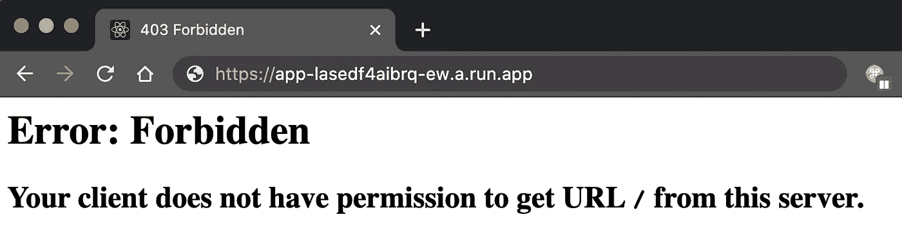
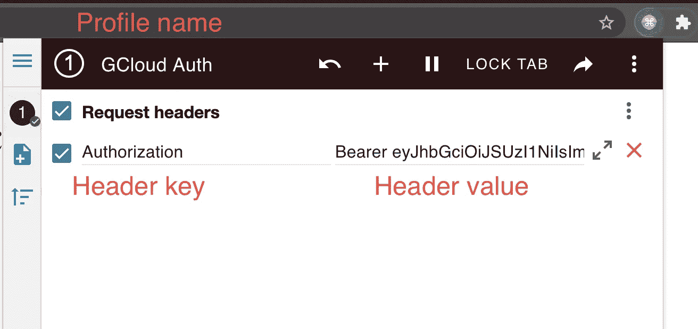
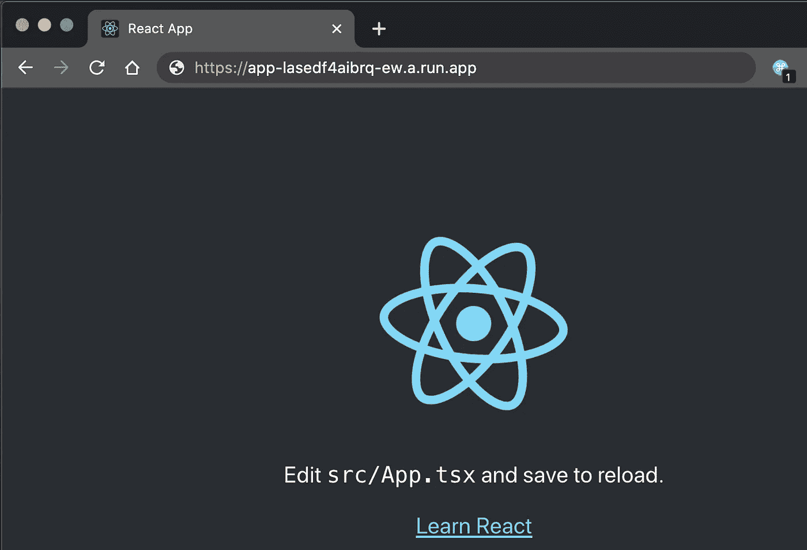
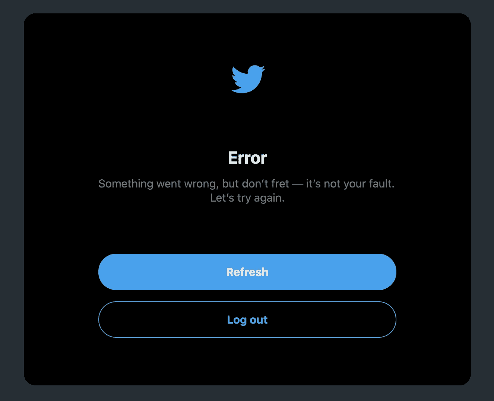
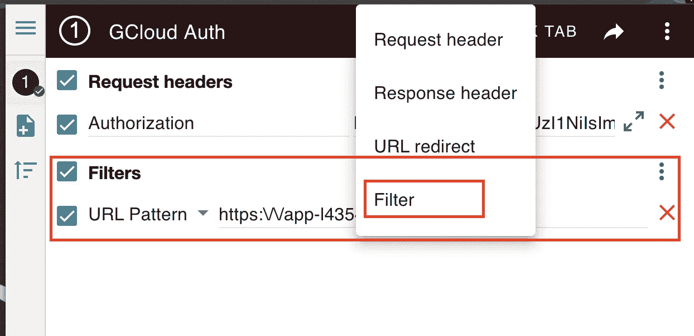

# 让开发者访问你在 GCP 上的云运行服务

> 原文：<https://levelup.gitconnected.com/providing-developer-access-to-hosted-cloud-run-service-on-gcp-61f1f5194de3>

保护您的云运行服务不被公开，但允许经过身份验证的开发人员/用户访问它们。

由[马库斯·斯皮斯克](https://unsplash.com/@markusspiske)在 [Unsplash](https://www.unsplash.com) 拍摄的照片

# 问题

当创建云运行服务时，可以设置“未经认证”的访问权限(因此它对公共互联网可用)或限制访问权限。在大多数用例中，由于安全原因，访问应该受到限制，尤其是对于后端服务。但是你也可以在 Cloud Run 上托管你的前端，这里需要公共访问，所以每个人都可以使用你的应用。

在我的另一篇文章中——[使用 Cloud Run 轻松实现 React 应用的无服务器部署](/easy-serverless-deployment-of-your-react-app-using-cloud-run-c26aa79af491)——你可以看到一个在 Cloud Run 上托管 React 应用的例子。

 [## 使用云运行轻松实现 React 应用的无服务器部署

### 使用 GCP 云运行将 React 应用作为 Docker 容器部署在无服务器环境中，并使其可访问…

levelup.gitconnected.com](/easy-serverless-deployment-of-your-react-app-using-cloud-run-c26aa79af491) 

而且对于您的前端服务，您可能不希望公众访问它。例如，您不希望公众访问您的开发或登台环境，所以您应该保护它们。而且对于内部工具来说，在使用任何应用程序代码进行身份验证之前保护它们是非常有用的。

因此，让我们来解决这个问题，只为某些用户提供访问应用程序的权限！

# 先决条件

需要一个正在运行的云运行服务，它服务于一些应该受到保护的前端。

如果您还没有，请按照[使用云运行轻松无服务器部署 React 应用](/easy-serverless-deployment-of-your-react-app-using-cloud-run-c26aa79af491)中的教程安装并运行一个。只要确保不使用`--allow-unauthenticated`而是使用`--no-allow-unauthenticated`来[阻止公众访问你的服务](https://cloud.google.com/sdk/gcloud/reference/run/deploy#--[no-]allow-unauthenticated)！

# 解决方案

当你的服务启动并运行时，你可以尝试通过你的浏览器访问它，如果一切正常，浏览器会显示一些`403 Forbidden`。但这是有意的，也是我们想要实现的，以防止未经授权的访问。

现在，让我们添加一些对该服务的访问。为了让一个特定的用户通过他的电子邮件访问这个服务(`roles/run.invoker`)，我们可以使用`gcloud run services add-iam-policy-binding`命令。

添加用户后，下一步是以特定用户的身份登录，并通过 CLI 生成一些用于授权的承载令牌。

既然令牌已经生成，下一步就是将这个令牌添加到对前端服务的请求中。为此，有一个很棒的 Chrome 插件叫做“ModHeader”，可以添加到 Chrome 中。

 [## ModHeader

### 修改 HTTP 请求和响应头

chrome.google.com](https://chrome.google.com/webstore/detail/modheader/idgpnmonknjnojddfkpgkljpfnnfcklj) 

添加插件后，我们需要添加一个请求头，这个请求头会自动添加到请求中，以通过服务进行身份验证。这里我们需要添加来自`gcloud auth print-identity-token`命令的`Authorization`头和令牌，前缀为`Bearer` 。

当 header +键被设置时，可以点击“播放”按钮来激活具有请求报头覆盖的简档。如果现在通过浏览器再次调用服务，那么 React 应用程序将得到服务，因为请求现在被授权为具有服务调用权限的用户。

很漂亮，对吧？😉

# 添加过滤器选项

如果插件中只定义了`Authorization`头，那么它会附加到浏览器中的所有请求上。这将会把你当前登录的所有其他网站搞得一团糟。以 Twitter 为例，它会突然开始抛出错误消息，因为现在发送到 Twitter 的`Authorization`头与它们的授权不匹配。

由于错误授权导致的 Twitter 错误

但幸运的是，有一个解决方案。使用 ModHeader 插件，你可以定义一个过滤器，使用一些 URL 模式来匹配你想要授权的前端服务的 URL。因此，只有当 URL 模式匹配时，标题才会被覆盖。

如果您在您的前端服务网站上添加此过滤器，它将自动获取正确的 URL 并将其填入值字段。

# 结论

我希望我可以向您展示如何轻松访问安全的云运行服务，并激励您保护您的服务免受未经授权的访问。

感谢您花时间阅读我的文章。

## 你想联系吗？

如果你想联系我，请在 LinkedIn 上打电话给我。

另外，请随意查看[我的书籍推荐](https://medium.com/@mr-pascal/my-book-recommendations-4b9f73bf961b)📚。

 [## 我的书籍推荐

### 在接下来的章节中，你可以找到我对所有日常生活话题的书籍推荐，它们对我帮助很大。

mr-pascal.medium.com](https://mr-pascal.medium.com/my-book-recommendations-4b9f73bf961b)  [## 通过我的推荐链接加入 Medium—Pascal Zwikirsch

### 作为一个媒体会员，你的会员费的一部分会给你阅读的作家，你可以完全接触到每一个故事…

mr-pascal.medium.com](https://mr-pascal.medium.com/membership)