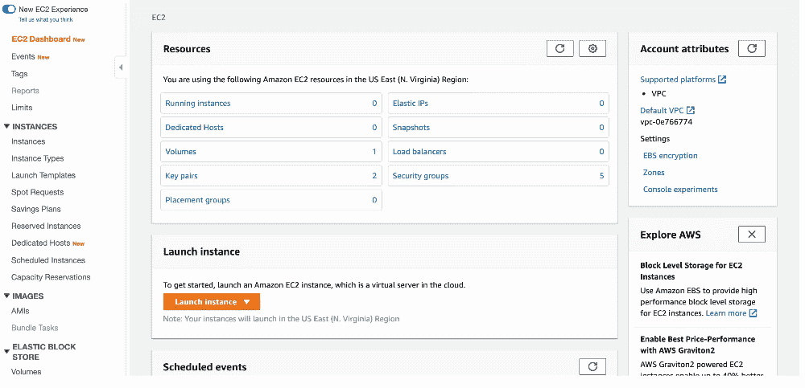
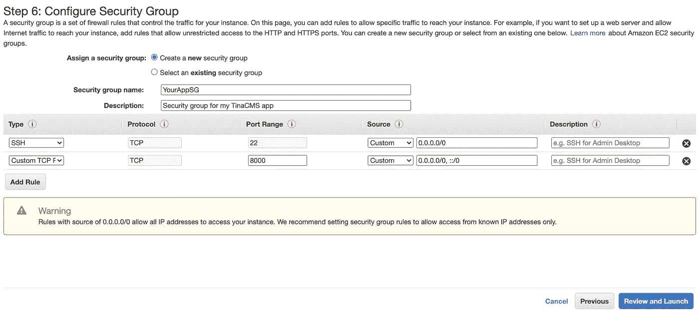
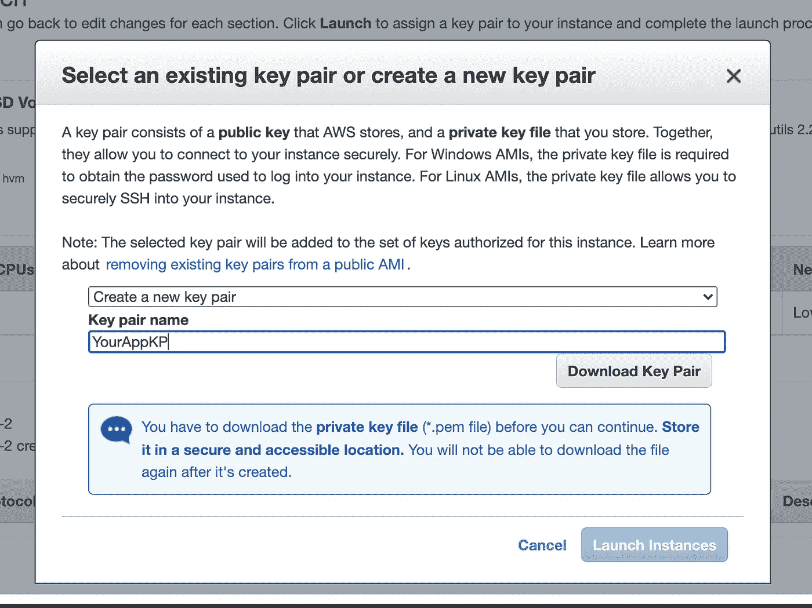
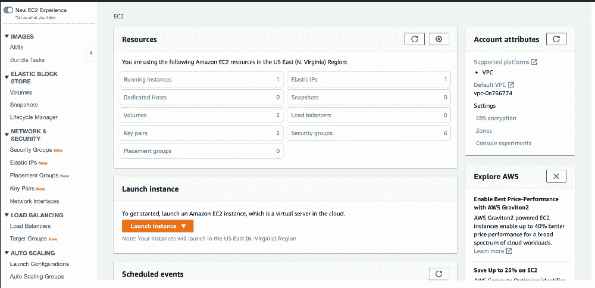
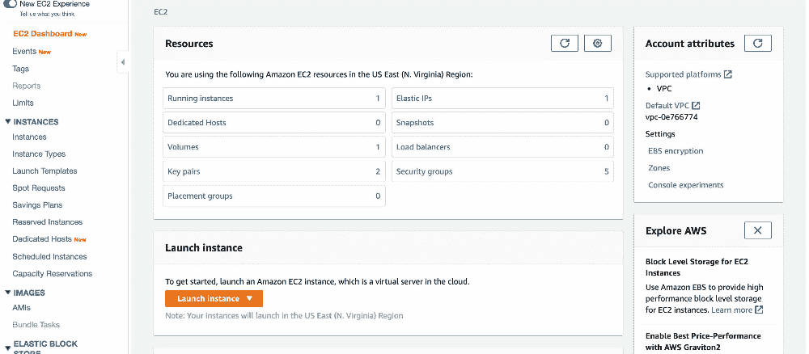
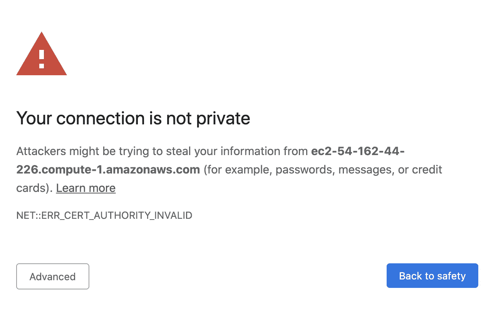
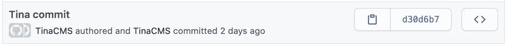

# 在 AWS 上供应、设置和保护 TinaCMS 云编辑器

> 原文：<https://levelup.gitconnected.com/provision-setup-and-secure-a-tinacms-cloud-editor-on-aws-e96b0e060e7c>


在 [Unsplash](https://unsplash.com?utm_source=medium&utm_medium=referral) 上由 [Paz Arando](https://unsplash.com/@pazarando?utm_source=medium&utm_medium=referral) 拍照

我最近第一次与 TinaCMS 和 Gatsby 一起建立了一个网站，我发现开发过程相对顺利。我发现的一个明显的开发人员体验差距是在设置云编辑器方面，这也是我想在本教程中分享的。由于云编辑器脱离了开发构建，所以我不会在本教程中讨论 TinaCMS 生产构建和部署。如果你好奇的话，我使用了一个带有 GitHub actions 的 CD 过程来构建和部署新的静态资产到 S3(带有 CloudFront 和静态 web 托管),在生产过程中对我的项目的主分支进行新的提交。

在我们开始之前，我想解释一下，为了允许使用 Gatsby 对 TinaCMS 进行实时云编辑，您目前需要运行项目的两个独立实例；一个作为私有云编辑器，另一个作为您的生产网站。我相信一旦 TinaCMS 发布他们的“TinaCMS Teams”产品，这种情况可能会改变，但目前的推荐似乎是盖茨比云(【https://tinacms.org/blog/using-tinacms-on-gatsby-cloud】T4)，我发现由于他们的分支和“预览”限制，我的客户几乎无法使用。

本教程将指导您使用 Gatsby 和 AWS 设置、供应和保护 TinaCMS 云编辑器。希望它能为你节省时间和金钱:-)。

*我会在本教程中定期链接提交，但这里是最终的*[*Tina CMS-cloud-editor-tutorial*](https://github.com/Integral-Stack/tinacms-cloud-editor-tutorial)*repo。*

# 概观

*   [设置 TinaCMS 项目](#dd20)
*   [为 TinaCMS 云编辑配置 Gatsby](#dbcd)
*   [给盖茨比添加认证](#fec7)
*   [安全机密](#0c5f)
*   [设置 AWS 资源](#000c)
*   [提供 EC2 实例](#00c0)
*   [运行你的云编辑器](#7a86)
*   我们该如何改进？

## 设置 TinaCMS 项目

*在我们开始之前，请确保您的计算机上已经安装了 node、npm 和 yarn。*

让我们从克隆规范的 gatsby-starter-tinacms 开始，安装依赖项并在本地运行项目以确保它按预期工作。如果您已经有了 TinaCMS/Gatsby 项目设置，那么您可以按照自己的项目进行操作。

```
git clone [https://github.com/tinacms/gatsby-starter-tinacms.git](https://github.com/tinacms/gatsby-starter-tinacms.git)
cd gatsby-starter-tinacms
yarn install
yarn start
```

如果一切按预期运行，继续在 GitHub 上创建一个新的 repo，将您的 origin remote 设置为新创建的 repo，并推送您的代码。确保用您自己的 url 替换远程 URL。

```
git remote set-url origin [git@github.com](mailto:git@github.com):user/project.git
git push origin master
```

## 为 TinaCMS 云编辑配置 Gatsby

如果你导航到你的`gatsby-config.js`文件，你会看到 TinaCMS 通过一个插件被激活。

```
{
  resolve: "gatsby-plugin-tinacms",
  options: {
    plugins: ["gatsby-tinacms-git", "gatsby-tinacms-remark", "gatsby-tinacms-json"],
    sidebar: {
      hidden: process.env.NODE_ENV === "production",
      position: "displace"
    },
  },
},
```

`gatsby-tinacms-git`的子插件将允许我们的编辑器在更新时与我们的 git repo 对话，所以如果你从你自己的项目开始跟进，确保你安装并添加了这个插件。此外，请注意在为生产构建应用程序时隐藏编辑器“侧边栏”的配置。这与我们想要实现的目标一致。

为了通知我们的云编辑器它需要在哪里推送内容更新，让我们用更详细的配置替换`gatsby-tinacms-git`插件的声明。确保用 git 远程 repo 的 SSH 地址替换`gitRemote`值。您可以随意用您喜欢的任何内容替换提交信息。

```
{
  resolve: "gatsby-plugin-tinacms",
  options: {
    plugins: [{
      resolve: "gatsby-tinacms-git",
      options: {
        gitRemote: "[git@github.com](mailto:git@github.com):user/project.git",
        defaultCommitMessage: 'Edited with TinaCMS',
        defaultCommitName: 'Cloud Editor',
        defaultCommitEmail: 'git@project.com',
      },
    }, "gatsby-tinacms-remark", "gatsby-tinacms-json"],
    sidebar: {
      hidden: process.env.NODE_ENV === "production",
      position: "displace"
    },
  },
},
```

您的本地 TinaCMS 编辑器现在应该已经连接到您在 GitHub 上的项目了。继续前进，导航到`http://localhost:8000`的博客，点击浏览器左下方的蓝色铅笔，做一些文本修改，然后点击“保存”。

您刚刚创建了一个从 TinaCMS 编辑器推送到 GitHub 的 commit！在 GitHub 中导航到您的项目，并确认提交被推送到您的分支。

对应提交:[https://github . com/Integral-Stack/Tina CMS-cloud-editor-tutorial/commit/349d 5093 e 55 b 38d 7 db 6 c 92 ab 9 e 2 aee 48 cc 969 e5d](https://github.com/Integral-Stack/tinacms-cloud-editor-tutorial/commit/349d5093e55b38d7db6c92ab9e2aee48cc969e5d)

## 向 Gatsby 添加身份验证

我们即将向互联网公开 CMS，我们需要一种方法来限制它的访问，只有网站的可信编辑。

我们可以尝试通过 AWS 中的 IP 白名单或地理定位来限制访问，但这两种方法都不能给我们提供通过凭证认证获得的细粒度和方便的控制。

[基本认证](https://en.wikipedia.org/wiki/Basic_access_authentication)并不是限制访问我们编辑器的最安全的方法，但它是目前最快的方法，对于我们的情况来说已经足够了。

为了最大限度地提高基本身份验证的安全性，请确保您的密码具有较高的基数和长度。我们还将启用`https`，这是必要的，因为基本 Auth 在通过网络发送之前只进行 base64 编码。最后，我们将从 master 以外的分支运行我们的编辑器。这样，如果我们的云编辑器碰巧遭到黑客攻击，攻击者最多能做的就是向一个甚至没有部署到生产中的分支添加一些新的提交。

让我们从安装`[express-basic-auth](https://github.com/LionC/express-basic-auth)`包开始。

```
yarn add express-basic-auth
```

幸运的是，Gatsby 给了我们一个[钩子来连接我们的 Express app 实例](https://www.gatsbyjs.org/docs/gatsby-config/#advanced-proxying-with-developmiddleware)，这将使安装基本 auth 变得轻而易举。只需将以下内容添加到您的`gatsyb-config.js`文件中:

```
const basicAuth = require("express-basic-auth")

module.exports = {
  siteMetadata: {
  ...
  },
  developMiddleware: app => {
    app.use(basicAuth({
      users: { test: 'test' },
      challenge: true,
      realm: 'your app name', 
    }))
  },
  ...
}
```

这将为应用程序的所有传入请求添加基本身份验证。显然，我们最终将添加一个用户名/密码，但是我们将使用“test”作为用户名和密码进行测试。您需要设置挑战和领域属性，以便用户浏览器知道在他们试图访问网站时提示他们输入用户名/密码。

现在重启进程并尝试访问`[http://localhost:8000](http://localhost:8000)`。您应该会看到一个用户名/密码对话框。如果您正确输入了凭据，您应该能够访问该站点。

对应提交:[https://github . com/Integral-Stack/Tina CMS-cloud-editor-tutorial/commit/5de 19 CD 413 e 38 e 484610 ba 5623 a 83155 c 81 af 7 fa](https://github.com/Integral-Stack/tinacms-cloud-editor-tutorial/commit/5de19cd413e38e484610ba5623a83155c81af7fa)

## 保密

既然我们开始探索将敏感数据添加到我们的应用程序中，我们需要确保我们不会将这些秘密暴露给公众。事实上，“敏感数据泄露”是 OWASP [#3](https://owasp.org/www-project-top-ten/) 应用程序的安全风险。我们将以最简单的方式来实现这一点，为 Node 集成 [dotenv](https://github.com/motdotla/dotenv) ，并在运行时注入我们的敏感数据。

我们不需要安装`dotenv`，因为它已经和 Gatsby 打包在一起了。然而，我们需要在`gatsby-config.js`的顶部添加一条 require 语句，以便正确加载我们的文件:

```
require("dotenv").config({ path: ".env.cloud" })
const basicAuth = require("express-basic-auth")

...
modules.exports = {
```

我特意给 dotenv 起了个名字，不会和我们常规的 dotenv 设置冲突。不要担心，如果文件不存在，`dotenv`不会因为它不存在而抛出任何错误。现在让我们在项目的根目录下创建我们的`.env.cloud`文件。

我们现在希望将它添加到我们的`.gitignore`文件中，这样它就不会被提交到我们的回购协议中:

```
# Live Github updates
.env.cloud
```

在我们的`.env.cloud`文件中，我们将添加几个变量。确保正确填写值，尤其是强用户名和密码:

```
AUTH_USER=*********
AUTH_PW=***************
ENABLE_AUTH=true
TINA_GIT_DEBOUNCE_MS=3000
```

我已经将 Tina Git 去抖增加到 3000 毫秒，因为我注意到了云编辑器上的 GraphQL 问题，当它保留默认值 1000 毫秒时。

与认证相关的环境变量将允许我们切换和安全地使用我们的基本认证。它需要对您在`gatsby-config.js`的中间件进行以下更新:

```
developMiddleware: app => {
  if (process.env.ENABLE_AUTH) {
    app.use(
      basicAuth({
        users: { [process.env.AUTH_USER]: process.env.AUTH_PW },
        challenge: true,
        realm: "your app name",
      })
    )
  }
},
```

重新启动应用程序，并确保您的新用户名和密码凭证正常工作。一旦确认，确保你提交并推送所有的新代码到 GitHub。

对应提交:[https://github . com/Integral-Stack/Tina CMS-cloud-editor-tutorial/commit/d 33 eef 357 af 4569 F9 e 232699 FCA 794604403 A0 DC](https://github.com/Integral-Stack/tinacms-cloud-editor-tutorial/commit/d33eef357af4569f9e232699fca794604403a0dc)

## 设置 AWS 资源

恭喜你，你已经完成了教程的 DevOps 部分。我们现在将把我们的编辑器转移到云中。

如果你是 AWS 新手，你可能想做一些其他教程来熟悉它，至少学会保护你的帐户。如果您已经有 AWS 帐户，请登录。我们将从配置 EC2 实例开始。

登录 AWS 帐户后，导航到 EC2 dashboard 并“启动”一个实例。我们将选择默认的" **Amazon Linux 2 AMI (HVM)，SSD 卷类型"**上的" **t2.micro** "实例类型。如果您符合免费层资格，则此选择符合免费资格，否则此配置的按需定价非常便宜。如果您想节省更多的钱，您可以考虑运行现场或保留实例。云编辑器基本上只需要处理几个编辑器的流量。



EC2 仪表板->选择 AMI ->配置实例

在“**配置**”页面上，我们可以保留所有默认设置

在“**添加存储**”页面上，我们将使用默认的 EBS 存储。

在“ **Add Tags** ”页面上，我们将添加一个键值对`Name` : `YourAppName`，这样更容易跟踪。

在“ **Security Groups** ”页面上，我们希望为云编辑器创建一个新的安全组，以便通过 SSH(端口 22)进行访问，并创建一个自定义 TCP 规则，以便在端口 8000 上显示编辑器。然后，按照提示启动实例。



在启动实例之前，会有一个模式提示您为新实例选择或创建一个密钥对。继续创建一个新对，适当地命名它，下载它，并启动您的实例。



在我们开始提供实例之前，我建议您设置一个弹性 IP 并将其附加到新运行的实例上。弹性 IP 是免费的，只要它们被附加到一个实例。这将维护一个默认的 DNS 和 IP，这样如果我们停止和启动实例，IP 和 DNS 就不会被释放。



弹性 IP

## 设置 EC2 实例

现在您已经下载了您的 PEM 密钥，让我们准备好通过 SSH 连接到我们的实例。我们会将 pem 密钥从下载文件夹移到`.ssh`文件夹。然后，我们将使用`chmod`命令保护我们的 pem 密钥，只允许`user, read`访问。

```
mv ~/Downloads/YourAppKP.pem ~/.ssh
chmod 400 ~/.ssh/YourAppKP.pem
```

为了通过 SSH 连接，我们需要运行实例的 IPv4 公共 IP。回到您的浏览器，访问实例页面，并单击您的实例以查看其详细信息。公共 IP 应该可以从“描述”选项卡中获得。



我的公开 IP 是`3.224.202.92`。确保在下面的命令中用您自己的 IP 替换它。

```
ssh -i ~/.aws/YourAppKP.pem  ec2-user@3.224.202.92
```

运行这个命令后，您应该通过 SSH 连接到 EC2 实例。让我们通过安装必要的依赖项来准备好实例。

```
sudo yum update -y
sudo yum install git -y
curl -o- [https://raw.githubusercontent.com/nvm-sh/nvm/v0.34.0/install.sh](https://raw.githubusercontent.com/nvm-sh/nvm/v0.34.0/install.sh) | bash
. ~/.nvm/nvm.sh
nvm install v12
npm install -g yarn
```

如果一切顺利，现在您将拥有 git，node 12。*、npm 和 yarn 安装在您的实例上。我们需要做的下一件事是允许我们的实例通过我们将在实例上生成的密钥对与 GitHub 通信。用您自己的电子邮件替换下面的命令，并遵循默认提示。

```
ssh-keygen -t rsa -b 4096 -C "your_email@example.com"
```

我们现在需要将新创建的公钥移动到我们用来设置回购的帐户的 GitHub 设置中。运行以下命令并复制公钥的输出。

```
cat ~/.ssh/id_rsa.pub
```

登录 GitHub，导航到**设置**->-SSH 和 GPG 键，然后点击“**新建 SSH 键**”按钮。给密钥起一个标题，粘贴你的公钥，然后保存。

您的实例现在应该能够从您的 GitHub repo 进行推和拉。回到 EC2 命令行，将项目克隆到实例上。用您自己的名称替换项目名称。

```
git clone [git@github.com](mailto:git@github.com):Integral-Stack/tinacms-cloud-editor-tutorial.git
```

## 运行您的云编辑器

从我们的 SSH 命令行，让我们`cd`进入项目，并安装我们的 npm 依赖项

```
cd tinacms-cloud-editor-tutorial
yarn install
```

现在继续使用 vim 或 nano 创建一个名为`.env.cloud`的文件，并将您的环境变量从本地`.env.cloud`文件复制并粘贴到这个新文件中。完成后，您可以在本地将`.env.cloud`从回购中删除。我们只在云编辑器中需要它。

在运行云编辑器之前，我们还想通过从一个分支而不是从`master`运行来增加安全性。这意味着通过云编辑器对我们的网站所做的更改将被提交到 GitHub 的这个新分支上。如果你从`master`进行生产构建，这将保护某人在你的云编辑器凭证被泄露时免受任何损害。请记住，使用这种策略，您将需要定期制作一个 PR，将内容更新到 master 中，并将它们部署到生产环境中。我将使用一个名为`cloud-editor`的分支，但是您可以随意使用。

```
git checkout -b cloud-editor
```

我们现在准备运行我们的云编辑器。我们将需要使用主机`0.0.0.0` (INADDR_ANY)而不是 localhost 来运行该应用程序，以便通过我们之前设置的安全组向公众公开该应用程序。我们还需要运行与 SSH 会话分离的流程，这样它就可以在后台运行。

基于这两个原因，我们根本不能只运行`yarn start`。在继续之前，让我们测试一下将要使用的服务器启动命令。

```
yarn develop -H 0.0.0.0 -S
```

如果您收到以下错误，您将需要创建一个`ca-certificates`目录。

```
cp: cannot create regular file ‘/usr/local/share/ca-certificates/devcert.cer’: No such file or directory
```

运行以下命令创建该目录:

```
# Run this command to fix the error
sudo mkdir /usr/local/share/ca-certificates
```

一旦您确认您的开发服务器可以在云中运行，我们将希望在分离模式下运行我们的命令。为了做到这一点，我们将利用`nohup`。

```
nohup yarn develop -H 0.0.0.0 -S &
```

我们将看不到命令的输出，但是我们可以通过访问活动站点来检查 Gatsby dev 服务器是否已经启动并正在运行。为此，请导航回 AWS EC2 控制台，从“描述”选项卡中复制您的“公共 DNS (IPv4)”地址，将其粘贴到您的浏览器中。确保在 url 的开头添加`https://`，并在回车前在末尾添加端口`:8000`。我的网址是这样的:

```
https://ec2–3–224–202–92.compute-1.amazonaws.com:8000
```

由于我们使用的是自签名 SSL 证书，您应该进入以下页面，在这里您需要点击“**高级**”->”**前进到……**”以访问该网站。此消息只会提示您一次。



如果你的云编辑器加载了，恭喜你！应该首先提示您输入用户名和密码，然后您就可以编辑您的网页了。您需要检查的第二件事是 TinaCMS " **Save** "功能。这个操作应该会生成一个新的 commit，并将其从 EC2 实例推送到 GitHub。保存一些编辑后，进入 GitHub，确保提交显示在当前运行的分支上。



本教程到此结束。请在下面评论或提问。

## 如何才能提高？

作为代码的基础设施。

理论上，服务器应该通过代码来提供。这意味着利用带有 node 的 Linux docker 映像，并通过 docker 文件安装 yarn 和 git。此外，您会希望在运行时将所有的秘密注入到容器中。

如果您想走 AWS 路线，这可能包括利用 ECS 进行容器管理，并从参数存储或秘密管理器注入您的秘密。这些秘密需要在 ECS 任务定义中定义，以便在运行时注入。在此设置中，您将能够通过 Docker 将端口映射到主机目标 8000，并在端口 80 上公开应用程序。容器将位于应用程序负载平衡器之后，这将允许您在 Route53 中设置 DNS 以指向 ALB，并且您可以通过使用证书管理器设置 SSL 证书来轻松添加 https。

而且，如果您想更进一步，您可以通过 CloudFormation 模板进行设置，以便通过代码提供 AWS 资源。

太多了！如果有人决定这样做，请让我知道，因为我想使用代码。