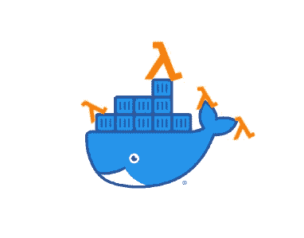

# 使用 AWS CDK (Python)提供 Lambda Docker 图像

> 原文：<https://levelup.gitconnected.com/provisioning-lambda-docker-images-with-aws-cdk-python-a10bffd20613>



Dockerized Lambda 函数

这是两篇文章的第一部分。在这一部分中，我将介绍如何提供 lambda docker 映像，在下一部分中，我将介绍如何与之交互。

涵盖:

*   在 CDK 申报拉姆达码头形象
*   将本地模块导入主 docker 脚本
*   编写 Dockerfile 文件
*   读取/写入 Docker 映像文件系统
*   本地测试

# 先决条件

*   [Docker](https://docs.docker.com/get-docker/) 安装在本地机器上
*   AWS CDK 安装和设置正确

以前与 Docker 的经验将是有益的，尽管我设法弄清楚这一点，这是我第一次与 Docker 打交道，所以你应该没事。

## 目录结构

```
cdk-project
|-- lambdas/
    |-- docker_func/
        |-- app/
            |-- __init__.py
            |-- components/
                |-- __init__.py
                |-- com1.py
                |-- com2.py
            |-- utils/
                |-- __init__.py
                |-- ut1.py
            |-- main.py
            |-- output.json # Optional
        |-- Dockerfile
        |-- README.md
        |-- requirements.txt
|-- project/
   |-- project_stack.py
```

# 过程

基于上述项目结构的逐步过程。我将在这些步骤中使用的文件名与上述目录结构中的文件直接相关。

注意:从你的 CDK 项目的根目录开始`../#/cdk-project>`

1.  使用 CDK 声明 docker

```
# ../project/project_stack.pydocker_lambda = _lambda.DockerImageFunction(self, 'DockerLambda',
code=_lambda.DockerImageCode.from_image_asset('lambdas/docker_func'),
    timeout=Duration.seconds(30), # Default is only 3 seconds
    memory_size=1000, # If your docker code is pretty complex
    environment={
        "BUCKET_NAME": bucket.bucket_name # Optional
    }
)
```

2.在新终端中，导航到 docker 功能的顶层:

```
cd lambdas/docker_func
```

3.提供一些基本组件/实用程序

```
# app/components/com1.pyclass Com1():
 def __init__(self):
  pass~~~# app/components/com2.pyclass Com2():
 def __init__(self):
  pass~~~# app/utils/ut1.pyclass Ut1():
 def __init__(self):
  pass
```

4.通过将`__init__.py`添加到每个文件夹并导入#3 中指定的类，将`components`和`utils`设置为模块。

```
# app/components/__init__.py
from components.com1 import *
from componented.com2 import *~~~# app/utils/__init__.py
from utils.ut1 import *
```

警告:如果您跳过这一步，您将无法以您认为的方式导入这些模块。当 docker 打包您的文件时，它会将它们四处移动，这会破坏相对导入(即使它可能在本地工作)

5.写着`Dockerfile`。

```
FROM public.ecr.aws/lambda/python:3.8# Copy function code
COPY app/main.py ${LAMBDA_TASK_ROOT}# Add local dependencies
ADD app/components components
ADD app/utils utils
ADD app/template.docx template.docx
# Install the function's dependencies using file requirements.txt
# from your project folder.COPY requirements.txt  .
RUN  pip3 install -r requirements.txt --target "${LAMBDA_TASK_ROOT}"# Set the CMD to your handler (could also be done as a parameter override outside of the Dockerfile)
CMD [ "main.handler" ]
```

在 docker 文件的*添加本地依赖关系*部分有一些重要的细节。
这些`ADD`命令告诉 docker，当它打包你的文件时，它需要获取`source`的内容，并在完成后将其放入`target`中。

例如`ADD source target` > `ADD app/components components`

这意味着一旦我们的应用程序构建完成，我们就可以通过

```
from components.com1 import Com1
```

最后一行`CMD ["main.handler"]`将 docker 入口点设置为`main.py`中的函数`handler`:

```
# main.pydef handler(event, context):
 pass
```

如果你不想把你的文件命名为`main.py`，那就把我使用它的所有实例都改成你喜欢的名字。

6.部署您的更改。最初上传需要一段时间。我是说很长一段时间。大概 7 到 10 分钟。

# 写入 Docker 文件系统

如果你尝试写一个文件，你会得到:

```
[ERROR] OSError: [Errno 30] Read-only file ststel: '/path'
```

这是因为具有任何 AWS Lambda 函数的唯一可写目录是`/tmp`文件夹。

如果你需要写一份文件，按如下方式做:

```
document.save('/tmp/report.docx') # example using python-docx
```

# 本地测试

每次你做出改变时，上传 docker 图片可能是让你的大脑从黏糊糊变成一碗汤的最快方法。不要那样做。改为这样做。

假设您有一个使用了`python-docx`库的 Docker 映像(这不重要，这只是一个很好的例子)。您的脚本加载一个`template.docx`文件并保存生成的`output.docx`文件。

为了进行本地测试，我们使用 python 的`if __name__ == "__main__":`魔法为我们的处理函数提供虚拟数据。当我们手动运行脚本时，这个方法将**T10 运行。**

```
# main.pydef handler(payload, context, prefix='/tmp/'):
   # ... code
   document.save(prefix+"output.json")
   # ... more code

   return

if __name__ == "__main__":
    with open("input.json") as f: # input.json sample event input
        handler(json.load(f), None, prefix='')
```

注意，在上面的代码中，我对我的`handler()`函数使用了一个`prefix`参数。这是为了控制输出文件的写入位置。对于我的本地测试，我不希望文件被写到`/tmp`目录，因为一旦我部署，那将是一个保留的文件夹。

要在本地运行该文件，您需要位于`app`文件夹中(从一开始就引用目录结构)。

```
C:\<path>\cdk-project\lambdas\docker_func\app> python main.py
```

这应该足够了。以上步骤是我让 lambda 正常工作所需要做的。作为参考，它的作用是:

1.  一个 lambda 函数准备一个 json 对象，并将其发送到 Docker 映像。
2.  Docker Image 解析 json 数据，导入第三方库，读取并填充模板文档，将输出保存到 Docker 文件系统，将结果上传到 S3，最后将 S3 对象 URI 返回给调用它的 Lambda。

希望这对任何阅读的人都有帮助。谢了。