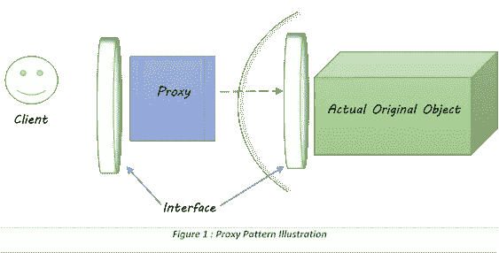
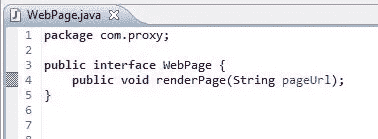
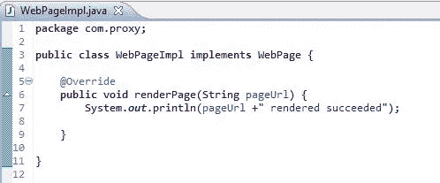
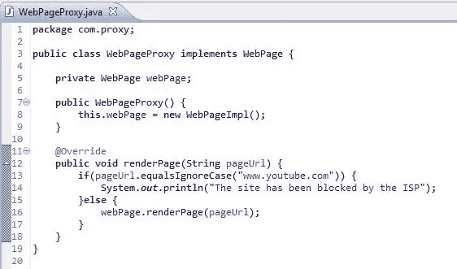
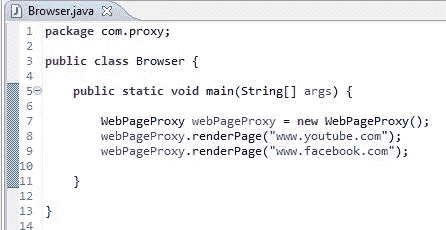
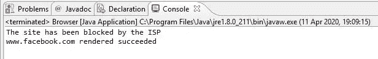

# 代理设计模式

> 原文：<https://levelup.gitconnected.com/proxy-design-pattern-9090969c2dd6>

代理意味着一个**过滤器**。让我们考虑一个只能由超级管理员执行的数据库“删除”操作。所以我们需要检查当前用户是否是超级管理员。这是我们需要代理人的地方之一。

代理设计模式与这个例子相同。它**坐在双方的中间，处理这些对外界隐藏的中间操作**。

## **让我们来看一个例子**

我们知道，一些网站无法通过使用一些互联网服务提供商来访问。他们是怎么做到的？他们有一个中间代理，负责过滤请求，并检查定制 ISP(互联网服务提供商)是否允许站点权限。因此，如果权限不允许，您就不能访问它，否则它可以被访问。

## **让我们实现这个场景**

让我们用一种渲染页面的方法来制作一个网页界面。

网页界面

让我们通过实现接口来制作 WebPageImpl 类。

WebPageImp 类

现在让我们制作代理类，它也是由网页接口实现的。

WebPageProxy 类

现在让我们用 main 方法创建 browser 类。

浏览器类(主类)

让我们运行并查看输出

输出

我们可以看到“www.youtube.com”被屏蔽了，而“www.facebook”没有。

## **我们将在哪里使用这个模式**

*   预处理—过滤、阻止、记录等
*   后处理
*   覆盖功能
*   缓存机制
*   安全机制

[下面是代码……](https://github.com/pramodaya/Design-Patterns/tree/master/DesignPatterns/src/com/proxy)

感谢阅读…