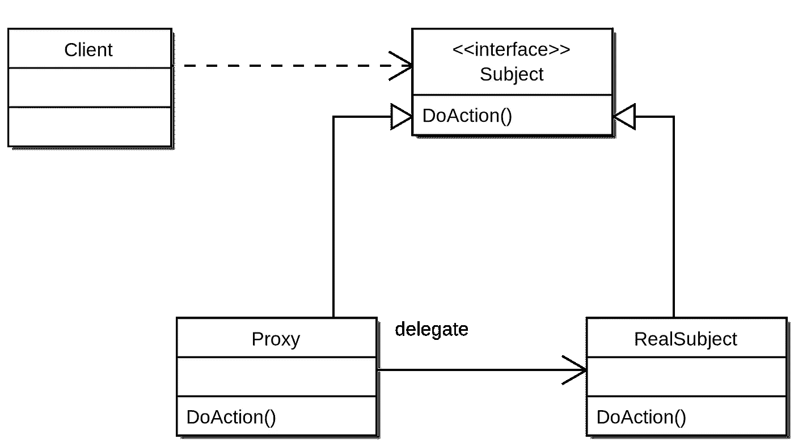
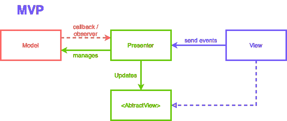
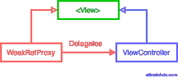

# 代理设计模式

> 原文：<https://levelup.gitconnected.com/proxy-design-pattern-f040a6561bfb>

在这篇文章中，我们将讨论`Proxy`设计模式和一个如何使用它的简单例子，在这个例子中，在 iOS 应用程序中以一种有效和干净的方式来防止保留周期。

# 什么是代理设计模式？

在 Gamma、Johnson、Vlissides、Helm 和合作者的著作 [Design Patterns](https://www.goodreads.com/book/show/85009.Design_Patterns) 中，代理设计模式被定义为:

> *为另一个对象提供代理或占位符，以控制对它的访问。它让消费者相信他们在和真正的实现对话。*

它的图表是这样的:



*图来自* [*维基百科*](https://en.wikipedia.org/wiki/Proxy_pattern#/media/File:Proxy_pattern_diagram.svg)

如果这是你第一次听说这种设计模式，可能会有点困惑，它们的比例可能一点也不清楚。但是让我给你一个例子来解释在哪里可以使用这种设计模式。

# 在 MVP UI 设计模式中使用代理

当我们在 iOS 应用中使用像 MVP 这样的 UI 设计模式时，我们注意到如果我们不削弱视图控制器 T21，就会产生一个保留循环，因为在 T1 和 T2 之间有一个双向的通信通道。让我们看看图表:



例如:

```
*// MARK: - UI* 

class ViewController: UIViewController, View {
    var presenter: Presenter?

    override func viewDidLoad() {
        super.viewDidLoad()
        view.backgroundColor = .systemBackground
        presenter?.didRequestMessage()
    }

    func display(_ viewModel: ViewModel) {
        print(viewModel.message)
    }
}

*// MARK: - Presenter*

struct ViewModel {
    let message: String
}

protocol View {
    func display(_ viewModel: ViewModel)
}

class Presenter {
    private let fetcher: FetchMessage
    private let view: View

    init(fetcher: FetchMessage, view: View) {
        self.fetcher = fetcher
        self.view = view
    }

    func didRequestMessage() {
        fetcher.get { [weak self] message in
            self?.view.display(ViewModel(message: message))
        }
    }
}

*// MARK: - Business logic*

class FetchMessage {
    func get(completion: @escaping (String) -> Void) {
        completion("Hello, World!")
    }
}
```

正如我们所见，由于双向通信，我们需要小心`Presenter`和`Controller`之间的连接。解决问题的一个方法是使`weak`成为演示者和控制器之间的参考。

```
private weak var view: View?
```

但是这样做会产生以下编译器错误:

> *“弱”不能应用于非类绑定的“视图”；考虑添加一个具有类绑定的协议一致性*

我们可以很容易地解决这个编译错误，就是使协议只针对类(使用`class`关键字使协议只针对类)。该约束定义为`The protocol to which all classes implicitly conform.`，如下所示:

```
protocol View: class {
    func display(_ viewModel: ViewModel)
}
```

这解决了我们的问题，但是这样做我们暴露了 presenter 中的内存管理。理想情况下，我们需要在复合根中处理它。直到现在，我们的作文根看起来是这样的:

```
class SceneDelegate: UIResponder, UIWindowSceneDelegate {
    var window: UIWindow?

    func scene(_ scene: UIScene, willConnectTo _: UISceneSession, options _: UIScene.ConnectionOptions) {
        guard let scene = (scene as? UIWindowScene) else { return }
        window = UIWindow(windowScene: scene)
        window?.rootViewController = Composer.composeWith(fetcher: FetchMessage())
        window?.makeKeyAndVisible()
    }
}

class Composer {
    static func composeWith(fetcher: FetchMessage) -> ViewController {
        let controller = ViewController()
        let presenter = Presenter(fetcher: fetcher, view: controller)
        controller.presenter = presenter
        return controller
    }
}
```

为了将内存管理从`Presenter`转移到`CompositionRoot`，我们可以创建一个代理，在这里我们可以*让消费者相信他们正在与真正的实现*对话。那么，代理实现看起来怎么样呢？

```
class WeakRefProxy: View {
    weak var view: (View & AnyObject)?

    init(_ view: View & AnyObject) {
        self.view = view
    }

    func display(_ viewModel: ViewModel) {
        view?.display(viewModel)
    }
}
```

还删除了`View`协议中的 class only 约束，并再次让我们的`view: View`变量 let:

```
protocol View { *// Remove class constraint*
    func display(_ viewModel: ViewModel)
}

class Presenter {
    private let fetcher: FetchMessage
    private let view: View *// Restore to a let*

    init(fetcher: FetchMessage, view: View) {
        self.fetcher = fetcher
        self.view = view
    }

    func didRequestMessage() {
        fetcher.get { [weak self] message in
            self?.view.display(ViewModel(message: message))
        }
    }
}
```

在*代理设计模式*中，我们有一个主题接口，在这种情况下是我们的`View`协议。我们还需要一个`RealSubject`和`Proxy`，在这种情况下，我们的*真实主体*是`ViewController`类，我们的*代理*当然是`WeakRefProxy`类。



在`WeakRefProxy`中，我们用一个`weak`引用来替代真实的实现，这就是我们想要避免的保留周期。而现在我们的`Composition Root`长这样:

```
class SceneDelegate: UIResponder, UIWindowSceneDelegate {
    var window: UIWindow?

    func scene(_ scene: UIScene, willConnectTo _: UISceneSession, options _: UIScene.ConnectionOptions) {
        guard let scene = (scene as? UIWindowScene) else { return }
        window = UIWindow(windowScene: scene)
        window?.rootViewController = Composer.composeWith(fetcher: FetchMessage())
        window?.makeKeyAndVisible()
    }
}

class Composer {
    static func composeWith(fetcher: FetchMessage) -> ViewController {
        let controller = ViewController()
        let presenter = Presenter(fetcher: fetcher, view: WeakRefProxy(controller))
        controller.presenter = presenter
        return controller
    }
}
```

我们将内存管理从`Presenter`移到了`CompositionRoot`，这样做，我们就不需要覆盖将所有视图协议约束为 MVP 中的类的需求，也不会泄漏 presenter 实现中的组合细节。

# 让 generic 成为我们的 WeakRef 代理

当然，创建一个`WeakRefProxy`可能会非常繁琐，所以我们可以创建一个泛型并将`View`方法实现到一个扩展中，就像这样:

```
class WeakRefProxy<T: AnyObject> {
    weak var object: T?

    init(_ object: T) {
        self.object = object
    }
}extension WeakRefProxy: View where T: View {
    func display(_ viewModel: ViewModel) {
        object?.display(viewModel)
    }
}
```

你可以在 github 上找到示例源代码:[https://github.com/alfredohdzdev/WeakRef](https://github.com/alfredohdzdev/WeakRef)

**还有一件事** :
这项技术被应用和学习是因为[essentialdeveloper.com](https://essentialdeveloper.com)的伟大工作。让我们来看看他们伟大而有价值的内容。