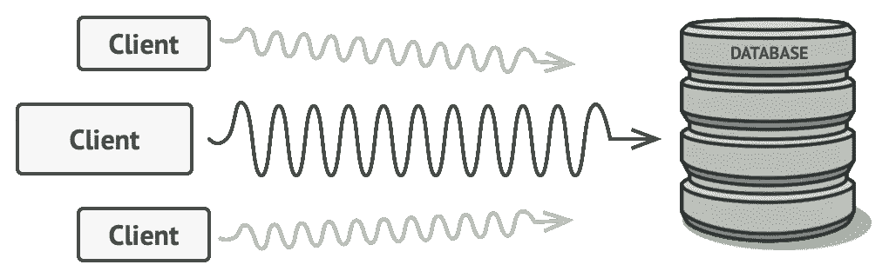

# 干净架构环境中的代理模式:使用 NodeJS 和 TypeScript 的解耦缓存实现方案

> 原文：<https://levelup.gitconnected.com/proxy-pattern-in-a-clean-architecture-context-a-decoupled-cache-implementation-proposal-with-ff0bb5f96161>

“代理”设计模式是一种结构模式，它允许一个对象被另一个作为原始对象中间媒介的对象所替换。缓存就是一个例子，它临时存储数据以避免访问昂贵的资源。



[https://refactoring.guru/design-patterns/proxy](https://refactoring.guru/design-patterns/proxy)

在这篇文章中，我提出了一个优雅的解耦方法来解决干净架构环境中的这个问题。
这篇文章建立在我的[上一篇文章](https://hofstede-matheus.medium.com/achieve-dependency-inversion-with-nodejs-typescript-and-tsyringe-8b956bc3254c)的基础上，它仍然尊重依赖倒置的原则。

亮点包括:

*   ***代理*** 实现了与任何 ***存储库*** 相同的接口，因此 ***用例*** 不知道(也不应该需要)他们正在使用代理。
*   代理实现中的一些样板文件。
*   通过 ***代理*** 和 ***可缓存*** 接口进行扩展

首先，我们必须实现两个接口:

***可缓存*** 定义要缓存的对象将被包装的形状。
***value*** 代表数据本身，
***expire sat***代表对象何时到期。

***代理*** 定义代理必须遵循的契约。
***TTL*** 是通用的缓解扩展性的一个代理。
由于我们的 ***代理*** 将是一个***InMemmoryCacheProxy***，其实现可以是:

在这个实现中，我们定义通用的 **TTL** 是一个数字，而***expire condition***是日期类型。在这个特定的代理实现中，我们希望它随着时间的推移而过期。

请注意，在这个特定的实现中，缓存存储在内存中，并通过 ***DI*** 进行管理。尽管如此，它也可以，例如，存储在***【RedisCacheProxy】***中，只要 ***代理*** 接口被遵守。

另外，请注意， ***proxy()*** 函数接收一个函数作为参数。在实现中，我们使用那个函数名来注入 ***可缓存的*** 对象，并在缓存到期*时调用它。*

最后但同样重要的是，我创建了一个函数，使得区分 ***代理*** 令牌和 ***代理*** 令牌变得更加容易。

如前所述，无论是谁呼叫，都不知道他们正在呼叫一个 ***代理*** ，因为该合同对于任何存储库都是一样的:

随后是代理实现:

唯一的区别是，它在构造函数中接收原始存储库以指向实际的源代码。

由于整个实现位于 ***CacheProxy*** 中，我们可以重用代码并简化 ***代理*** 实现。

在我们的容器中，我们必须注册 ***代理*** 、 ***被代理*** (实际存储库)，以及要被 ***缓存的*** 函数。

这样，我们的***GetCatsUseCase***甚至没有得到修改，因为它仍然在使用一个***cats repository***。

作为一个运行示例，我使用 ***jest*** 创建了一个测试套件。首先，我们需要配置测试容器:

这是测试结果:

在第一个测试中，我们检查实际的存储库是否被调用，因为它被初始化为*和 ***expiresAt*** 为 ***new Date()*** 。*

*在第二个例子中，我们模拟了原始存储库中的变化。但是，由于对象在缓存中尚未过期，它仍应返回以下内容:*

```
*[
  { name: 'cat1', breedName: 'Persa' },
  { name: 'cat2', breedName: 'Sphynx' }
]*
```

*在最后一个示例中，我们模拟了一个足够长的延迟，导致缓存过期，以便从原始存储库中获取数据:*

```
*[
  { name: 'cat3', breedName: 'Persa' }, 
  { name: 'cat4', breedName: 'Sphynx' }
]*
```

*要实时观看，请运行:*

```
*yarn test*
```

*这个简单的例子展示了如何在后端使用 NodeJS 实现具有干净架构的缓存。尽管如此，如果它支持 OOP，主要思想仍然适用于前端或移动设备，即使使用不同的编程语言。*

*完整的代码位于本[报告](https://github.com/hofstede-matheus/proxy-pattern-cache)中。*