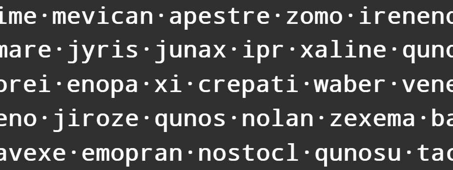

# 伪英语

> 原文：<https://levelup.gitconnected.com/pseudo-english-typing-practice-with-machine-learning-5700eb4dc54>

## 通过机器学习进行打字练习

> 本系列文章:
> 1。[简介](https://medium.com/@bayan.bennett/typing-practice-with-machine-learning-introduction-aa3bb5d24134)
> 2。[伪英语](/pseudo-english-typing-practice-with-machine-learning-5700eb4dc54)(你在这里) *3。* [键盘输入](/keyboard-input-typing-practice-w-machine-learning-b5c5a9a362a7) *4。* [Web Worker 推断](/inference-using-web-workers-f47266b7ef11)
> 
> 已完工项目位于:[https://www.bayanbennett.com/projects/rnn-typing-practice](https://www.bayanbennett.com/projects/rnn-typing-practice)



# 目标

使用递归神经网络生成类似英语的单词。

# 琐碎的方法

在决定使用 ML 之前，首先我必须说服自己，这些琐碎的方法不能提供足够的结果。

## 随机字母

```
const getRandom = (distribution) => {
  const randomIndex = Math.floor(Math.random() * distribution.length);
  return distribution[randomIndex];
}const alphabet = "abcdefghijklmnopqrstuvwxyz";const randomLetter = getRandom(alphabet);
```

不出所料，和英语单词没有相似之处。生成的字符序列很难输入。以下是五个字母单词的几个例子:

```
snyam   iqunm   nbspl   onrmx   wjavb   nmlgj
arkpt   ppqjn   zgwce   nhnxl   rwpud   uqhuq
yjwpt   vlxaw   uxibk   rfkqa   hepxb   uvxaw
```

## 加权随机字母

如果我们生成的序列具有和英语一样的字母分布会怎么样？我从维基百科获得了[字母的频率，并创建了一个 JSON 文件，将字母表映射到它们相应的相对频率。](https://en.wikipedia.org/wiki/Letter_frequency)

```
// letter-frequencies.json
{
  "a": 0.08497,  "b": 0.01492,  "c": 0.02202,  "d": 0.04253,
  "e": 0.11162,  "f": 0.02228,  "g": 0.02015,  "h": 0.06094,
  "i": 0.07546,  "j": 0.00153,  "k": 0.01292,  "l": 0.04025,
  "m": 0.02406,  "n": 0.06749,  "o": 0.07507,  "p": 0.01929,
  "q": 0.00095,  "r": 0.07587,  "s": 0.06327,  "t": 0.09356,
  "u": 0.02758,  "v": 0.00978,  "w": 0.02560,  "x": 0.00150,
  "y": 0.01994,  "z": 0.00077
}
```

这里的想法是创建一个大的字母序列，其分布与上面的频率紧密匹配。`Math.random`具有均匀分布，因此当我们从序列中随机选择字母时，选择字母的概率与其频率相匹配。

```
const TARGET_DISTRIBUTION_LENGTH = 1e4; // 10,000const letterFrequencyMap = require("./letter-frequencies.json");const letterFrequencyEntries = Object.entries(letterFrequencyMap);const reduceLetterDistribution = (result, [letter, frequency]) => {
  const num = Math.round(TARGET_DISTRIBUTION_LENGTH * frequency);
  const letters = letter.repeat(num);
  return result.concat(letters);
};const letterDistribution = letterFrequencyEntries
  .reduce(reduceLetterDistribution, "");const randomLetter = getRandom(letterDistribution);
```

元音数量的增加是显而易见的，但生成的序列仍然无法像一个英语单词。以下是五个字母单词的几个例子:

```
aoitv   aertc   cereb   dettt   rtrsl   ararm
oftoi   rurtd   ehwra   rnfdr   rdden   kidda
nieri   eeond   cntoe   rirtp   srnye   enshk
```

## [马尔可夫链](https://en.wikipedia.org/wiki/Markov_chain)

这将是下一个逻辑步骤，我们将创建字母序列对的概率。这就是我决定直接去 RNNs 的原因。如果有人想实现这种方法，我很想看看结果。

# 递归神经网络

神经网络通常是无记忆的，系统没有来自先前步骤的信息。RNNs 是一种神经网络，其中网络的先前状态是当前步骤的输入。

*   **输入**:一个字符
*   **输出**:下一个字符概率的张量。

神经网络天生不擅长处理不同长度的输入，有办法解决这个问题*(就像变形金刚中的位置编码)*。对于 RNNs，输入的大小是一致的，只有一个字符。自然语言处理对 rnn 有天然的亲和力，因为语言是单向的(LTR 或 RTL ),字符的顺序很重要。换句话说，虽然*联*和*解*这两个字只交换了两个字，但意思却相反。

下面的模型基于 [Tensorflow 文本生成和 RNN](https://www.tensorflow.org/tutorials/text/text_generation#build_the_model) 教程。

## 嵌入的输入层

这是我第一次遇到嵌入层的概念。这是一个迷人的概念，我很高兴开始使用它。

我在这里写了一篇总结嵌入的短文:[https://bayanbennett . com/posts/embeddings-in-machine-learning](https://bayanbennett.com/posts/embeddings-in-machine-learning)

```
const generateEmbeddingLayer = (batchSize, outputDim) =>
  tf.layers.embedding({
    inputDim: vocabSize,
    outputDim,
    maskZero: true,
    batchInputShape: [batchSize, null],
  });
```

## 门控循环单元(GRU)

我没有足够的知识来证明*为什么选择*GRU，所以我推迟到前面提到的 Tensorflow 教程中的实现。

```
const generateRnnLayer = (units) =>
  tf.layers.gru({
    units,
    returnSequences: true,
    recurrentInitializer: "glorotUniform",
    activation: "softmax",
  });
```

# 把所有的放在一起

由于我们是将一层的输出顺序输入到另一层的输入中，`tf.Sequential`是我们应该使用的模型类。

```
const generateModel = (embeddingDim, rnnUnits, batchSize) => {
  const layers = [
    generateEmbeddingLayer(batchSize, embeddingDim),
    generateRnnLayer(rnnUnits),
  ];
  return tf.sequential({ layers });
};
```

# 培训用数据

我使用普林斯顿的 WordNet 3.1 数据集作为单词的来源。

> WordNet 是一个大型的英语词汇数据库。名词、动词、形容词和副词被分组为认知同义词集(synset)……”
> ——普林斯顿大学“关于 WordNet。” [WordNet](https://wordnet.princeton.edu/) 。普林斯顿大学。2010.

因为我只对单词感兴趣，所以我解析了每个文件，只提取了单词。带空格的单词被拆分成单独的单词。符合以下条件的单词也被删除:

*   带有音调符号的单词
*   单字符单词
*   含数字的单词
*   罗马数字
*   重复的单词

# 数据集生成器

`tf.LayersModel`和`tf.Sequential`都有`.fitDataset` [方法](https://js.tensorflow.org/api/latest/#tf.Sequential.fitDataset)，这是一种方便的方式— *拟合数据集*。我们需要创建一个`tf.data.Dataset`，但首先这里有一些助手函数:

```
// utils.jsconst characters = Array.from("\0 abcdefghijklmnopqrstuvwxyz");
const mapCharToInt = Object.fromEntries(
  characters.map((char, index) => [char, index])
);const vocabSize = characters.length;const int2Char = (int) => characters[int];
const char2Int = (char) => mapCharToInt[char];// dataset.jsconst wordsJson = require("./wordnet-3.1/word-set.json");
const wordsArray = Array.from(wordsJson);// add 1 to max length to accommodate a single space that follows each word
const maxLength = wordsArray.reduce((max, s) => Math.max(max, s.length), 0) + 1;const data = wordsArray.map((word) => {
  const paddedWordInt = word
    .concat(" ")
    .padEnd(maxLength, "\0")
    .split("")
    .map(char2Int);
  return { input: paddedWordInt, expected: paddedWordInt.slice(1).concat(0) };
});function* dataGenerator() {
  for (let { input, expected } of data) {
    /* If I try to make the tensors inside `wordsArray.map`,
     * I get an error on the second epoch of training */
    yield { xs: tf.tensor1d(input), ys: tf.tensor1d(expected) };
  }
}module.exports.dataset = tf.data.generator(dataGenerator);
```

注意，我们需要所有的输入都是相同的长度，所以我们用空字符填充所有的单词，这些字符将通过`char2Int`函数转换成整数 0。

# 生成和编译模型

这就是我们一直在努力打造的时刻:

```
const BATCH_SIZE = 500;const batchedData = dataset.shuffle(10 * BATCH_SIZE).batch(BATCH_SIZE, false);
const model = generateModel(vocabSize, vocabSize, BATCH_SIZE);
const optimizer = tf.train.rmsprop(1e-2);model.compile({
  optimizer,
  loss: "sparseCategoricalCrossentropy",
  metrics: tf.metrics.sparseCategoricalAccuracy,
});model.fitDataset(batchedData, { epochs: 100 });
```

选择批量大小为 500，因为这是我在不耗尽内存的情况下可以容纳的大小。

# 例子

```
ineco uno kam whya qunaben qunobin
xexaela sadinon zaninab mecoomasph
anonyus lyatra fema inimo unenones
```

它并不完美，但它产生的单词似乎来自另一种罗曼语或日耳曼语。`model.json`和`weights.bin`文件的大小只有 44 kB。这一点很重要，因为更简单的模型通常运行推理更快，并且足够轻便，最终用户可以下载，而不会影响感知的页面性能。

下一步是有趣的开始，构建一个打字练习 web 应用程序！

*原籍:*

 [## 机器学习打字练习:伪英语

www.bayanbennett.com](https://www.bayanbennett.com/posts/typing-practice-with-machine-learning-pseudo-english)