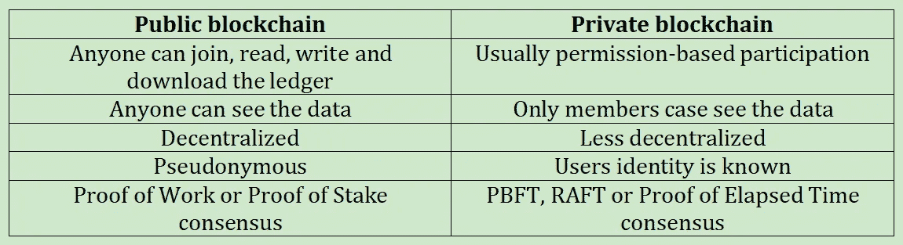

# 公立区块链 vs 私立区块链

> 原文：<https://levelup.gitconnected.com/public-blockchains-vs-private-blockchains-96514dfae3a7>

## 诸如比特币、以太坊等公共区块链允许任何人加入一个有助于共识机制或发行交易的节点。二等兵区块链呢？

诸如比特币、以太坊、 [Monero](https://henriquecentieiro.medium.com/rings-stealth-and-monero-awesomeness-99bcab969676) 等公共区块链允许任何人加入有助于共识机制或发布交易的节点。以太网还允许创建分布在数千个节点上的[智能合约](https://henriquecentieiro.medium.com/what-the-heck-are-smart-contracts-bf41f1820c03)。 [DeFi](https://medium.com/nerd-for-tech/defining-defi-what-is-decentralized-finance-technically-speaking-40bca2d405df) 本质上也是基于区块链的公共事业。

公共区块链通常也被称为无许可，认为任何人都可以加入而不需要许可或成员证书。这些区块链在本质上是完全分散的，没有所有权或集中治理。公共区块链中的用户/节点可以访问所有数据并保留一份分类账副本，但 DLT 的一些情况除外。在大多数公共区块链中，他们通过工作证明或利害关系证明等共识机制达成共识。例如，我们将在本书的后面部署一个以太坊节点，并与区块链同步，这是任何人都可以做的事情。

公共区块链通常有大量的参与者，它们基本上依靠这些参与者来运行节点，这些节点将保持区块链对攻击的弹性。在公共区块链中，网络安全性和弹性随着节点数量的增加而增加。区块链越大，就越难被成功攻击。所使用的共识机制还包括对节点(也称为矿工)的一些激励，以维护区块链和验证事务。例如，比特币激励矿工每创造一个新区块，就奖励他们 6.25 BTC(截至 2021 年)。这样，人们就有动力为网络做贡献。

公共区块链的一大优势是它们也非常安全，因为它们有许多节点参与。如果一个区块链只有 10 个节点，黑客需要控制至少 6 个节点来控制网络，这可能不是很困难。然而，如果一个区块链有 10 万个节点(这是比特币的情况)，黑客将不得不控制超过 50%的网络节点，这实际上是不可能的，除非黑客可以花费数十亿美元的设备和电力。真的不值得。

由于分散的性质、加密和共识机制，参与者被激励保持分类账可信。比特币和大多数主要的加密货币可能是世界上最安全的 IT 系统。

然而，公共区块链并不是天堂。也有一些缺点:缓慢的处理时间和延迟—一个交易可能需要几分钟才能完成—低吞吐量，有时还有交易成本。

因此，我们可以看到，在公共区块链中，任何人都可以加入公共区块链，下载整个分类帐，读取历史交易，编写新交易(但永远不会更改现有交易)，并作为节点/矿工参与。公共区块链是完全透明的，任何人都可以看到一切，并有助于达成共识。

另一方面，私人区块链通常是许可的，这意味着参与者需要获得许可才能参与。私人区块链通常有较少的参与者。这些参与者可以是共享某种业务流程的一组人、公司或组织。通常，私人区块链是由区块链邀请的，参与者与他们现实世界的身份相关联——姓名、公司名称等。

在公共区块链，用户是化名的。它们与现实世界的身份无关，而用户的身份在《私人区块链》中并不是无名的。

诸如 Hyperledger Fabric、 [Quorum](https://henriquecentieiro.medium.com/consensys-quorum-enterprise-blockchain-1774062dc579) 、 [Multichain](https://henriquecentieiro.medium.com/what-the-heck-is-the-multichain-blockchain-6b2d677785f1) 和 Corda 之类的私有区块链技术允许不同种类的配置，以便参与者可以在区块链中具有不同的许可和能力。与公共区块链相比，私有区块链通常更具可扩展性，允许高吞吐量、快速事务处理和低延迟。私人区块链的用户数量一般较少；因此，在他们之间传播数据并达成共识更容易。一些专用区块链每秒钟可以处理数千笔交易。

私立区块链的一个主要缺点是，它们倾向于更加集中，而错过了分散化的优势。更高的集中化程度可能会带来更高的吞吐量、更好的治理以及对法规的遵从性，但这是以额外的安全问题为代价的。考虑到涉及的节点数量较少，一个糟糕的节点更容易操纵或试图利用系统。

半私有的区块链和区块链也可以是混合的，这意味着它们部分是私有的，部分是公有的。在混合网络的公共端，任何人都可以加入(例如，编写新的事务)，而一些功能可以保持私有(例如，验证节点)。 [Ripple](https://henriquecentieiro.medium.com/ripple-xrp-starting-kit-39a53eaa75a2) 和 EOS 可以看作是半私有的区块链。在 EOS 上，验证节点，在 EOS 区块链上被称为块生产者，是 21 个被选择的节点。用户可以访问网络，并可以以公开的方式进行交易。在 EOS 的情况下，委托的利害关系证明机制用于提名将伪造块的 21 个块生产者节点。我们将在后面读到更多关于 EOS 授权的利益相关者共识机制的证明。

**🚀关注我，也查看我的🧱·区块链的书和课程:**

**📖** [**取消连锁图书— Kindle 和 Paperbac**](https://www.amazon.com/dp/B091CYTX37/ref=sr_1_1?dchild=1&keywords=unblockchain&qid=1617186443&s=digital-text&sr=1-1) **k**

**👨‍🎓** [**【取消冻结】科目**](https://www.udemy.com/course/blockchain-deep-dive-from-bitcoin-to-ethereum-to-crypto/?referralCode=B8463EE382E6D313304B)

*声明:所表达的观点纯属个人观点，并不反映本文作者所属或相关的任何组织的观点或想法。这不是财务建议，我也不推荐任何东西。本文仅供教育之用。*