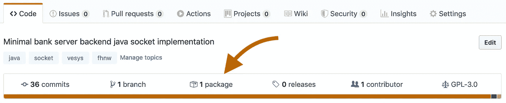
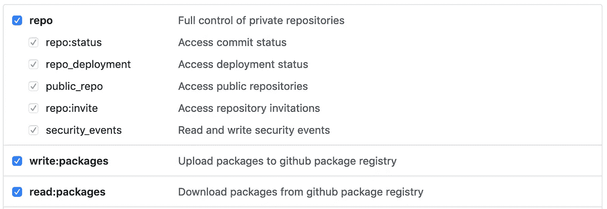
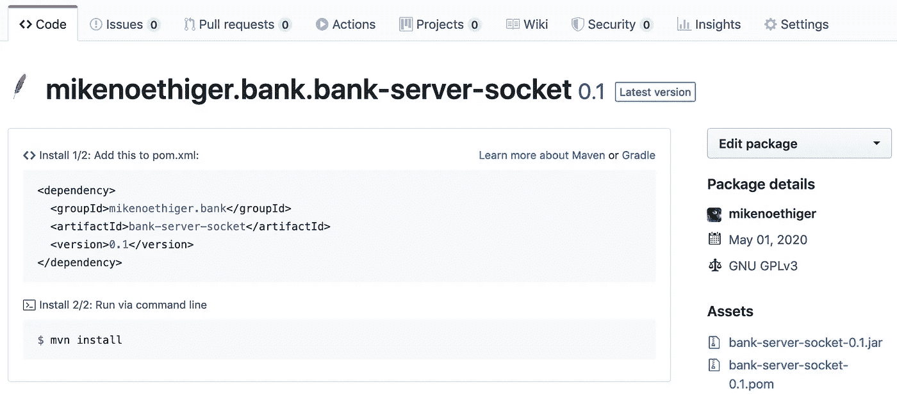

# 用 Gradle 发布一个 Maven 包到 GitHub

> 原文：<https://levelup.gitconnected.com/publish-a-maven-package-to-github-with-gradle-fabc6de24d6>

## 你知道你可以把你的 java 库发布到 GitHub 吗？

尽管乍一看并不总是显而易见，GitHub 除了托管 git 库之外还提供了许多有用的工具。今天的话题:

## Maven 包



如此不起眼的链接背后却藏着牛逼的工具！

我将向您展示如何使用 Gradle 将 Maven 包发布到您的 GitHub repo 这也包含在 [GitHub 文档](https://help.github.com/en/packages/using-github-packages-with-your-projects-ecosystem/configuring-gradle-for-use-with-github-packages)中。我将补充一些提示，这些提示在我第一次发表时对我来说并不完全明显。

如果你是那种不说话只举例的类型；[要点](https://gist.github.com/mikenoethiger/0c16dfe095a5fc60a4c249c42d0d0b70)来了。

# 1 —创建访问令牌

身份验证是通过令牌完成的，所以让我们从创建一个令牌开始。

在 GitHub 中，导航到**设置** → **开发者设置**→[→**个人访问令牌**](https://github.com/settings/tokens) ，点击 [**生成新令牌**](https://github.com/settings/tokens/new) 。

给它一个有用的注释，例如“*发布 maven 包*”，并至少选择以下权限:



生成令牌并将其粘贴到文本编辑器或目前类似的东西中——您将无法在 GitHub 上再次显示它。

# 2 —安装 build.gradle

接下来，我们需要在 gradle 中设置发布任务。将此添加到您的`build.gradle`

```
plugins {
    id 'maven-publish'
}publishing {
    repositories {
        maven {
            name = "GitHubPackages"
            url = uri("https://maven.pkg.github.com/**OWNER**/**REPOSITORY**")
            credentials {
                username = project.findProperty("gpr.user") ?: System.*getenv*("GITHUB_USERNAME")
                password = project.findProperty("gpr.key") ?: System.*getenv*("GITHUB_TOKEN")
            }
        }
    }
    publications {
        gpr(MavenPublication) {
            groupId = '**org.group**'
            artifactId = '**artifact**'
            version = '**0.1**'

            from(components.java)
        }
    }
}
```

替换粗体部分，来自[的真实世界示例在这里](https://github.com/mikenoethiger/bank-server-socket/packages/207802)将是:

*   **拥有者:**
*   **储存库:** `bank-server-socket`
*   **groupId:**
*   **artifactId:**
*   **版本:**

> N **注意:**根据[文档](https://help.github.com/en/packages/using-github-packages-with-your-projects-ecosystem/configuring-gradle-for-use-with-github-packages#authenticating-to-github-packages)所有者和存储库必须是小写的，即使它们在 GitHub 上包含大写字母。
> 
> **注意事项 2:** 一个版本只能发布一次，对于[公开回购不能删除](https://help.github.com/en/packages/publishing-and-managing-packages/deleting-a-package#about-public-package-deletion)。如果你想让它工作，我建议使用低版本号。

# 3-存储凭据

最后，我们必须存储用户名/令牌。就我们目前的`build.gradle`而言，我们至少有以下三种选择:

将它们作为**等级属性**存储在`~/.gradle/gradle.properties`中:

```
gpr.user=github-username
gpr.key=github-token
```

根据您使用的 shell，将它们作为 **OS 环境**变量存储在`~/.bash_profile`或`~/.zsh`中:

```
export GITHUB_USERNAME="username"
export GITHUB_TOKEN="token"
```

通过 CLI 将它们**作为梯度属性传递:**

```
$ gradle publish -Pgpr.user=username -Pgpr.key=token
```

你可以选择最适合你的。我采用了第一种方法来限制令牌对 gradle 的可用性，但这并不重要。

# 4 —发布

开始吧，发布到 GitHub，任务是`publish`:

```
$ gradle publish
```



你的 maven 包应该出现在 http://github.com/username/repo/packages[的](http://github.com/username/repo/packages)

# 附录

这里列出了一些可能有用的参考资料:

*   [配置 Gradle 用于 GitHub 包](https://help.github.com/en/packages/using-github-packages-with-your-projects-ecosystem/configuring-gradle-for-use-with-github-packages#authenticating-to-github-packages)
*   [删除包](https://help.github.com/en/packages/publishing-and-managing-packages/deleting-a-package#about-public-package-deletion)
*   [构建环境](https://docs.gradle.org/current/userguide/build_environment.html)
*   [出版专家](https://docs.gradle.org/current/userguide/publishing_maven.html)