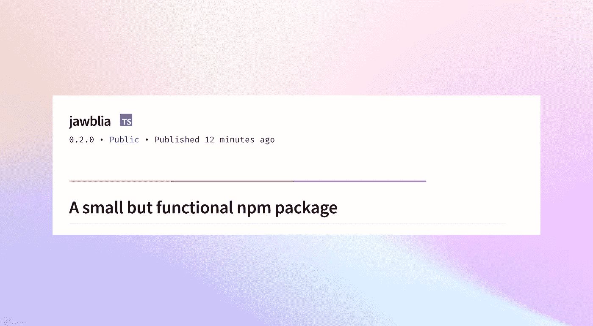
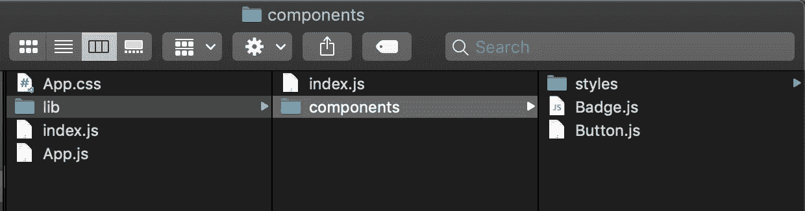
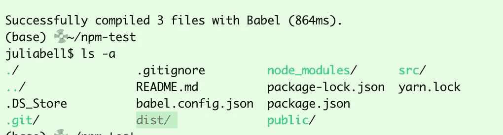
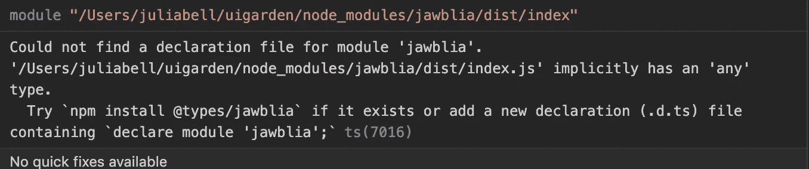

# 将 React 组件发布为 npm 包

> 原文：<https://levelup.gitconnected.com/publish-react-components-as-an-npm-package-7a671a2fb7f>



本文将回顾如何用 Babel 7(撰写本文时的最新版本)将 React 组件发布为 npm 包，以及常见错误。

我发现自己从一个项目到另一个项目复制粘贴了我的 React 组件，并希望创建一个 npm 包，这样我就可以轻松地导入它们。为此，我必须学习如何发布一个 npm 包。很难在网上找到太多关于用 Babel 7 发布 React 组件的更新信息，而且我得到了很多构建错误，所以我决定写这篇文章作为参考。这将假设反应能力，但很少或没有使用 npm 的经验。

看看最终的 [npm 包](https://www.npmjs.com/package/jawblia)和 [GitHub repo](https://github.com/jawblia/npm-test)

**前置条件:**

*   创建一个 npm 帐户并登录。您可以从 npm 网站登录，也可以通过运行`npm login`从 CLI 登录。
*   一款 React 应用。我用`npx create-react-app npm-test`为这篇文章创建了样板文件。在本地机器上运行应用程序。

## 1.创建并隔离要发布的零部件

在样板应用程序中，我进入 **src** 文件夹，删除了除 App.js、app.css 和 index.js 之外的所有内容。

我还添加了一个名为`lib`的文件夹，它将存储我想在 npm 上发布的所有内容。在`lib`中，有一个名为`components`的文件夹来存储组件元素，还有一个名为`index.js`的文件来导出它们。(这似乎是一个标准，基于其他教程和 Carbon 的库。)



在 components 文件夹中，我创建了名为`Button.js`和`Badge.js`的新文件，它们将是 npm 包中要使用的组件。这些组件的代码不是很重要，但是我会在下面列出来。

**> Button.js**

```
import React from 'react';const Button = (props) => {
   return (
      <button className={`btn btn--${props.kind} CTA`}
        data-id={props.id}
        type={props.type}
        name={props.name}
        value={props.value}
        disabled={props.disabled}
        onClick={props.handleClick}> 
           <h4>{props.label}</h4>
      </button>
   )
}export default Button;
```

**> Badge.js**

```
import React from 'react';const Badge = (props) => {
   return (
      <div className={`badge ${!props.value ? 'badge--none' :''} `}
        <h4 className="heavy">{props.value || 0}</h4>
      </div>
     )
}export default Badge;
```

> I **重要的**:要设计这些组件的样式，他们要么需要 1。css 直接导入到组件中，2。内联样式，可以直接应用于组件，或者借助 css-in-js 包，如 [styled-components](https://styled-components.com/) 或 3。预编译和捆绑的 sass/scss，我相信可以用一个带有 [sass-loader](https://www.npmjs.com/package/sass-loader) 的 React 应用程序来应用，但这超出了本文的范围。

这些组件都在`components`文件夹中。然后，我们将它们添加到 index.js 文件中:

```
import Badge from './components/Badge';
import Button from './components/Button';export { Badge, Button };
```

## 1b。为组件创建一个 repo

这在技术上是可选的，因为组件不必在 Github 上发布到 npm 中。但是这非常方便，因为您的 repo 的自述文件将自动作为 npm 中的软件包文档进行填充。

## 2.安装 Babel 并构建`dist`文件夹

要安装 Babel，请在 CLI 中运行以下命令:

```
npm install --save-dev @babel/core @babel/cli @babel/preset-env npm install -save @babel/polyfill
```

使用以@符号开头的巴别塔版本对于匹配预置很重要。无论哪种方式，使用未划分范围的巴别塔版本(没有@符号)和有范围的预设(用@符号指定)都会导致构建错误。

在项目的顶层文件夹中，添加一个名为`babel.config.json`的文件，并添加以下预设:

```
{
 "presets": [
  [
   "@babel/env",
    {
     "targets": {
     "edge": "17",
     "firefox": "60",
     "chrome": "67",
     "safari": "11.1"
      },
   "useBuiltIns": "usage",
   "corejs": "3.6.5"
    }
],
   "@babel/preset-react"
]
}
```

`@babel/env`告诉浏览器它应该以哪个版本为目标，`@babel/preset-react`允许巴别塔编译 JSX。

在`package.json`中的`scripts`下，用以下内容替换构建脚本:

```
"build": "rm -rf dist && NODE_ENV=production babel src/lib --out-dir dist --copy-files";
```

这将把`src/lib`复制到一个名为`dist`的新文件夹中。此文件夹不可见，但会在生成后添加到您的根文件夹中。

在 CLI 中运行命令`npm run build`。

如果构建成功，并且在根文件夹中写入了`ls -a`，您将会看到一个名为`dist`的新文件夹:



有趣的事实！您可以自定义 CLI 的配色方案

## 3.更改 package.json 以进行发布

这是最精彩的部分！必须将`package.json` 更改为发布到 npm。

这是我的`package.json`的第一部分:

```
"name": "npm-test",
"version": "0.1.0",
"private": true,
```

这里的`name`必须是一个没有被现有 npm 包使用的唯一名称(您可以使用 npm 搜索来检查名称是否被使用)。`version`是包版本，每次重新发布都必须更改。版本语法指明了主要版本、次要版本和补丁版本，更多信息可以在 npm 文档中的[这里](https://docs.npmjs.com/about-semantic-versioning)找到。

`description`、`keywords`和`author`都是可选字段，可以让潜在的最终用户对软件包有更好的了解。此处全`package.json` 。

```
"name": "jawblia",
"description": "Two test React components",
"author": "Jawblia",
"keywords": ["react", "components", "ui"],
"version": "0.1.0",
"private": false,
"main": "dist/index.js",
"module": "dist/index.js",
"files": [ "dist", "README.md" ],
"repository": {
    "type": "git",
    "url": "git+https://github.com/jawblia/npm-test.git"
},
```

文件已为`npm publish`准备好。

## 4.使用新的软件包

在 CLI 和您的 npm 配置文件中检查程序包已发布的内容。要确保它正常工作，请在本地机器上打开一个不同的项目，并尝试使用该包:

`npm install jawblia`

在新项目中，尝试通过导入来使用其中一个组件:

> App.js

```
**import { Button } from 'jawblia';** import Flex from './layout/Flex';function App() {return (
  <Flex middle center column className="page" gap={1.5}>
   <h3>This is my new project</h3>
 **<Button label="test" kind="primary"/>**  </Flex>);}export default App;
```

在浏览器中，我们看到:


从 npm 包导入的按钮正在工作

我们可以使用原始组件中的任何道具，并更改按钮的标签、类型和样式。国家预防机制一揽子计划正在发挥作用。

## 尾声:一些警告

这里漏掉了一些值得一提的东西。

**类型:**

如果您导入您的新包，您会注意到这样的警告:



所有的 React npm 包也可以与 Typescript 一起使用。为一个包声明类型需要创建一个声明文件，并用`typings`键将它添加到 package.json 中。或者，您不需要声明类型，但是 Typescript 用户必须声明他们自己的类型。

**scss:**

我在我的组件上使用了 scss 作为样式，并在`components`文件夹中添加了一个名为`styles`的独立文件夹。这个样式全部编译到主 src 文件夹中的 App.css 表中。如果你不想让 scss 预编译，我发现[这个堆栈溢出回答](https://stackoverflow.com/questions/66548611/customisable-component-library-in-reactjs/66670203#66670203)解决了这个问题。

**巴别塔版本:**

如果您的预设语法和导入的 Babel 版本不一致，您可能会得到如下错误消息:

```
ReferenceError: [BABEL] src/lib/index.js: Unknown option: /Users/juliabell/skylight/node_modules/babel-preset-react-app/index.js.overrides. Check out [<http://babeljs.io/docs/usage/options/>](<http://babeljs.io/docs/usage/options/>) for more information about options.A common cause of this error is the presence of a configuration options object without the corresponding preset name. Example:Invalid: { presets: [{option: value}] } Valid: { presets: [['presetName', {option: value}]] }
```

或者

```
Requires Babel “7.0.0-0” but was loaded with “6.26.3” #8482
```

从网上看，这些错误可能是由于全球和本地安装了不同版本的巴别塔，在父文件夹中有一个`.babelrc`或`babel.config.json`文件，或者使用了不正确的预设语法。在我的例子中，我在预置中使用了不正确的语法，并且在我最初安装未作用域的巴别塔版本(`babel`)时添加了作用域的巴别塔版本(`@ babel`)。

**许可证:**

建议 npm 软件包使用许可证来定义它们的用途。我没有添加，但是下面链接的 Ben Awad 视频解释了如何添加。

**参考文献:**

 [## 使用指南巴别塔

### 在 Babel 工具链中有相当多的工具试图让你更容易地使用 Babel，不管你是一个…

babeljs.io](https://babeljs.io/docs/en/usage/) [](https://betterprogramming.pub/how-to-publish-a-react-component-library-c89a07566770) [## 如何发布 React 组件库

### 既然你已经创造了一些有用的东西，那就和全世界分享吧

better 编程. pub](https://betterprogramming.pub/how-to-publish-a-react-component-library-c89a07566770)  [## 将 React 组件作为节点模块导出到 NPM

### 多重视觉指南

www.pluralsight.com](https://www.pluralsight.com/guides/export-reactjs-components-as-node-modules-to-npm) [](https://hackernoon.com/creating-a-library-of-react-components-using-create-react-app-without-ejecting-d182df690c6b) [## 使用 Create React App 创建 React 组件库

### 更新:您可以使用 npm 包 create-component-lib 来自动化本文中描述的所有步骤。

hackernoon.com](https://hackernoon.com/creating-a-library-of-react-components-using-create-react-app-without-ejecting-d182df690c6b) 

[https://it next . io/how-to-package-your-react-component-for-distribution-via-NPM-d 32d 4 BF 71 b 4](https://itnext.io/how-to-package-your-react-component-for-distribution-via-npm-d32d4bf71b4f)

# 分级编码

感谢您成为我们社区的一员！升级正在改变技术招聘。 [**在最好的公司**找到你最完美的工作](https://jobs.levelup.dev/talent) **。**

[](https://jobs.levelup.dev/talent) [## 提升——改变招聘流程

### 🔥让软件工程师找到他们热爱的完美角色🧠寻找人才是最痛苦的部分…

作业. levelup.dev](https://jobs.levelup.dev/talent)