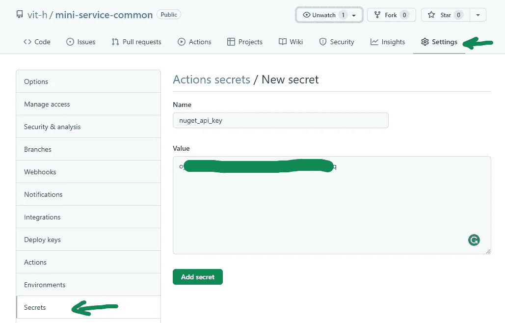

# 使用 GitHub 操作发布到 NuGet

> 原文：<https://levelup.gitconnected.com/publish-to-nuget-with-github-actions-4e1486e7c19f>

在[上一篇文章](https://itnext.io/how-to-create-a-template-in-net-for-a-c-application-and-what-nuget-is-for-e5d4fc03c487)中，我描述了如何创建一个 NuGet 模板并手动将其发布到 NuGet。在这里，我想谈谈如何通过 CI 自动创建包，或者使用 GitHub 作为存储库来发布包。

**1。创建 API 密钥**

登录到 nuget.org 的[然后进入 API 密钥管理并创建一个密钥。](http://nuget.org)

**2。将 API 密钥添加到 GitHub 库**

转到 GitHub 和所需的存储库设置，然后转到 Secrets。创建一个新的秘密并粘贴在第一步中创建的 API 密匙。

**3。添加工作流程说明**

在根目录 <repository>/下创建一个文件。github/workflows/release . yml
将内容从[复制到此处](https://github.com/vit-h/mini-service-common/blob/main/.github/workflows/release.yml)。</repository>

确实如此:
-发布发布时触发
-在 ubuntu 上运行-最新
-设置。NET SDK
-运行 dotnet 构建，然后测试
-打包 nuget 并使用附加的 nu get 密钥将其推送到 nuget.org

**4。创建发布**

您的回购主页上的“查找发行”链接

然后创建一个新版本

**5。验证工作流程是否成功**

转到“操作”选项卡，检查已触发操作的状态和输出。

6。检查已发布的包

去 nuget.org，然后登录并检查包页面。大约 5-10 分钟后，您的包将出现在[未列出的包](https://www.nuget.org/account/Packages#)中，然后它们将被移动到[已发布的包](https://www.nuget.org/account/Packages#)中。

7。故障排除

正如你从上面的动作图片中看到的，我在向 nuget.org 推进时遇到了麻烦。

所以，如果你将遇到你自己无法解决的问题，你可以发电子邮件给[support@nuget.org](mailto:support@nuget.org)。在我的情况下，我在 10 天内得到了答案和修复。