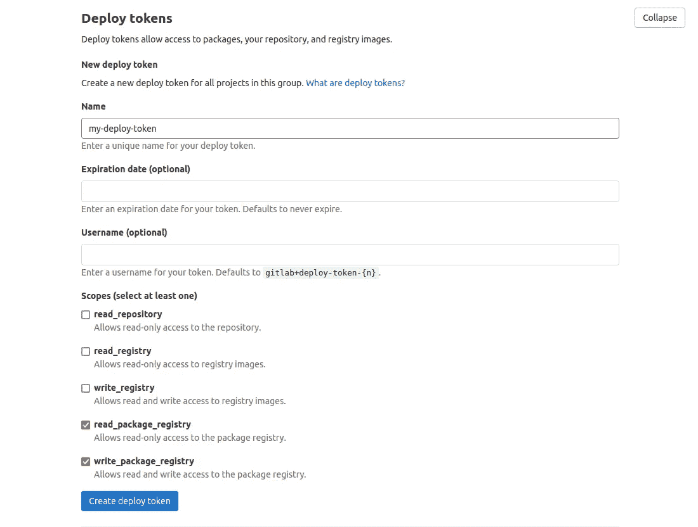
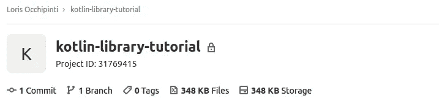
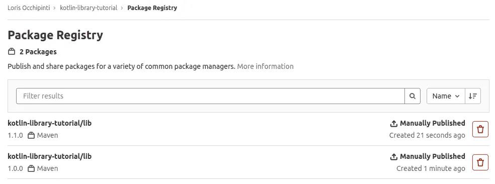

# 用 Gradle 和 GitLab 发布你的第一个包

> 原文：<https://levelup.gitconnected.com/publish-your-first-package-with-gradle-and-gitlab-1993e4405629>

## 与您的团队共享周到的 API 库

照片由 [Tijana Drndarski](https://unsplash.com/@izgubljenausvemiru?utm_source=medium&utm_medium=referral) 在 [Unsplash](https://unsplash.com?utm_source=medium&utm_medium=referral) 上拍摄

我们正处于假日季节的中期，如果你想庆祝一下，很可能你不得不彻底考虑今年的礼物以及如何取悦家人和朋友。我承认，我有时觉得消费主义有点破坏了送礼仪式的纯真。最起码，我觉得我应该亲自包装我的礼盒，给他们一点个人的感动，把捐东西的喜悦赚回来。

如果我们能处理好礼物的物理信封，为什么不学习如何用神奇的软件包做同样的事情，与我们的团队分享呢？毕竟，众所周知，我们应该最大限度地重用代码，以加快开发，最重要的是，改善我们同事的生活。

如果您的团队在 GitLab 上合作，并且热衷于构建 Gradle 项目，这是学习软件包发布这一令人尊敬的技术的时候了。

# 先决条件

在开始我们的装箱任务之前，请确保您手头上有所有需要的材料:

*   Gradle v7.2.0+(如果你使用的是 v6，你仍然可以理解，只是要注意具体的注释)
*   维护者访问 GitLab 项目或组
*   与你的团队分享一个奇妙的 API 库

# 建立一个项目

如果你已经清楚地知道该把哪个项目放进你的包里，就跳过这一部分，继续选择一些花哨的丝带。

然而，如果您是从零开始，导航到一个新的目录并将命令`gradle init`提交到您的首选命令行中。然后，当提示输入项目类型时，选择`3\. library`。使用最适合项目的设置完成初始配置。对于本指南，我用`Kotlin`语言和`Groovy DSL`构建脚本生成了一个库(是的，它在 GitLab 上，你可以在这里[浏览](https://gitlab.com/loris.occhipinti2/kotlin-library-tutorial))。

最后，您可能还想建立一个新的 GitLab 项目来托管库源代码及其包工件。

# 认证到包存储库

在发布私有包时，GitLab 允许几种不同的授权方法:

*   `personal access token`
*   `deploy token`
*   `CI_JOB_TOKEN`

一个`personal access token`链接到一个特定的账户，所以你可能不应该与你的团队分享。另一方面，一个`CI_JOB_TOKEN`通常用于 CI/CD 管道，所以您可能对它们不感兴趣，因为我们将在本文中手动发布我们的库。

对于我们的用例，一个`deploy token`似乎是最好的选择。要生成令牌，导航到所需的 GitLab 组或项目(需要维护者角色)，然后浏览`Settings>Repository`并展开`Deploy Tokens`部分。为令牌选择名称、到期日期(可选)和用户名(可选)，并分配`read_package_registry`、`write_package_registry`范围。

确保在创建令牌时分配正确的范围

最后按下满意的`Create deploy token` 蓝色按钮，安全保存结果，因为新生成的令牌无法再次访问。

现在您可以将您的库连接到包存储库了。只需在`build.gradle`脚本中添加一个`publishing`部分，并启用`publishing`插件。

Gradle v7.2 的发布部分

不要忘记启用发布插件

将项目名称下的`PROJECT_ID`占位符替换为 GitLab 存储库中显示的项目 ID。

## 关于早期 Gradle 版本的注释

对于 Gradle 的早期版本，`publishing`部分的布局略有不同，如下面的代码片段所示:

# 出版

运行任务`gradle publish`。打包的库可以在所选项目的`Packages & Registries`页面中浏览，并且现在可以由外部项目下载。

项目的包注册表包含多个版本

记得正确更新`build.gradle`文件中的`version`字段，以跟踪您的所有更改。

# 导入包

已发布的包可以作为依赖项导入到项目中。但是，有必要更新依赖于依赖关系的项目的`build.gradle`中的存储库部分:

要导入库，请更新项目依赖关系:

最后，您的 API 和类可以在项目中自由使用！

# 结论

我希望你喜欢用彩色包装纸和华丽的蝴蝶结弄脏你的手。

请记住:当然是心意，但是请不要让任何粘糊糊的虫子进入你的包裹！

[加入我的时事通讯，了解更多类似的故事](https://blog.lorisocchipinti.com)

[张阳](https://unsplash.com/@iamchang?utm_source=medium&utm_medium=referral)在 [Unsplash](https://unsplash.com?utm_source=medium&utm_medium=referral) 上的照片

# 参考

*   GitLab 资源库:[https://git lab . com/loris . occhipinti 2/kot Lin-library-tutorial](https://gitlab.com/loris.occhipinti2/kotlin-library-tutorial)
*   官方文档:[https://docs . git lab . com/ee/user/packages/maven _ repository/index . html](https://docs.gitlab.com/ee/user/packages/maven_repository/index.html)