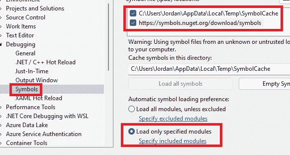
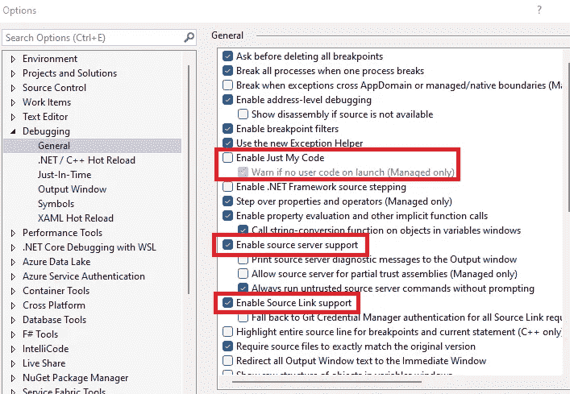

# 发布调试符号—使调试对大众可用

> 原文：<https://levelup.gitconnected.com/publishing-debug-symbols-making-debugging-available-to-the-masses-54e7d8428bfa>

发布 NuGet 包和调试符号让每个使用它们的人的生活变得更容易。如果你不确定如何做到这一点，请继续阅读！


# 背景

如果您是. NET 开发人员，在将第三方包导入到您自己的项目中后，您可能会遇到的第一件事就是您无法单步执行该包的代码…除非您已经设法找到了它的调试符号。

奇怪的是，这似乎是我工作过的许多公司倾向于忽视的东西——在花费大量时间编写供开发人员使用的库时，没有人想到包括调试这些包的简单方法。

在本文中，我将简要介绍您需要做些什么来确保您的符号与您的 NuGet 包一起发布。

为了演示，我编写了下面的库:

[](https://github.com/therealjordanlee/JL.Test.Package) [## GitHub - therealjordanlee/JL。测试包

### 此时您不能执行该操作。您已使用另一个标签页或窗口登录。您已在另一个选项卡中注销，或者…

github.com](https://github.com/therealjordanlee/JL.Test.Package) 

这包含单个字符串扩展方法:

```
public static class StringExtensions
{
    public static void Repeat(this string x, int times)
    {
        if (times <= 0)
            throw new ArgumentOutOfRangeException(nameof(times), "Argument must be greater than 0");for (int i = 0; i < times; i++)
        {
            Console.WriteLine(x);
        }
    }
}
```

我将介绍如何将包和符号发布到 NuGet 提要，网址是:

*   nuget.org
*   天蓝色的艺术品

# NuGet.org

nuget 既是一个 nuget feed，也是一个符号服务器。

出版非常简单:

*   nuget 包在*。nupkg 格式
*   符号包在*。snupkg 格式

## 打包您的代码

`dotnet` CLI 可以用来创建这两个包:

```
dotnet pack -o [output directory] --configuration Release -p:PackageVersion=[semver]-p:SymbolPackageFormat=snupkg
```

下面是对我的示例库运行该命令的输出示例:

```
PS C:\Git\JL.Test.Package\src> dotnet pack -o C:\Temp\build --configuration Release -p:PackageVersion=0.0.1-d --include-source -p:SymbolPackageFormat=snupkg
Microsoft (R) Build Engine version 17.0.0+c9eb9dd64 for .NET
Copyright (C) Microsoft Corporation. All rights reserved.Determining projects to restore...
  Restored C:\Git\JL.Test.Package\src\JL.Test.Package\JL.Test.Package.csproj (in 117 ms).
  JL.Test.Package -> C:\Git\JL.Test.Package\src\JL.Test.Package\bin\Release\netstandard2.1\JL.Test.Package.dll
  Successfully created package 'C:\Temp\build\JL.Test.Package.0.0.1-d.nupkg'.
  Successfully created package 'C:\Temp\build\JL.Test.Package.0.0.1-d.snupkg'.
```

您会注意到，运行这个命令会创建`nupkg`和`snupkg`文件。

## 推销你的包裹

`dotnet` CLI 也可用于将两个包发布到 NuGet.org:

```
dotnet nuget push [package name].nupkg -k [API Key] -s [https://api.nuget.org/v3/index.json](https://api.nuget.org/v3/index.json)
```

您可以通过登录[nuget.org](https://www.nuget.org/)并在下拉菜单中选择 **API 密钥**来创建 API 密钥。


以下是在我的机器上运行该命令的输出:

```
PS C:\Temp\build> dotnet nuget push JL.Test.Package.0.0.1-d.nupkg -k oy2...bu -s [https://api.nuget.org/v3/index.json](https://api.nuget.org/v3/index.json)
Pushing JL.Test.Package.0.0.1-d.nupkg to '[https://www.nuget.org/api/v2/package'](https://www.nuget.org/api/v2/package')...
  PUT [https://www.nuget.org/api/v2/package/](https://www.nuget.org/api/v2/package/)
warn : All published packages should have license information specified. Learn more: [https://aka.ms/deprecateLicenseUrl](https://aka.ms/deprecateLicenseUrl).
  Created [https://www.nuget.org/api/v2/package/](https://www.nuget.org/api/v2/package/) 1334ms
Your package was pushed.
Pushing JL.Test.Package.0.0.1-d.snupkg to '[https://www.nuget.org/api/v2/symbolpackage'](https://www.nuget.org/api/v2/symbolpackage')...
  PUT [https://www.nuget.org/api/v2/symbolpackage/](https://www.nuget.org/api/v2/symbolpackage/)
  Created [https://www.nuget.org/api/v2/symbolpackage/](https://www.nuget.org/api/v2/symbolpackage/) 659ms
Your package was pushed.
```

注意，尽管我只指定了`.nupkg`文件，但是从输出中可以看到`.nupkg`和`.snupkg`文件都被推送了。

一旦完成，你需要等待符号被索引。如果您在 Nuget.org 检查包裹状态，您会看到以下消息:


索引完成后，上面的警告信息将消失，您现在可以选择下载符号:


# 设置 Visual Studio 以使用 NuGet.org 符号服务器

在 Visual Studio 中，转到**工具|选项|调试|符号**并添加符号服务器 URL: `https://symbols.nuget.org/download/symbols`。



这不是必需的，但是你可能想要选择**只加载指定的模块**，否则你将会等待 Visual Studio 尝试为你的项目中的每个 DLL 下载符号。


然后转到**工具|选项|调试|常规**，并确保:

*   **启用仅我的代码**:禁用
*   **启用源服务器支持**:已启用
*   **启用源链接支持**:已启用



现在设置一个断点并开始调试。如果您之前设置了上面的**加载指定模块**选项，符号应该会自动下载。您可以通过浏览符号缓存文件夹并确认符号已下载来检查这一点。


如果您没有指定自动加载包的符号，则需要手动加载它们。

转到**调试|窗口|模块**


在模块窗口中，右击包并选择**加载符号**。


如果一切设置正确，您应该在状态栏中看到**符号已加载**。


您还会看到调试信息已经加载到解决方案资源管理器的外部源下:


现在，您应该能够单步执行包中的代码了


# 天蓝色的艺术品

Azure 工件也可以用作 nuget 提要和符号服务器，但是关于符号服务器的使用有一些警告。

具体来说，索引和发布符号的构建步骤如下:

[](https://docs.microsoft.com/en-us/azure/devops/pipelines/tasks/build/index-sources-publish-symbols?view=azure-devops) [## 索引源和发布符号- Azure 管道

### 注意符号服务器可用于 Azure Artifacts 中的包管理，与 Visual Studio 2017.4 配合使用效果最佳…

docs.microsoft.com](https://docs.microsoft.com/en-us/azure/devops/pipelines/tasks/build/index-sources-publish-symbols?view=azure-devops) 

> 此构建任务仅适用于:
> 
> 对于存储在 Team Foundation Server (TFS)或 Azure Repos 中的 Git 或 TFVC 代码。它不适用于任何其他类型的存储库。

由于我不使用 Azure Repos(也绝不会选择它而不是 GitHub)，我无法让符号发布工作。

然而，有一个可行的替代方法——在包中嵌入符号。

这将增加您的包的大小，因此根据最小化包的大小对您的重要性，这种方法可能不适合您。

下面记录了这些步骤。

## 安装 Azure 工件凭据提供程序

Azure Artifacts 凭据提供程序用于通过 Azure Artifacts nuget 源进行身份验证:

[https://github.com/Microsoft/artifacts-credprovider](https://github.com/Microsoft/artifacts-credprovider)

```
iex "& { $(irm https://aka.ms/install-artifacts-credprovider.ps1) } -AddNetfx"
```

## 更新 csproj 文件以启用嵌入式调试

您可以通过将`<DebugType>embedded</DebugType>`属性添加到 csproj 文件中的第一个**属性组**部分来实现这一点。

```
<PropertyGroup>
    <TargetFramework>netstandard2.1</TargetFramework>
    <Nullable>enable</Nullable>
    <DebugType>embedded</DebugType>
  </PropertyGroup>
```

## 打包代码

和前面一样，使用`dotnet` CLI 创建`nupkg`文件。

```
dotnet pack -o [output directory] --configuration Release -p:PackageVersion=[semver]
```

我的机器输出示例:

```
PS C:\Git\JL.Test.Package\src> dotnet pack -o C:\Temp\build --configuration Release -p:PackageVersion=0.0.2-e
Microsoft (R) Build Engine version 17.0.0+c9eb9dd64 for .NET
Copyright (C) Microsoft Corporation. All rights reserved.Determining projects to restore...
  Restored C:\Git\JL.Test.Package\src\JL.Test.Package\JL.Test.Package.csproj (in 181 ms).
  JL.Test.Package -> C:\Git\JL.Test.Package\src\JL.Test.Package\bin\Release\netstandard2.1\JL.Test.Package.dll
  Successfully created package 'C:\Temp\build\JL.Test.Package.0.0.2-e.nupkg'.
```

## 推送至 Azure 工件

这一步需要 Azure 工件凭证提供者。

```
dotnet nuget push [package name].nupkg -k placeholder -s [https://pkgs.dev.azure.com/jordanleenet/_packaging/jordanleenet/nuget/v3/index.json](https://pkgs.dev.azure.com/jordanleenet/_packaging/jordanleenet/nuget/v3/index.json) --interactive
```

*   这个实例中的 API 键可以是任何值(在这个例子中，我使用值‘placeholder’)
*   只有当你第一次使用 Azure Artifacts 认证时，才需要`--interactive`选项。系统会提示您打开 Azure Devops 的链接以设置初始身份验证。

我的机器的输出如下所示。

```
PS C:\Temp\build> dotnet nuget push JL.Test.Package.0.0.2-e.nupkg -k placeholder -s [https://pkgs.dev.azure.com/jordanleenet/_packaging/jordanleenet/nuget/v3/index.json](https://pkgs.dev.azure.com/jordanleenet/_packaging/jordanleenet/nuget/v3/index.json)
Pushing JL.Test.Package.0.0.2-e.nupkg to '[https://pkgs.dev.azure.com/jordanleenet/_packaging/8b6a50dd-3e7b-4a55-a352-3bf3d250a9f3/nuget/v2/'](https://pkgs.dev.azure.com/jordanleenet/_packaging/8b6a50dd-3e7b-4a55-a352-3bf3d250a9f3/nuget/v2/')...
  PUT [https://pkgs.dev.azure.com/jordanleenet/_packaging/8b6a50dd-3e7b-4a55-a352-3bf3d250a9f3/nuget/v2/](https://pkgs.dev.azure.com/jordanleenet/_packaging/8b6a50dd-3e7b-4a55-a352-3bf3d250a9f3/nuget/v2/)
  Accepted [https://pkgs.dev.azure.com/jordanleenet/_packaging/8b6a50dd-3e7b-4a55-a352-3bf3d250a9f3/nuget/v2/](https://pkgs.dev.azure.com/jordanleenet/_packaging/8b6a50dd-3e7b-4a55-a352-3bf3d250a9f3/nuget/v2/) 1126ms
Your package was pushed.
```

## 在 Visual Studio 中使用嵌入符号

与符号服务器不同，嵌入符号不需要您设置符号服务器。

设置断点并开始调试。在 **Debug | Windows | Modules** 窗口中，你会注意到**符号文件**列将显示嵌入的符号。


您应该能够单步执行包代码，就像从符号服务器加载符号一样。