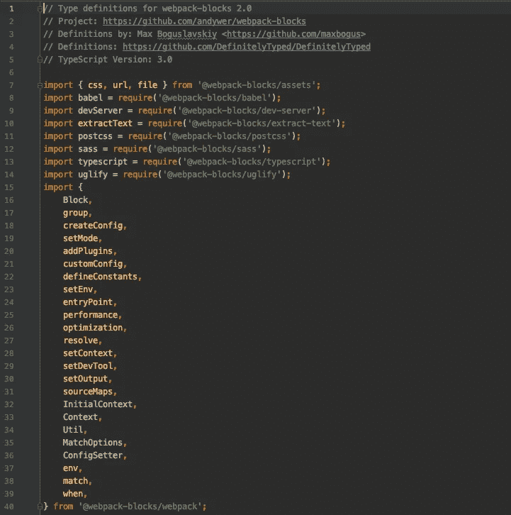

# 将类型发布到明确的类型

> 原文：<https://levelup.gitconnected.com/publishing-typings-to-definitelytyped-d4e0777e40f5>

# 介绍

Typescript 是 JavaScript 的一大补充。不幸的是，并不是每个 JS 包都有 TypeScript 的定义。当然，您可以在您的项目中创建您的自定义定义，但是我相信共享这些定义对于社区来说会更容易:

*   一个大的社区维护着共享的类型
*   审查过程可以提供宝贵的见解
*   这个定义有助于传播打字稿语言

# 出版

在开始之前，我假设您遇到了以下情况之一:

*   默认类型和库不包含您要添加的@type
*   应该更新现有的类型
*   包提供了它的定义，您应该移除 DefinitelyTyped 定义

# 准备

1.  派生明确类型的存储库
2.  在本地克隆它，并为您的更改创建一个分支

# 包装定义的实施

我将流程分为三种类型的活动:添加、更新或删除。

## **添加新包**

1.  在`types`目录— `types/<name_of_package>`中为您要键入的库创建一个文件夹。
2.  准备文件夹结构。最低要求:`index.d.ts`、`<name_of_package>-tests.ts`、`tsconfig.json`、`tslint.json` 。你可以从另一个包中复制它们，但是不要忘记更新信息！
3.  调查你想描述的是哪种类型的包装。您可以在这里研究包的类型:[https://www . typescriptlang . org/docs/handbook/declaration-files/templates . html](https://www.typescriptlang.org/docs/handbook/declaration-files/templates.html)
4.  从编写测试开始。它们为您的使用类型提供了一些保护。用这种方式描述打字更快，并且检查一切都好。对文件名的要求:`<name of package>-tests.ts`。如果您想要提供几个测试文件，请将它们移动到 tests 文件夹中。
5.  编写定义文件(`index.d.ts`)。您可以使用`dts-gen`创建草稿类型。
6.  为您的键入添加描述。提供包装的名称和版本供您键入。它应该与`npmjs.com`上的包装相匹配。Github 上的包链接。列出贡献者。或者，您可以提供一个 Typescript 版本。
7.  写入`tslint`文件。默认情况下，该文件包含唯一链接到具有林挺规则`dtslint` / `dt.json`的父文件的链接。你不应该无缘无故地无视默认的林挺规则。
8.  写`tsconfig.json`。将* ts 文件包含到 tsconfig 的“文件”部分。



index.d.ts 文件示例。

## **编辑现有的包**

*非破坏性变化*

1.  更新定义。检查测试是否涵盖您的软件包使用。如果您的更新提供了新的参数或方法，请添加新的测试。
2.  更新定义。将自己添加为贡献者。如果需要，更新描述中的版本。次要包版本已更新。跳过“补丁”版本。

*突变变化*

1.  阅读重大变更的说明:[(链接)](https://github.com/DefinitelyTyped/DefinitelyTyped#if-a-library-is-updated-to-a-new-major-version-with-breaking-changes-how-should-i-update-its-type-declaration-package)
2.  为新版本提供测试。
3.  将旧版本存储在文件夹中。文件夹的名称必须是:`v<its major version number>`。
4.  将该文件夹添加到`tsconfig.json`的路径中。
5.  更新定义。将自己添加为贡献者。如果需要，更新描述中的版本。次要包版本已更新。跳过“补丁”版本。

## **移除现有包装:**

1.  从`./types`中删除打字
2.  将对象添加到根目录中的`notNeededPackages.json`。
3.  模板[(链接)](https://github.com/sindresorhus/create-html-element):

```
{ 
  “libraryName”: “create-html-element”, 
  “typingsPackageName”: “create-html-element”, 
  “sourceRepoURL”: “sindresorhus/create-html-element”, 
  “asOfVersion”: “2.1.0” 
}
```

# 提交对 DefinitelyTyped 的更改

1.  提交更改
2.  运行`npm test`检查一切正常。
3.  用`npm run lint <name of package>`检查林挺
4.  修复错误
5.  推动变革
6.  通过推送提交中的链接进入 Github
7.  创建拉式请求
8.  通过核对表确认一切正常
9.  选中常规复选框，并在适当的部分选中复选框
10.  等待审阅者的合并或注释

# 建议:

1.  @包。DTS-gen 无法为子包(即@webpack-block/assets)创建正确的类型。这是一个已知的错误。作为一个解决方案，为父包创建类型，并将所有需要的内容复制到子包的类型中。
2.  如果可以的话，重复使用其他类型。
3.  对于全局类型，您应该避免在测试中“导入”。这样，您可以检查一切工作正常。检查指南:[(链接)](https://github.com/DefinitelyTyped/DefinitelyTyped#how-do-i-write-definitions-for-packages-that-can-be-used-globally-and-as-a-module)
4.  Github 提供了优秀的工具来处理合并。你可以通过 github.com 合并简单的冲突。

# 指导

1.  最佳实践|明确分类的[(链接)](http://definitelytyped.org/guides/best-practices.html)
2.  投稿指南|确定类型[(链接)](http://definitelytyped.org/guides/contributing.html)
3.  简介打字稿[(链接)](https://www.typescriptlang.org/docs/handbook/declaration-files/introduction.html)
4.  确定类型/确定类型[(链接)](https://github.com/DefinitelyTyped/DefinitelyTyped)