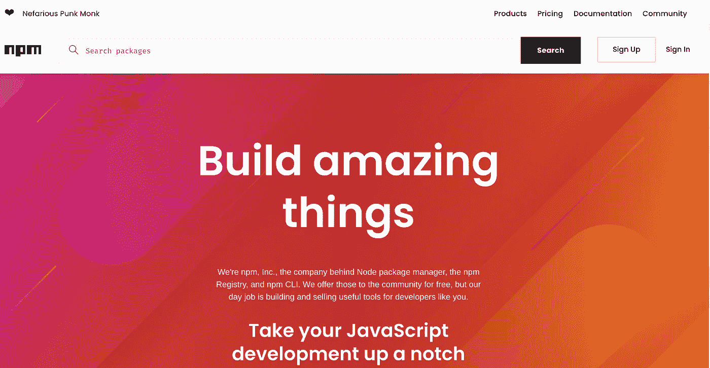
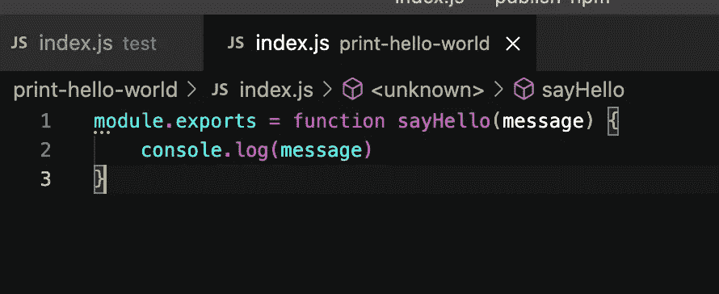
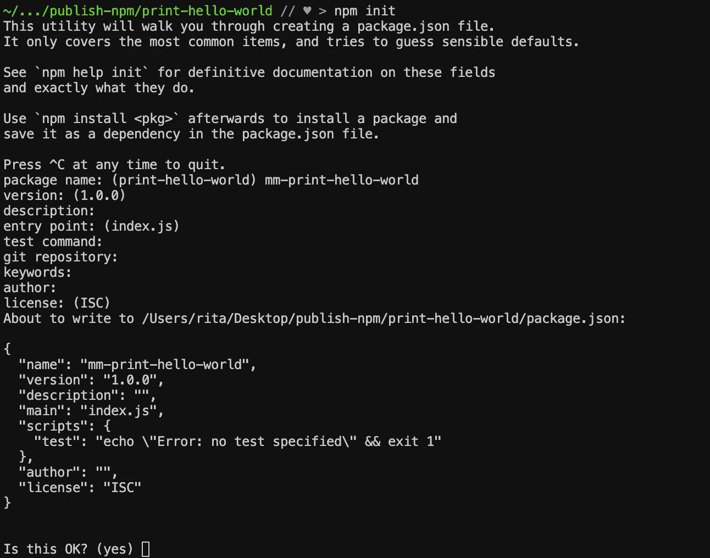
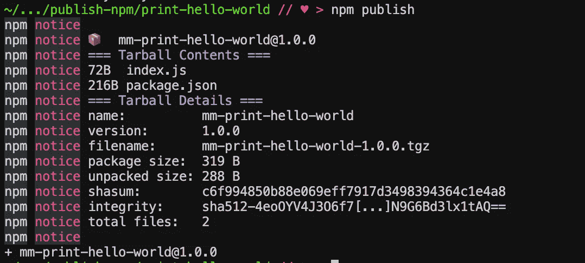
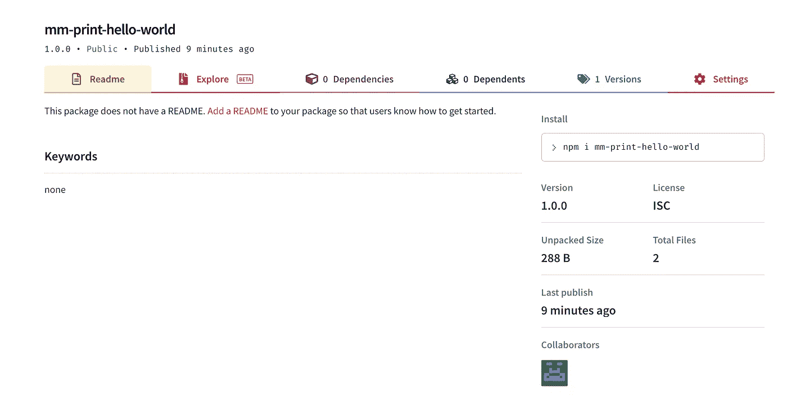
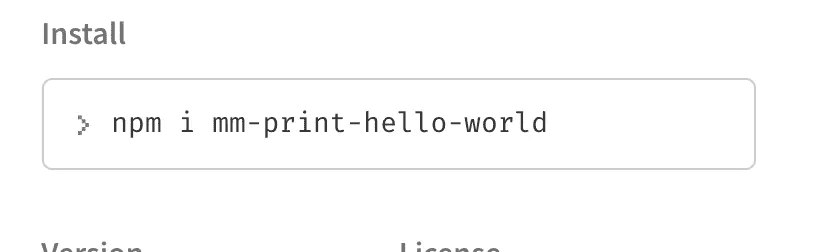
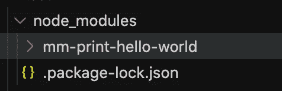

# 发布您的第一个 npm 包

> 原文：<https://levelup.gitconnected.com/publishing-your-first-npm-package-241d0af6c82e>

## 如何发布 npm 包的分步指南



用 npm 创造奇迹

在这篇博文中，我将向您展示在世界上最大的软件注册中心发布您自己的 *npm* 包是多么容易。对于本教程，我创建了一个虚拟文件，我们将一起发布。



索引. js

我创建了一个 *index.js* 文件。这里没有任何花哨的东西，它只是打印“你好，世界！”。为了能够用 ***npm*** 发布我们的包，我们需要创建一个 *package.json* 文件。创建*包. json* 运行

```
npm init
```



输入您的包的名称。因为名称必须是唯一的，所以首先要确保在 ***npm*** 存储库中没有同名的包。我将在我的包裹上添加我的姓名首字母，以确保该名称是唯一的。版本应该是 1.0.0，因为这是第一次发布。如果您愿意，可以为您的包添加描述。默认情况下，入口点和 git 存储库值可以保持不变。添加作者的名字，其余的也可以默认留下。

首先，在我们可以发布我们的包之前，我们必须从 ***npm*** 接收凭证。去[https://www.npmjs.com/](https://www.npmjs.com/)创建一个免费账户。一旦你有了帐号，你就可以用你的用户名和密码用 ***npm*** 发布包了。

在您的终端中运行(确保您在软件包的主目录中)

```
npm login
```

*npm 登录*会将您的凭证连接到本地 ***npm*** 以便您可以发布您的包。输入您的用户名和密码(在输入时，您不会看到您的密码出现在屏幕上——只要继续输入并在完成后按 Enter 键),输入您用来创建 ***npm*** 帐户的电子邮件。

现在运行:

```
npm publish
```

就是这样！此命令将把您的包发布到 npmjs.com 注册表。



现在让我们检查一下我们是否成功发布了我们的第一个包。前往***<https://www.npmjs.com/package/>此处>。*** 给你！恭喜你，你刚刚发布了你的第一个包！



现在，可以使用以下命令在任何机器上安装这个包:



现在，如果我返回并从文件夹中删除我的文件，然后运行上面的命令， ***npm*** 将下载我的包并将其安装在 *node_modules* 目录下。



如果你按照我的教程发布了一个虚拟包到 ***npm*** ，确保你从注册表中删除它。让我们成为负责任的开发者，不要制造不必要的混乱。

奔跑

```
npm unpublish <name-of-your-package> -f
```

此命令将取消发布整个包(您只有 72 小时的时间来删除它)。

希望这个小指南对你有帮助。迫不及待地想看到新的很酷的 npm 包！