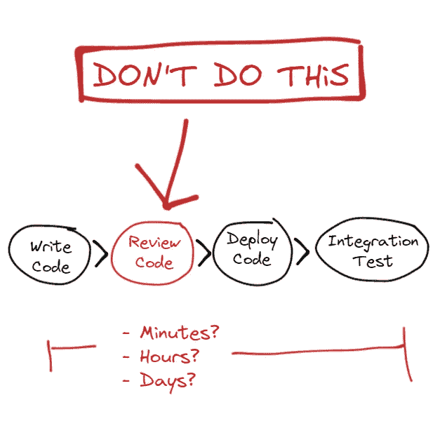
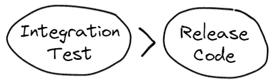
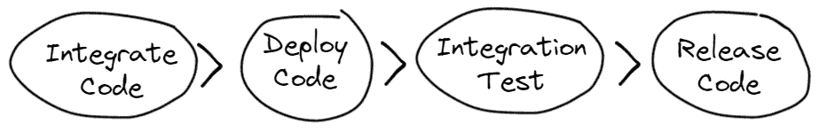
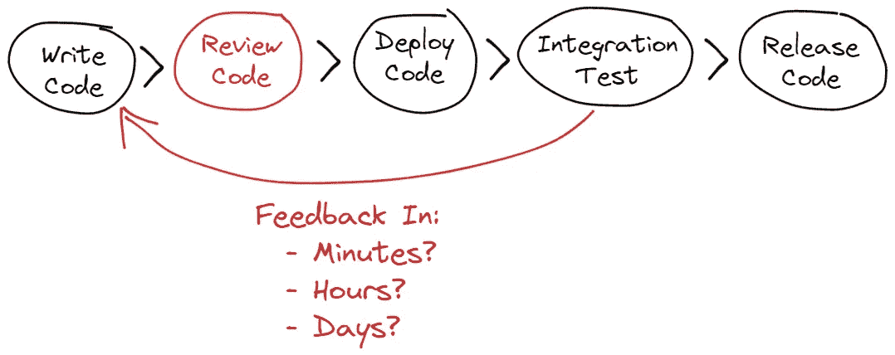
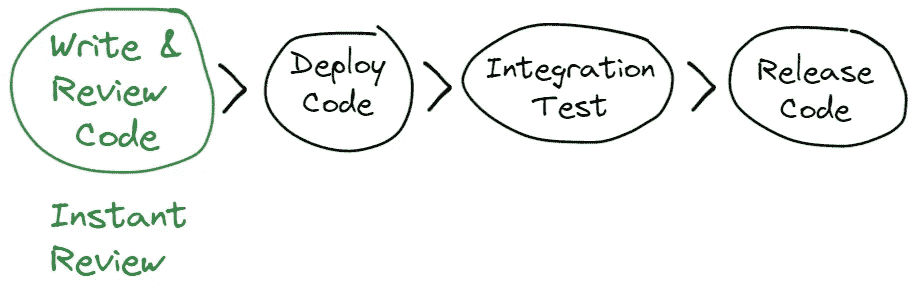
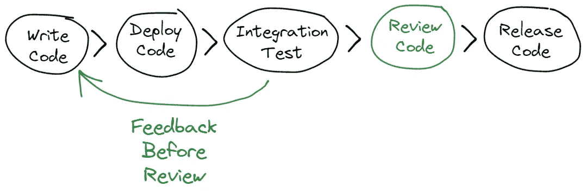
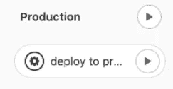

# 拉取请求会降低您的速度

> 原文：<https://levelup.gitconnected.com/pull-requests-are-slowing-you-down-513e35522e9a>

当在软件开发中作为标准代码变更的一部分时，拉请求会减慢连续交付的速度。如果您使用拉式请求，您应该问自己:

*   您每天花费多长时间等待拉动式请求批准？
*   当您打开一个拉取请求时，您有多大把握通过集成测试？
*   不按预期工作的代码被批准了多少次？



拉请求的问题是

# 连续交付需要集成测试

在开发软件时，我们希望尽可能频繁地测试和发布软件，这样我们就可以获得快速的反馈并做出快速的改进。

为了让我们交付软件，我们需要运行集成测试，以便我们可以确认系统的行为并识别任何问题。



发布前的集成测试

但在此之前…

# 集成测试需要代码集成和部署

在运行有效的集成测试之前，我们需要集成我们的代码变更并将其部署到测试环境中。



集成测试前合并和部署

这个过程可以简单到将变更提交到主分支，然后等待自动部署和测试。但是对于许多团队来说，这意味着:

1.  创建带有拉请求的分支。
2.  向其他团队成员发送消息，要求进行代码评审。
3.  查看拉动式请求的备注。
4.  对代码进行更改。
5.  从步骤 2 开始重复，直到提供正确的批准数量。
6.  合并代码，等待部署和测试。

# 拉取请求是如何阻碍的

等待拉取请求批准我们的代码更改可能需要几分钟、几小时，甚至几天。这个时间直接影响我们获得代码变更反馈的能力，因为它发生在我们的集成测试运行之前。



反馈缓慢的问题

我们不应该浪费时间等待我们还没有完全测试过的代码的批准，我们应该致力于在我们对代码有信心的时候获得即时的批准或者完成审查。

# 我们如何移动得更快？

有两个主要的选择来防止拉请求通过减慢你的速度来破坏你的软件开发生命周期。

## 结对编程

在共享屏幕、键盘和/或计算机的同时一起处理代码的两个开发者可以被用来保证在打开和批准拉请求之间的最小停机时间。



结对编程即时复习

这是可行的，因为一起工作的两个开发人员应该理解代码，就实现达成一致，并且同时可用。

## 预发布代码审查

在部署和测试之后、发布之前完成代码评审可以取代对拉请求的需求。这仍然允许相同级别的审查，但是给予开发人员信心和首先运行集成测试的快速反馈。



评审前测试反馈

我们可以通过向部署管道添加一些额外的步骤来实现这个代码审查过程。

首先，我们需要区分当前代码和新版本，这可以通过 git 命令来完成:

```
git diff e237udbas r2bghur392
```

然后，在检查代码变更后，需要手动触发发布。



Gitlab 手动触发器

# 你怎么想呢?

这些仅仅是在连续交付软件时防止拉请求减慢我们速度的一些方法的例子。

你认为这些想法有助于提高你的软件开发吗？在**Twitter:**[@ BenTorvo](https://twitter.com/BenTorvo)或通过**邮箱:**[ben@torvo.com.au](http://torvo.com.au/)告诉我