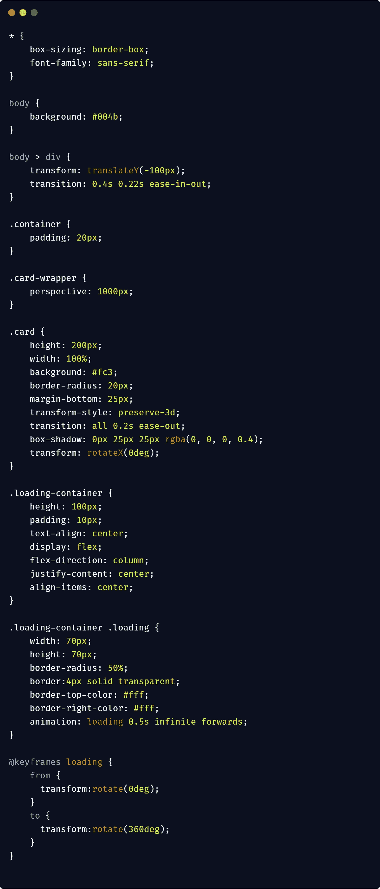

# 用普通的 JavaScript 拉动以刷新动画

> 原文：<https://levelup.gitconnected.com/pull-to-refresh-animation-with-vanilla-javascript-6574d7c4ad24>

照片由 [Pexels](https://www.pexels.com/photo/bokeh-photography-of-person-holding-turned-on-iphone-1440727/?utm_content=attributionCopyText&utm_medium=referral&utm_source=pexels) 的 [Daria Shevtsova](https://www.pexels.com/@daria?utm_content=attributionCopyText&utm_medium=referral&utm_source=pexels) 拍摄

拉动刷新是智能手机上非常流行的滑动手势，允许用户在数据列表上加载新内容。它被用于大多数流行的智能手机应用程序和网络应用程序中，已经成为 UX 的一个主要部分。

[https://codepen.io/Vijit_Ail/full/pmbypw](https://codepen.io/Vijit_Ail/full/pmbypw)(打开 devtools 尝试动画)

几天前我在 [dribbble](https://dribbble.com/shots/4963449-Pull-to-Refresh-Animation) 上看到了上面的动画，所以我想我应该拿出我的版本。

你猜怎么着，我设法不用库或 jQuery 插件，只用普通的 JavaScript 就完成了这个。😎

一个非常简单的标记——一个顶部装载容器，它将包含装载器和一堆卡片。

让我们开始有趣的事情吧😁。

这个想法是默认隐藏加载容器，当用户向下滑动时向下滑动。`**transform-style : preserve-3d**` 将使卡片能够在 3D 空间中定位，并且卡片包装上的**透视**属性将决定用户将如何从他们的视角观看；较低的值将产生更强烈的 3D 效果。*注意*透视图没有在子元素上设置。[关于 CSS 3D 动画和变换的更多信息](https://3dtransforms.desandro.com/)。

这就是我们需要的所有 CSS。现在让我们开始添加滑动手势。

JS 中的触摸事件由触摸事件监听器处理。这些事件类似于鼠标事件，只是它们允许在触摸表面上进行多次触摸。

`pStart`和`pCurrent`对象将存储开始和当前触摸的触摸位置。我们需要这些来找到 Y 坐标的变化，来计算卡片的旋转。

在`swipeStart()`函数中，我们将捕捉触摸坐标并将其分配给`pStart`对象。

在`swipe()`函数中，我们用当前触摸坐标设置`pCurrent`对象。下一步是找到开始位置和当前 Y 位置之间的差异，以计算滑动的距离，并基于 30%的距离进行旋转。只有当距离大于 100 时，装载容器才会出现。

如果触摸已经开始，但没有启用加载，则`swipeEnd()`功能将取消旋转。

在加载时，加载容器将向下滑动 2 秒钟，用于本演示，但在实际示例中，根据服务器的响应，这可能需要更多或更少的时间。一旦装载完成，装载容器和卡片将移回到初始状态。

我从[这个](https://stackoverflow.com/questions/46190436/how-to-detect-pull-to-refresh) stackoverflow 问题中引用了 JavaScript。

我的 [codepen](https://codepen.io/Vijit_Ail/pen/pmbypw) 中的完整源代码。打开 devtools 查看动画效果。

我希望你今天能学到一些新东西😄。如果您有任何问题或对改进代码有任何建议，请随时写下您的回复。

干杯，快乐编码🍻 ✌

 [## 学习 JavaScript -最佳 JavaScript 教程(2019) | gitconnected

### 68 大 JavaScript 教程-免费学习 JavaScript。课程由开发人员提交并投票，从而实现…

gitconnected.com](https://gitconnected.com/learn/javascript)