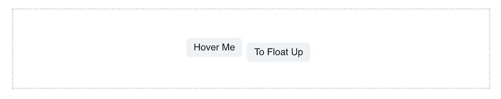

# 悬停效果上的纯 CSS 浮动

> 原文：<https://levelup.gitconnected.com/pure-css-float-on-hover-effect-ecf4473e8a8a>



这个故事最早发表在 coffeeclass.io 上([https://www . coffee class . io/snippets/make-div-float-up-hover-CSS](https://www.coffeeclass.io/snippets/make-div-float-up-hover-css))。阅读那里的故事，了解代码语法突出显示和交互式示例。

在这个一步一步的片段中，您将学习如何向`HTML`元素添加一个简单的`css`悬停动画。

# 密码

```
<div class="flex-wrapper">
  <div class="tag">
    <p>Hover Me</p>
  </div>
  <div class="tag">
    <p>To Float Up</p>
  </div>
</div>

<style>
  .flex-wrapper {
    display: flex;
    height: 5px;
  }

  .tag {
    margin-right: 2px;
    transition: margin 0.2s ease-in-out;
    background-color: gray;
  }

  .tag:hover {
    margin-top: -2;
  }
</style>
```

上面的代码是基本的`HTML`。在这个片段的后面，我将向您展示 React 实现和 Chakra UI 实现。

# 步骤+解释

## 添加 HTML 标记

带有类名的基本`HTML`标记。

```
<div class="flex-wrapper">
  <div class="tag">
    <p>Hover Me</p>
  </div>
  <div class="tag">
    <p>To Float Up</p>
  </div>
</div>
```

## 定义包装 CSS

我们将制作包装器`flex`，并将高度设置为`5px`。高度可以是你想要的任何高度。

```
<style>
  .flex-wrapper {
    display: flex;
    height: 5px;
  }
</style>
```

## 定义标签 CSS

这两种风格都是可选的和主观的。

```
<style>
  .tag {
    margin-right: 2px;
    background-color: gray;
  }
</style>
```

## 创建悬停状态

当用户悬停在标签上时，`margin`会变为“-2”。如果您尝试这段代码，您会注意到标签会向上跳，而不是很好地浮动。

```
<style>
  .tag:hover {
    margin-top: -2;
  }
</style>
```

## 添加 CSS 过渡

我们可以使用一个`transition`让标签很好地浮动。这个过渡被添加到`tag`类中。

```
<style>
  .tag {
    margin-right: 2px;
    transition: margin 0.2s ease-in-out; // Add the transition
    background-color: gray;
  }
</style>
```

# 更进一步

让我们进一步看看一些代码位。

# css 转换

## 定义

> CSS 过渡提供了一种在更改 CSS 属性时控制动画速度的方法。您可以使属性的更改在一段时间后生效，而不是立即生效。例如，如果您将元素的颜色从白色更改为黑色，通常这种更改是即时的。启用 CSS 转换后，更改会按照加速曲线的时间间隔发生，所有这些都可以自定义。

## 我们如何使用过渡

在我们的例子中，我们的转换看起来像:

```
transition: margin 0.2s ease-in-out;
```

进一步细分，我们有:

*   `margin` -我们正在改变的属性
*   `.2s` -完成过渡所需的时间
*   `ease-in-out` -缓解功能

# 缓进缓出

## 定义

> 向内和向外放松类似于汽车加速和减速，如果使用得当，可以提供比仅仅放松更具戏剧性的效果。— [谷歌开发者](https://developers.google.com/web/fundamentals/design-and-ux/animations/the-basics-of-easing)

# 常见错误

以下是一些常见的错误以及如何避免它们。

*   没有定义的`height`

如果您没有定义好的`height`，那么当您在标签之间快速移动时，标签布局将会改变。这是因为您所悬停的标签会变大，导致包装器也变大并产生布局偏移。

> 请参见[https://www . coffee class . io/snippets/make-div-float-up-hover-CSS](https://www.coffeeclass.io/snippets/make-div-float-up-hover-css)获取此操作的演示

这与上面的代码完全相同，只是我们没有定义`height`。

```
.flex-wrapper {
  display: flex;
  // height: 5px; // <-- this line is removed
}
```

*   将`transition`添加到错误的元素

确保你添加的是每个`tag`的`transition`，而不是`wrapper`。

# 反应示例

下面是带有内联样式的 react 代码。

```
import React from 'react'

export default function make-div-float-up-hover-css() {
    return (
        <div style={{border: '2px dotted', borderColor: 'gray', padding: '10px 0', marginTop: '4px'}}>
            <div style={{display: 'flex', margin: '4px 0', justifyContent: 'center', height: 5}}>
                <div style={{marginRight: 2, transition: 'margin .2s ease-in-out'}} _hover={{marginTop: 2}}>
                    <p>Hover Me</p>
                </div>
                <div style={{marginRight: 2, transition: 'margin .2s ease-in-out'}} _hover={{marginTop: 2}}>
                    <p>To Float Up</p>
                </div>
            </div>
        </div>
    )
}
```

一些特定的主观风格与示例略有不同。即`border`、`borderColor`，标签颜色/尺寸。

# Chakra UI 示例

```
import { Flex, Tag, Text, Box, useColorModeValue } from "@chakra-ui/react";

export default function FloatUpDivAnimation() {
  return (
    <Box
      border="2px dotted"
      borderColor={useColorModeValue("gray.300", "gray.100")}
      py={10}
      mt={4}
    >
      <Flex my={4} justifyContent="center" h={5}>
        <Tag
          mr={2}
          size="lg"
          transition="margin .2s ease-in-out"
          _hover={{ mt: "-2" }}
        >
          <Text>Hover Me</Text>
        </Tag>
        <Tag
          mr={2}
          size="lg"
          transition="margin .2s ease-in-out"
          _hover={{ mt: "-2" }}
        >
          <Text>To Float Up</Text>
        </Tag>
      </Flex>
    </Box>
  );
}
```

*原载于 2021 年 8 月 23 日*[*https://www . coffee class . io*](https://www.coffeeclass.io/snippets/make-div-float-up-hover-css)*。*