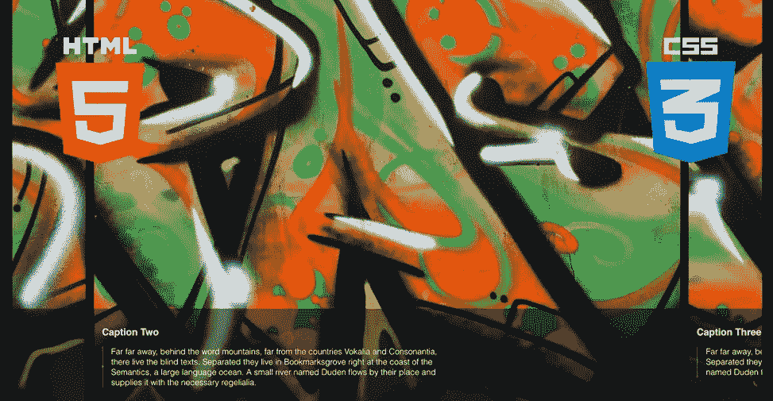
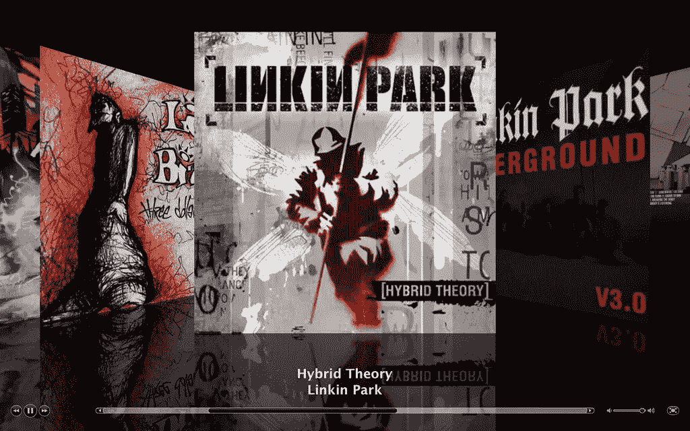
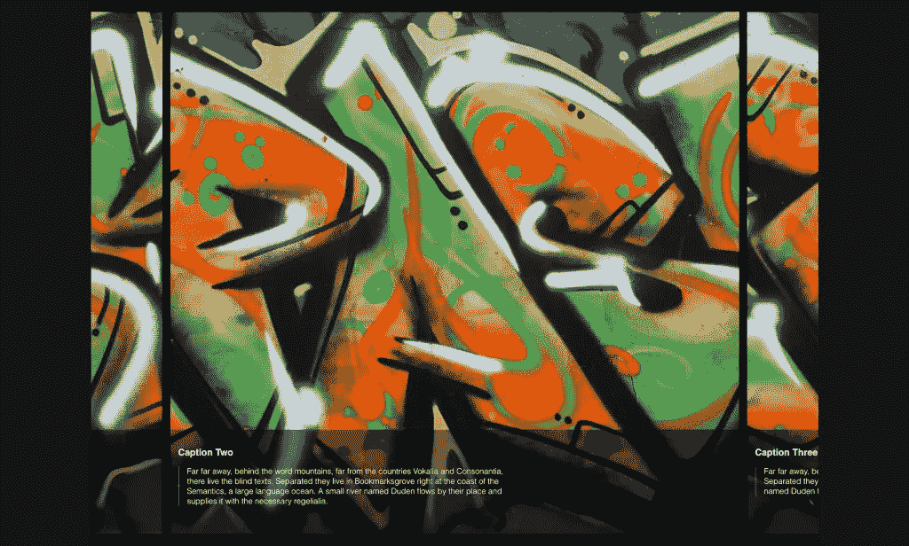

# 纯 CSS 滑块—使用滚动捕捉

> 原文：<https://levelup.gitconnected.com/pure-css-slider-using-scroll-snap-93084b85f251>



滚动捕捉就像它听起来的那样——滚动时*捕捉*或*锁定*到某个位置。当滚动浏览网站或图片库等内容时，我们通常喜欢让我们正在滚动的内容在特定位置锁定*或*锁定*或*作为辅助滚动的手段。

iTunes 的 Cover Flow 视图就是一个很好的例子。



iTunes Cover Flow 视图

# 使用

纯 CSS 滚动捕捉使用属于 *CSS 滚动捕捉模块*的属性。该系统基于 div 之间的父子关系(我们将在下面的例子中看到)，并分别使用 CSS 属性— `scroll-snap-type`和`scroll-snap-align`。

```
.parent {
 scroll-snap-type: x mandatory;
}.child {
 scroll-snap-align: start;
}
```

现在，让我们继续设置我们的工作区。对于我们的例子，我们将使用一个非常基本的，精简的，非花哨版本的 Cover Flow 视图。当我们水平滚动 X 轴时，我们可以滚动图像和它们的标题，并锁定在屏幕的中心。我们将使用来自 [UnSplash](https://unsplash.com/) 的图像，并为标题使用一些虚拟文本。

让我们看看代码。

## 超文本标记语言

```
<div class="parent">
   <div class="child">
     
     <div class="caption">
       <h3>Caption One</h3>
       <p>Far far away, behind the word mountains, far from the countries Vokalia and Consonantia, there live the blind texts. Separated they live in Bookmarksgrove right at the coast of the Semantics, a large language ocean. A small river named Duden flows by their place and supplies it with the necessary regelialia.</p>
     </div>
   </div>
</div>
```

类别为`.parent`的 div 元素是我们的父元素。`.child` div 元素就是，你猜对了——子元素。在这个子元素中，我们设置了一个图像。在这个图片下面是一个`.caption` div 元素，它包含一个标题和段落。在这个例子中，我们将再复制 4 次`.child` div 来制作 5 张幻灯片。

## 半铸钢ˌ钢性铸铁(Cast Semi-Steel)

```
body {
 font-family: sans-serif;
 font-size: 16px;
 font-weight: 300;
 background-color: #151515;
 margin: 0;
 height: 100vh;
 color: #fff;
}

p {
 line-height: 1.25rem;
 padding-left: 1rem;
 border-left: 2px solid rgba(255, 255, 255, 0.25);
}
```

对于身体，你可以看到我们没有做任何花哨的东西。这里我们所拥有的是一个全视口高度`100vh`，重置默认的浏览器边距，并设置背景颜色，因为...为什么不呢？

对于这一段，我们已经添加了一些左填充和边界，使它有点花哨。我们还设置了一个`max-width`，这样我们就不会在一行中有太多的单词，从而保持可读性。

让我们从设计`.parent`元素开始。

```
.parent {
 display: flex;
 padding: 1rem;
 width: 80%;
 height: 100%;
 margin: 0 auto;
 background-color: #000;
 overflow-x: scroll;

 scroll-snap-type: x mandatory;
}
```

你在这里看到的大多数 CSS 都是基本样式，除了我们使用了`display: flex`，因为我们将在`.child`元素中使用 CSS 属性`flex-grow`。`overflow`属性用于隐藏在`.parent`的集合边界内包含`.child`元素的溢出。此外，没有它，快照功能将无法工作。

现在这里有一个关键的玩家:T0。该属性接受两个参数——第一个参数是`x`或`y`——要么是 x 轴，要么是 y 轴。第二个是我们在这个例子中坚持使用的，即`mandatory`。这将确保当你滚动一点点时，子元素锁定在原位。更大的滚动量会让你跳到下一张幻灯片。更多选项，您可以访问 [MDN 网络文档](https://developer.mozilla.org/en-US/docs/Web/CSS/scroll-snap-type)。

现在让我们看看`.child`元素的 CSS。

```
.child {
 position: relative;
 margin: 0.5rem;
 border-radius: 10px;

 scroll-snap-align: center;
}
```

这里，`position`的值为`relative`，因为其中的`.caption` div 需要一个`absolute`的`position`。`margin`是在每个子元素之间创建一些空间。

元素的关键 CSS 是属性。该属性最多接受 x 和 y 轴的两个值，或者 block 或 inline，但是我们将只使用一个值，在这里，我们使用了`center`(记住，我们希望将子元素放在屏幕的中心)。或者，您可以使用`start`或`end`来定位它们。

使用下面的 CSS，我们只是要-

*   对图像进行样式化，使它们能够很好地适应`.child`元素
*   样式和位置的`.caption` div，同时也给它一个统一的固定高度
*   使用`:nth-child()`设计每个`.child`元素的样式，使用`flex-grow`给它们不同的宽度。

```
width: 100%;
 height: 100%;
 object-fit: cover
}

.child .caption {
 position: absolute;
 bottom: 0;
 padding: 1rem;
 height: 210px;
 background-color: rgba(0, 0, 0, 0.5)
}

.child:nth-child(1) {
 flex: 0 0 100%
}

.child:nth-child(2) {
 flex: 0 0 80%
}

.child:nth-child(3) {
 flex: 0 0 100%
}

.child:nth-child(4) {
 flex: 0 0 50%
}

.child:nth-child(5) {
 flex: 0 0 100%
}
```

现在，我们的浏览器输出应该是这样的(没有图像):



浏览器输出

还有，这是笔:)

密码笔

# 浏览器支持

全球浏览器对 Scroll Snap 的支持为 92.07%。要了解更多信息，你可以查阅[can use](https://caniuse.com/#search=scroll%20snap)。

现在你知道了！就是这么简单容易！

*原载于 2020 年 4 月 7 日*[*https://www.aritsltd.com*](https://www.aritsltd.com/blog/frontend-development/pure-css-slider/)*。*