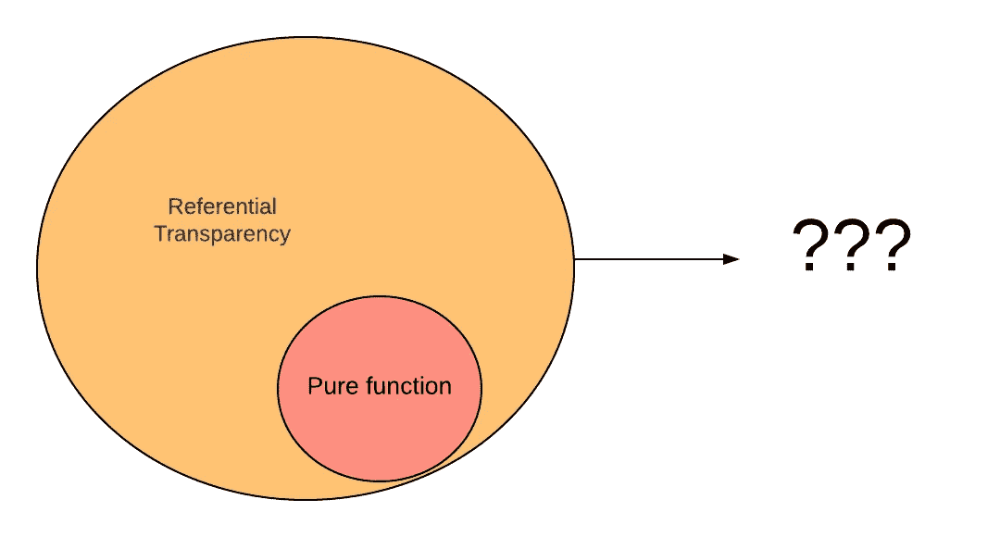
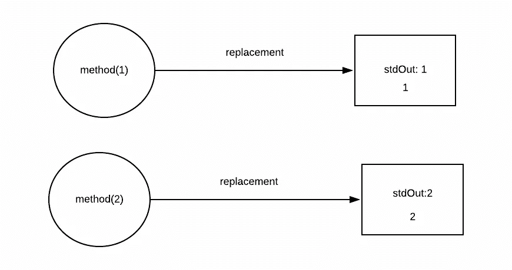

# 纯函数与参照透明性

> 原文：<https://levelup.gitconnected.com/pure-function-vs-referential-transparency-7192553d9d1>



*最初发表于*[](https://edward-huang.com/functional-programming/tech/programming/scala/2020/01/30/pure-function-vs-referential-transparency/)**。**

*今天我在给同事们讲授 scala 课程中的函数式编程，并提出了一些关于纯函数和引用透明性的问题。其中一个问题比较棘手，测试当前函数是否纯。事情是这样的:*

```
*val one = 1
def method(num:Int) : Int = {
  one + num
}*
```

*这个问题给出了一个有趣的讨论，函数在哪里是纯的或者不是纯的。其中一位同事说，这是一个纯函数，因为同样的输入，你总是得到同样的输出。然而，在一个纯函数中，它在定义中提到它没有“后门”，这意味着它不依赖于函数范围之外的任何隐藏值。*

*这个函数纯不纯？*

*我给了一个答案提到基于纯函数定义，它是不纯的。*

*我错了。*

*答案是这个函数是纯函数，它是引用透明的。*

*在我们讨论纯函数和引用透明性之前，让我们先讨论一下这些术语是什么。*

# *什么是纯函数*

*一个纯函数依赖于输入参数和算法来产生结果。*

*对于一个纯函数来说，输出依赖于输入函数，你不必担心相同的输入函数会产生不同的输出函数。*

*pure 函数还具有没有副作用的功能。有什么副作用？*

*你可以认为副作用是任何使功能不可预测的东西。你希望你的函数是可预测的，这样你就永远不需要为函数的输出绞尽脑汁。*

*通常，纯函数是在运行时 100%产生相同输出的函数。*

*`foreach`仅用于其副作用。*

```
*def foreach(f:(A) => Unit):Unit*
```

*`foreach`不产生任何回报的事实并不是一个纯粹的函数，因为该函数意味着产生副作用，比如`println`或者修改内部的某些变量。*

*副作用意味着它依赖于任何外部 I/O。一个纯粹的功能不能依赖于来自文件、数据库、web 服务、UI 的输入；它不能产生输出，如写入文件、数据库或 web 服务。*

*关于纯函数的另一个重要的事情是，如果一个函数是纯的，它也是引用透明的。*

# *什么是参照透明性*

*如果你以前从未接触过函数式编程，你可能从未听说过这个术语。在我从事 Scala 项目之前，我从未听说过引用透明。面向对象编程在软件开发中非常流行，在软件工程师的面试中，这 4 个原则被广泛讨论，以测试候选人对面向对象编程的理解。然而，越来越多的应用程序是建立在函数式范例之上的，而引用透明性就像函数式编程的原则之一。*

*引用透明性意味着您可以用它的值替换函数，并获得相同的输出。*

*您可以构建一个映射，将函数作为键，将值作为键的另一个表示，并且可以确保无论在什么场景下，键-值对总是保持不变。*

*举个例子:*

```
*def square(x:Int) : Int = x * x*
```

*当你执行`square(2)`时，你将得到 4。你可以在运行时用`x*x`替换`square(x)`，它会得到相同的输出，而不会真正改变程序的行为。因此，`square(1) + square(2)`可以用`1*1 + 2*2`替换，它仍然会产生相同的值。*

*非参照透明的一个例子:*

```
*def addRandom(x:Int) : Int = {
  (new util.Random).nextInt(10) + x
}*
```

*上面的示例代码不是引用透明的，因为您不能用该函数中任何定义的值替换`addRandom`来获得相同的输出——即`addRandom(1) ≠ addRandom(1)`。*

*另一个非引用透明的例子是 Future:*

```
*for {
  _ <- Future{println("Future1")}
  _ <- Future{println("Future1")}
} yield {}*
```

*未来陈述本质上是[热切](http://scalapro.net/scala-futures-traverse-and-side-effects/)的。因此，它向控制台打印两次。但是，如果 Future 是参照透明的，如果您这样做，它也会打印两次:*

```
*val f = Future{println("Future1")}
for {
  _ <- f
  _ <- f
} yield {}*
```

*但是，在这种情况下，未来只能打印一次。它表明，未来是不透明的。*

# *纯函数等于指称透明吗？*

*声明:有很多关于[纯度 vs](https://stackoverflow.com/questions/4865616/purity-vs-referential-transparency) 参照透明的[讨论](https://www.reddit.com/r/haskell/comments/21y560/purity_and_referential_transparency_are_different/)，不同的人对它的实际含义有不同的看法。本文基于我在学习函数式编程语言 Scala 的过程中的观点和观察。*

*纯函数是参照透明的子集。为什么？因为要纯粹，你不需要有副作用和参照透明。然而，反过来可能就不对了。*

*拿这个函数来说:*

```
*def method(x:Int) : Int = {
  println(x)
  x
}*
```

**

*这个函数是引用透明的，因为您可以用 print 语句和 x 来更改底层方法；它产生相同的结果。`method(1)`将始终等于`method(1)`，`method(42)`可以替换为`print(42); 42`。但是，这个函数并不纯粹，因为它有一个 IO，print 语句。*

# ***2020 年 05 月 30 日更新**:*

*学习函数式编程一段时间后，我想修改一下我写的这个语句。如果一个函数是参照透明的，那么它也是纯的。正如在 Scala 的 [Functional 中提到的，表达式是引用透明的——在任何程序中，表达式都可以被它的结果替换，而不会改变程序的含义。如果用引用透明参数调用一个函数也是引用透明的，我们可以说这个函数是纯的。](https://www.manning.com/books/functional-programming-in-scala)*

# *主要外卖*

*   *如果一个函数不是引用透明的，请注意具有相同输入的函数被多次调用时会产生一些意外的输出。*
*   *纯函数比引用透明性更具约束性。*

*感谢阅读！如果你喜欢这篇文章，请随意[订阅](https://edward-huang.com/subscribe/)我的时事通讯，每周都会收到关于科技职业的文章、有趣的链接和内容！*

*你可以关注我，也可以在[媒体](https://medium.com/@edwardgunawan880)上关注我，以获得更多类似的帖子。*