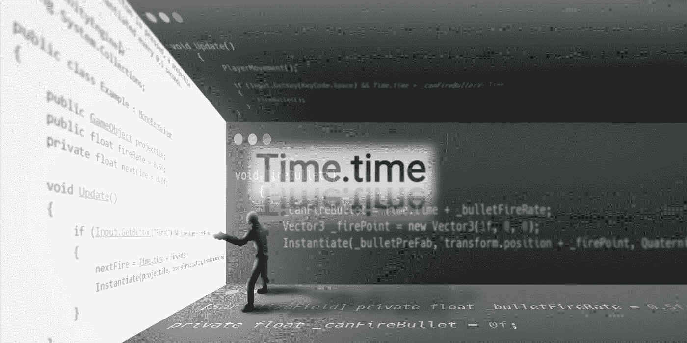
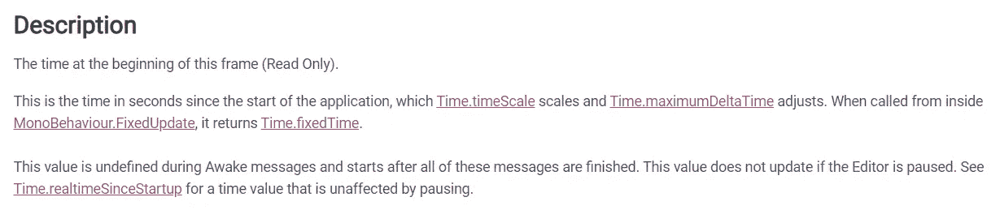
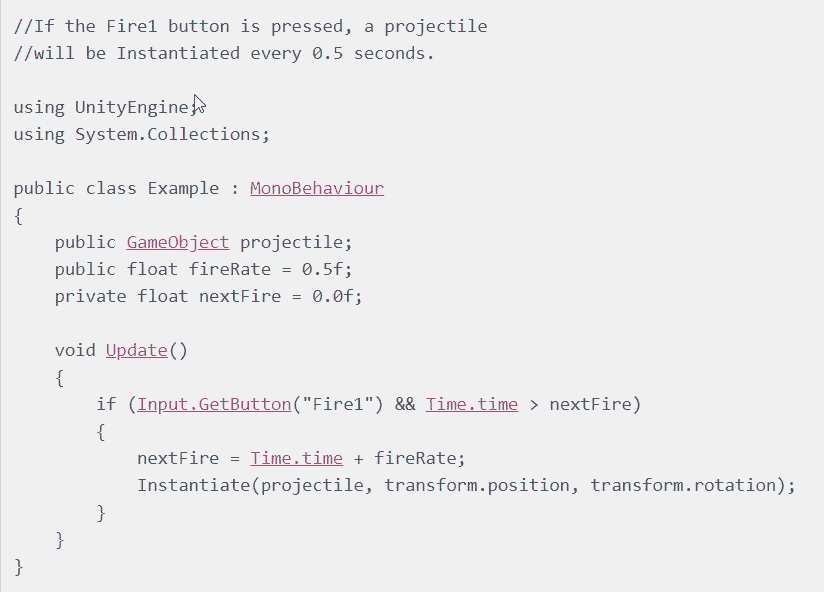
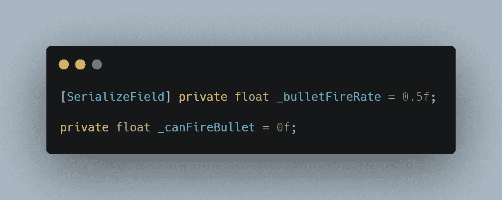
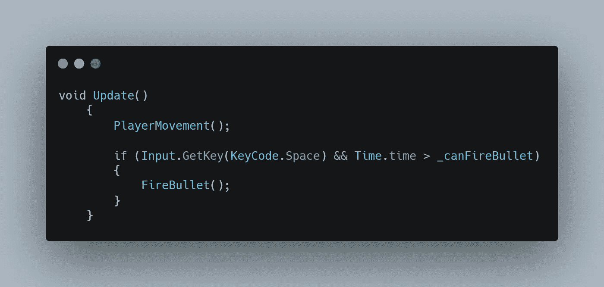
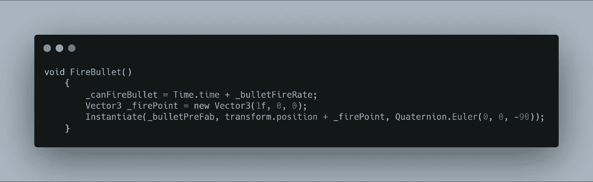

# 通过在 Unity 中创建一个冷却系统来控制手枪

> 原文：<https://levelup.gitconnected.com/put-a-leash-on-that-pistol-by-creating-a-cooldown-system-in-unity-f5c36f3532be>

在我的上一篇文章中，玩家通过实例化预置获得了射击子弹的能力。每当用户按下空格键，子弹就会发射，不管他们按得多快。在这篇文章中，我将介绍如何在火技能上设置一个总督。

发射机制可以有一个定时器延迟，基本上是说，“你只能每隔 X 秒发射一次。”为了使用那个定时器，我需要使用 real time，可以用 **Time.time** 统一完成。

时间被认为是一种**浮动**，可能是因为它以微小的增量流逝，比如一秒的几分之一。

从下一个片段中可以看出一些重要的事情，时间**代表**，是从**游戏**开始**到**结束**的时间。如果游戏已经运行了 **8 秒**，你就有了 **8** 的 Time.time **变量**。游戏运行的**时间越长**，这个变量就变得越大**。****

Unity 给了我们一个使用 Time.time 的**例子**，而它恰好是关于**如何在一个射击机制**上实现一个冷却系统。没有比这更简单的了！

为了在我的游戏中加入这个额外的例子，我首先需要一些变量。我把**射速**变量默认设置为 **0.5f** ，这样会让玩家每隔**半秒**发射一颗子弹。然后**序列化**字段**字段**，这样我就可以**稍后从**检查器**调整**该值。我还需要另一个变量，让我的**可以触发**，我将它设置为**零**，原因我稍后会谈到。

在我的更新方法中，我使用**检查**空格**键进行输入，我使用 **& &** 运算符来检查两个条件。如果空格键被**按住**并且(& & ) **Time.time** (游戏开始后经过的时间)大于**可以发射**变量(零)，子弹将会发射。**

这里是一切汇集的地方。由于游戏已经运行了**比**零秒**(time . time>_ canFireBullet)长**，玩家可以发射一颗子弹。之后，在发射子弹方法中，**可以发射**变量，通过**将** Time.time 加到我们的发射率上，得到一个**新值**。现在可以开火的值就是我们的时间.时间值**加上** 0.5 从射速。也就是说，Time.time 的**不会大于**的**新**可以开火的数值，所以玩家不能开火。Time.time 保持**更新，**所以在一个**半秒**(射速)后，Time.time 的值将再次大于**，玩家可以再次开火！**

****