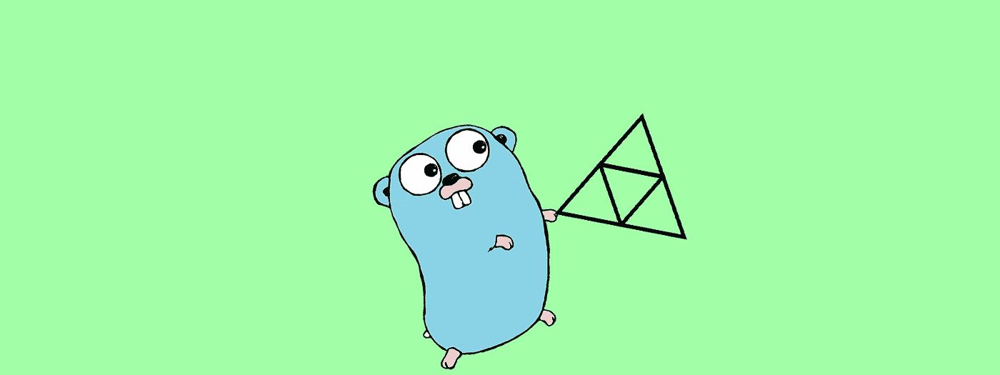
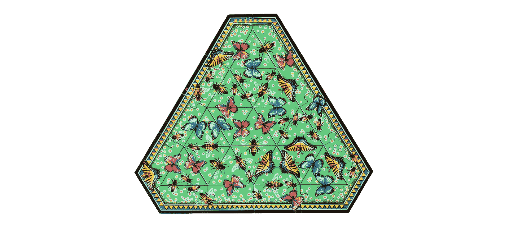
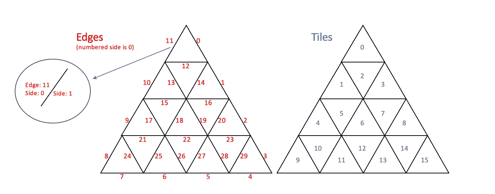

# 围棋中的困惑

> 原文：<https://levelup.gitconnected.com/puzzling-in-go-be2b51039cda>



标志归功于 golang.org

使用 Go 通过回溯解决一个难题。

最近给女儿买了个拼图。这不是一个普通的谜题，它被称为 [Triazzle](https://www.amazon.com/Triazzle-Brain-Teaser-Puzzle-Pollinators/dp/B07D4MZK62) ，其特点是三角形的碎片平铺在三角形的板上。有趣的是，拼图图像是蜜蜂和蝴蝶的图案，因此在任何三角形的边缘，它都以标准的方式将生物分开。例如，一个三角形的边上有一只大蜜蜂飞出，另一个边上有一只小蜜蜂进入，这样这两个边就很匹配。结果是所有的边缘图案必须匹配以“解决”该难题。我们做了一次，然后我们对有多少实际解(和无解)感到好奇。让我们弄清楚。



在高层次上，有 16 个三角形的棋子可以放在棋盘上的 16 个位置。所以，重温一下你的数学技能，这里有 16 种阶乘排列。每个棋子可以旋转到 3 个不同的方向(它们是等边三角形)，这意味着每个位置的棋子有 3 个⁶方向。这是*巨大的* 16！是 20，922，789，888，000，3 ⁶是 43，046，721。将两者相乘，你就得到了 **9.006574988503573e20** 棋盘的可能配置。

# 抓住问题

我们将从拼图建模开始；我们需要以数字方式捕获数据结构中的难题，这样我们就可以有计划地对其采取行动。我们将首先定义一些有助于我们命名结构的术语。

**谜题**有如下内容:

*   十六个三角形**件。**
*   一个**棋盘**由十六个**棋子**组成，一个棋子是棋盘上放置棋子的位置。
*   板子有三十个**边，每个边有两个**边**。每个瓷砖有 3 条边，其中一条边位于瓷砖片的内部。**
*   十二条边形成拼图**边框。**

我们将对组件进行任意编号，这样我们就可以在代码中捕获几何图形。



这为我们如何构建数据结构提供了蓝图。首先，让我们确定需要匹配的不同模式。因为每一个都被一条边分开，所以我们在瓷砖上有一半。我对这些模式的简单描述是:

左右大蜜蜂，前后大蜜蜂，小蜜蜂，条纹蝴蝶，蓝蝴蝶，粉蝴蝶。六种不同的独特模式，每一种都分成两半，所以我们只对它们使用一组常量。

```
package mainimport (
    "fmt"
    "math"
    "time"
)//Unique patterns to match, each bisected side
const (
    lBigBee     = iota //Left of Big Bee
    rBigBee            //Right of Big Bee
    fBigBee            //Front of Big Bee
    bBigBee            //Back of Big Bee
    fLittleBees        //Front of Little Bees
    bLittleBees        //Back of Little Bees
    fStripeBfly        //Front of Stripe Butterfly
    bStripeBfly        //Back of Stripe Butterfly
    lBlueBfly          //Left of Blue Butterfly
    rBlueBfly          //Right of Blue Butterfly
    fPinkBfly          //Front of Pink Butterfly
    bPinkBfly          //Back of Pink Butterfly
)
```

让我们考虑一下，我们想问程序和数据结构什么问题。立刻，一个重要的问题浮现在脑海:我们所有的边都匹配吗？我们可以将其分解为“边缘匹配吗？”我们需要一个数据结构来捕捉边上的两边，这样我们就可以确定匹配。我们需要问的另一个问题是:所有作品的位置和方向是什么？我们所说的位置是指每个棋子在棋盘上的位置，有 16 种不同的位置。所谓方向，我们指的是它们是如何旋转的，因为每一个三角形都可以被定位在三个不同的位置。因此，每个瓷砖可以包含一块与位置和方向，我们必须能够比较每个边缘。

我们的数据结构(和数据)看起来像:

```
//Each pattern can extend onto the border
//so need to initialize the outside puzzle border
var border = [12]int{bBigBee, bStripeBfly, fLittleBees, bStripeBfly, lBlueBfly, lBigBee, fPinkBfly, bLittleBees, bPinkBfly, rBlueBfly, fBigBee, fPinkBfly}//Traingular puzzle pieces
var pieces = [16][3]int{
    {fLittleBees, fPinkBfly, lBlueBfly},     //0
    {fBigBee, lBlueBfly, bPinkBfly},         //1
    {bPinkBfly, fBigBee, lBigBee},           //2
    {bBigBee, fPinkBfly, rBigBee},           //3
    {bStripeBfly, bStripeBfly, rBigBee},     //4
    {fBigBee, bPinkBfly, bPinkBfly},         //5
    {fStripeBfly, rBigBee, bBigBee},         //6
    {lBlueBfly, rBlueBfly, lBigBee},         //7
    {fStripeBfly, rBlueBfly, lBigBee},       //8
    {bPinkBfly, fPinkBfly, lBlueBfly},       //9
    {fStripeBfly, rBlueBfly, lBlueBfly},     //10
    {fStripeBfly, fStripeBfly, rBlueBfly},   //11
    {rBigBee, bLittleBees, rBlueBfly},       //12
    {fPinkBfly, bPinkBfly, fLittleBees},     //13
    {fPinkBfly, bBigBee, fLittleBees},       //14
    {bLittleBees, bLittleBees, bStripeBfly}, //15
}//Each edge of a tile refers to the edge list
//and identifies which side faces inward to the tile
type Tile struct {
    edgeRef [3]int
    sideRef [3]int
}var board = [16]Tile{
    {[3]int{11, 0, 12}, [3]int{1, 1, 1}},  //0
    {[3]int{10, 13, 15}, [3]int{1, 0, 1}}, //1
    {[3]int{13, 12, 14}, [3]int{1, 0, 1}}, //2
    {[3]int{14, 1, 16}, [3]int{0, 1, 1}},  //3
    {[3]int{9, 17, 21}, [3]int{1, 0, 1}},  //4
    {[3]int{17, 15, 18}, [3]int{1, 0, 1}}, //5
    {[3]int{18, 19, 22}, [3]int{0, 1, 1}}, //6
    {[3]int{19, 16, 20}, [3]int{0, 0, 1}}, //7
    {[3]int{20, 2, 23}, [3]int{0, 1, 1}},  //8
    {[3]int{8, 24, 7}, [3]int{1, 0, 1}},   //9
    {[3]int{24, 21, 25}, [3]int{1, 0, 1}}, //10
    {[3]int{25, 26, 6}, [3]int{0, 1, 1}},  //11
    {[3]int{26, 22, 27}, [3]int{0, 0, 1}}, //12
    {[3]int{27, 28, 5}, [3]int{0, 1, 1}},  //13
    {[3]int{28, 23, 29}, [3]int{0, 0, 1}}, //14
    {[3]int{29, 3, 4}, [3]int{0, 1, 1}},   //15
}//Keep track of pieces as they are used
type PieceStatus struct {
    tileRef int
}var pieceStatus [16]PieceStatus//Keep track of tiles as they are used
type TileStatus struct {
    pieceRef int
    rotation int
}var tileStatus [16]TileStatus//Keep track of edges as they are used
type Edge struct {
    side [2]int
}var edgeStatus [30]Edge
```

# 蛮力

强力解决方案适用于小问题，通常也是最简单的方法，但是问题很快就会变得不可行。我们的搜索空间 9.0e20 非常大，因此在我们花大量时间研究这种方法之前，我们将确定暴力解决方案是否有任何意义。我们需要一些基本的螺母和螺栓功能来解决这个问题。然后，我们将设置所有瓷砖的一个位置，经历 4300 万次旋转并计时。

```
//=== Helper functions ===//Clear all status, and set the border
func initBoard() {
    fmt.Println("Initialize Board")
    for i, _ := range edgeStatus {
        edgeStatus[i].side[0] = -1
        edgeStatus[i].side[1] = -1
    }
    for i, _ := range tileStatus {
        tileStatus[i].pieceRef = -1
        tileStatus[i].rotation = -1
    }
    for i, _ := range pieceStatus {
        pieceStatus[i].tileRef = -1
    }
    for i, _ := range border {
        edgeStatus[i].side[0] = border[i]
    }
}//Print current tiles on the board
func printBoard() {
    fmt.Println("======================")
    fmt.Println("Board: ")
    for i, v := range tileStatus {
        if v.pieceRef == -1 {
            fmt.Printf("Tile: %d: No Tile\n", i)
        } else {
            fmt.Printf("Tile: %d: = piece: %d\n", i, v.pieceRef)
        }
    }
    fmt.Println("======================")
}//Check 2 edges for a bisected match of same pattern
func edgeMatch(edge1, edge2 int) bool {
    if ((edge1 / 2) == (edge2 / 2)) && (edge1 != edge2) {
        return true
    }
    return false
}//Check if all edges match (solution)
func allEdgesMatch() bool {
    for i, _ := range edgeStatus {if ((edgeStatus[i].side[0] == -1) || (edgeStatus[i].side[1] == -1)) || !edgeMatch(edgeStatus[i].side[0], edgeStatus[i].side[1]) {
            return false
        }
    }
    return true
}//Place a rotated piece at tile location, update appropriate status
func placePiece(piece int, tile int, rot int) {
    // fmt.Println("Placing piece: ", piece, " on tile: ", tile, "rot: ", rot)
    tileStatus[tile].pieceRef = piece
    tileStatus[tile].rotation = rot
    pieceStatus[piece].tileRef = tile
    rotPiece := rotate(pieces[piece][0:], rot)
    for i, v := range rotPiece {
        edgeStatus[board[tile].edgeRef[i]].side[board[tile].sideRef[i]] = v
    }
}//Remove a piece from board, clear appropriate status
func removePiece(tile int) {
    // fmt.Println(">>Removing ", tile)
    for i := 0; i < 3; i++ {
        edgeStatus[board[tile].edgeRef[i]].side[board[tile].sideRef[i]] = -1
    }
    pieceStatus[tileStatus[tile].pieceRef].tileRef = -1
    tileStatus[tile].pieceRef = -1
    tileStatus[tile].rotation = -1
}//Rotate a piece that is already placed on the board
func rotatePiece(tile int) {
    if tileStatus[tile].pieceRef == -1 {
        return
    }
    tileStatus[tile].rotation = (tileStatus[tile].rotation + 1) % 3
    for i, v := range pieces[tileStatus[tile].pieceRef] {
        offset := (i + tileStatus[tile].rotation) % 3
        edgeStatus[board[tile].edgeRef[offset]].side[board[tile].sideRef[offset]] = v
    }
}//Tests a piece for a match at a tile location in all 3 rotations
//Returns rot >=0 if match or -1 if no match
func checkMatch(piece int, tile int) int {
    for rot := 0; rot < 3; rot++ {
        match := true
        rotPiece := rotate(pieces[piece][0:], rot)
        for edge := 0; edge < 3; edge++ {
            adj := tileEdgeAdjacent(tile, edge)
            if (adj != -1) && (!edgeMatch(rotPiece[edge], adj)) {
                match = false
                break
            }
        }
        if match {
            return rot
        }
    }
    return -1
}//Return the edge pattern on the outside ede of a tile
func tileEdgeAdjacent(tile int, edge int) int {
    otherSide := (board[tile].sideRef[edge] + 1) % 2
    return edgeStatus[board[tile].edgeRef[edge]].side[otherSide]
}//Return factorial of a number
func factorial(n uint64) (result uint64) {
    if n > 0 {
        result = n * factorial(n-1)
        return result
    }
    return 1
}//Return rotated slice of ints
func rotate(nums []int, k int) []int {
    if k < 0 || len(nums) == 0 {
        return nums
    }
    r := len(nums) - k%len(nums)
    nums = append(nums[r:], nums[:r]...)
    return nums
}//=== Brute Force (one) ===//Place all tiles on the board and then permute all rotations
//for a time check of one placement (not full brute force)
func bruteForceOne() {
    //Just one placement to do a time check on the rotations (n! more to go)
    fmt.Println("One tile placement")
    for i, _ := range pieces {
        placePiece(i, i, 0)
    }
    permuteRot()
}//perform all 3^16 rotations of the tiles in one placement, checking each board for full match
func permuteRot() {
    count := int64(math.Pow(3, 16))
    fmt.Println("Checking ", count, " permutations")
    for i := int64(0); i < count; i++ {
        carry := true
        for k := 0; k < 16; k++ {
            if carry {
                tileStatus[k].rotation++
                if tileStatus[k].rotation == 3 {
                    tileStatus[k].rotation = 0
                    rotatePiece(k)
                } else {
                    carry = false
                }
            } else {
                break
            }
        }
        if allEdgesMatch() {
            fmt.Println(">>SOLUTION<<")
            printBoard()
        }
    }
}func main() {
 fmt.Println("==================PUZZLE: Brute Force (one) ==================")
 start := time.Now()
 initBoard()
 bruteForceOne()
 end := time.Now()
 scaledDuration := int64(end.Sub(start) / time.Millisecond)
 fmt.Printf("Calculation finished in %d milliseconds\n", scaledDuration)
 f := factorial(16)
 years := (float64(f) * float64(scaledDuration)) / (1000.0 * 60 * 60 * 24 * 365)
 fmt.Printf("Doing that 16! times would take: %.0f years\n\n", years)
}
```

我们现在准备在一个位置上进行第一次强力运行，作为时间检查。

```
>puzzle
==================PUZZLE: Brute Force (one) ==================
Initialize Board
One tile placement
Checking  43046721  permutations
Calculation finished in 891 milliseconds
Doing that 16! times would take: 591140 years
```

哇哦。一次放置和随后的旋转需要 891 毫秒。再次召唤你的数学技能:每次放置 0.891 秒乘以 16！位置将带我们:16！* 0.891 / (60 秒/分* 60 分/小时* 24 小时/天* 365 天/年)= 591，140 年。嗯，那不行..很确定这台 mac 活不了那么久。我们需要一个新的策略，或者量子计算机。

# 递归回溯

人类实际上是如何解决这个难题的？我们解决这个问题的方法是，首先对所有的碎片进行排序，找出哪些碎片会进入三角形的各个点，因为这些点是两条边相交时最受约束的地方。事实证明，实际上只有三个片段可以进入点位置(图中的 0，9，15 ),这很好。如果第一个图块位置只有三块，则原始搜索空间减少了 12 * 15！，或 15692092416000 配售。根据我们之前的蛮力一次放置时间测量，我们的蛮力 cpu 运行时间缩短了 443，355 年。现在，我们有进展了。

事实证明，人类的行为很像经典的 CS 算法，回溯算法。我们寻找一个有约束的位置，帮助我们减少搜索空间，放置那个片段，并在其上进行构建。如果我们走进一个死胡同，我们不能再往前走了，那么我们就拿走最后一块，尝试一块新的..回溯。回溯对于这一点是很好的，因为它自然地分支切割，允许大部分潜在的解决方案空间被避免。这种解法几乎是在乞求递归，不是吗？

递归回溯的一般模式是:

```
func backtrack(item) {
    if item < 0 {
        printSolution()
        return
    }
    for choice := len(choices) -1; choice >=0; choice-- {
        if goodChoice(choices[choice]) {
            saveItemToSolution(items[item])
            bactrack(item - 1)
            deleteItemFromSolution(items[item])
        }
    }
}
```

在我们的谜题中，这意味着:

```
func backtrack(tile int) {
    if tile < 0 {
        fmt.Println(">>SOLUTION<<")
        printBoard()
        return
    }
    for piece := len(pieces) - 1; piece >= 0; piece-- {
        if pieceStatus[piece].tileRef != -1 {
            continue
        }
        rot := checkMatch(piece, tile)
        if rot >= 0 { //goodChoice
            placePiece(piece, tile, rot)
            backtrack(tile - 1)
            removePiece(tile)
        }
    }
}func main() {
    fmt.Println("==================PUZZLE: Recursive Backtrack ==================")
    start := time.Now()
    initBoard()
    backtrack(15)
    end := time.Now()
    scaledDuration := int64(end.Sub(start) / time.Microsecond)
    fmt.Printf("Calculation finished in %d microseconds\n\n", scaledDuration)
}
```

让我们运行它。

```
==================PUZZLE: Recursive Backtrack ==================
Initialize Board
>>SOLUTION<<
======================
Board:
Tile: 0: = piece: 1
Tile: 1: = piece: 14
Tile: 2: = piece: 12
Tile: 3: = piece: 8
Tile: 4: = piece: 7
Tile: 5: = piece: 9
Tile: 6: = piece: 5
Tile: 7: = piece: 0
Tile: 8: = piece: 15
Tile: 9: = piece: 13
Tile: 10: = piece: 3
Tile: 11: = piece: 2
Tile: 12: = piece: 6
Tile: 13: = piece: 4
Tile: 14: = piece: 11
Tile: 15: = piece: 10
======================
Calculation finished in 199 microseconds
```

我们现在有了一个在 199 微秒内运行的解决方案——比我们的蛮力快 9.36e16 倍。我们也找到了最初问题的答案——这个难题只有一个解决方案。

我们能做得更好吗？为了优化性能或内存，人们通常喜欢将递归代码转换为非递归代码。现在让我们做一个非递归版本。

# 非递归回溯

幸运的是，我们的 tileStatus 结构有点像一个自然的堆栈，因为它保存了我们在递减计数时测试的最后一个块 id。因此，如果我们只是创建一个指向当前图块的堆栈指针，我们可以手动管理我们自己的堆栈，并使用上面递归算法的基本模式。

```
//=== Non-Recursive Backtrack ===func nrBacktrack(tile int) {
    for stackPtr := tile; ; {
        if stackPtr < 0 {
            fmt.Println(">>SOLUTION<<")
            printBoard()
        }
        for piece := len(pieces) - 1; ; piece-- {
            if piece < 0 {
                stackPtr++           //pop stack
                if stackPtr > tile { //all done
                    return
                }
                piece = tileStatus[stackPtr].pieceRef
                removePiece(stackPtr)
                continue
            }
            if pieceStatus[piece].tileRef != -1 {
                continue
            }
            rot := checkMatch(piece, stackPtr)
            if rot >= 0 { //goodChoice
                placePiece(piece, stackPtr, rot) //push stack
                stackPtr--
                break
            }
        }
    }
}func main() {
    fmt.Println("==================PUZZLE: Non-Recursive Backtrack ==================")
    start := time.Now()
    initBoard()
    nrBacktrack(15)
    end := time.Now()
    scaledDuration := int64(end.Sub(start) / time.Microsecond)
    fmt.Printf("Calculation finished in %d microseconds\n", scaledDuration)
}
```

让我们运行这个版本。

```
==================PUZZLE: Non-Recursive Backtrack ==================
Initialize Board
>>SOLUTION<<
======================
Board:
Tile: 0: = piece: 1
Tile: 1: = piece: 14
Tile: 2: = piece: 12
Tile: 3: = piece: 8
Tile: 4: = piece: 7
Tile: 5: = piece: 9
Tile: 6: = piece: 5
Tile: 7: = piece: 0
Tile: 8: = piece: 15
Tile: 9: = piece: 13
Tile: 10: = piece: 3
Tile: 11: = piece: 2
Tile: 12: = piece: 6
Tile: 13: = piece: 4
Tile: 14: = piece: 11
Tile: 15: = piece: 10
======================
Calculation finished in 166 microseconds
```

稍微快一点，但是在误差范围内，事实上后续运行可能会以两种方法都更快而告终。

获取所有代码:

```
go get github.com/exyzzy/puzzle
```

【https://github.com/exyzzy/puzzle 号

我们学会了如何将现实世界的问题捕获到数据和数据结构中，以便通过计算对其进行处理。为了解决我们的问题，我们探索了两种回溯方法。勇往直前，征服生活的困惑！