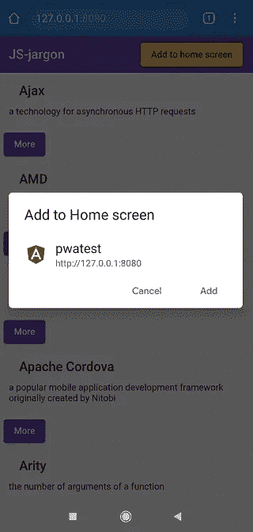
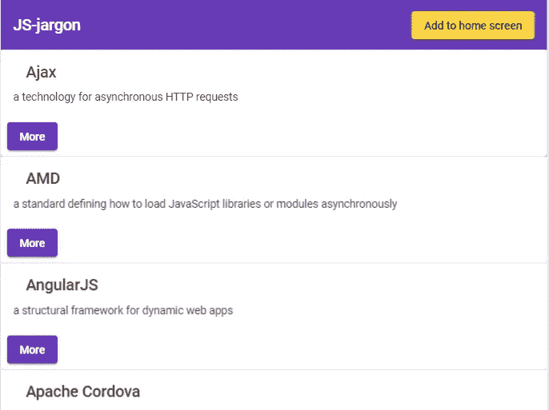
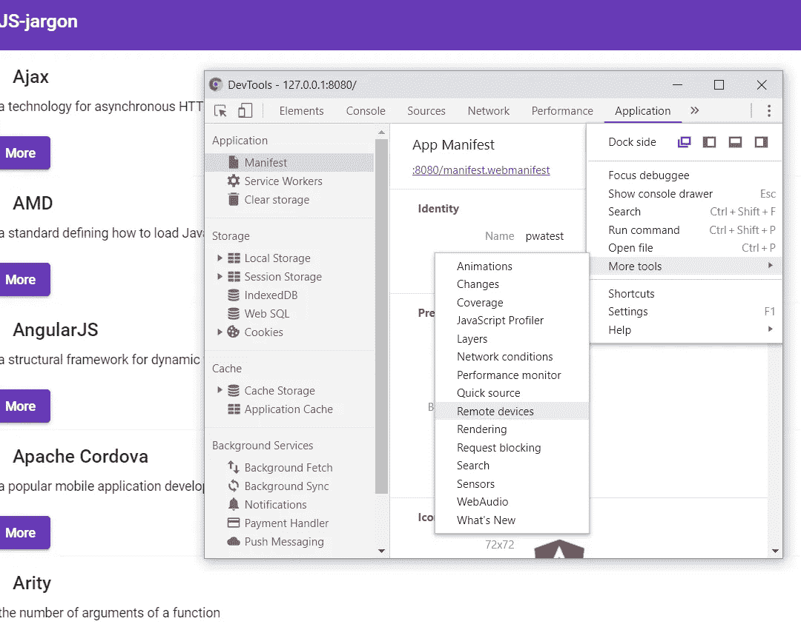
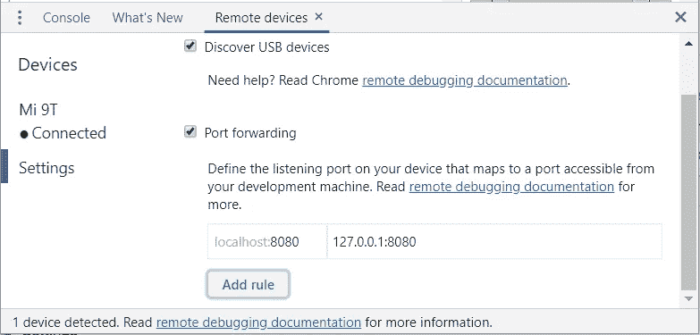
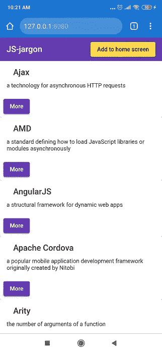
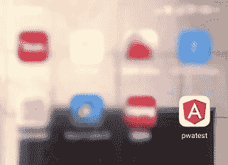
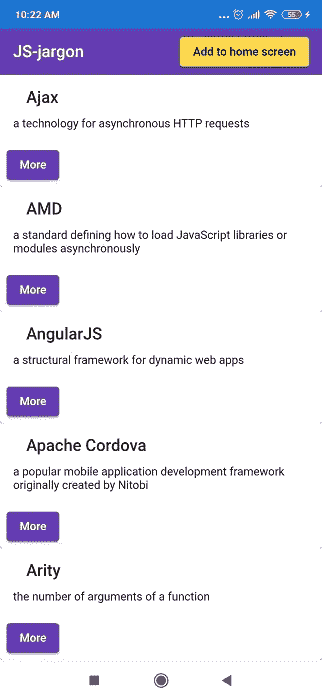

# 使用 Angular 8 的 Android 设备中的 PWA“主屏幕添加按钮”和远程调试

> 原文：<https://levelup.gitconnected.com/pwa-add-button-to-home-screen-and-remote-debugging-in-android-devices-with-angular-8-3dbaec772a1>

## 在 Android 设备中实现带远程调试的 PWA



添加到主屏幕— PWA

如果你想了解更多，并从头开始学习如何在 Angular 8 中构建 PWA，请先查看这个[链接](/a-guide-to-building-a-pwa-in-angular-acea27ae708d)。这是用 Angular 8 创建渐进式 web 应用程序的一步一步的教程，它解释了什么是 PWA。

这篇文章的目的是添加一个前一个环节中缺少的最后一步。通过点击“添加到主屏幕”按钮，用户将被提示将应用程序添加到他们的主屏幕，如上图所示。通常，没有按钮来触发提示消息，但是您可以根据应用程序中的需要使用相同的函数来处理提示消息。

让我们先添加按钮。

# 添加 UI 按钮

我们将使用[代码](https://github.com/aimanrahmattt/pwatest/tree/master)从以前的链接。

若要添加“添加到主屏幕”按钮，请更新以下文件。

【app.component.html 

```
<mat-toolbar color="primary">
  <mat-toolbar-row>
    <span>JS-jargon</span>
    <span class="example-spacer"></span>
    <button mat-raised-button color="accent" (click)="addToHomeScreen()">Add to home screen</button>
  </mat-toolbar-row>
</mat-toolbar>
```

**app.component.scss**

```
.example-spacer {
  flex: 1 1 auto;
}
```

这是最后的样子。该按钮被添加到工具栏的右侧。



最后外观

# 添加到主屏幕功能

接下来，我们将添加提示消息的函数。将下面的代码添加到我们的 **app.component.ts** 中。

```
deferredPrompt: any;
showButton = false;@HostListener('window:beforeinstallprompt', ['$event'])
onbeforeinstallprompt(e) {
  console.log(e);
  // Prevent Chrome 67 and earlier from automatically showing the prompt
  e.preventDefault();
  // Stash the event so it can be triggered later.
  this.deferredPrompt = e;
  this.showButton = true;
}addToHomeScreen() {
  // hide our user interface that shows our A2HS button
  this.showButton = false;
  // Show the prompt
  this.deferredPrompt.prompt();
  // Wait for the user to respond to the prompt
  this.deferredPrompt.userChoice
  .then((choiceResult) => {
  if (choiceResult.outcome === 'accepted') {
    console.log('User accepted the A2HS prompt');
  } else {
    console.log('User dismissed the A2HS prompt');
  }
  this.deferredPrompt = null;
});
```

查看此[链接](https://github.com/aimanrahmattt/pwatest)以获得此演示的完整代码。

# Android 设备的远程调试

我们将在实际的 Android 设备中测试 PWA。正如我们在本地环境中进行的开发一样，我们将在 Chrome 浏览器中设置一个端口转发到我们的设备。

在此之前，构建用于生产的应用程序，并通过运行以下命令使用 **http-server** 为其提供服务:

```
ng build --prod
cd dist/pwatest
http-server -o
```

**启用端口转发**

1.  将您的 Android 设备连接到 pc，并在设备中启用 USB 调试。
2.  在您的 pc 中，通过点击 F12 或右键-> Inspect 打开 Chrome DevTools。
3.  点击右上角的三点->更多工具->选择远程设备。



Chrome DevTools 中的远程设备

4.确保**发现 USB 设备**和**端口转发**复选框已启用。添加一个新规则，如下图所示。



现在，在你的设备中打开 Chrome，输入 url [http://127.0.0.1:8080。](http://127.0.0.1:8080.)这是它在设备中的样子。



设备屏幕

点击“添加到主屏幕”按钮，将会提示一条消息。


消息提示

最后，pwatest 应用程序已添加到主屏幕。



点击 pwatest 应用程序。它看起来像任何其他应用程序，没有在屏幕上方的网址搜索栏。



Pwatest 应用程序

# 资源

1.  [https://developers . Google . com/web/tools/chrome-devtools/remote-debugging](https://developers.google.com/web/tools/chrome-devtools/remote-debugging)
2.  [https://developers . Google . com/web/tools/chrome-devtools/remote-debugging/local-server](https://developers.google.com/web/tools/chrome-devtools/remote-debugging/local-server)
3.  【https://github.com/aimanrahmattt/pwatest 