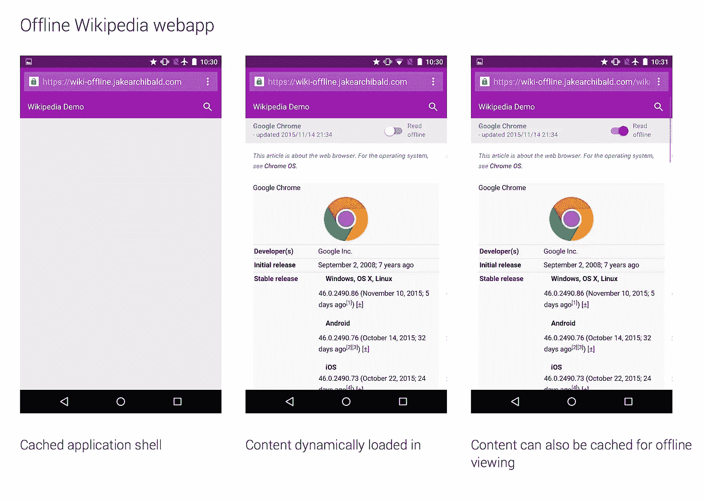

# PWA——简单的力量

> 原文：<https://levelup.gitconnected.com/pwa-the-power-of-simplicity-aabbdba26e37>

# 教老狗新把戏

谷歌渐进式网络应用并不“新”——它遵循了一个**回归基本原则**。实现是标准的依赖，只是 JavaScript+HTML+CSS 增加了离线能力，多设备，等等。

[公司已经爱上了 PWA](https://www.computerworld.com/article/3314746/mobile-apps/why-microsoft-and-google-love-progressive-web-apps.html) ，它为这项技术提供了构建混合应用的机会。一些公司如全球速卖通已经成功地实施了这种方法。

这是 PWA 功能的总结:

1.  [应用外壳模型](https://developers.google.com/web/fundamentals/architecture/app-shell):想法是尝试缓存每一项资产(正如我们已经做的那样)，但也用[服务工作者](https://developers.google.com/web/ilt/pwa/introduction-to-service-worker)缓存应用数据。这种模型允许提高 web 应用程序的性能，使它们成为混合方法的极好补充(例如，与一个框架如 [Ionic](https://ionicframework.com/docs/developer-resources/service-worker/) 相结合)。通过将数据与静态资产一起缓存，可以立即构建页面
2.  可以在手机( [WebAPK](https://developers.google.com/web/fundamentals/integration/webapks) )甚至是[桌面](https://developers.google.com/web/fundamentals/app-install-banners/)中模拟[网络应用](https://developers.google.com/web/fundamentals/app-install-banners/)的安装！
3.  更好的解决[推送通知](https://developers.google.com/web/fundamentals/push-notifications/)的问题，改善用户体验。
4.  [多设备解决方案](https://developers.google.com/web/fundamentals/codelabs/your-first-multi-screen-site/)比以往更加简单，性能也更高。
5.  具有[支付集成](https://developers.google.com/web/fundamentals/payments/)的解决方案，无需处理复杂的 API。

但是所有的**【核心理念】**都驻留在**服务人员**身上。

# 服务人员—生命周期

服务人员的完整生命周期

> 服务工作器是浏览器在后台运行的脚本，在 web 浏览器中充当网络代理，以编程方式管理 web/HTTP 请求。在你的网站上添加一个服务人员是相当容易的。它们位于网络和设备之间，用于补充内容，支持使用缓存机制创建有效的离线体验。他们还将允许访问推送通知和后台同步 API

服务人员定义不同的处理程序，以便更好地利用与应用程序交互的各个方面。可以实现 [**多种可能性**](https://developers.google.com/web/fundamentals/instant-and-offline/offline-cookbook/) 来处理**缓存策略**。

例如，一种方法是使用服务工作者`fetch`处理程序，该处理程序为导航请求实现了 [stale-while-revalidate 策略](https://developers.google.com/web/fundamentals/instant-and-offline/offline-cookbook/#stale-while-revalidate)。

# 结论

这里有一个[完整的清单](https://developers.google.com/web/progressive-web-apps/checklist)说明 WPA 如何处理**最常见的问题**。

在我看来，PWA 是通向混合解决方案的一条干净的道路。**性能问题**是 pwa 的主要优势之一，也一直是混合方法的弱点。我建议您关注这项技术，因为它只会在未来得到改进，并被越来越多的人采用。如果您想了解这项技术，请关注我的下一篇文章:[工具箱](https://medium.com/@krukmat/workbox-improving-the-pwa-4a5f5bda8c9d)。