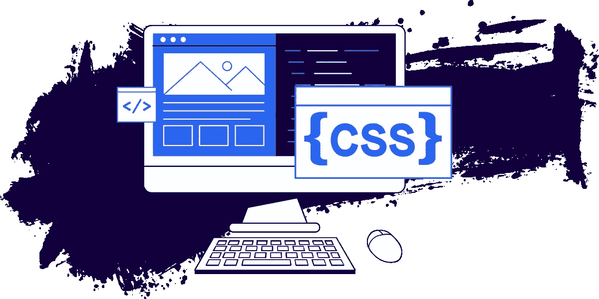
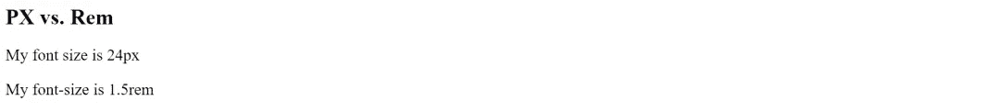
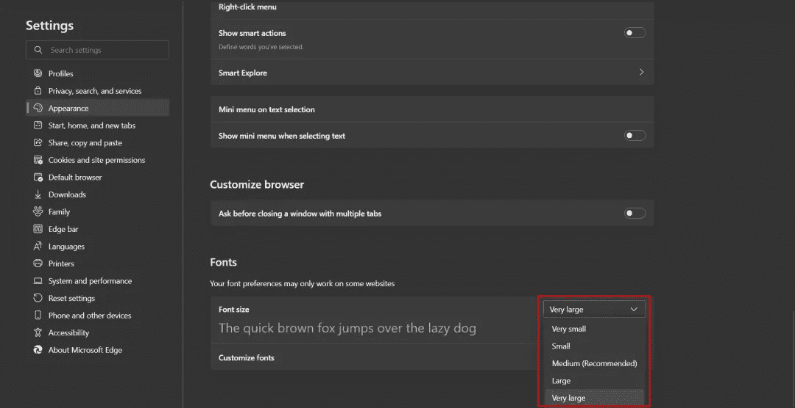
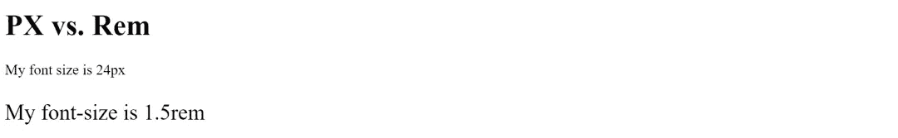
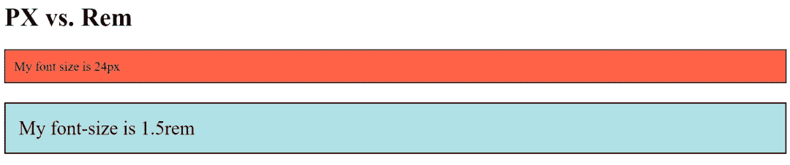

# CSS 中的 PX 还是 REM？只用快速眼动

> 原文：<https://levelup.gitconnected.com/px-or-rem-in-css-just-use-rem-470c01882021>



CSS 有[很多不同的单位](https://developer.mozilla.org/en-US/docs/Learn/CSS/Building_blocks/Values_and_units)供你选择。在许多情况下，有一个单元明显比其他单元好。

然而，在我的职业生涯中，似乎经常出现的一个问题是，在似乎没有明显区别的某些属性上，是否应该使用像素或 rem。

今天我要回答这个问题。

# 设置

假设我们有一个非常基本的 [HTML](https://austingil.com/category/development/html/) 页面，有两个段落:一个用像素大小，另一个用 rems 大小:

```
<!DOCTYPE html>
<html>
<body>
  <h1>PX vs. Rem</h1>
  <p style="font-size: 24px;">My font size is 24px</p>
  <p style="font-size: 1.5rem;">My font-size is 1.5rem</p>
</body>
</html>
```



像素是一个绝对的单位，所以当你设置字体大小为 24 像素时，它将是 24 像素。另一方面，Rems 是基于文档字体大小的相对单位。文档的默认字体大小是 16 像素，因此 1.5rems x 16px 相当于 24 像素。

事实上，rem 是相对的，并且它们基于默认的 16 像素，这使得它们比像素更难处理。这就是为什么，我经常看到人们使用像素。但我认为这是个错误。

# 不太真实的问题

在过去，围绕[视网膜](https://en.wikipedia.org/wiki/Retina_display)或高密度显示器如何影响像素和[像素密度](https://en.wikipedia.org/wiki/Pixel_density)存在一些困惑。没有深入了解它，有一个时刻，像素缩放怪异，但这个问题已经被修复。

既然这个问题已经解决，我不断看到的一个论点是，用户可以通过放大或缩小浏览器来放大或缩小字体大小，像素和 rem 大小以相同的速度增长。

因此，有些人说，无论你使用像素还是 rem 都不再重要。

但事实如此。

# 真正的问题是

这个问题实际上与 CSS 单元如何响应浏览器设置有关。用户可以转到他们的浏览器设置，修改浏览器的默认字体大小。



这对有视觉障碍的用户来说非常好。

然而，如果你检查浏览器，绝对单位为 24 像素的段落将保持 24 像素不变，不管用户的偏好是什么。另一方面，相对单位随着浏览器的默认设置而增长。



所以这实际上是一个[可访问性](https://austingil.com/category/development/accessibility/)问题。

**因此，任何时候你在定义字体大小的时候，你都应该绝对地(或者相对地？)使用 rems。**

# 细微差别

当然，因为我们谈论的是 web 开发，所以讨论是微妙的。比如填充和边框等其他属性呢？

```
<!DOCTYPE html>
<html>
<body>
  <h1>PX vs. Rem</h1>
  <p style="
    font-size: 24px;
    padding: 16px;
    border: 2px solid;
    background: tomato;
  ">
    My font size is 24px
  </p>
  <p style="
    font-size: 1.5rem;
    padding: 1rem;
    border: .125rem solid;
    background: powderblue;
  ">
    My font-size is 1.5rem
  </p>
</body>
</html>
```

在这个例子中，除了字体大小之外，我们还将比较像素和边框宽度。



正如你所料，第二段除了更大的字体之外，还有更大的填充和边框宽度，因为 rem 单位随着浏览器设置的增加而增加。

这就把我们带到了“视情况而定”的对话中。填充和边框宽度与可访问性并没有严格的关系。那么，你希望你的填充、边框宽度或任何其他属性(否则可能是像素)用 rems 设置，并在用户更改它们的设置时放大吗？

这取决于你，\_(ツ)_/

当您引入媒体查询或容器查询时，情况会变得更加混乱。这很难解释，但基本上，如果你的字体随着浏览器的设置而放大，你可能也希望你的媒体查询以同样的方式回应。这意味着您应该用 Rem(或 EM)单位来定义它们。

当然，这里有很多因素在起作用，我不想太迷失在茫茫人海中。幸运的是，2016 年有一篇文章基本上解决了这个问题，名为 Zell Liew 的“ [PX，EM 或 REM media queries](https://zellwk.com/blog/media-query-units/) ”。

它的基本结论是 EM 单元和 REM 单元比像素单元更适合媒体查询，因为 EM 单元基于它们的父元素，但是媒体查询影响根样式，所以 EM 和 REM 几乎是一样的。

唯一的不同是由于 Safari 中有一个带有 REM 单位的 bug，因此 EM 比更稳定一些，但是我认为这个 bug 已经被修复了。所以我会坚持使用快速眼动仪。

# 简短的回答

所以，为了一劳永逸地回答这个问题，你是否应该使用像素或 rems，简短的答案是…

**就用 rems** ！

当然，有细微差别。当然也有例外。当然也会有像素实际上*比*好的情况。

(你**真的**应该用各种浏览器设置来测试你的应用程序，以进行这些调用)。

但是

对于字体大小，rem 更容易访问。

Rems(可能)更适合媒体查询。

我认为坚持一个简单的规则(偶尔有例外)比把事情混在一起更容易。

归根结底，这完全取决于如何根据用户的浏览器设置进行扩展，所以对你来说可能没那么重要。但对我来说，一切都以同样的速度扩大或缩小是有道理的。

如果你有不同的感觉，或者你想参与谈话，我很乐意听听你的想法。

非常感谢您的阅读。如果你喜欢这篇文章，请[分享它](https://twitter.com/share?via=heyAustinGil)。这是支持我的最好方式之一。你也可以[注册我的时事通讯](https://austingil.com/newsletter/)或者[在 Twitter 上关注我](https://twitter.com/heyAustinGil)如果你想知道什么时候有新文章发表。

*原载于*[](https://austingil.com/px-or-rem-in-css/)**。**