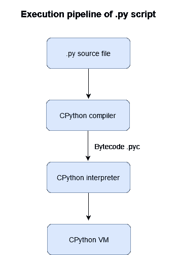
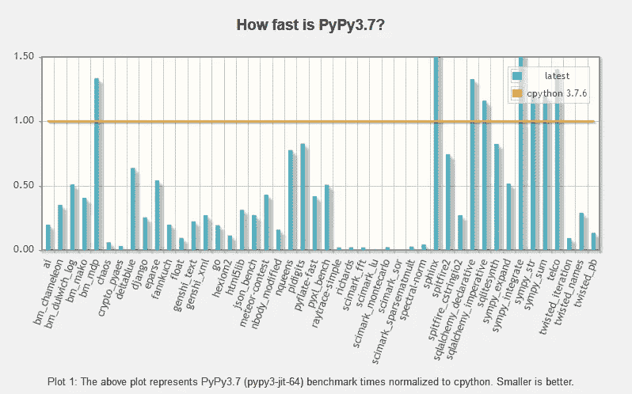

# PyPy:Python 的遵从性、灵活性和快速实现

> 原文：<https://levelup.gitconnected.com/pypy-compliant-flexible-and-fast-implementation-of-python-4fc1377e6375>

## 运行相同的 Python 脚本甚至要快数百倍，无需付出任何努力。

[克里萨·伯纳德](https://unsplash.com/@kellisa?utm_source=medium&utm_medium=referral)在 [Unsplash](https://unsplash.com?utm_source=medium&utm_medium=referral) 上的照片

作为软件开发人员，痴迷于代码性能和效率是典型的。假设您有一个 Python 脚本来完成某项工作，但您确信它太慢了，您可以做得更好。您使用了正确的数据结构，算法是最佳的，并且您已经应用了所有关于 Python 性能调优的技巧。不过，这太慢了。

突然之间，你发现了一个名为 [PyPy](https://www.pypy.org/) 的工具，它的目标是让你的 Python 代码运行速度快上百倍。你没有什么可失去的，所以你为什么不试一试呢？

在本文中，我将向您展示什么是 PyPy，以及它的主要特性。

> 如果希望代码运行得更快，可能只需要使用 PyPy。
> 
> 吉多·范·罗苏姆(Python 的创造者)

# 默认 Python 实现的工作原理

在讨论什么是 PyPy 以及它如何设法加快 Python 代码的执行速度之前，我们先来讨论一下“默认 Python”是如何工作的。

大家可能已经知道，Python 是一个接口。与每个接口一样，存在不同的实现。Python 实现的几个例子是 [CPython](https://en.wikipedia.org/wiki/CPython) (用 C 语言编写) [Jython](https://www.jython.org/) (用 Java 编写)和 [IronPython](https://ironpython.net/) (用 C#编写)。Python 的缺省实现(也是最广泛使用的实现)是 **CPython** 。

但是，当您使用 CPython 运行 Python 脚本时会发生什么呢？

作者形象

基本上，Python 文件被编译为字节码文件。pyc 扩展。然后，使用 CPython 解释器，在虚拟机中执行字节码。虚拟环境是 Python 跨平台的部分原因。可以将在 Windows 计算机上编译的. pyc 文件运行到 Mac 环境中，因为。pyc 文件与体系结构无关。不过，一定要使用相同的 Python 版本。

# PyPy 价值主张

我们希望确保 PyPy 确实值得安装，因为我们的时间非常宝贵。那么，PyPy 的主要特点是什么呢？我们为什么要使用它？

我不会在这里列出在官方网站上发布的使用 PyPy 的好处，我会写下我最看重的东西。

所以，有三个好处:

*   速度
*   无堆栈
*   易用性

让我们快速回顾一下它们。

## 特点 1:速度

PyPy 比 CPython 更快的原因很简单:PyPy 有一个不同的设计，一个更好的实现，并带有一个 **JIT** (实时)编译器。

不涉及太多细节，PyPy 有两个部分:

1.  **解释器**，用 Python 的子集 RPython 编写
2.  **翻译工具链**，它将 RPython 代码编译成 C

解释器是一个普通的 Python 解释器。使用翻译工具链将它翻译成 C，在这个过程中，会自动添加垃圾收集器(GC)和 JIT 编译器。JIT 编译器通常允许 Python 程序运行得更快，因为它不是在执行之前翻译和优化字节码，而是在运行时翻译和优化代码。值得注意的是，PyPy 在处理运行纯 Python 代码的长时间运行的程序时表现出色，因为对于短进程，JIT 编译器甚至没有时间正确启动。

图片由[https://speed.pypy.org/](https://speed.pypy.org/)

如 PyPy 的速度中心所述，速度的提高很大程度上取决于正在执行的任务类型。所有基准的几何平均值比 CPython 快 0.22 或 **4.5** 倍*。*

## 功能 2:无堆叠

> 递归错误:超过了最大递归深度

如果您在生活中使用过递归算法，您几乎肯定会遇到上述递归错误。发生此错误的原因是您的函数被调用了太多次，并且由于函数调用被安排在堆栈上，如果堆栈已满，它将无法再处理函数调用。换句话说，标准 Python 中的递归受到 C 堆栈大小的限制。通过使用[stacklespython](https://wiki.python.org/moin/StacklessPython)，函数调用被存储在堆中，通常堆的大小要大得多。

然而，这不是重点。StacklessPython 实现了**小线程**。

小任务是在单个 Python 线程中运行的微小任务。它们重量轻，便于携带。您可以运行数以千计的线程，而不用担心使用单独的线程或进程带来的开销。

## 特点 3:简单，非常好用！

你下载 PyPy，你就可以开始了。没有特殊的配置或手动工作要做。

如果您想在不接触源代码的情况下优化 Python 代码，PyPy 是一个不错的选择。为了给你带来一个具有相同目标的不同工具的例子，Cython 是编译成 c 的 Python 的超集，它的目的是以 c 的速度运行 Python 代码，例如，你拿一个在标准 Python 中很慢的函数来编译它。然后，像普通的 Python 代码片段一样导入它。但是，要使用 Cython，您必须手动检查您的代码并相应地修改它(例如，通过添加类型)。不完全是一个无痛的解决方案。

# 结论

我最近发现了 PyPy，它给 Python 代码带来的巨大性能优势让我非常惊讶。

PyPy 是优化 Python 代码的一种便捷方式，但是请记住，它也有一些限制。它不是一个神奇的工具，可以加速一切，所以一定要检查它的用法是否符合你的需要。

我希望你喜欢这篇文章，如果你发现有什么不对的地方，请在评论中补充。

谢谢😉

# 参考

[1]: PyPy 文档、目标和架构概述。[https://doc.pypy.org/en/latest/architecture.html](https://doc.pypy.org/en/latest/architecture.html)

[2]: PyPy 官网。https://www.pypy.org/index.html