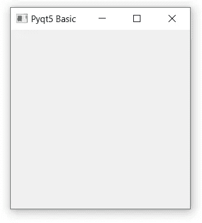
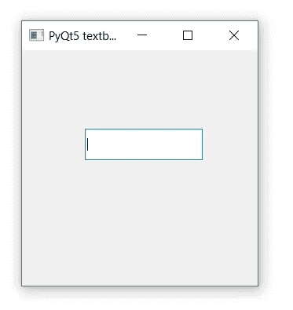
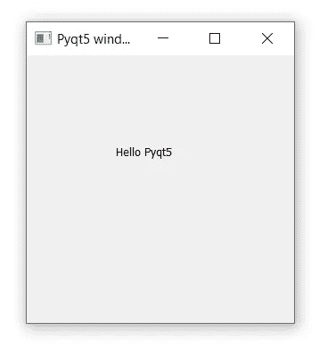
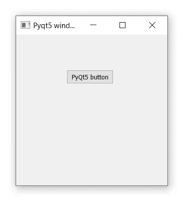
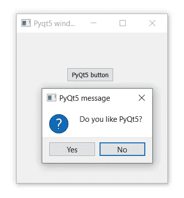

# PyQt5 教程:用 Python 和 PyQt5 学习 GUI 编程

> 原文：<https://levelup.gitconnected.com/pyqt5-tutorial-learn-gui-programming-with-python-and-pyqt5-df4225d2e3b8>


照片由 [Fotis Fotopoulos](https://unsplash.com/@ffstop?utm_source=medium&utm_medium=referral) 在 [Unsplash](https://unsplash.com?utm_source=medium&utm_medium=referral) 上拍摄

Pyqt5 是图形用户界面小部件工具包。它是最强大和最流行的 python 接口之一。它是 Qt 模块和 python 编程的结合。Qt 本身就是一个 C++绑定。Pyqt5 是一个免费的开源小部件工具包，可以在跨平台应用程序开发上实现。PyQt 是由英格兰的河岸计算公司开发和维护的免费软件，而 Qt 是由一家名为 Qt 公司的芬兰公司开发的。在本文中，我们将介绍如何使用 Pyqt5 构建桌面应用程序。

# Pyqt5 的特性:

1.  图形用户界面
2.  XML 处理
3.  网络通信
4.  多媒体
5.  数据库
6.  网页浏览
7.  多线程

# 安装:

您需要在系统中安装最新版本的 python。如果您已经安装了 python，那么在 windows 和 Mac 和 Linux 的终端的命令提示符下执行以下命令。

`pip install PyQt5`

# PyQt5 的基本概念:

基本概念你将看到我们如何为桌面应用程序构建一个窗口。

祝贺你创建了你的第一个桌面应用程序窗口。让我们看看每一个程序。前两行我们只是在 python 文件中导入模块。`Sys module`是 Python 内置模块，具有操作系统交互功能。接下来，我们有了 Pyqt5 模块，从中我们导入了所选的类 QtWidget、QApplication、QWidget。

`QWidget`是 pyqt5 中 UI 的基类，你在桌面应用程序中看到的所有东西，像按钮、搜索栏、下拉菜单等等都是小部件，所以你可以说小部件是在小部件中构建的。这将有助于您通过嵌套小部件来构建复杂的用户界面。

是一个 Qwidget 类方法，可以将你的窗口调整到任意高度和宽度。它们有两个参数，第一个是表示宽度的 x，第二个是表示高度的 y。

`w.setwindowtitle(“Basic pyqt5”)`是一个 Qt widget 类方法，它以一个字符串参数作为参数，改变你的桌面应用程序标题栏。

`w.show()`是在屏幕上显示窗口的 Qtwidget 方法。

`sys.exit(app.exec_())`将启动 Qt/C++事件循环，因为我们知道 Qt 是纯内置的 C++语言，而`app.exec_()`将简单地启动应用程序的循环机制，您不能像在其他应用程序中一样通过简单地按 ctrl + c 来关闭桌面应用程序，您需要单击应用程序的关闭按钮。

## 输出:



# PyQt5 组件模块

这些是 Python 的 Qt 绑定使用的基本模块，特别是 PyQt5。以下是模块及其说明。

1.  **QtWidget** 是一个 pyqt5 模块类，包含了 pyqt5 的大部分小部件
2.  **QtCore** 是 pyqt5 类的核心模块，包含非图形用户界面组件，如信号、插槽连接、事件循环等。
3.  QtMultimedia 是 PyQt5 的一个基本类，用于处理多媒体内容，它还提供了必要的 API 来访问您的相机功能。
4.  QtGui 是一个 pyqt5 模块类，包含 Gui 组件并扩展了 QtCore 模块
5.  QtSql 是一个处理 Sql 数据库的 pyqt5 模块。它支持 ODBC、MySQL、Oracle、SQLite 和 PostgreSQL。
6.  **QtNetwork** 是一个 pyqt5 模块，用于实现网络编程。它支持 TCP 服务器、TCP 套接字、UDP 套接字、SSL 处理、网络会话和 DNS 查找。

# 窗口布局和 OOP

Pyqt5 用户界面编程可以用更容易理解和维护代码的面向对象编程来完成。如果你看到了下面的代码，在第 4 行我们实现了一个带有参数`QWidget`的类名`App()`，然后`def __ini__()`我们声明了 Gui 类 title，left，top，width，height 的实例。我们有另一个名为 def initUI(self)方法，你也可以自己命名这个类方法，在我使用的方法`setWindowTitle()`中，它接受字符串参数，但我传递了一个我在`__init__() method`中创建的类的实例，接下来，我们使用`setGeometry()`来设置我们的窗口`self.left`的大小，而`self.top`显示了在屏幕上显示 Gui 窗口的位置，最后`self.show()`显示了 Pyqt5 Gui 窗口。

# 文本框

在许多用户界面程序中，会有一个输入框，你可以在里面输入文本到软件中，软件会根据它们的功能提供结果。Pyqt5 Qwidget 有一个在你的 Gui 程序中制作文本框的方法。在 QWidget 类内部的类。您可以使用`move() method`通过传递 x，y 坐标来设置文本框的位置，也可以使用`resize()`通过传递高度和宽度来调整文本框的大小。 `QLineEdit()`有`setText() method`来设置你的文本框的文本，而`getText() method`将获得文本框中的输入文本。

```
self.textbox = QLineEdit(self)
self.textbox.move(20, 20)
self.textbox.resize(280,40) 
```

## 输出:



# 文本标签

文本标签是简单的显示字符串文本，显示在任何用户界面软件上，Pyqt5 有一个类名`Qlabel()`，可以用来在屏幕上显示文本。您可以使用`move method`来设置您的文本在程序屏幕上的位置，并使用`setText method`来设置标签文本。

```
*self*.label = QLabel(*self*)
*self*.label.move(100, 100)
self.label.setText("Hello Pyqt5")
```

## 输出:



# 小跟班

pyqt5 中的按钮是用 Qpushbutton 类实现的。众所周知，按钮是任何软件的重要组成部分。button 类接受一个字符串按钮名称参数。接下来，我们可以使用 move 函数来设置按钮在 GUI 屏幕中的位置。首先用以下代码行更新您的代码。

```
from PyQt5.QtWidgets import QApplication, QWidget, QPushButton
from PyQt5.QtCore import pyqtSlot
```

我们已经导入了 Buttons 类和 Pyqtslot 类，这将在按钮动作中使用，您将在下面的代码中看到。

```
self.button = QPushButton('PyQt5 Button', self)
self.button.move(100,70)
```

## 输出:



## 按钮操作:

我们在 Gui 窗口屏幕上实现了一个按钮，但是如果我们点击它，它什么也不做。我们需要让它有用，因为我们需要设置他们的动作，这意味着如果我们点击按钮，他们的事情应该发生。为此，如果你还记得 upward 代码块，我们导入了一个`PyQt 5`类名`pyqtslot`，它将像按钮被按下一样工作，然后运行`pyqtslot`类型方法。检查下面的代码，我们在代码块中做了更改，添加了新的一行`self.button.clicked.connect(self.on_click)`和`@pyqtslot`的方法类型。当按钮被按下时，Pyqt5 知道它连接到类型为`pyqtslot`的方法名 on_click()并执行该方法代码行。

```
@pyqtSlot()
def on_click(self):
    print('Button click')
```

# MessageBox

当您想通过任何消息或询问用户问题来提醒用户时，消息框非常有用。举一个简单的例子来理解，如果你试图关闭你正在工作的任何软件，并且没有保存软件，将会在问题消息框中询问你，你想要保存工作吗？也许正如我提到的，它可以在你的软件中用于任何目的。如果软件中的任何过程完成，它会显示一个消息框，告诉用户过程已经完成。在 PyQt5 中，我们有一个消息框类，它接受 self 参数、字符串文本和 Question Yes 和 Question No 参数，这样它就生成了问题消息框，在下一行，如果你看到下面的代码，我们已经实现了一个`if-else logic`来打印消息框上用户活动的结果。

## 输出:



# 结论:

到目前为止，我们在 PyQt5 中学到了很多东西，这个特性是我们可以在任何软件开发和简单的 Gui 程序中使用的通用特性。只需点击此 [*Doc URL*](https://www.riverbankcomputing.com/static/Docs/PyQt5/) *即可了解更多新东西，发现 PyQt5 的更多类别。您将被重定向到 PyQt5 文档页面。这是 PyQt5 的初学者指南，帮助你了解 PyQt5 的工作原理和使用方法。我希望这篇文章在将来对你有用，并随时分享你的回应*