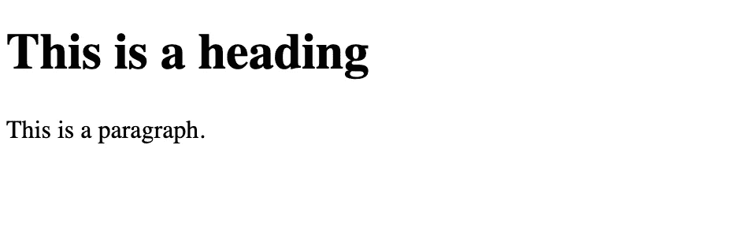

# PyScript:浏览器中的 Python

> 原文：<https://levelup.gitconnected.com/pyscript-python-in-the-browser-4c1a578d67f3>

在 [Unsplash](https://unsplash.com?utm_source=medium&utm_medium=referral) 上 [Sai Kiran Anagani](https://unsplash.com/@anagani_saikiran?utm_source=medium&utm_medium=referral) 拍摄的照片

如果你只是用 python 写代码，但你也有兴趣在浏览器中构建漂亮的网站，那么在 PyCon US 2022 上，Anaconda 的首席执行官王蒙杰宣布了一项名为 **PyScript** 的新技术，允许用户在浏览器中编写 Python。

## PyScript 是什么？

*   PyScript 是由 Anaconda 的团队开发的，该团队包括王蒙杰、法比奥·普利格和菲利普·鲁迪格。
*   [PyScript](https://pyscript.net/) 是新创建的用于在浏览器中执行 Python 代码的框架或系统。听起来很有趣！
*   没有任何基础设施障碍
*   PyScript 目前构建在连接 JavaScript 和 Python 的 [Pyodide](http://pyodide.org/) 和 [WebAssembly/Emscripten](https://webassembly.org/) 之上。
*   在 PyScript 作为数据科学家的帮助下，我们可以在一个 html 文件中共享我们的仪表板和模型，每当其他人在 web 浏览器中打开该文件时，它就会运行代码

## 如何使用 PyScript？

*   没什么好安装的。只需要在 HTML 头中添加两个资源，一个 JavaScript 文件和一个 CSS。
*   PyScript 的 alpha 版本可以在 pyscript.net 上找到。
*   PyScript 有三个主要组件:
*   **py-env** 定义了运行 Python 代码所需的 Python 包
*   **py-script** 是您编写 Python 代码的地方，这些代码将在。网页
*   **py-repl** 创建一个 REPL (read-eval-print loop)组件，该组件评估用户输入的代码并显示结果。

## **用几个例子来理解 PyScript:**

要详细理解 PyScript，请按以下步骤逐一操作:

**1。创建简单的 HTML 文件**

上述文件的结果如下所示

**2。向 HTML 头添加一个 JavaScript 文件和一个 CSS 文件**

**3。将 Python 代码添加到您的 HTML 文件**

上述文件的结果如下所示:

在本例中，您已经看到我们可以在浏览器中运行 Python 代码，而无需任何外部依赖。听起来很神奇！

**4。包含更复杂示例的 py script**

在这个例子中，我们引入了一个 for 循环，结果如下所示:

**5。添加 Python 包**

在 PyScript 中，我们可以使用 **py-env** 标签轻松添加 python 包

让我们在下一个例子中使用这个 python 包

**6。用直方图**绘制分布图

结果就在这里

**7。py-repl 示例**

在 py-repl 的帮助下，你可以创建一个定制的 repl，并在其中运行你的代码。

## 结论:

PyScript 将 Python 引入浏览器。我对这项新技术感到非常兴奋。同样，它非常简单易学。希望你喜欢阅读这篇文章。请尝试一下，玩得开心，并让我知道你的反馈！

**参考文献:**

*   [https://ehmatthes.com/blog/pycon_2022_highlights/](https://ehmatthes.com/blog/pycon_2022_highlights/)
*   [https://github.com/pyscript](https://github.com/pyscript)
*   [https://pyscript.net/](https://pyscript.net/)