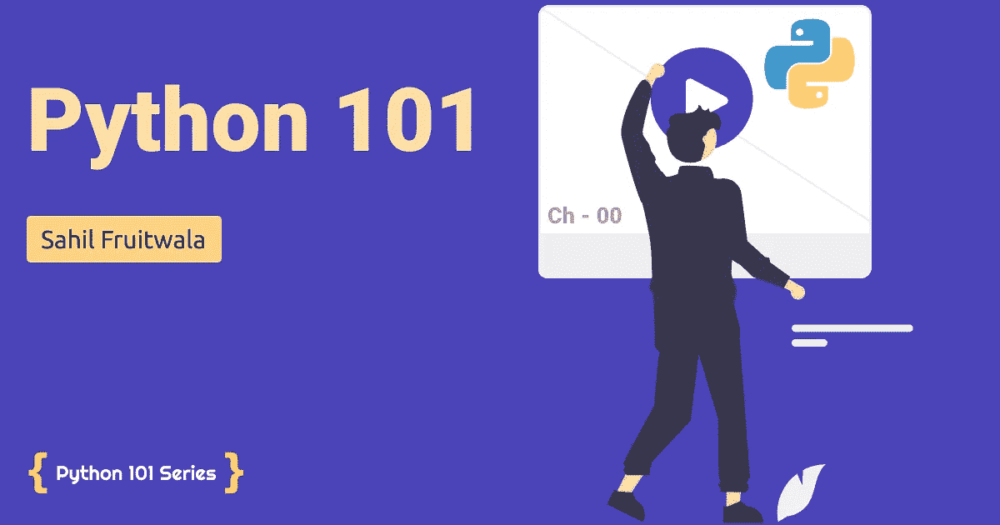
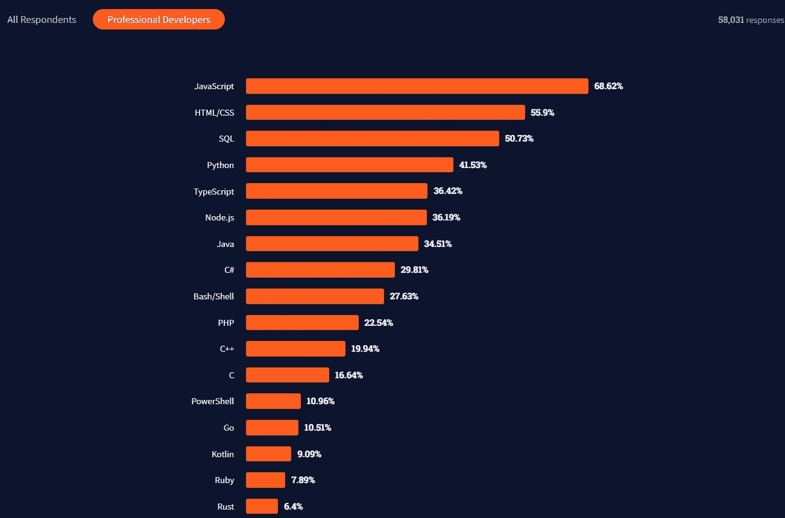

# Python 101 系列

> 原文：<https://levelup.gitconnected.com/python-101-series-ae077ee58a61>

## 带有最佳编码示例的简单 Python 教程。



Python 101 系列

Python，最流行的通用编程语言之一。根据 [2021 年开发者调查](https://insights.stackoverflow.com/survey/2021?_ga=2.236209345.190202062.1628102352-126161871.1625855113#technology-most-popular-technologies)，Python 被*专业开发者*评为第四大最受欢迎的技术。Python 是易于学习和使用的编程语言，我相信这也是你想学习 Python 的原因之一。



# 你将从这个系列中得到什么

1.  您将了解 Python 的历史
2.  你将理解编程的基本概念
3.  你将能够自己编写和理解代码
4.  你将从事一些小项目
5.  你将获得知识，知道“当你卡住时谷歌什么”

# 这个系列的概要

1.  介绍
2.  变量和数据类型
3.  条件语句
4.  数据结构
5.  循环和迭代
6.  功能
7.  正则表达式和文件
8.  面向对象编程

# 这个系列适合你吗？

我知道，我知道！你就是观众。但是我特别针对的是那些刚刚开始或刚接触编程世界的人。这并不意味着懂编程的人什么也得不到。可能有些概念你还没有学过，或者你想重温一下你学过的概念。发展一个强大的核心总是一个好主意。

# Python 有什么用？

现在你会看到大家都在夸大 Python 的用途。人们会说，python 可以用在这里和这里和这里。但是你应该到处使用 Python 吗？

简单的答案是否定的。我同意，Python 是一种令人惊叹的语言，但每种编程语言都有它的用例。Python 广泛用于以下任务:

1.  后端开发
2.  系统脚本/自动化脚本
3.  物联网
4.  数据科学和机器学习
5.  软件/游戏开发的一小部分

是时候做决定了。现在，看完所有这些之后，如果你认为 Python 对你有用，那么让我们开始吧。


如果你有任何问题或疑问，请在评论区提出。如果你想让我解释任何特定的话题，请在下面的评论部分提及👇。

```
**Want to Know More?**Reach out to me on [**Twitter**](https://bit.ly/3KjwgZV)**,** [**LinkedIn**](https://bit.ly/3JbsPDm) **or join my** [**Newsletter**](https://sahil-fruitwala.medium.com/subscribe)**.**
```

**查看 Python 101 系列的下一篇博客👇**

[](/introduction-to-python-6c17499cd9da) [## Python 简介

### 了解如何在您的系统上安装和验证 Python 安装

levelup.gitconnected.com](/introduction-to-python-6c17499cd9da) [](/variables-and-data-types-in-python-eee80a886a17) [## Python 中的变量和数据类型

### Python 初学者的变量和数据类型完全指南

levelup.gitconnected.com](/variables-and-data-types-in-python-eee80a886a17)